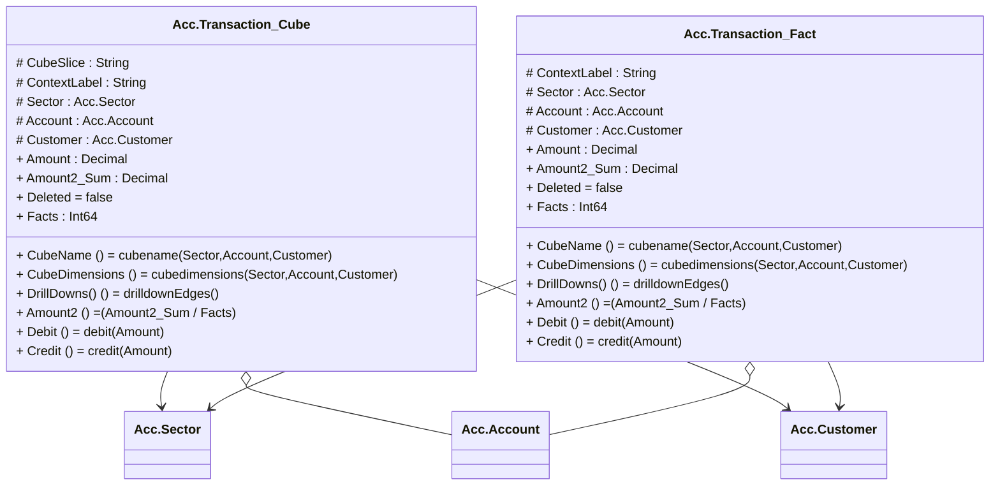

# Account-graph

> The tables below contain descriptions of the members of each Element. 
> The first column indicates the type of the member:
> A ‘#’ indicates that the field is a key to the element, and a ‘+’ indicates that the field is a value.
> The ‘*’ column contains a description for the element member.  
> The ‘@’ column contains any properties for the member.
> The ‘=’ column contains calculated values; or in the case of an enum, the serialized value.

---

## EntityImpl Acc.Transaction_Cube
A Customer

| |Name|Type|*|@|=|
|-|-|-|-|-|-|
|#|CubeSlice|String||||
|#|ContextLabel|String||||
|#|Sector|Acc.Sector||CubeDimensionReference()||
|#|Account|Acc.Account|A Customer|CubeDimensionReference()||
|#|Customer|Acc.Customer|A Customer|CubeDimensionReference()||
|+|Amount|Decimal|debt or credit to account, with respect to the customer position|CubeMeasure(Aggregate?.Sum)||
|+|Amount2_Sum|Decimal||CubeMeasure(Aggregate?.AverageTotal)||
||Deleted|Some(Boolean)|The cube fact has been deleted||false|
|+|Facts|Int64|Number of Facts this Cube/Fact is calculated from|||
||CubeName|Some(String)|||cubename(Sector,Account,Customer)|
||CubeDimensions|Some(Int32)|||cubedimensions(Sector,Account,Customer)|
||DrillDowns()|Some(global::System.Collections.Generic.HashSet<Hiperspace.Edge>)|Drilldown to Edges||drilldownEdges()|
||Amount2|Some(Decimal)||CubeMeasure(Aggregate?.Average)|(Amount2_Sum / Facts)|
||Debit|Some(Decimal)||CubeExtent()|debit(Amount)|
||Credit|Some(Decimal)||CubeExtent()|credit(Amount)|

---

## EntityImpl Acc.Transaction_Fact
A Customer

| |Name|Type|*|@|=|
|-|-|-|-|-|-|
|#|ContextLabel|String||||
|#|Sector|Acc.Sector||CubeDimensionReference()||
|#|Account|Acc.Account|A Customer|CubeDimensionReference()||
|#|Customer|Acc.Customer|A Customer|CubeDimensionReference()||
|+|Amount|Decimal|debt or credit to account, with respect to the customer position|CubeMeasure(Aggregate?.Sum)||
|+|Amount2_Sum|Decimal||CubeMeasure(Aggregate?.AverageTotal)||
||Deleted|Some(Boolean)|The cube fact has been deleted||false|
|+|Facts|Int64|Number of Facts this Cube/Fact is calculated from|||
||CubeName|Some(String)|||cubename(Sector,Account,Customer)|
||CubeDimensions|Some(Int32)|||cubedimensions(Sector,Account,Customer)|
||DrillDowns()|Some(global::System.Collections.Generic.HashSet<Hiperspace.Edge>)|Drilldown to Edges||drilldownEdges()|
||Amount2|Some(Decimal)||CubeMeasure(Aggregate?.Average)|(Amount2_Sum / Facts)|
||Debit|Some(Decimal)||CubeExtent()|debit(Amount)|
||Credit|Some(Decimal)||CubeExtent()|credit(Amount)|

