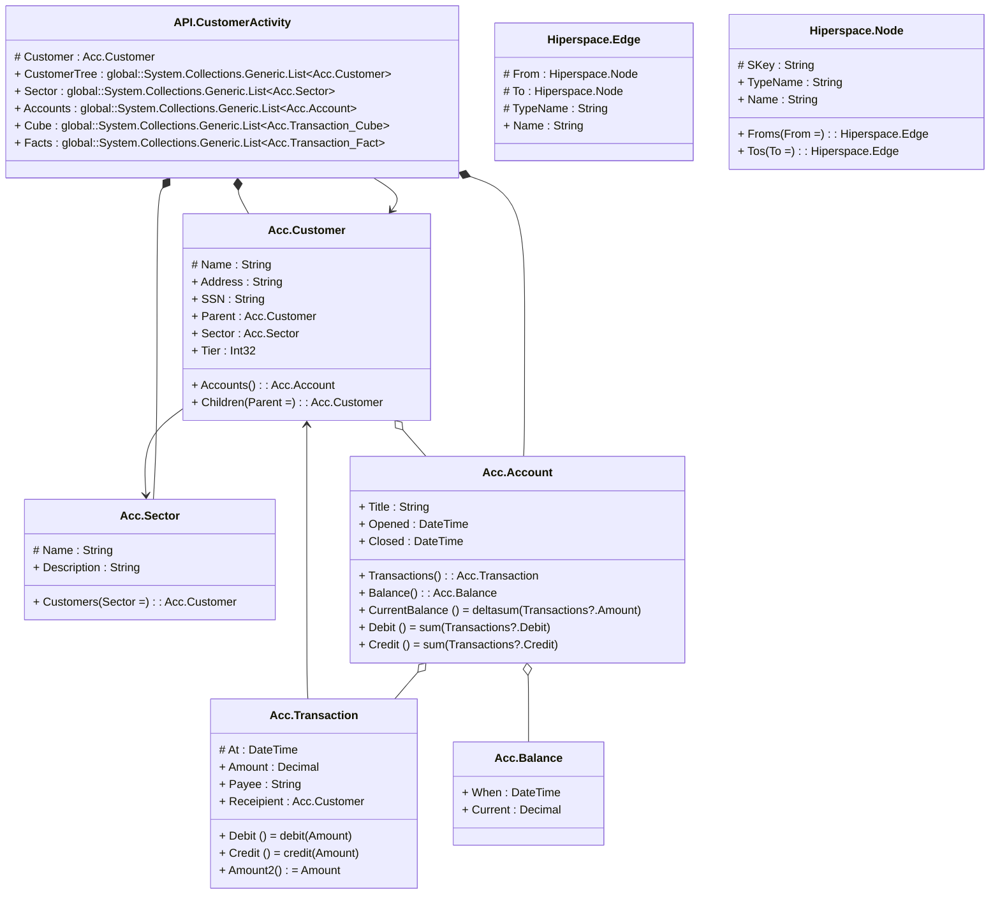

# Account

> The tables below contain descriptions of the members of each Element. 
> The first column indicates the type of the member:
> A ‘#’ indicates that the field is a key to the element, and a ‘+’ indicates that the field is a value.
> The ‘*’ column contains a description for the element member.  
> The ‘@’ column contains any properties for the member.
> The ‘=’ column contains calculated values; or in the case of an enum, the serialized value.

---

## Message API.CustomerActivity

| |Name|Type|*|@|=|
|-|-|-|-|-|-|
|#|Customer|Acc.Customer||||
|+|CustomerTree|global::System.Collections.Generic.List<Acc.Customer>||||
|+|Sector|global::System.Collections.Generic.List<Acc.Sector>||||
|+|Accounts|global::System.Collections.Generic.List<Acc.Account>||||
|+|Cube|global::System.Collections.Generic.List<Acc.Transaction_Cube>||||
|+|Facts|global::System.Collections.Generic.List<Acc.Transaction_Fact>||||

---

## Segment Acc.Account
An Account for a customer

| |Name|Type|*|@|=|
|-|-|-|-|-|-|
|+|Title|String||Key()||
|+|Opened|DateTime||||
|+|Closed|DateTime||||
|+|Transactions|Acc.Transaction|transactions against the account|||
|+|Balance|Acc.Balance|the last closing balance|||
||CurrentBalance|Some(Decimal)||CubeMeasure(Aggregate?.Sum)|deltasum(Transactions?.Amount)|
||Debit|Some(Decimal)|||sum(Transactions?.Debit)|
||Credit|Some(Decimal)|||sum(Transactions?.Credit)|

---

## Aspect Acc.Balance
 Balance is the rolled up value for the account computed for a time

| |Name|Type|*|@|=|
|-|-|-|-|-|-|
|+|When|DateTime|DateTime of the max balance|||
|+|Current|Decimal|Current closing balance at time When|||

---

## Entity Acc.Customer
A Customer

| |Name|Type|*|@|=|
|-|-|-|-|-|-|
|#|Name|String| name  of the customer|||
|+|Address|String||||
|+|SSN|String||||
|+|Parent|Acc.Customer||||
|+|Sector|Acc.Sector||||
|+|Tier|Int32||||
|+|Accounts|Acc.Account|Account that the customer owns|||
||Children|Acc.Customer|||Parent = |

---

## Entity Acc.Sector

| |Name|Type|*|@|=|
|-|-|-|-|-|-|
|#|Name|String|name of the sector|||
|+|Description|String|description of the sector|||
||Customers|Acc.Customer|customers in this sector||Sector = |

---

## Segment Acc.Transaction
a transaction against account

| |Name|Type|*|@|=|
|-|-|-|-|-|-|
|#|At|DateTime|when the transaction was authorised|||
|+|Amount|Decimal|debt or credit to account, with respect to the customer position|CubeMeasure(Aggregate?.Sum)||
|+|Payee|String|who it was paid to|||
|+|Receipient|Acc.Customer||||
||Debit|Some(Decimal)||CubeExtent()|debit(Amount)|
||Credit|Some(Decimal)||CubeExtent()|credit(Amount)|
||Amount2|Some(Decimal)||CubeMeasure(Aggregate?.Average)|Amount|

---

## View Hiperspace.Edge
edge between nodes

| |Name|Type|*|@|=|
|-|-|-|-|-|-|
|#|From|Hiperspace.Node||||
|#|To|Hiperspace.Node||||
|#|TypeName|String||||
|+|Name|String||||

---

## View Hiperspace.Node
node in a graph view of data

| |Name|Type|*|@|=|
|-|-|-|-|-|-|
|#|SKey|String||||
|+|TypeName|String||||
|+|Name|String||||
||Froms|Hiperspace.Edge|||From = |
||Tos|Hiperspace.Edge|||To = |

