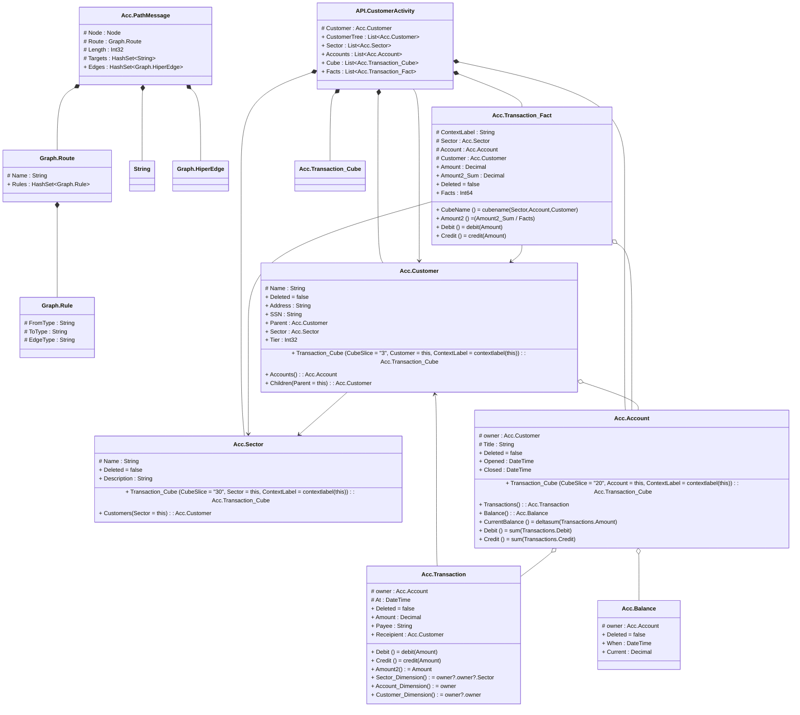

# readme

---

## Value Graph.Route
Route across a graph of edge/node to form an HiperEdge

||Name|Type|*|@|=|
|-|-|-|-|-|
|#|Name|String||||
|+|Rules|HashSet<Graph.Rule>||||

---

## Value Graph.Rule
A rule for a route that matched as a type of Edge to a HiperEdge, e.g. { Name = 'relation', Rules = [{FromType = 'Person', ToType = 'Person', EdgeType = 'Mother'}]}

||Name|Type|*|@|=|
|-|-|-|-|-|
|#|FromType|String||||
|#|ToType|String||||
|#|EdgeType|String||||

---

## Message Acc.PathMessage
Remote execution of path requests

||Name|Type|*|@|=|
|-|-|-|-|-|
|#|Node|Node||||
|#|Route|Graph.Route||||
|#|Length|Int32||||
|#|Targets|HashSet<String>||||
|+|Edges|HashSet<Graph.HiperEdge>||||

---

## EntityImpl Acc.Sector

||Name|Type|*|@|=|
|-|-|-|-|-|
|#|Name|String|name of the sector|||
||Deleted|Some(Boolean)|Flag for read horizon filter to hide when true||false|
|+|Description|String|description of the sector|||
||Transaction_Cube|Acc.Transaction_Cube|Reference to the dimension|CubeFactReference()|CubeSlice = "30", Sector = this, ContextLabel = contextlabel(this)|
||Customers|Acc.Customer|customers in this sector||Sector = this|

---

## EntityImpl Acc.Customer
A Customer

||Name|Type|*|@|=|
|-|-|-|-|-|
|#|Name|String| name  of the customer|||
||Deleted|Some(Boolean)|Flag for read horizon filter to hide when true||false|
|+|Address|String||||
|+|SSN|String||||
|+|Parent|Acc.Customer||||
|+|Sector|Acc.Sector||||
|+|Tier|Int32||||
||Transaction_Cube|Acc.Transaction_Cube|Reference to the dimension|CubeFactReference()|CubeSlice = "3", Customer = this, ContextLabel = contextlabel(this)|
|+|Accounts|Acc.Account|Account that the customer owns|||
||Children|Acc.Customer|||Parent = this|

---

## SegmentImpl Acc.Transaction
A Customer

||Name|Type|*|@|=|
|-|-|-|-|-|
|#|owner|Acc.Account||||
|#|At|DateTime|when the transaction was authorised|||
||Deleted|Some(Boolean)|Flag for read horizon filter to hide when true||false|
|+|Amount|Decimal|debt or credit to account, with respect to the customer position|CubeMeasure(Aggregate?.Sum)||
|+|Payee|String|who it was paid to|||
|+|Receipient|Acc.Customer||||
||Debit|Some(Decimal)||CubeExtent()|debit(Amount)|
||Credit|Some(Decimal)||CubeExtent()|credit(Amount)|
||Amount2|Some(Decimal)||CubeMeasure(Aggregate?.Average)|Amount|
||Sector_Dimension|Some(Acc.Sector)|||owner?.owner?.Sector|
||Account_Dimension|Some(Acc.Account)|||owner|
||Customer_Dimension|Some(Acc.Customer)|||owner?.owner|

---

## SegmentImpl Acc.Account
A Customer

||Name|Type|*|@|=|
|-|-|-|-|-|
|#|owner|Acc.Customer||||
|#|Title|String||||
||Deleted|Some(Boolean)|Flag for read horizon filter to hide when true||false|
|+|Opened|DateTime||||
|+|Closed|DateTime||||
||Transaction_Cube|Acc.Transaction_Cube|Reference to the dimension|CubeFactReference()|CubeSlice = "20", Account = this, ContextLabel = contextlabel(this)|
|+|Transactions|Acc.Transaction|transactions against the account|||
|+|Balance|Acc.Balance|the last closing balance|||
||CurrentBalance|Some(Decimal)||CubeMeasure(Aggregate?.Sum)|deltasum(Transactions.Amount)|
||Debit|Some(Decimal)|||sum(Transactions.Debit)|
||Credit|Some(Decimal)|||sum(Transactions.Credit)|

---

## AspectImpl Acc.Balance
A Customer

||Name|Type|*|@|=|
|-|-|-|-|-|
|#|owner|Acc.Account||||
||Deleted|Some(Boolean)|Flag for read horizon filter to hide when true||false|
|+|When|DateTime|DateTime of the max balance|||
|+|Current|Decimal|Current closing balance at time When|||

---

## EntityImpl Acc.Transaction_Fact
A Customer

||Name|Type|*|@|=|
|-|-|-|-|-|
|#|ContextLabel|String||||
|#|Sector|Acc.Sector||CubeDimensionReference()||
|#|Account|Acc.Account|A Customer|CubeDimensionReference()||
|#|Customer|Acc.Customer|A Customer|CubeDimensionReference()||
|+|Amount|Decimal|debt or credit to account, with respect to the customer position|CubeMeasure(Aggregate?.Sum)||
|+|Amount2_Sum|Decimal||CubeMeasure(Aggregate?.AverageTotal)||
||Deleted|Some(Boolean)|The cube fact has been deleted||false|
|+|Facts|Int64|Indicate that the Cube Slice is a Fact|||
||CubeName|Some(String)|||cubename(Sector,Account,Customer)|
||Amount2|Some(Decimal)||CubeMeasure(Aggregate?.Average)|(Amount2_Sum / Facts)|
||Debit|Some(Decimal)||CubeExtent()|debit(Amount)|
||Credit|Some(Decimal)||CubeExtent()|credit(Amount)|

---

## Message API.CustomerActivity

||Name|Type|*|@|=|
|-|-|-|-|-|
|#|Customer|Acc.Customer||||
|+|CustomerTree|List<Acc.Customer>||||
|+|Sector|List<Acc.Sector>||||
|+|Accounts|List<Acc.Account>||||
|+|Cube|List<Acc.Transaction_Cube>||||
|+|Facts|List<Acc.Transaction_Fact>||||

