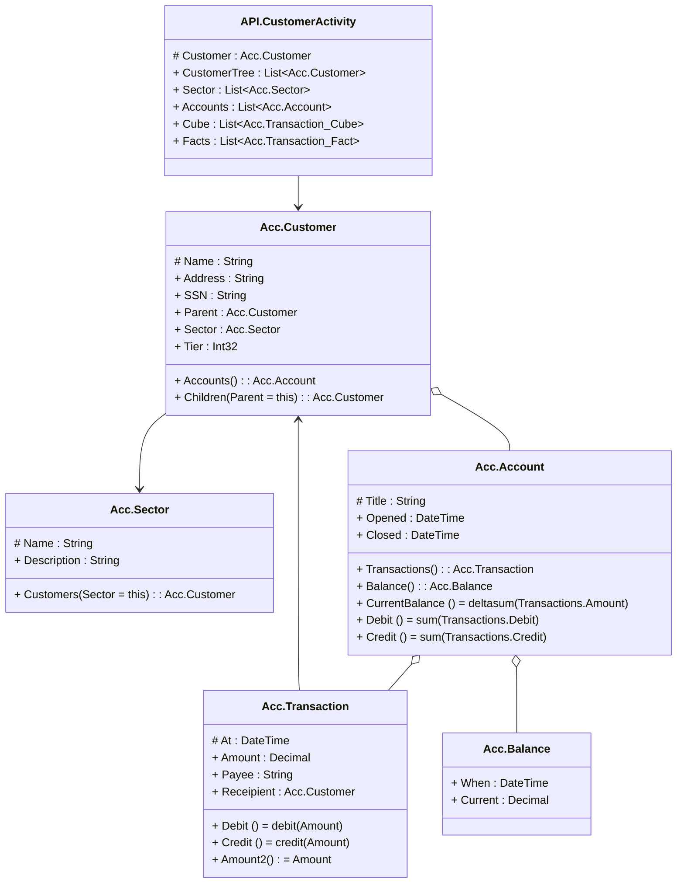

# readme

---

## Entity Acc.Sector

||Name|Type|*|@|=|
|-|-|-|-|-|
|#|Name|String|name of the sector|||
|+|Description|String|description of the sector|||
||Customers|Acc.Customer|customers in this sector||Sector = this|

---

## Entity Acc.Customer
A Customer

||Name|Type|*|@|=|
|-|-|-|-|-|
|#|Name|String| name  of the customer|||
|+|Address|String||||
|+|SSN|String||||
|+|Parent|Acc.Customer||||
|+|Sector|Acc.Sector||||
|+|Tier|Int32||||
|+|Accounts|Acc.Account|Account that the customer owns|||
||Children|Acc.Customer|||Parent = this|

---

## Segment Acc.Transaction
a transaction against account

||Name|Type|*|@|=|
|-|-|-|-|-|
|#|At|DateTime|when the transaction was authorised|||
|+|Amount|Decimal|debt or credit to account, with respect to the customer position|CubeMeasure(Aggregate?.Sum)||
|+|Payee|String|who it was paid to|||
|+|Receipient|Acc.Customer||||
||Debit|||CubeExtent()|debit(Amount)|
||Credit|||CubeExtent()|credit(Amount)|
||Amount2|||CubeMeasure(Aggregate?.Average)|Amount|

---

## Segment Acc.Account
An Account for a customer

||Name|Type|*|@|=|
|-|-|-|-|-|
|#|Title|String||||
|+|Opened|DateTime||||
|+|Closed|DateTime||||
|+|Transactions|Acc.Transaction|transactions against the account|||
|+|Balance|Acc.Balance|the last closing balance|||
||CurrentBalance|||CubeMeasure(Aggregate?.Sum)|deltasum(Transactions.Amount)|
||Debit||||sum(Transactions.Debit)|
||Credit||||sum(Transactions.Credit)|

---

## Aspect Acc.Balance
 Balance is the rolled up value for the account computed for a time

||Name|Type|*|@|=|
|-|-|-|-|-|
|+|When|DateTime|DateTime of the max balance|||
|+|Current|Decimal|Current closing balance at time When|||

---

## Message API.CustomerActivity

||Name|Type|*|@|=|
|-|-|-|-|-|
|#|Customer|Acc.Customer||||
|+|CustomerTree|List<Acc.Customer>||||
|+|Sector|List<Acc.Sector>||||
|+|Accounts|List<Acc.Account>||||
|+|Cube|List<Acc.Transaction_Cube>||||
|+|Facts|List<Acc.Transaction_Fact>||||

