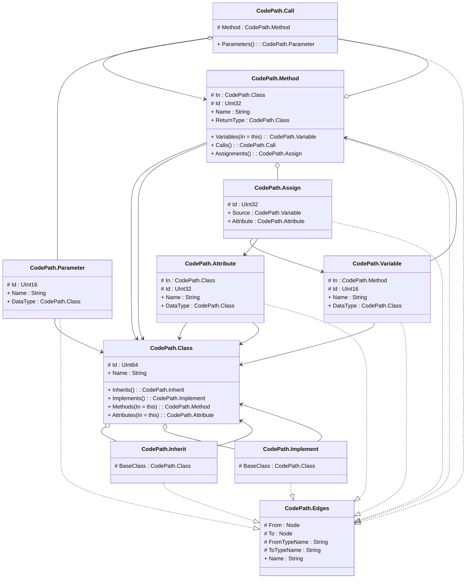

```mermaid

classDiagram

    class CodePath.Edges {

        # From  : Node
        # To  : Node
        # FromTypeName  : String
        # ToTypeName  : String

        + Name  : String

    }


 

    class CodePath.Attribute {

        # In  : CodePath.Class
        # Id  : UInt32

        + Name  : String
        + DataType  : CodePath.Class

    }


    CodePath.Attribute --> CodePath.Class
    CodePath.Attribute --> CodePath.Class


    CodePath.Attribute ..|> CodePath.Edges
 

    class CodePath.Call {

        # Method  : CodePath.Method


        + Parameters () : CodePath.Parameter
    }


    CodePath.Call --> CodePath.Method

    CodePath.Call o-- CodePath.Parameter

    CodePath.Call ..|> CodePath.Edges
 

    class CodePath.Class {

        # Id  : UInt64

        + Name  : String

        + Inherits () : CodePath.Inherit
        + Implements () : CodePath.Implement
        + Methods (In = this) : CodePath.Method
        + Attributes (In = this) : CodePath.Attribute
    }


    CodePath.Class o-- CodePath.Inherit
    CodePath.Class o-- CodePath.Implement

 

    class CodePath.Implement {

        # BaseClass  : CodePath.Class


    }


    CodePath.Implement --> CodePath.Class


    CodePath.Implement ..|> CodePath.Edges
 

    class CodePath.Inherit {

        # BaseClass  : CodePath.Class


    }


    CodePath.Inherit --> CodePath.Class


    CodePath.Inherit ..|> CodePath.Edges
 

    class CodePath.Method {

        # In  : CodePath.Class
        # Id  : UInt32

        + Name  : String
        + ReturnType  : CodePath.Class

        + Variables (In = this) : CodePath.Variable
        + Calls () : CodePath.Call
        + Assignments () : CodePath.Assign
    }


    CodePath.Method --> CodePath.Class
    CodePath.Method --> CodePath.Class
    CodePath.Method o-- CodePath.Call
    CodePath.Method o-- CodePath.Assign

    CodePath.Method ..|> CodePath.Edges
 

    class CodePath.Parameter {

        # Id  : UInt16

        + Name  : String
        + DataType  : CodePath.Class

    }


    CodePath.Parameter --> CodePath.Class


    CodePath.Parameter ..|> CodePath.Edges
 

    class CodePath.Variable {

        # In  : CodePath.Method
        # Id  : UInt16

        + Name  : String
        + DataType  : CodePath.Class

    }


    CodePath.Variable --> CodePath.Method
    CodePath.Variable --> CodePath.Class


    CodePath.Variable ..|> CodePath.Edges
 

    class CodePath.Assign {

        # Id  : UInt32

        + Source  : CodePath.Variable
        + Attribute  : CodePath.Attribute

    }


    CodePath.Assign --> CodePath.Variable
    CodePath.Assign --> CodePath.Attribute


    CodePath.Assign ..|> CodePath.Edges
 

```