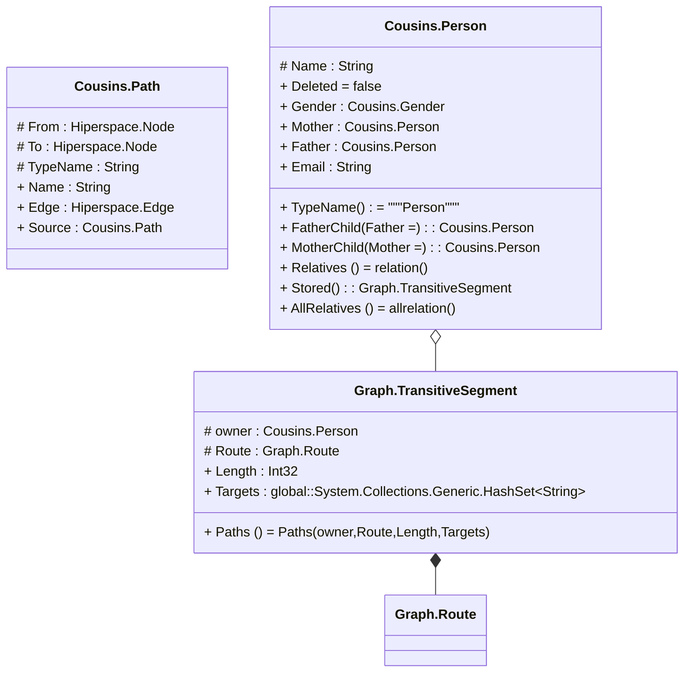

# Cousins-physical

> The tables below contain descriptions of the members of each Element. 
> The first column indicates the type of the member:
> A ‘#’ indicates that the field is a key to the element, and a ‘+’ indicates that the field is a value.
> The ‘*’ column contains a description for the element member.  
> The ‘@’ column contains any properties for the member.
> The ‘=’ column contains calculated values; or in the case of an enum, the serialized value.

---

## EntityImpl Cousins.Path

| |Name|Type|*|@|=|
|-|-|-|-|-|-|
|#|From|Hiperspace.Node||||
|#|To|Hiperspace.Node||||
|#|TypeName|String||||
|+|Name|String||||
|+|Edge|Hiperspace.Edge||||
|+|Source|Cousins.Path||||

---

## EntityImpl Cousins.Person

| |Name|Type|*|@|=|
|-|-|-|-|-|-|
|#|Name|String||||
||Deleted|Some(Boolean)|Flag for read horizon filter to hide when true||false|
|+|Gender|Cousins.Gender||||
|+|Mother|Cousins.Person||||
|+|Father|Cousins.Person||||
|+|Email|String||||
||TypeName|Some(String)|||"""Person"""|
||FatherChild|Cousins.Person|||Father = |
||MotherChild|Cousins.Person|||Mother = |
||Relatives|Some(global::System.Collections.Generic.List<Path>)||Once()|relation()|
|+|Stored|Graph.TransitiveSegment||||
||AllRelatives|Some(global::System.Collections.Generic.HashSet<Graph.HiperEdge>)||Once()|allrelation()|

---

## SegmentImpl Graph.TransitiveSegment

| |Name|Type|*|@|=|
|-|-|-|-|-|-|
|#|owner|Cousins.Person||||
|#|Route|Graph.Route||||
|+|Length|Int32||||
|+|Targets|global::System.Collections.Generic.HashSet<String>||||
||Paths|Some(global::System.Collections.Generic.HashSet<Graph.HiperEdge>)||Once()|Paths(owner,Route,Length,Targets)|

