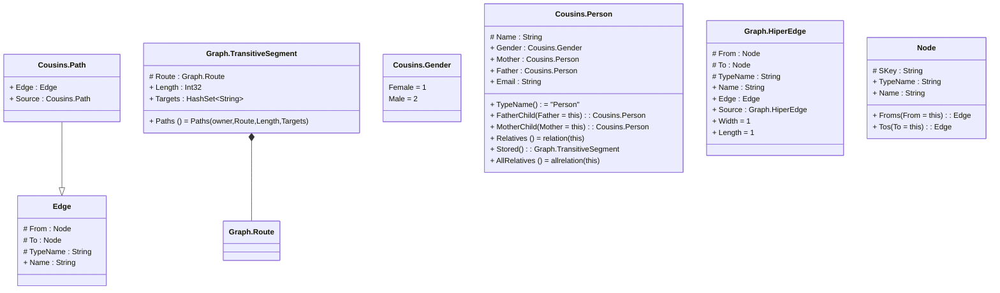

# Cousins

> The tables below contain descriptions of the members of each Element. 
> The first column indicates the type of the member:
> A ‘#’ indicates that the field is a key to the element, and a ‘+’ indicates that the field is a value.
> The ‘*’ column contains a description for the element member.  
> The ‘@’ column contains any properties for the member.
> The ‘=’ column contains calculated values; or in the case of an enum, the serialized value.

---

## Entity Cousins.Path

| |Name|Type|*|@|=|
|-|-|-|-|-|-|
|+|Edge|Edge||||
|+|Source|Cousins.Path||||

---

## Segment Graph.TransitiveSegment

| |Name|Type|*|@|=|
|-|-|-|-|-|-|
|#|Route|Graph.Route||||
|+|Length|Int32||||
|+|Targets|HashSet<String>||||
||Paths|Some(HashSet<Graph.HiperEdge>)||Once()|Paths(owner,Route,Length,Targets)|

---

## Enum Cousins.Gender

| |Name|Type|*|@|=|
|-|-|-|-|-|-|
||Female|Int32|||1|
||Male|Int32|||2|

---

## Entity Cousins.Person

| |Name|Type|*|@|=|
|-|-|-|-|-|-|
|#|Name|String||||
|+|Gender|Cousins.Gender||||
|+|Mother|Cousins.Person||||
|+|Father|Cousins.Person||||
|+|Email|String||||
||TypeName|Some(String)|||"Person"|
||FatherChild|Cousins.Person|||Father = this|
||MotherChild|Cousins.Person|||Mother = this|
||Relatives|Some(List<Path>)||Once()|relation(this)|
|+|Stored|Graph.TransitiveSegment||||
||AllRelatives|Some(HashSet<Graph.HiperEdge>)||Once()|allrelation(this)|

---

## View Graph.HiperEdge
Path from one Node to another Node over a number of routes

| |Name|Type|*|@|=|
|-|-|-|-|-|-|
|#|From|Node||||
|#|To|Node||||
|#|TypeName|String||||
|+|Name|String||||
|+|Edge|Edge|The Edge that provides the end of this Path|||
|+|Source|Graph.HiperEdge|The shortest source Path that this path extends|||
||Width|Some(Int32)|The number of distict paths between the Nodes||1|
||Length|Some(Int32)|The shortest number of Edges in the Path||1|

---

## View Edge
edge between nodes

| |Name|Type|*|@|=|
|-|-|-|-|-|-|
|#|From|Node||||
|#|To|Node||||
|#|TypeName|String||||
|+|Name|String||||

---

## View Node
node in a graph view of data

| |Name|Type|*|@|=|
|-|-|-|-|-|-|
|#|SKey|String||||
|+|TypeName|String||||
|+|Name|String||||
||Froms|Edge|||From = this|
||Tos|Edge|||To = this|

