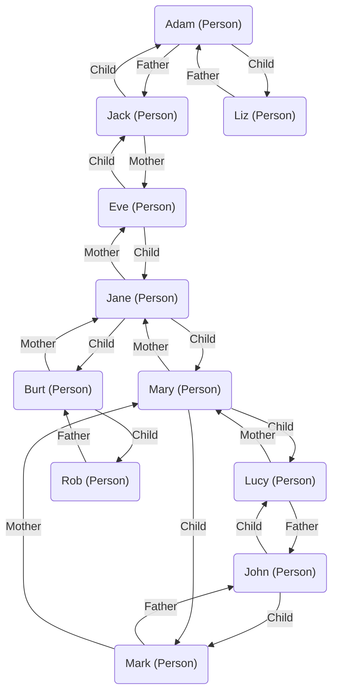
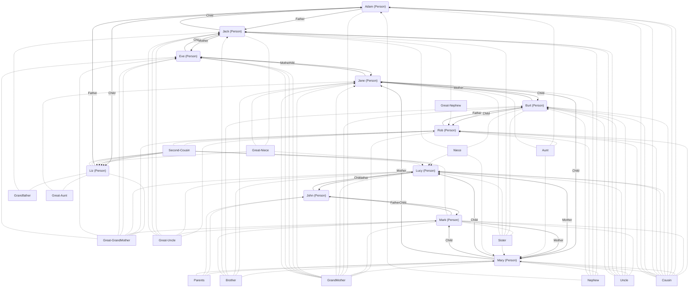

# Cousins Problem

Cousin Problem that highlights the different perspectives of ancestor relationships 
seen from the perspective of parents, and individual with their {siblings, 
cousins, uncles, aunts, grandparents}:

* A genealogical perspective is concerned with the mothers, fathers and children
* A person perspective views relations as a star, with the individual at the center, and cousins around them

There's an ontological choice between modeling modelling all relations between people as `Node` and `Edge`
or add `transitive edge` that are impled by `path` following a number of edges. 
The decision is often made based for performance reasons, since recursive queries in graph databases 
become very complex when the edge type changes when traversing the graph


This simple diagram shows parental relations and *some* of the implied relationships.
Only a subset of implied relations is shown,including them all would resemble a 
spider-web rather than a reaable graph.

## Example using hiperspace

Hiperspace makes it easier to resolve the conflict of ancestoral or cousins view because

* Node traversal in Hiperspace is very quick and performed in parallel for views (like Node)
* HiLang models allow extensions to be added: [Helper](./Helper.cs) add graph search

### Model

The ancestoral model can be expressed in HiLang as an Entity `Person` witha `Father` and `Mother` reference.
The person provides the `Node` view and four `Edge` views for graph traversal.  For this sample the key is just `Name`.

```
entity Cousins.Person                                                       /* define Persion                       */
    = Node (),                                                              /* Person has a Node View               */
      Edge  (From = this,   To = Mother, Name = Name, TypeName = "Mother"), /* Person provides Edge to Mother       */
      Edge2 (From = this,   To = Father, Name = Name, TypeName = "Father"), /* Person provides Edge to Father       */
      Edge3 (From = Father, To = this,   Name = Name, TypeName = "Child"),  /* Person provides Edge from Father     */
      Edge4 (From = Mother, To = this,   Name = Name, TypeName = "Child")   /* Person provides Edge from Mother     */
(                                                                           /* Keys                                 */
    Name        : String                                                    /* Person has Name as key               */
)
{                                                                           /* Values                               */
    Gender      : Cousins.Gender,                                           /* Person has Gender {}Female, Male     */

    Mother      : Cousins.Person,                                           /* Person has reference to Mother       */
    Father      : Cousins.Person                                            /* Person has reference to Father       */
}
[                                                                           /* Extent properties not stored         */
    TypeName    = "Person",                                                 /* TypeName for Node View               */

    FatherChild : Cousins.Person (Father = this),                           /* navigation to children               */
    MotherChild : Cousins.Person (Mother = this),                           /* navigation to children               */
    @Once
    Relatives   = relation (this)                                           /* function to navigate to all relatives*/
];
```

The graph above is loaded inot Hiperspace in the [Test cases](./Test.cs). In this example there are no Horizon constraints, 
parents do not need to be loaded first `Mother = new Person {Name "Eve"}` provides the reference to a parent that will be lazy 
loaded when referenced
```
    new Person {Name = "Eve", Gender = Gender.Female },
    new Person {Name = "Jane", Gender = Gender.Female, Mother = new Person {Name = "Eve" }},
    new Person {Name = "Jack", Gender = Gender.Male, Mother = new Person {Name = "Eve" }},
    new Person {Name = "Adam", Gender = Gender.Male, Father = new Person {Name = "Jack" }},
    new Person {Name = "Liz", Gender = Gender.Female, Father = new Person {Name = "Adam" }},
    new Person {Name = "Mary", Gender = Gender.Female, Mother = new Person {Name = "Jane" }},
    new Person {Name = "Burt", Gender = Gender.Male, Mother= new Person {Name = "Jane" }},
    new Person {Name = "Rob", Gender = Gender.Male, Father = new Person {Name = "Burt" }},
    new Person {Name = "John", Gender = Gender.Male},
    new Person {Name = "Lucy", Gender = Gender.Female, Father = new Person {Name = "John" }, Mother = new Person {Name = "Mary" } },
    new Person {Name = "Mark", Gender = Gender.Male, Father = new Person {Name = "John" }, Mother = new Person {Name = "Mary"} },
```

**11** row of data becomes **22** Edges when viewed as a graph. The code `Relatives = relation (this)` uses a native C# function to 
provide the **106** infered relations that would be unmaintainable if stored in a graph database.

The advantgage of the Hiperspace graph view are

* Only the source data is stored and changed, with Edges projected as needed
* Edge projections are loaded in parallel and cached in the Session 
* Transative relations are projected as needd

|Person|Father|Mother|
|-|-|-|
|Lucy|John|Mary|

is projected as graph edges

|From|Edge|To|
|-|-|-|
|Lucy|Father|John|
|Lucy|Mother|Mary|
|John|Child|Lucy|
|Mary|Child|Lucy|


and transitively infered to 

|From|Edge|To|
|-|-|-|
|Lucy|Brother|Mark|
|Lucy|Cousin|Rob|
|Lucy|Father|John|
|Lucy|GrandMother|Jane|
|Lucy|Great-GrandMother|Eve|
|Lucy|Great-Uncle|Jack|
|Lucy|Mother|Mary|
|Lucy|relation|Eve|
|Lucy|relation|Liz|
|Lucy|relation|Rob|
|Lucy|relation|Mary|
|Lucy|relation|Adam|
|Lucy|relation|Burt|
|Lucy|relation|Jack|
|Lucy|relation|Jane|
|Lucy|relation|John|
|Lucy|Second-Cousin|Liz|
|Lucy|Uncle|Burt|
|Adam|relation|Lucy|
|Burt|Niece|Lucy|
|Jack|Great-Niece|Lucy|
|John|Child|Lucy|
|Liz|Second-Cousin|Lucy|
|Mark|Sister|Lucy|
|Mary|Child|Lucy|
|Rob|Cousin|Lucy|



