# Cube-graph

```mermaid
classDiagram
    class Cube.ContractCountryEdge {
        # From  : Node
        # To  : Node
        # TypeName  : String
        + Name  : String
    }
    class Cube.ContractPortfolioEdge {
        # From  : Node
        # To  : Node
        # TypeName  : String
        + Name  : String
    }
    class Cube.ContractProductEdge {
        # From  : Node
        # To  : Node
        # TypeName  : String
        + Name  : String
    }
    class Cube.ContractSectorEdge {
        # From  : Node
        # To  : Node
        # TypeName  : String
        + Name  : String
    }
    class Cube.CountryContractEdge {
        # From  : Node
        # To  : Node
        # TypeName  : String
        + Name  : String
    }
    class Cube.Edges2 {
        # From  : Node
        # To  : Node
        # FromTypeName  : String
        # ToTypeName  : String
        + Name  : String
    }
    Cube.Edges2 ..|> Cube.Edge_
    Cube.Edges2 ..|> Cube.Edges
    class Cube.PortfolioContractEdge {
        # From  : Node
        # To  : Node
        # TypeName  : String
        + Name  : String
    }
    class Cube.ProductContractEdge {
        # From  : Node
        # To  : Node
        # TypeName  : String
        + Name  : String
    }
    class Cube.SectorContractEdge {
        # From  : Node
        # To  : Node
        # TypeName  : String
        + Name  : String
    }
    class Cube.Account {
        # Id  : String
        + Customer  : Cube.Customer
        + FirstAccount (Account = this) : First.Acc
    }
    Cube.Account ..|> Cube.Edges
    class Cube.Customer {
        # Id  : String
        + Sector  : Cube.Sector
        + Accounts (Customer = this) : Cube.Account
        + FirstAccount () : Cube.CustomerFirstAccount
    }
    Cube.Customer ..|> Cube.Edges
    class Cube.Instrument {
        # ISIN  : String
        + Country  : Cube.Country
        + Product  : Cube.Product
        + Price () : Cube.Price
        + Market () = Price?.Market
    }
    Cube.Instrument ..|> Cube.Edges
    Cube.Instrument ..|> Cube.Edges2
    class Cube.CustomerFirstAccount {
        # owner  : Cube.Customer
        + Account  : Cube.Account
    }
    class Cube.Country {
        # ISO  : String
        + Contract_Cube (CubeSlice = "13", Country = this, ContextLabel = contextlabel(this)) : Cube.Contract_Cube
        + Instruments (Country = this) : Cube.Instrument
    }
    class Cube.Portfolio {
        # Id  : String
        + Parent  : Cube.Portfolio
        + Tier  : Int32
        + Contract_Cube (CubeSlice = "11", Portfolio = this, ContextLabel = contextlabel(this)) : Cube.Contract_Cube
        + Children (Parent = this) : Cube.Portfolio
    }
    Cube.Portfolio ..|> Cube.Edges
    class Cube.Sector {
        # Id  : Int32
        + Name  : String
        + Parent  : Cube.Sector
        + Tier  : Int32
        + Contract_Cube (CubeSlice = "19", Sector = this, ContextLabel = contextlabel(this)) : Cube.Contract_Cube
        + Children (Parent = this) : Cube.Sector
        + Customers (Sector = this) : Cube.Customer
    }
    Cube.Sector ..|> Cube.Edges
    class Cube.Product {
        # Id  : String
        + Parent  : Cube.Product
        + Tier  : Int32
        + Contract_Cube (CubeSlice = "25", Product = this, ContextLabel = contextlabel(this)) : Cube.Contract_Cube
        + Children (Parent = this) : Cube.Product
        + ProductInstruments (Product = this) : Cube.Instrument
    }
    Cube.Product ..|> Cube.Edges
    class Cube.Contract {
        # Id  : Int64
        + Deleted  = false
        + Quantity  : Decimal
        + Instrument  : Cube.Instrument
        + Portfolio  : Cube.Portfolio
        + Account  : Cube.Account
        + Market () = Instrument?.Market
        + Value () = (Quantity * Market)
        + StdDev () = Value
        + Percentile () = Value
        + Avg () = Value
        + Sector_Dimension () = Account?.Customer?.Sector
        + Country_Dimension () = Instrument?.Country
        + Product_Dimension () = Instrument?.Product
        + Portfolio_Dimension () = Portfolio
    }
    class Cube.Contract_Cube {
        # CubeSlice  : String
        # ContextLabel  : String
        # Sector  : Cube.Sector
        # Country  : Cube.Country
        # Product  : Cube.Product
        # Portfolio  : Cube.Portfolio
        + Value  : Decimal
        + StdDev  : Double
        + Percentile  : Double
        + Avg_Sum  : Decimal
        + Deleted  = false
        + Facts  : Int64
        + CubeName () = cubename(Sector,Country,Product,Portfolio)
        + CubeDimensions () = cubedimensions(Sector,Country,Product,Portfolio)
        + Avg () = (Avg_Sum / Facts)
    }
    Cube.Contract_Cube --> Cube.Sector
    Cube.Contract_Cube --> Cube.Country
    Cube.Contract_Cube --> Cube.Product
    Cube.Contract_Cube --> Cube.Portfolio
    Cube.Contract_Cube ..|> Cube.ContractSectorEdge
    Cube.Contract_Cube ..|> Cube.SectorContractEdge
    Cube.Contract_Cube ..|> Cube.ContractCountryEdge
    Cube.Contract_Cube ..|> Cube.CountryContractEdge
    Cube.Contract_Cube ..|> Cube.ContractProductEdge
    Cube.Contract_Cube ..|> Cube.ProductContractEdge
    Cube.Contract_Cube ..|> Cube.ContractPortfolioEdge
    Cube.Contract_Cube ..|> Cube.PortfolioContractEdge
    class Cube.Contract_Fact {
        # ContextLabel  : String
        # Sector  : Cube.Sector
        # Country  : Cube.Country
        # Product  : Cube.Product
        # Portfolio  : Cube.Portfolio
        + Value  : Decimal
        + StdDev_Vector  : Vector
        + Percentile_Vector  : Vector
        + Avg_Sum  : Decimal
        + Deleted  = false
        + Facts  : Int64
        + CubeName () = cubename(Sector,Country,Product,Portfolio)
        + CubeDimensions () = cubedimensions(Sector,Country,Product,Portfolio)
        + Avg () = (Avg_Sum / Facts)
        + StdDev () = stddev(StdDev_Vector)
        + Percentile () = percentile(Percentile_Vector,95)
    }
    Cube.Contract_Fact --> Cube.Sector
    Cube.Contract_Fact --> Cube.Country
    Cube.Contract_Fact --> Cube.Product
    Cube.Contract_Fact --> Cube.Portfolio
    Cube.Contract_Fact ..|> Cube.ContractSectorEdge
    Cube.Contract_Fact ..|> Cube.SectorContractEdge
    Cube.Contract_Fact ..|> Cube.ContractCountryEdge
    Cube.Contract_Fact ..|> Cube.CountryContractEdge
    Cube.Contract_Fact ..|> Cube.ContractProductEdge
    Cube.Contract_Fact ..|> Cube.ProductContractEdge
    Cube.Contract_Fact ..|> Cube.ContractPortfolioEdge
    Cube.Contract_Fact ..|> Cube.PortfolioContractEdge
    class Banking.Trade {
        # Id  : String
        + Book  : Banking.Book
        + Value  : Decimal
    }
    class Banking.EQ.Trade {
        # Id  : String
        + Book  : Banking.Book
        + Value  : Decimal
    }
    Banking.EQ.Trade ..|> Banking.Trade
    class Banking.FI.Trade {
        # Id  : String
        + Book  : Banking.Book
        + Value  : Decimal
    }
    Banking.FI.Trade ..|> Banking.Trade
    class Banking.FX.Trade {
        # Id  : String
        + Book  : Banking.Book
        + Value  : Decimal
    }
    Banking.FX.Trade ..|> Banking.Trade
    class Cube.Edge_ {
        # From  : Node
        # To  : Node
        # TypeName  : String
        + Name  : String
    }
    class Cube.Edges {
        # From  : Node
        # To  : Node
        # FromTypeName  : String
        # ToTypeName  : String
        + Name  : String
    }
    Cube.Edges ..|> Cube.Edge_
```

> The tables below contain descriptions of the members of each Element. 
> The first column indicates the type of the member:
> A ‘#’ indicates that the field is a key to the element, and a ‘+’ indicates that the field is a value.
> The ‘*’ column contains a description for the element member.  
> The ‘@’ column contains any properties for the member.
> The ‘=’ column contains calculated values; or in the case of an enum, the serialized value.

---

## View Cube.ContractCountryEdge

| |Name|Type|*|@|=|
|-|-|-|-|-|-|
|#|From|Node||||
|#|To|Node||||
|#|TypeName|String||||
|+|Name|String||||

---

## View Cube.ContractPortfolioEdge

| |Name|Type|*|@|=|
|-|-|-|-|-|-|
|#|From|Node||||
|#|To|Node||||
|#|TypeName|String||||
|+|Name|String||||

---

## View Cube.ContractProductEdge

| |Name|Type|*|@|=|
|-|-|-|-|-|-|
|#|From|Node||||
|#|To|Node||||
|#|TypeName|String||||
|+|Name|String||||

---

## View Cube.ContractSectorEdge

| |Name|Type|*|@|=|
|-|-|-|-|-|-|
|#|From|Node||||
|#|To|Node||||
|#|TypeName|String||||
|+|Name|String||||

---

## View Cube.CountryContractEdge

| |Name|Type|*|@|=|
|-|-|-|-|-|-|
|#|From|Node||||
|#|To|Node||||
|#|TypeName|String||||
|+|Name|String||||

---

## View Cube.Edges2

| |Name|Type|*|@|=|
|-|-|-|-|-|-|
|#|From|Node||||
|#|To|Node||||
|#|FromTypeName|String||||
|#|ToTypeName|String||||
|+|Name|String||||

---

## View Cube.PortfolioContractEdge

| |Name|Type|*|@|=|
|-|-|-|-|-|-|
|#|From|Node||||
|#|To|Node||||
|#|TypeName|String||||
|+|Name|String||||

---

## View Cube.ProductContractEdge

| |Name|Type|*|@|=|
|-|-|-|-|-|-|
|#|From|Node||||
|#|To|Node||||
|#|TypeName|String||||
|+|Name|String||||

---

## View Cube.SectorContractEdge

| |Name|Type|*|@|=|
|-|-|-|-|-|-|
|#|From|Node||||
|#|To|Node||||
|#|TypeName|String||||
|+|Name|String||||

---

## EntityImpl Cube.Account

| |Name|Type|*|@|=|
|-|-|-|-|-|-|
|#|Id|String||||
|+|Customer|Cube.Customer||||
||FirstAccount|First.Acc|||Account = this|

---

## EntityImpl Cube.Customer

| |Name|Type|*|@|=|
|-|-|-|-|-|-|
|#|Id|String||||
|+|Sector|Cube.Sector||||
||Accounts|Cube.Account|||Customer = this|
|+|FirstAccount|Cube.CustomerFirstAccount||||

---

## EntityImpl Cube.Instrument

| |Name|Type|*|@|=|
|-|-|-|-|-|-|
|#|ISIN|String||||
|+|Country|Cube.Country||||
|+|Product|Cube.Product||||
|+|Price|Cube.Price||||
||Market|Some(Decimal)|||Price?.Market|

---

## AspectImpl Cube.CustomerFirstAccount

| |Name|Type|*|@|=|
|-|-|-|-|-|-|
|#|owner|Cube.Customer||||
|+|Account|Cube.Account||AlternateIndex("Cube.CustomerFirstAccount", 78)||

---

## EntityImpl Cube.Country

| |Name|Type|*|@|=|
|-|-|-|-|-|-|
|#|ISO|String||||
||Contract_Cube|Cube.Contract_Cube|Reference to the dimension|CubeFactReference()|CubeSlice = "13", Country = this, ContextLabel = contextlabel(this)|
||Instruments|Cube.Instrument|||Country = this|

---

## EntityImpl Cube.Portfolio

| |Name|Type|*|@|=|
|-|-|-|-|-|-|
|#|Id|String||||
|+|Parent|Cube.Portfolio||||
|+|Tier|Int32||||
||Contract_Cube|Cube.Contract_Cube|Reference to the dimension|CubeFactReference()|CubeSlice = "11", Portfolio = this, ContextLabel = contextlabel(this)|
||Children|Cube.Portfolio|||Parent = this|

---

## EntityImpl Cube.Sector

| |Name|Type|*|@|=|
|-|-|-|-|-|-|
|#|Id|Int32||||
|+|Name|String||||
|+|Parent|Cube.Sector||||
|+|Tier|Int32||||
||Contract_Cube|Cube.Contract_Cube|Reference to the dimension|CubeFactReference()|CubeSlice = "19", Sector = this, ContextLabel = contextlabel(this)|
||Children|Cube.Sector|||Parent = this|
||Customers|Cube.Customer|||Sector = this|

---

## EntityImpl Cube.Product

| |Name|Type|*|@|=|
|-|-|-|-|-|-|
|#|Id|String||||
|+|Parent|Cube.Product||||
|+|Tier|Int32||||
||Contract_Cube|Cube.Contract_Cube|Reference to the dimension|CubeFactReference()|CubeSlice = "25", Product = this, ContextLabel = contextlabel(this)|
||Children|Cube.Product|||Parent = this|
||ProductInstruments|Cube.Instrument|||Product = this|

---

## EntityImpl Cube.Contract

| |Name|Type|*|@|=|
|-|-|-|-|-|-|
|#|Id|Int64||||
||Deleted|Some(Boolean)|Flag for read horizon filter to hide when true||false|
|+|Quantity|Decimal||||
|+|Instrument|Cube.Instrument||||
|+|Portfolio|Cube.Portfolio||||
|+|Account|Cube.Account||||
||Market|Some(Decimal)|||Instrument?.Market|
||Value|Some(Decimal)||CubeMeasure(Aggregate?.Sum)|(Quantity * Market)|
||StdDev|Some(Decimal)||CubeMeasure(Aggregate?.StdDev)|Value|
||Percentile|Some(Decimal)||CubeMeasure(Aggregate?.Percentile, 95)|Value|
||Avg|Some(Decimal)||CubeMeasure(Aggregate?.Average)|Value|
||Sector_Dimension|Some(Cube.Sector)|||Account?.Customer?.Sector|
||Country_Dimension|Some(Cube.Country)|||Instrument?.Country|
||Product_Dimension|Some(Cube.Product)|||Instrument?.Product|
||Portfolio_Dimension|Some(Cube.Portfolio)|||Portfolio|

---

## EntityImpl Cube.Contract_Cube

| |Name|Type|*|@|=|
|-|-|-|-|-|-|
|#|CubeSlice|String||||
|#|ContextLabel|String||||
|#|Sector|Cube.Sector||CubeDimensionReference()||
|#|Country|Cube.Country||CubeDimensionReference()||
|#|Product|Cube.Product||CubeDimensionReference()||
|#|Portfolio|Cube.Portfolio||CubeDimensionReference()||
|+|Value|Decimal||CubeMeasure(Aggregate?.Sum)||
|+|StdDev|Double||CubeMeasure(Aggregate?.StdVector)||
|+|Percentile|Double||CubeMeasure(Aggregate?.PerVector, 95)||
|+|Avg_Sum|Decimal||CubeMeasure(Aggregate?.AverageTotal)||
||Deleted|Some(Boolean)|The cube fact has been deleted||false|
|+|Facts|Int64|Number of Facts this Cube/Fact is calculated from|||
||CubeName|Some(String)|||cubename(Sector,Country,Product,Portfolio)|
||CubeDimensions|Some(Int32)|||cubedimensions(Sector,Country,Product,Portfolio)|
||Avg|Some(Decimal)||CubeMeasure(Aggregate?.Average)|(Avg_Sum / Facts)|

---

## EntityImpl Cube.Contract_Fact

| |Name|Type|*|@|=|
|-|-|-|-|-|-|
|#|ContextLabel|String||||
|#|Sector|Cube.Sector||CubeDimensionReference()||
|#|Country|Cube.Country||CubeDimensionReference()||
|#|Product|Cube.Product||CubeDimensionReference()||
|#|Portfolio|Cube.Portfolio||CubeDimensionReference()||
|+|Value|Decimal||CubeMeasure(Aggregate?.Sum)||
|+|StdDev_Vector|Vector||CubeMeasure(Aggregate?.StdVector)||
|+|Percentile_Vector|Vector||CubeMeasure(Aggregate?.PerVector, 95)||
|+|Avg_Sum|Decimal||CubeMeasure(Aggregate?.AverageTotal)||
||Deleted|Some(Boolean)|The cube fact has been deleted||false|
|+|Facts|Int64|Number of Facts this Cube/Fact is calculated from|||
||CubeName|Some(String)|||cubename(Sector,Country,Product,Portfolio)|
||CubeDimensions|Some(Int32)|||cubedimensions(Sector,Country,Product,Portfolio)|
||Avg|Some(Decimal)||CubeMeasure(Aggregate?.Average)|(Avg_Sum / Facts)|
||StdDev|Some(Double)||CubeMeasure(Aggregate?.StdDev)|stddev(StdDev_Vector)|
||Percentile|Some(Double)||CubeMeasure(Aggregate?.Percentile)|percentile(Percentile_Vector,95)|

---

## View Banking.Trade

| |Name|Type|*|@|=|
|-|-|-|-|-|-|
|#|Id|String||||
|+|Book|Banking.Book||AlternateIndex("Banking.EQ.Trade", 145), AlternateIndex("Banking.FI.Trade", 143), AlternateIndex("Banking.FX.Trade", 144), AlternateIndex("Banking.Trade", 58)||
|+|Value|Decimal||CubeMeasure(Aggregate?.Sum)||

---

## EntityImpl Banking.EQ.Trade

| |Name|Type|*|@|=|
|-|-|-|-|-|-|
|#|Id|String||||
|+|Book|Banking.Book||AlternateIndex("Banking.EQ.Trade", 145), AlternateIndex("Banking.FI.Trade", 143), AlternateIndex("Banking.FX.Trade", 144), AlternateIndex("Banking.Trade", 58)||
|+|Value|Decimal||CubeMeasure(Aggregate?.Sum)||

---

## EntityImpl Banking.FI.Trade

| |Name|Type|*|@|=|
|-|-|-|-|-|-|
|#|Id|String||||
|+|Book|Banking.Book||AlternateIndex("Banking.EQ.Trade", 145), AlternateIndex("Banking.FI.Trade", 143), AlternateIndex("Banking.FX.Trade", 144), AlternateIndex("Banking.Trade", 58)||
|+|Value|Decimal||CubeMeasure(Aggregate?.Sum)||

---

## EntityImpl Banking.FX.Trade

| |Name|Type|*|@|=|
|-|-|-|-|-|-|
|#|Id|String||||
|+|Book|Banking.Book||AlternateIndex("Banking.EQ.Trade", 145), AlternateIndex("Banking.FI.Trade", 143), AlternateIndex("Banking.FX.Trade", 144), AlternateIndex("Banking.Trade", 58)||
|+|Value|Decimal||CubeMeasure(Aggregate?.Sum)||

---

## View Cube.Edge_
An additional edge helper for Cube.Edges

| |Name|Type|*|@|=|
|-|-|-|-|-|-|
|#|From|Node||||
|#|To|Node||||
|#|TypeName|String||||
|+|Name|String||||

---

## View Cube.Edges
Bidirectional Edge, implemented with two Cube.Edges

| |Name|Type|*|@|=|
|-|-|-|-|-|-|
|#|From|Node||||
|#|To|Node||||
|#|FromTypeName|String||||
|#|ToTypeName|String||||
|+|Name|String||||

