# Cube

```mermaid
classDiagram
    class Cube.Account {
        # Id  : String
        + Customer  : Cube.Customer
        + FirstAccount (Account = this) : First.Acc
    }
    Cube.Account ..|> Cube.Edges
    class Cube.Customer {
        # Id  : String
        + Sector  : Cube.Sector
        + Accounts (Customer = this) : Cube.Account
        + FirstAccount () : First.Acc
    }
    Cube.Customer ..|> Cube.Edges
    class Cube.Instrument {
        # ISIN  : String
        + Country  : Cube.Country
        + Product  : Cube.Product
        + Price () : Cube.Price
        + Market () = Price?.Market
    }
    Cube.Instrument ..|> Cube.Edges
    class First.Acc {
        + Account  : Cube.Account
    }
    class Valued {
        # Name  : String
        + Value  : Decimal
    }
    class Banking.Book {
        # Id  : String
        + Trades (Book = this) : Banking.Trade
    }
    class Cube.Portfolio {
        # Id  : String
        + Parent  : Cube.Portfolio
        + Tier  : Int32
        + Children (Parent = this) : Cube.Portfolio
    }
    Cube.Portfolio ..|> Cube.Edges
    class Cube.Product {
        # Id  : String
        + Parent  : Cube.Product
        + Tier  : Int32
        + Children (Parent = this) : Cube.Product
        + ProductInstruments (Product = this) : Cube.Instrument
    }
    Cube.Product ..|> Cube.Edges
    class Cube.Country {
        # ISO  : String
        + Instruments (Country = this) : Cube.Instrument
    }
    class Cube.Sector {
        # Id  : Int32
        + Name  : String
        + Parent  : Cube.Sector
        + Tier  : Int32
        + Children (Parent = this) : Cube.Sector
        + Customers (Sector = this) : Cube.Customer
    }
    Cube.Sector ..|> Cube.Edges
    class Cube.Contract {
        # Id  : Int64
        + Quantity  : Decimal
        + Instrument  : Cube.Instrument
        + Portfolio  : Cube.Portfolio
        + Account  : Cube.Account
        + Market () = Instrument?.Market
        + Value () = (Quantity * Market)
        + StdDev () = Value
        + Percentile () = Value
        + Avg () = Value
    }
    Cube.Contract ..|> Valued
    class Cube.Price {
        + Market  : Decimal
    }
    class Cube.Edges {
        # From  : Node
        # To  : Node
        # FromTypeName  : String
        # ToTypeName  : String
        + Name  : String
    }
    class Edge {
        # From  : Node
        # To  : Node
        # TypeName  : String
        + Name  : String
    }
    class Node {
        # SKey  : String
        + TypeName  : String
        + Name  : String
        + Froms (From = this) : Edge
        + Tos (To = this) : Edge
    }
```

> The tables below contain descriptions of the members of each Element. 
> The first column indicates the type of the member:
> A ‘#’ indicates that the field is a key to the element, and a ‘+’ indicates that the field is a value.
> The ‘*’ column contains a description for the element member.  
> The ‘@’ column contains any properties for the member.
> The ‘=’ column contains calculated values; or in the case of an enum, the serialized value.

---

## Type Banking.TradeBase

| |Name|Type|*|@|=|
|-|-|-|-|-|-|
|#|Id|String||||
|+|Book|Banking.Book||AlternateIndex("Banking.EQ.Trade", 60), AlternateIndex("Banking.FI.Trade", 56), AlternateIndex("Banking.FX.Trade", 58), AlternateIndex("Banking.EQ.Trade", 98), AlternateIndex("Banking.FI.Trade", 96), AlternateIndex("Banking.FX.Trade", 97), AlternateIndex("Banking.EQ.Trade", 119), AlternateIndex("Banking.FI.Trade", 117), AlternateIndex("Banking.FX.Trade", 118), AlternateIndex("Banking.FI.Trade", 94), AlternateIndex("Banking.FX.Trade", 95), AlternateIndex("Banking.EQ.Trade", 145), AlternateIndex("Banking.FI.Trade", 143), AlternateIndex("Banking.FX.Trade", 144)||
|+|Value|Decimal||CubeMeasure(Aggregate?.Sum)||

---

## Entity Cube.Account

| |Name|Type|*|@|=|
|-|-|-|-|-|-|
|#|Id|String||||
|+|Customer|Cube.Customer||||
||FirstAccount|First.Acc|||Account = this|

---

## Entity Cube.Customer

| |Name|Type|*|@|=|
|-|-|-|-|-|-|
|#|Id|String||||
|+|Sector|Cube.Sector||||
||Accounts|Cube.Account|||Customer = this|
|+|FirstAccount|First.Acc||||

---

## Entity Cube.Instrument

| |Name|Type|*|@|=|
|-|-|-|-|-|-|
|#|ISIN|String||||
|+|Country|Cube.Country||||
|+|Product|Cube.Product||||
|+|Price|Cube.Price||||
||Market|Some(Decimal)|||Price?.Market|

---

## Aspect First.Acc

| |Name|Type|*|@|=|
|-|-|-|-|-|-|
|+|Account|Cube.Account||AlternateIndex("Cube.CustomerFirstAccount", 78)||

---

## View Valued

| |Name|Type|*|@|=|
|-|-|-|-|-|-|
|#|Name|String||||
|+|Value|Decimal||||

---

## Entity Banking.Book

| |Name|Type|*|@|=|
|-|-|-|-|-|-|
|#|Id|String||||
||Trades|Banking.Trade|||Book = this|

---

## Entity Cube.Portfolio

| |Name|Type|*|@|=|
|-|-|-|-|-|-|
|#|Id|String||||
|+|Parent|Cube.Portfolio||||
|+|Tier|Int32||||
||Children|Cube.Portfolio|||Parent = this|

---

## Entity Cube.Product

| |Name|Type|*|@|=|
|-|-|-|-|-|-|
|#|Id|String||||
|+|Parent|Cube.Product||||
|+|Tier|Int32||||
||Children|Cube.Product|||Parent = this|
||ProductInstruments|Cube.Instrument|||Product = this|

---

## Entity Cube.Country

| |Name|Type|*|@|=|
|-|-|-|-|-|-|
|#|ISO|String||||
||Instruments|Cube.Instrument|||Country = this|

---

## Entity Cube.Sector

| |Name|Type|*|@|=|
|-|-|-|-|-|-|
|#|Id|Int32||||
|+|Name|String||||
|+|Parent|Cube.Sector||||
|+|Tier|Int32||||
||Children|Cube.Sector|||Parent = this|
||Customers|Cube.Customer|||Sector = this|

---

## Entity Cube.Contract

| |Name|Type|*|@|=|
|-|-|-|-|-|-|
|#|Id|Int64||||
|+|Quantity|Decimal||||
|+|Instrument|Cube.Instrument||||
|+|Portfolio|Cube.Portfolio||||
|+|Account|Cube.Account||||
||Market|Some(Decimal)|||Instrument?.Market|
||Value|Some(Decimal)||CubeMeasure(Aggregate?.Sum)|(Quantity * Market)|
||StdDev|Some(Decimal)||CubeMeasure(Aggregate?.StdDev)|Value|
||Percentile|Some(Decimal)||CubeMeasure(Aggregate?.Percentile, 95)|Value|
||Avg|Some(Decimal)||CubeMeasure(Aggregate?.Average)|Value|

---

## Aspect Cube.Price

| |Name|Type|*|@|=|
|-|-|-|-|-|-|
|+|Market|Decimal||||

---

## View Cube.Edges
Bidirectional Edge, implemented with two Cube.Edges

| |Name|Type|*|@|=|
|-|-|-|-|-|-|
|#|From|Node||||
|#|To|Node||||
|#|FromTypeName|String||||
|#|ToTypeName|String||||
|+|Name|String||||

---

## View Edge
edge between nodes

| |Name|Type|*|@|=|
|-|-|-|-|-|-|
|#|From|Node||||
|#|To|Node||||
|#|TypeName|String||||
|+|Name|String||||

---

## View Node
node in a graph view of data

| |Name|Type|*|@|=|
|-|-|-|-|-|-|
|#|SKey|String||||
|+|TypeName|String||||
|+|Name|String||||
||Froms|Edge|||From = this|
||Tos|Edge|||To = this|

