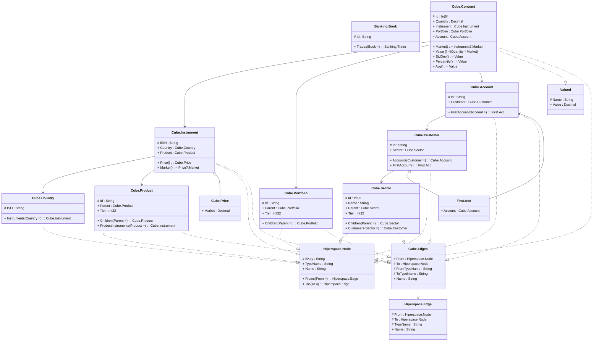

# Cube

> The tables below contain descriptions of the members of each Element. 
> The first column indicates the type of the member:
> A ‘#’ indicates that the field is a key to the element, and a ‘+’ indicates that the field is a value.
> The ‘*’ column contains a description for the element member.  
> The ‘@’ column contains any properties for the member.
> The ‘=’ column contains calculated values; or in the case of an enum, the serialized value.

---

## Entity Banking.Book

| |Name|Type|*|@|=|
|-|-|-|-|-|-|
|#|Id|String||||
||Trades|Banking.Trade|||Book = |

---

## Type Banking.TradeBase

| |Name|Type|*|@|=|
|-|-|-|-|-|-|
|#|Id|String||||
|+|Book|Banking.Book||AlternateIndex("""Banking.EQ.Trade""", 145), AlternateIndex("""Banking.FI.Trade""", 143), AlternateIndex("""Banking.FX.Trade""", 144), AlternateIndex("""Banking.Trade""", 58)||
|+|Value|Decimal||CubeMeasure(Aggregate?.Sum)||

---

## Entity Cube.Account

| |Name|Type|*|@|=|
|-|-|-|-|-|-|
|#|Id|String||||
|+|Customer|Cube.Customer||||
||FirstAccount|First.Acc|||Account = |

---

## Entity Cube.Contract

| |Name|Type|*|@|=|
|-|-|-|-|-|-|
|#|Id|Int64||||
|+|Quantity|Decimal||||
|+|Instrument|Cube.Instrument||||
|+|Portfolio|Cube.Portfolio||||
|+|Account|Cube.Account||||
||Market|Some(Decimal)|||Instrument?.Market|
||Value|Some(Decimal)||CubeMeasure(Aggregate?.Sum)|(Quantity * Market)|
||StdDev|Some(Decimal)||CubeMeasure(Aggregate?.StdDev)|Value|
||Percentile|Some(Decimal)||CubeMeasure(Aggregate?.Percentile, 95)|Value|
||Avg|Some(Decimal)||CubeMeasure(Aggregate?.Average)|Value|

---

## Entity Cube.Country

| |Name|Type|*|@|=|
|-|-|-|-|-|-|
|#|ISO|String||||
||Instruments|Cube.Instrument|||Country = |

---

## Entity Cube.Customer

| |Name|Type|*|@|=|
|-|-|-|-|-|-|
|#|Id|String||||
|+|Sector|Cube.Sector||||
||Accounts|Cube.Account|||Customer = |
|+|FirstAccount|First.Acc||||

---

## View Cube.Edges
Bidirectional Edge, implemented with two Cube.Edges

| |Name|Type|*|@|=|
|-|-|-|-|-|-|
|#|From|Hiperspace.Node||||
|#|To|Hiperspace.Node||||
|#|FromTypeName|String||||
|#|ToTypeName|String||||
|+|Name|String||||

---

## Entity Cube.Instrument

| |Name|Type|*|@|=|
|-|-|-|-|-|-|
|#|ISIN|String||||
|+|Country|Cube.Country||||
|+|Product|Cube.Product||||
|+|Price|Cube.Price||||
||Market|Some(Decimal)|||Price?.Market|

---

## Entity Cube.Portfolio

| |Name|Type|*|@|=|
|-|-|-|-|-|-|
|#|Id|String||||
|+|Parent|Cube.Portfolio||||
|+|Tier|Int32||||
||Children|Cube.Portfolio|||Parent = |

---

## Aspect Cube.Price

| |Name|Type|*|@|=|
|-|-|-|-|-|-|
|+|Market|Decimal||||

---

## Entity Cube.Product

| |Name|Type|*|@|=|
|-|-|-|-|-|-|
|#|Id|String||||
|+|Parent|Cube.Product||||
|+|Tier|Int32||||
||Children|Cube.Product|||Parent = |
||ProductInstruments|Cube.Instrument|||Product = |

---

## Entity Cube.Sector

| |Name|Type|*|@|=|
|-|-|-|-|-|-|
|#|Id|Int32||||
|+|Name|String||||
|+|Parent|Cube.Sector||||
|+|Tier|Int32||||
||Children|Cube.Sector|||Parent = |
||Customers|Cube.Customer|||Sector = |

---

## View Hiperspace.Edge
edge between nodes

| |Name|Type|*|@|=|
|-|-|-|-|-|-|
|#|From|Hiperspace.Node||||
|#|To|Hiperspace.Node||||
|#|TypeName|String||||
|+|Name|String||||

---

## Aspect First.Acc

| |Name|Type|*|@|=|
|-|-|-|-|-|-|
|+|Account|Cube.Account||AlternateIndex("""Cube.CustomerFirstAccount""", 78)||

---

## View Hiperspace.Node
node in a graph view of data

| |Name|Type|*|@|=|
|-|-|-|-|-|-|
|#|SKey|String||||
|+|TypeName|String||||
|+|Name|String||||
||Froms|Hiperspace.Edge|||From = |
||Tos|Hiperspace.Edge|||To = |

---

## View Valued

| |Name|Type|*|@|=|
|-|-|-|-|-|-|
|#|Name|String||||
|+|Value|Decimal||||

