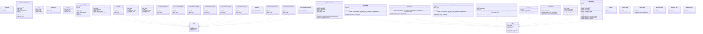

```mermaid
classDiagram

    class Node {

        # SKey  : String

        + TypeName  : String
        + Name  : String

        + Froms (From = this) : Edge
        + Tos (To = this) : Edge
    }


 

    class Edge {

        # From  : Node
        # To  : Node
        # TypeName  : String

        + Name  : String

    }


 

    class VectorNode {

        # SKey  : String

        + Vector  : Hiperspace.Vector

    }


 

    class HashSet~Graph.HiperEdge~ {

        # From  : Node
        # To  : Node
        # TypeName  : String

        + Name  : String
        + Edge  : Edge
        + Source  : Graph.HiperEdge
        + Width  = 1
        + Length  = 1

    }


 

    class HashSet~Graph.Rule~ {

        # FromType  : String
        # ToType  : String
        # EdgeType  : String


    }


 

    class Valued {

        # name  : String

        + Deleted  = false
        + Value  : Decimal

    }


 

    class Graph.Route {

        # Name  : String

        + Rules  : HashSet~Graph.Rule~

    }


 

    class Graph.Rule {

        # FromType  : String
        # ToType  : String
        # EdgeType  : String


    }


 

    class Graph.HiperEdge {

        # From  : Node
        # To  : Node
        # TypeName  : String

        + Name  : String
        + Edge  : Edge
        + Source  : Graph.HiperEdge
        + Width  = 1
        + Length  = 1

    }


 

    class Cube.PathMessage {

        # Node  : Node
        # Route  : Graph.Route
        # Length  : Int32
        # Targets  : HashSet~String~

        + Edges  : HashSet~Graph.HiperEdge~

    }


 

    class Cube.Edge_ {

        # From  : Node
        # To  : Node
        # TypeName  : String

        + Name  : String

    }


    Cube.Edge_ ..|> Edge
 

    class Cube.Edges {

        # From  : Node
        # To  : Node
        # FromTypeName  : String
        # ToTypeName  : String

        + Name  : String

    }


    Cube.Edges ..|> Edge
 

    class Cube.Edges2 {

        # From  : Node
        # To  : Node
        # FromTypeName  : String
        # ToTypeName  : String

        + Name  : String

    }


    Cube.Edges2 ..|> Edge
 

    class Cube.Portfolio {

        # Id  : String

        + Parent  : Cube.Portfolio
        + Tier  : Int32

        + Contract_Cube (CubeSlice = "11", Portfolio = this, ContextLabel = contextlabel(this)) : Cube.Contract_Cube
        + Children (Parent = this) : Cube.Portfolio
    }


    Cube.Portfolio ..|> Node
 

    class Cube.Country {

        # ISO  : String


        + Contract_Cube (CubeSlice = "13", Country = this, ContextLabel = contextlabel(this)) : Cube.Contract_Cube
        + Instruments (Country = this) : Cube.Instrument
    }


    Cube.Country ..|> Node
 

    class Cube.Sector {

        # Id  : Int32

        + Name  : String
        + Parent  : Cube.Sector
        + Tier  : Int32

        + Contract_Cube (CubeSlice = "19", Sector = this, ContextLabel = contextlabel(this)) : Cube.Contract_Cube
        + Children (Parent = this) : Cube.Sector
        + Customers (Sector = this) : Cube.Customer
    }


    Cube.Sector ..|> Node
 

    class Cube.Product {

        # Id  : String

        + Parent  : Cube.Product
        + Tier  : Int32

        + Contract_Cube (CubeSlice = "25", Product = this, ContextLabel = contextlabel(this)) : Cube.Contract_Cube
        + Children (Parent = this) : Cube.Product
        + ProductInstruments (Product = this) : Cube.Instrument
    }


    Cube.Product ..|> Node
 

    class Cube.Account {

        # Id  : String

        + Customer  : Cube.Customer

        + FirstAccount (Account = this) : First.Acc
    }


    Cube.Account ..|> Node
 

    class Cube.Customer {

        # Id  : String

        + Sector  : Cube.Sector

        + Accounts (Customer = this) : Cube.Account
        + FirstAccount () : Cube.CustomerFirstAccount
    }


    Cube.Customer ..|> Node
 

    class Cube.Price {

        # owner  : Cube.Instrument

        + Market  : Decimal

    }


 

    class Cube.Instrument {

        # ISIN  : String

        + Country  : Cube.Country
        + Product  : Cube.Product

        + Price () : Cube.Price
        + Market () = Price?.Market
    }


    Cube.Instrument ..|> Node
 

    class Cube.Contract {

        # Id  : Int64

        + Deleted  = false
        + Quantity  : Decimal
        + Instrument  : Cube.Instrument
        + Portfolio  : Cube.Portfolio
        + Account  : Cube.Account

        + Market () = Instrument?.Market
        + Value () = (Quantity * Market)
        + StdDev () = Value
        + Sector_Dimension () = Account?.Customer?.Sector
        + Country_Dimension () = Instrument?.Country
        + Product_Dimension () = Instrument?.Product
        + Portfolio_Dimension () = Portfolio
    }


    Cube.Contract ..|> Node
 

    class Cube.CustomerFirstAccount {

        # owner  : Cube.Customer

        + Account  : Cube.Account

    }


 

    class Cube.Contract_Fact {

        # ContextLabel  : String
        # Sector  : Cube.Sector
        # Country  : Cube.Country
        # Product  : Cube.Product
        # Portfolio  : Cube.Portfolio

        + Value  : Decimal
        + StdDev_Vector  : Vector
        + Deleted  = false
        + Facts  : Int64

        + CubeName () = cubename(Sector,Country,Product,Portfolio)
        + StdDev () = StdDev(StdDev_Vector)
    }


 

    class Cube.ContractSectorEdge {

        # From  : Node
        # To  : Node
        # TypeName  : String

        + Name  : String

    }


    Cube.ContractSectorEdge ..|> Edge
 

    class Cube.SectorContractEdge {

        # From  : Node
        # To  : Node
        # TypeName  : String

        + Name  : String

    }


    Cube.SectorContractEdge ..|> Edge
 

    class Cube.ContractCountryEdge {

        # From  : Node
        # To  : Node
        # TypeName  : String

        + Name  : String

    }


    Cube.ContractCountryEdge ..|> Edge
 

    class Cube.CountryContractEdge {

        # From  : Node
        # To  : Node
        # TypeName  : String

        + Name  : String

    }


    Cube.CountryContractEdge ..|> Edge
 

    class Cube.ContractProductEdge {

        # From  : Node
        # To  : Node
        # TypeName  : String

        + Name  : String

    }


    Cube.ContractProductEdge ..|> Edge
 

    class Cube.ProductContractEdge {

        # From  : Node
        # To  : Node
        # TypeName  : String

        + Name  : String

    }


    Cube.ProductContractEdge ..|> Edge
 

    class Cube.ContractPortfolioEdge {

        # From  : Node
        # To  : Node
        # TypeName  : String

        + Name  : String

    }


    Cube.ContractPortfolioEdge ..|> Edge
 

    class Cube.PortfolioContractEdge {

        # From  : Node
        # To  : Node
        # TypeName  : String

        + Name  : String

    }


    Cube.PortfolioContractEdge ..|> Edge
 

    class First.Acc {

        # owner  : Any

        + Account  : Cube.Account

    }


 

    class Banking.Trade {

        # Id  : String

        + Book  : Banking.Book

    }


 

    class Banking.Book {

        # Id  : String


        + Trades (Book = this) : Banking.Trade
    }


 

    class Banking.FI.Trade {

        # Id  : String

        + Book  : Banking.Book

    }


 

    class Banking.FX.Trade {

        # Id  : String

        + Book  : Banking.Book

    }


 

    class Banking.EQ.Trade {

        # Id  : String

        + Book  : Banking.Book

    }


 

```