# readme

```mermaid
classDiagram
    class Cube.Portfolio {
        # Id  : String
        + Parent  : Cube.Portfolio
        + Tier  : Int32
        + Contract_Cube (CubeSlice = "11", Portfolio = this, ContextLabel = contextlabel(this)) : Cube.Contract_Cube
        + Children (Parent = this) : Cube.Portfolio
    }
    class Cube.Country {
        # ISO  : String
        + Contract_Cube (CubeSlice = "13", Country = this, ContextLabel = contextlabel(this)) : Cube.Contract_Cube
        + Instruments (Country = this) : Cube.Instrument
    }
    class Cube.Sector {
        # Id  : Int32
        + Name  : String
        + Parent  : Cube.Sector
        + Tier  : Int32
        + Contract_Cube (CubeSlice = "19", Sector = this, ContextLabel = contextlabel(this)) : Cube.Contract_Cube
        + Children (Parent = this) : Cube.Sector
        + Customers (Sector = this) : Cube.Customer
    }
    class Cube.Product {
        # Id  : String
        + Parent  : Cube.Product
        + Tier  : Int32
        + Contract_Cube (CubeSlice = "25", Product = this, ContextLabel = contextlabel(this)) : Cube.Contract_Cube
        + Children (Parent = this) : Cube.Product
        + ProductInstruments (Product = this) : Cube.Instrument
    }
    class Cube.Contract {
        # Id  : Int64
        + Deleted  = false
        + Quantity  : Decimal
        + Instrument  : Cube.Instrument
        + Portfolio  : Cube.Portfolio
        + Account  : Cube.Account
        + Market () = Instrument?.Market
        + Value () = (Quantity * Market)
        + StdDev () = Value
        + Sector_Dimension () = Account?.Customer?.Sector
        + Country_Dimension () = Instrument?.Country
        + Product_Dimension () = Instrument?.Product
        + Portfolio_Dimension () = Portfolio
    }
    class Cube.Contract_Cube {
        # CubeSlice  : String
        # ContextLabel  : String
        # Sector  : Cube.Sector
        # Country  : Cube.Country
        # Product  : Cube.Product
        # Portfolio  : Cube.Portfolio
        + Value  : Decimal
        + StdDev  : Double
        + Deleted  = false
        + Facts  : Int64
        + CubeName () = cubename(Sector,Country,Product,Portfolio)
    }
    class Cube.Contract_Fact {
        # ContextLabel  : String
        # Sector  : Cube.Sector
        # Country  : Cube.Country
        # Product  : Cube.Product
        # Portfolio  : Cube.Portfolio
        + Value  : Decimal
        + StdDev_Vector  : Vector
        + Deleted  = false
        + Facts  : Int64
        + CubeName () = cubename(Sector,Country,Product,Portfolio)
        + StdDev () = StdDev(StdDev_Vector)
    }
```

---

## EntityImpl Cube.Portfolio

||Name|Type|*|@|=|
|-|-|-|-|-|-|
|#|Id|String||||
|+|Parent|Cube.Portfolio||||
|+|Tier|Int32||||
||Contract_Cube|Cube.Contract_Cube|Reference to the dimension|CubeFactReference()|CubeSlice = "11", Portfolio = this, ContextLabel = contextlabel(this)|
||Children|Cube.Portfolio|||Parent = this|

---

## EntityImpl Cube.Country

||Name|Type|*|@|=|
|-|-|-|-|-|-|
|#|ISO|String||||
||Contract_Cube|Cube.Contract_Cube|Reference to the dimension|CubeFactReference()|CubeSlice = "13", Country = this, ContextLabel = contextlabel(this)|
||Instruments|Cube.Instrument|||Country = this|

---

## EntityImpl Cube.Sector

||Name|Type|*|@|=|
|-|-|-|-|-|-|
|#|Id|Int32||||
|+|Name|String||||
|+|Parent|Cube.Sector||||
|+|Tier|Int32||||
||Contract_Cube|Cube.Contract_Cube|Reference to the dimension|CubeFactReference()|CubeSlice = "19", Sector = this, ContextLabel = contextlabel(this)|
||Children|Cube.Sector|||Parent = this|
||Customers|Cube.Customer|||Sector = this|

---

## EntityImpl Cube.Product

||Name|Type|*|@|=|
|-|-|-|-|-|-|
|#|Id|String||||
|+|Parent|Cube.Product||||
|+|Tier|Int32||||
||Contract_Cube|Cube.Contract_Cube|Reference to the dimension|CubeFactReference()|CubeSlice = "25", Product = this, ContextLabel = contextlabel(this)|
||Children|Cube.Product|||Parent = this|
||ProductInstruments|Cube.Instrument|||Product = this|

---

## EntityImpl Cube.Contract

||Name|Type|*|@|=|
|-|-|-|-|-|-|
|#|Id|Int64||||
||Deleted|Some(Boolean)|Flag for read horizon filter to hide when true||false|
|+|Quantity|Decimal||||
|+|Instrument|Cube.Instrument||||
|+|Portfolio|Cube.Portfolio||||
|+|Account|Cube.Account||||
||Market|Some(Decimal)|||Instrument?.Market|
||Value|Some(Decimal)||CubeMeasure(Aggregate?.Sum)|(Quantity * Market)|
||StdDev|Some(Decimal)||CubeMeasure(Aggregate?.StdDev)|Value|
||Sector_Dimension|Some(Cube.Sector)|||Account?.Customer?.Sector|
||Country_Dimension|Some(Cube.Country)|||Instrument?.Country|
||Product_Dimension|Some(Cube.Product)|||Instrument?.Product|
||Portfolio_Dimension|Some(Cube.Portfolio)|||Portfolio|

---

## EntityImpl Cube.Contract_Cube

||Name|Type|*|@|=|
|-|-|-|-|-|-|
|#|CubeSlice|String||||
|#|ContextLabel|String||||
|#|Sector|Cube.Sector||CubeDimensionReference()||
|#|Country|Cube.Country||CubeDimensionReference()||
|#|Product|Cube.Product||CubeDimensionReference()||
|#|Portfolio|Cube.Portfolio||CubeDimensionReference()||
|+|Value|Decimal||CubeMeasure(Aggregate?.Sum)||
|+|StdDev|Double||CubeMeasure(Aggregate?.StdVector)||
||Deleted|Some(Boolean)|The cube fact has been deleted||false|
|+|Facts|Int64|Indicate that the Cube Slice is a Fact|||
||CubeName|Some(String)|||cubename(Sector,Country,Product,Portfolio)|

---

## EntityImpl Cube.Contract_Fact

||Name|Type|*|@|=|
|-|-|-|-|-|-|
|#|ContextLabel|String||||
|#|Sector|Cube.Sector||CubeDimensionReference()||
|#|Country|Cube.Country||CubeDimensionReference()||
|#|Product|Cube.Product||CubeDimensionReference()||
|#|Portfolio|Cube.Portfolio||CubeDimensionReference()||
|+|Value|Decimal||CubeMeasure(Aggregate?.Sum)||
|+|StdDev_Vector|Vector||CubeMeasure(Aggregate?.StdVector)||
||Deleted|Some(Boolean)|The cube fact has been deleted||false|
|+|Facts|Int64|Indicate that the Cube Slice is a Fact|||
||CubeName|Some(String)|||cubename(Sector,Country,Product,Portfolio)|
||StdDev|Some(Double)||CubeMeasure(Aggregate?.StdDev)|StdDev(StdDev_Vector)|

