# readme

```mermaid
classDiagram
    class Valued {
        # name  : String
        + Deleted  = false
        + Value  : Decimal
    }
    class Graph.Route {
        # Name  : String
        + Rules  : HashSet~Graph.Rule~
    }
    Graph.Route *-- Graph.Rule
    class Graph.Rule {
        # FromType  : String
        # ToType  : String
        # EdgeType  : String
    }
    class Cube.PathMessage {
        # Node  : Node
        # Route  : Graph.Route
        # Length  : Int32
        # Targets  : HashSet~String~
        + Edges  : HashSet~Graph.HiperEdge~
    }
    Cube.PathMessage *-- Graph.Route
    Cube.PathMessage *-- String
    Cube.PathMessage *-- Graph.HiperEdge
    class Cube.Edge_ {
        # From  : Node
        # To  : Node
        # TypeName  : String
        + Name  : String
    }
    class Cube.Edges {
        # From  : Node
        # To  : Node
        # FromTypeName  : String
        # ToTypeName  : String
        + Name  : String
    }
    Cube.Edges ..|> Cube.Edge_
    class Cube.Edges2 {
        # From  : Node
        # To  : Node
        # FromTypeName  : String
        # ToTypeName  : String
        + Name  : String
    }
    Cube.Edges2 ..|> Cube.Edge_
    Cube.Edges2 ..|> Cube.Edges
    class Cube.Portfolio {
        # Id  : String
        + Parent  : Cube.Portfolio
        + Tier  : Int32
        + Contract_Cube (CubeSlice = "11", Portfolio = this, ContextLabel = contextlabel(this)) : Cube.Contract_Cube
        + Children (Parent = this) : Cube.Portfolio
    }
    Cube.Portfolio ..|> Cube.Edges
    class Cube.Country {
        # ISO  : String
        + Contract_Cube (CubeSlice = "13", Country = this, ContextLabel = contextlabel(this)) : Cube.Contract_Cube
        + Instruments (Country = this) : Cube.Instrument
    }
    class Cube.Sector {
        # Id  : Int32
        + Name  : String
        + Parent  : Cube.Sector
        + Tier  : Int32
        + Contract_Cube (CubeSlice = "19", Sector = this, ContextLabel = contextlabel(this)) : Cube.Contract_Cube
        + Children (Parent = this) : Cube.Sector
        + Customers (Sector = this) : Cube.Customer
    }
    Cube.Sector ..|> Cube.Edges
    class Cube.Product {
        # Id  : String
        + Parent  : Cube.Product
        + Tier  : Int32
        + Contract_Cube (CubeSlice = "25", Product = this, ContextLabel = contextlabel(this)) : Cube.Contract_Cube
        + Children (Parent = this) : Cube.Product
        + ProductInstruments (Product = this) : Cube.Instrument
    }
    Cube.Product ..|> Cube.Edges
    class Cube.Account {
        # Id  : String
        + Customer  : Cube.Customer
        + FirstAccount (Account = this) : First.Acc
    }
    Cube.Account --> Cube.Customer
    Cube.Account ..|> Cube.Edges
    class Cube.Customer {
        # Id  : String
        + Sector  : Cube.Sector
        + Accounts (Customer = this) : Cube.Account
        + FirstAccount () : Cube.CustomerFirstAccount
    }
    Cube.Customer --> Cube.Sector
    Cube.Customer o-- Cube.CustomerFirstAccount
    Cube.Customer ..|> Cube.Edges
    class Cube.Price {
        # owner  : Cube.Instrument
        + Market  : Decimal
    }
    class Cube.Instrument {
        # ISIN  : String
        + Country  : Cube.Country
        + Product  : Cube.Product
        + Price () : Cube.Price
        + Market () = Price?.Market
    }
    Cube.Instrument --> Cube.Country
    Cube.Instrument --> Cube.Product
    Cube.Instrument o-- Cube.Price
    Cube.Instrument ..|> Cube.Edges
    Cube.Instrument ..|> Cube.Edges2
    class Cube.Contract {
        # Id  : Int64
        + Deleted  = false
        + Quantity  : Decimal
        + Instrument  : Cube.Instrument
        + Portfolio  : Cube.Portfolio
        + Account  : Cube.Account
        + Market () = Instrument?.Market
        + Value () = (Quantity * Market)
        + StdDev () = Value
        + Sector_Dimension () = Account?.Customer?.Sector
        + Country_Dimension () = Instrument?.Country
        + Product_Dimension () = Instrument?.Product
        + Portfolio_Dimension () = Portfolio
    }
    Cube.Contract --> Cube.Instrument
    Cube.Contract --> Cube.Portfolio
    Cube.Contract --> Cube.Account
    Cube.Contract ..|> Valued
    class Cube.CustomerFirstAccount {
        # owner  : Cube.Customer
        + Account  : Cube.Account
    }
    Cube.CustomerFirstAccount --> Cube.Account
    Cube.CustomerFirstAccount ..|> First.Acc
    class Cube.Contract_Fact {
        # ContextLabel  : String
        # Sector  : Cube.Sector
        # Country  : Cube.Country
        # Product  : Cube.Product
        # Portfolio  : Cube.Portfolio
        + Value  : Decimal
        + StdDev_Vector  : Vector
        + Deleted  = false
        + Facts  : Int64
        + CubeName () = cubename(Sector,Country,Product,Portfolio)
        + StdDev () = StdDev(StdDev_Vector)
    }
    Cube.Contract_Fact --> Cube.Sector
    Cube.Contract_Fact --> Cube.Country
    Cube.Contract_Fact --> Cube.Product
    Cube.Contract_Fact --> Cube.Portfolio
    class First.Acc {
        # owner  : Any
        + Account  : Cube.Account
    }
    First.Acc --> Cube.Account
    class Banking.Trade {
        # Id  : String
        + Book  : Banking.Book
    }
    Banking.Trade --> Banking.Book
    class Banking.Book {
        # Id  : String
        + Trades (Book = this) : Banking.Trade
    }
    class Banking.FI.Trade {
        # Id  : String
        + Book  : Banking.Book
    }
    Banking.FI.Trade --> Banking.Book
    Banking.FI.Trade ..|> Banking.Trade
    class Banking.FX.Trade {
        # Id  : String
        + Book  : Banking.Book
    }
    Banking.FX.Trade --> Banking.Book
    Banking.FX.Trade ..|> Banking.Trade
    class Banking.EQ.Trade {
        # Id  : String
        + Book  : Banking.Book
    }
    Banking.EQ.Trade --> Banking.Book
    Banking.EQ.Trade ..|> Banking.Trade
```

---

## View Valued

||Name|Type|*|@|=|
|-|-|-|-|-|
|#|name|String||||
||Deleted|Some(Boolean)|Flag for read horizon filter to hide when true||false|
|+|Value|Decimal||||

---

## Value Graph.Route
Route across a graph of edge/node to form an HiperEdge

||Name|Type|*|@|=|
|-|-|-|-|-|
|#|Name|String||||
|+|Rules|HashSet<Graph.Rule>||||

---

## Value Graph.Rule
A rule for a route that matched as a type of Edge to a HiperEdge, e.g. { Name = 'relation', Rules = [{FromType = 'Person', ToType = 'Person', EdgeType = 'Mother'}]}

||Name|Type|*|@|=|
|-|-|-|-|-|
|#|FromType|String||||
|#|ToType|String||||
|#|EdgeType|String||||

---

## Message Cube.PathMessage
Remote execution of path requests

||Name|Type|*|@|=|
|-|-|-|-|-|
|#|Node|Node||||
|#|Route|Graph.Route||||
|#|Length|Int32||||
|#|Targets|HashSet<String>||||
|+|Edges|HashSet<Graph.HiperEdge>||||

---

## View Cube.Edge_
An additional edge helper for Cube.Edges

||Name|Type|*|@|=|
|-|-|-|-|-|
|#|From|Node||||
|#|To|Node||||
|#|TypeName|String||||
|+|Name|String||||

---

## View Cube.Edges
Bidirectional Edge, implemented with two Cube.Edges

||Name|Type|*|@|=|
|-|-|-|-|-|
|#|From|Node||||
|#|To|Node||||
|#|FromTypeName|String||||
|#|ToTypeName|String||||
|+|Name|String||||

---

## View Cube.Edges2

||Name|Type|*|@|=|
|-|-|-|-|-|
|#|From|Node||||
|#|To|Node||||
|#|FromTypeName|String||||
|#|ToTypeName|String||||
|+|Name|String||||

---

## EntityImpl Cube.Portfolio

||Name|Type|*|@|=|
|-|-|-|-|-|
|#|Id|String||||
|+|Parent|Cube.Portfolio||||
|+|Tier|Int32||||
||Contract_Cube|Cube.Contract_Cube|Reference to the dimension|CubeFactReference()|CubeSlice = "11", Portfolio = this, ContextLabel = contextlabel(this)|
||Children|Cube.Portfolio|||Parent = this|

---

## EntityImpl Cube.Country

||Name|Type|*|@|=|
|-|-|-|-|-|
|#|ISO|String||||
||Contract_Cube|Cube.Contract_Cube|Reference to the dimension|CubeFactReference()|CubeSlice = "13", Country = this, ContextLabel = contextlabel(this)|
||Instruments|Cube.Instrument|||Country = this|

---

## EntityImpl Cube.Sector

||Name|Type|*|@|=|
|-|-|-|-|-|
|#|Id|Int32||||
|+|Name|String||||
|+|Parent|Cube.Sector||||
|+|Tier|Int32||||
||Contract_Cube|Cube.Contract_Cube|Reference to the dimension|CubeFactReference()|CubeSlice = "19", Sector = this, ContextLabel = contextlabel(this)|
||Children|Cube.Sector|||Parent = this|
||Customers|Cube.Customer|||Sector = this|

---

## EntityImpl Cube.Product

||Name|Type|*|@|=|
|-|-|-|-|-|
|#|Id|String||||
|+|Parent|Cube.Product||||
|+|Tier|Int32||||
||Contract_Cube|Cube.Contract_Cube|Reference to the dimension|CubeFactReference()|CubeSlice = "25", Product = this, ContextLabel = contextlabel(this)|
||Children|Cube.Product|||Parent = this|
||ProductInstruments|Cube.Instrument|||Product = this|

---

## EntityImpl Cube.Account

||Name|Type|*|@|=|
|-|-|-|-|-|
|#|Id|String||||
|+|Customer|Cube.Customer||||
||FirstAccount|First.Acc|||Account = this|

---

## EntityImpl Cube.Customer

||Name|Type|*|@|=|
|-|-|-|-|-|
|#|Id|String||||
|+|Sector|Cube.Sector||||
||Accounts|Cube.Account|||Customer = this|
|+|FirstAccount|Cube.CustomerFirstAccount||||

---

## AspectImpl Cube.Price

||Name|Type|*|@|=|
|-|-|-|-|-|
|#|owner|Cube.Instrument||||
|+|Market|Decimal||||

---

## EntityImpl Cube.Instrument

||Name|Type|*|@|=|
|-|-|-|-|-|
|#|ISIN|String||||
|+|Country|Cube.Country||||
|+|Product|Cube.Product||||
|+|Price|Cube.Price||||
||Market|Some(Decimal)|||Price?.Market|

---

## EntityImpl Cube.Contract

||Name|Type|*|@|=|
|-|-|-|-|-|
|#|Id|Int64||||
||Deleted|Some(Boolean)|Flag for read horizon filter to hide when true||false|
|+|Quantity|Decimal||||
|+|Instrument|Cube.Instrument||||
|+|Portfolio|Cube.Portfolio||||
|+|Account|Cube.Account||||
||Market|Some(Decimal)|||Instrument?.Market|
||Value|Some(Decimal)||CubeMeasure(Aggregate?.Sum)|(Quantity * Market)|
||StdDev|Some(Decimal)||CubeMeasure(Aggregate?.StdDev)|Value|
||Sector_Dimension|Some(Cube.Sector)|||Account?.Customer?.Sector|
||Country_Dimension|Some(Cube.Country)|||Instrument?.Country|
||Product_Dimension|Some(Cube.Product)|||Instrument?.Product|
||Portfolio_Dimension|Some(Cube.Portfolio)|||Portfolio|

---

## AspectImpl Cube.CustomerFirstAccount

||Name|Type|*|@|=|
|-|-|-|-|-|
|#|owner|Cube.Customer||||
|+|Account|Cube.Account||AlternateIndex("Cube.CustomerFirstAccount", 78)||

---

## EntityImpl Cube.Contract_Fact

||Name|Type|*|@|=|
|-|-|-|-|-|
|#|ContextLabel|String||||
|#|Sector|Cube.Sector||CubeDimensionReference()||
|#|Country|Cube.Country||CubeDimensionReference()||
|#|Product|Cube.Product||CubeDimensionReference()||
|#|Portfolio|Cube.Portfolio||CubeDimensionReference()||
|+|Value|Decimal||CubeMeasure(Aggregate?.Sum)||
|+|StdDev_Vector|Vector||CubeMeasure(Aggregate?.StdVector)||
||Deleted|Some(Boolean)|The cube fact has been deleted||false|
|+|Facts|Int64|Indicate that the Cube Slice is a Fact|||
||CubeName|Some(String)|||cubename(Sector,Country,Product,Portfolio)|
||StdDev|Some(Double)||CubeMeasure(Aggregate?.StdDev)|StdDev(StdDev_Vector)|

---

## View First.Acc

||Name|Type|*|@|=|
|-|-|-|-|-|
|#|owner|Any|owner of the segment/aspect as an object|||
|+|Account|Cube.Account||AlternateIndex("Cube.CustomerFirstAccount", 78)||

---

## View Banking.Trade

||Name|Type|*|@|=|
|-|-|-|-|-|
|#|Id|String||||
|+|Book|Banking.Book||AlternateIndex("Banking.EQ.Trade", 60), AlternateIndex("Banking.FI.Trade", 56), AlternateIndex("Banking.FX.Trade", 58), AlternateIndex("Banking.EQ.Trade", 96), AlternateIndex("Banking.FI.Trade", 94), AlternateIndex("Banking.FX.Trade", 95)||

---

## EntityImpl Banking.Book

||Name|Type|*|@|=|
|-|-|-|-|-|
|#|Id|String||||
||Trades|Banking.Trade|||Book = this|

---

## EntityImpl Banking.FI.Trade

||Name|Type|*|@|=|
|-|-|-|-|-|
|#|Id|String||||
|+|Book|Banking.Book||AlternateIndex("Banking.EQ.Trade", 60), AlternateIndex("Banking.FI.Trade", 56), AlternateIndex("Banking.FX.Trade", 58), AlternateIndex("Banking.EQ.Trade", 96), AlternateIndex("Banking.FI.Trade", 94), AlternateIndex("Banking.FX.Trade", 95)||

---

## EntityImpl Banking.FX.Trade

||Name|Type|*|@|=|
|-|-|-|-|-|
|#|Id|String||||
|+|Book|Banking.Book||AlternateIndex("Banking.EQ.Trade", 60), AlternateIndex("Banking.FI.Trade", 56), AlternateIndex("Banking.FX.Trade", 58), AlternateIndex("Banking.EQ.Trade", 96), AlternateIndex("Banking.FI.Trade", 94), AlternateIndex("Banking.FX.Trade", 95)||

---

## EntityImpl Banking.EQ.Trade

||Name|Type|*|@|=|
|-|-|-|-|-|
|#|Id|String||||
|+|Book|Banking.Book||AlternateIndex("Banking.EQ.Trade", 60), AlternateIndex("Banking.FI.Trade", 56), AlternateIndex("Banking.FX.Trade", 58), AlternateIndex("Banking.EQ.Trade", 96), AlternateIndex("Banking.FI.Trade", 94), AlternateIndex("Banking.FX.Trade", 95)||

