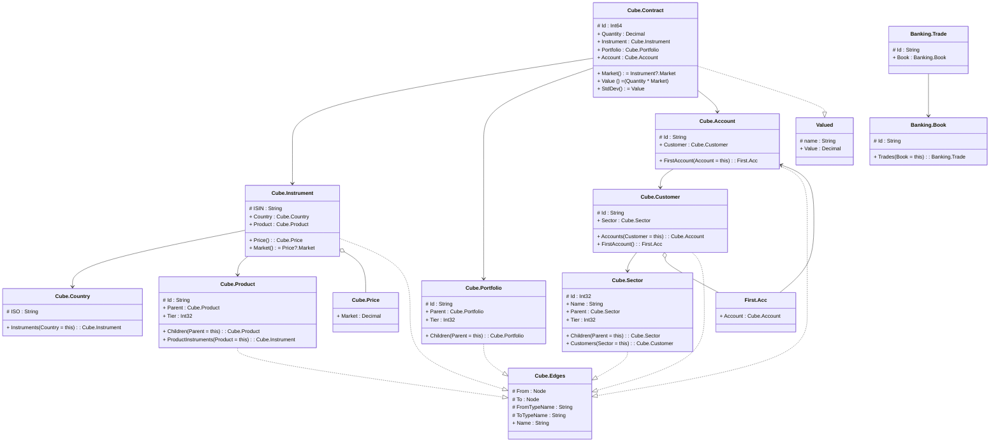

# readme

---

## View Cube.Edges
Bidirectional Edge, implemented with two Cube.Edges

||Name|Type|*|@|=|
|-|-|-|-|-|
|#|From|Node||||
|#|To|Node||||
|#|FromTypeName|String||||
|#|ToTypeName|String||||
|+|Name|String||||

---

## Entity Cube.Portfolio

||Name|Type|*|@|=|
|-|-|-|-|-|
|#|Id|String||||
|+|Parent|Cube.Portfolio||||
|+|Tier|Int32||||
||Children|Cube.Portfolio|||Parent = this|

---

## Entity Cube.Country

||Name|Type|*|@|=|
|-|-|-|-|-|
|#|ISO|String||||
||Instruments|Cube.Instrument|||Country = this|

---

## Entity Cube.Sector

||Name|Type|*|@|=|
|-|-|-|-|-|
|#|Id|Int32||||
|+|Name|String||||
|+|Parent|Cube.Sector||||
|+|Tier|Int32||||
||Children|Cube.Sector|||Parent = this|
||Customers|Cube.Customer|||Sector = this|

---

## Entity Cube.Product

||Name|Type|*|@|=|
|-|-|-|-|-|
|#|Id|String||||
|+|Parent|Cube.Product||||
|+|Tier|Int32||||
||Children|Cube.Product|||Parent = this|
||ProductInstruments|Cube.Instrument|||Product = this|

---

## Entity Cube.Account

||Name|Type|*|@|=|
|-|-|-|-|-|
|#|Id|String||||
|+|Customer|Cube.Customer||||
||FirstAccount|First.Acc|||Account = this|

---

## Entity Cube.Customer

||Name|Type|*|@|=|
|-|-|-|-|-|
|#|Id|String||||
|+|Sector|Cube.Sector||||
||Accounts|Cube.Account|||Customer = this|
|+|FirstAccount|First.Acc||||

---

## Aspect First.Acc

||Name|Type|*|@|=|
|-|-|-|-|-|
|+|Account|Cube.Account||AlternateIndex("Cube.CustomerFirstAccount", 78)||

---

## Aspect Cube.Price

||Name|Type|*|@|=|
|-|-|-|-|-|
|+|Market|Decimal||||

---

## Entity Cube.Instrument

||Name|Type|*|@|=|
|-|-|-|-|-|
|#|ISIN|String||||
|+|Country|Cube.Country||||
|+|Product|Cube.Product||||
|+|Price|Cube.Price||||
||Market||||Price?.Market|

---

## Entity Cube.Contract

||Name|Type|*|@|=|
|-|-|-|-|-|
|#|Id|Int64||||
|+|Quantity|Decimal||||
|+|Instrument|Cube.Instrument||||
|+|Portfolio|Cube.Portfolio||||
|+|Account|Cube.Account||||
||Market||||Instrument?.Market|
||Value|||CubeMeasure(Aggregate?.Sum)|(Quantity * Market)|
||StdDev|||CubeMeasure(Aggregate?.StdDev)|Value|

---

## View Valued

||Name|Type|*|@|=|
|-|-|-|-|-|
|#|name|String||||
|+|Value|Decimal||||

---

## View Banking.Trade

||Name|Type|*|@|=|
|-|-|-|-|-|
|#|Id|String||||
|+|Book|Banking.Book||AlternateIndex("Banking.EQ.Trade", 60), AlternateIndex("Banking.FI.Trade", 56), AlternateIndex("Banking.FX.Trade", 58), AlternateIndex("Banking.EQ.Trade", 96), AlternateIndex("Banking.FI.Trade", 94), AlternateIndex("Banking.FX.Trade", 95)||

---

## Entity Banking.Book

||Name|Type|*|@|=|
|-|-|-|-|-|
|#|Id|String||||
||Trades|Banking.Trade|||Book = this|

