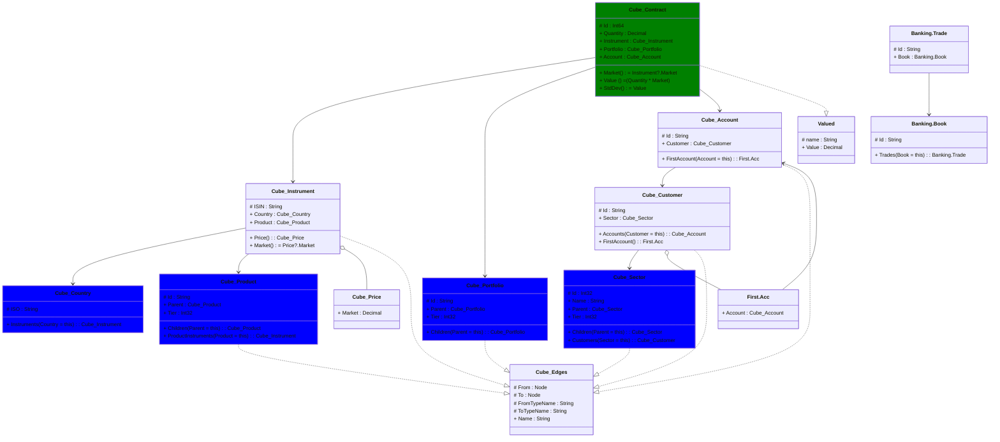

```mermaid
classDiagram

    class Cube_Edges {

        # From  : Node
        # To  : Node
        # FromTypeName  : String
        # ToTypeName  : String

        + Name  : String

    }


 

    class Cube_Portfolio {

        # Id  : String

        + Parent  : Cube_Portfolio
        + Tier  : Int32

        + Children (Parent = this) : Cube_Portfolio
        
    } 


    Cube_Portfolio ..|> Cube_Edges
 

    class Cube_Country {

        # ISO  : String


        + Instruments (Country = this) : Cube_Instrument
    }


 

    class Cube_Sector {

        # Id  : Int32

        + Name  : String
        + Parent  : Cube_Sector
        + Tier  : Int32

        + Children (Parent = this) : Cube_Sector
        + Customers (Sector = this) : Cube_Customer
    }


    Cube_Sector ..|> Cube_Edges
 

    class Cube_Product {

        # Id  : String

        + Parent  : Cube_Product
        + Tier  : Int32

        + Children (Parent = this) : Cube_Product
        + ProductInstruments (Product = this) : Cube_Instrument
    }


    Cube_Product ..|> Cube_Edges
 

    class Cube_Account {

        # Id  : String

        + Customer  : Cube_Customer

        + FirstAccount (Account = this) : First.Acc
    }


    Cube_Account --> Cube_Customer


    Cube_Account ..|> Cube_Edges
 

    class Cube_Customer {

        # Id  : String

        + Sector  : Cube_Sector

        + Accounts (Customer = this) : Cube_Account
        + FirstAccount () : First.Acc
    }


    Cube_Customer --> Cube_Sector
    Cube_Customer o-- First.Acc

    Cube_Customer ..|> Cube_Edges
 

    class First.Acc {


        + Account  : Cube_Account

    }


    First.Acc --> Cube_Account


 

    class Cube_Price {


        + Market  : Decimal

    }


 

    class Cube_Instrument {

        # ISIN  : String

        + Country  : Cube_Country
        + Product  : Cube_Product

        + Price () : Cube_Price
        + Market () = Price?.Market
    }


    Cube_Instrument --> Cube_Country
    Cube_Instrument --> Cube_Product
    Cube_Instrument o-- Cube_Price

    Cube_Instrument ..|> Cube_Edges
 

    class Cube_Contract {

        # Id  : Int64

        + Quantity  : Decimal
        + Instrument  : Cube_Instrument
        + Portfolio  : Cube_Portfolio
        + Account  : Cube_Account

        + Market () = Instrument?.Market
        + Value () = (Quantity * Market)
        + StdDev () = Value
    }


    Cube_Contract --> Cube_Instrument
    Cube_Contract --> Cube_Portfolio
    Cube_Contract --> Cube_Account


    Cube_Contract ..|> Valued
 

    class Valued {

        # name  : String

        + Value  : Decimal

    }


 

    class Banking.Trade {

        # Id  : String

        + Book  : Banking.Book

    }


    Banking.Trade --> Banking.Book


 

    class Banking.Book {

        # Id  : String


        + Trades (Book = this) : Banking.Trade
    }


  style Cube_Portfolio fill:blue
  style Cube_Country fill:blue
style Cube_Sector fill:blue
style Cube_Product fill:blue
style Cube_Contract fill:green

 

```