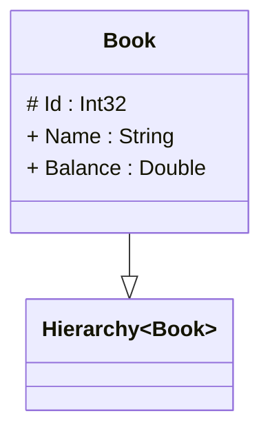

# readme

---

## Type Hierarchy<TParent>

||Name|Type|*|@|=|
|-|-|-|-|-|
|+|Parent|TParent||||
||Children|TParent|||Parent = this|

---

## Entity Book

||Name|Type|*|@|=|
|-|-|-|-|-|
|#|Id|Int32||||
|+|Name|String||||
|+|Balance|Double||||

