# acmt.002.001.08-graph

```mermaid
classDiagram
    class ISO20022.Acmt002001.DocumentAcctDtlsConf {
        # owner  : ISO20022.Acmt002001.Document
        + Xtnsn  : List~ISO20022.Acmt002001.Extension1~
        + MktPrctcVrsn  : ISO20022.Acmt002001.MarketPracticeVersion1
        + AddtlInf  : List~ISO20022.Acmt002001.AdditiononalInformation13~
        + SvcLvlAgrmt  : List~ISO20022.Acmt002001.DocumentToSend4~
        + CshSttlm  : List~ISO20022.Acmt002001.CashSettlement3~
        + WdrwlInvstmtPlan  : List~ISO20022.Acmt002001.InvestmentPlan17~
        + SvgsInvstmtPlan  : List~ISO20022.Acmt002001.InvestmentPlan17~
        + NewIsseAllcn  : ISO20022.Acmt002001.NewIssueAllocation2
        + Plcmnt  : ISO20022.Acmt002001.ReferredAgent3
        + Intrmies  : List~ISO20022.Acmt002001.Intermediary46~
        + AcctPties  : ISO20022.Acmt002001.AccountParties17
        + InvstmtAcct  : ISO20022.Acmt002001.InvestmentAccount74
        + ConfDtls  : ISO20022.Acmt002001.AccountManagementConfirmation5
        + RltdRef  : ISO20022.Acmt002001.AdditionalReference13
        + OrdrRef  : ISO20022.Acmt002001.InvestmentFundOrder4
        + MsgId  : ISO20022.Acmt002001.MessageIdentification1
        + Validation () = validation(validList("""Xtnsn""",Xtnsn),validElement(Xtnsn),validElement(MktPrctcVrsn),validList("""AddtlInf""",AddtlInf),validElement(AddtlInf),validList("""SvcLvlAgrmt""",SvcLvlAgrmt),validListMax("""SvcLvlAgrmt""",SvcLvlAgrmt,30),validElement(SvcLvlAgrmt),validList("""CshSttlm""",CshSttlm),validListMax("""CshSttlm""",CshSttlm,8),validElement(CshSttlm),validList("""WdrwlInvstmtPlan""",WdrwlInvstmtPlan),validListMax("""WdrwlInvstmtPlan""",WdrwlInvstmtPlan,10),validElement(WdrwlInvstmtPlan),validList("""SvgsInvstmtPlan""",SvgsInvstmtPlan),validListMax("""SvgsInvstmtPlan""",SvgsInvstmtPlan,50),validElement(SvgsInvstmtPlan),validElement(NewIsseAllcn),validElement(Plcmnt),validList("""Intrmies""",Intrmies),validElement(Intrmies),validElement(AcctPties),validElement(InvstmtAcct),validElement(ConfDtls),validElement(RltdRef),validElement(OrdrRef),validElement(MsgId))
    }
```

> The tables below contain descriptions of the members of each Element. 
> The first column indicates the type of the member:
> A ‘#’ indicates that the field is a key to the element, and a ‘+’ indicates that the field is a value.
> The ‘*’ column contains a description for the element member.  
> The ‘@’ column contains any properties for the member.
> The ‘=’ column contains calculated values; or in the case of an enum, the serialized value.

---

## AspectImpl ISO20022.Acmt002001.DocumentAcctDtlsConf

| |Name|Type|*|@|=|
|-|-|-|-|-|-|
|#|owner|ISO20022.Acmt002001.Document||||
|+|Xtnsn|List<ISO20022.Acmt002001.Extension1>||XmlElement()||
|+|MktPrctcVrsn|ISO20022.Acmt002001.MarketPracticeVersion1||XmlElement()||
|+|AddtlInf|List<ISO20022.Acmt002001.AdditiononalInformation13>||XmlElement()||
|+|SvcLvlAgrmt|List<ISO20022.Acmt002001.DocumentToSend4>||XmlElement()||
|+|CshSttlm|List<ISO20022.Acmt002001.CashSettlement3>||XmlElement()||
|+|WdrwlInvstmtPlan|List<ISO20022.Acmt002001.InvestmentPlan17>||XmlElement()||
|+|SvgsInvstmtPlan|List<ISO20022.Acmt002001.InvestmentPlan17>||XmlElement()||
|+|NewIsseAllcn|ISO20022.Acmt002001.NewIssueAllocation2||XmlElement()||
|+|Plcmnt|ISO20022.Acmt002001.ReferredAgent3||XmlElement()||
|+|Intrmies|List<ISO20022.Acmt002001.Intermediary46>||XmlElement()||
|+|AcctPties|ISO20022.Acmt002001.AccountParties17||XmlElement()||
|+|InvstmtAcct|ISO20022.Acmt002001.InvestmentAccount74||XmlElement()||
|+|ConfDtls|ISO20022.Acmt002001.AccountManagementConfirmation5||XmlElement()||
|+|RltdRef|ISO20022.Acmt002001.AdditionalReference13||XmlElement()||
|+|OrdrRef|ISO20022.Acmt002001.InvestmentFundOrder4||XmlElement()||
|+|MsgId|ISO20022.Acmt002001.MessageIdentification1||XmlElement()||
||Validation|Some(String)||XmlIgnore(), JsonIgnore()|validation(validList("""Xtnsn""",Xtnsn),validElement(Xtnsn),validElement(MktPrctcVrsn),validList("""AddtlInf""",AddtlInf),validElement(AddtlInf),validList("""SvcLvlAgrmt""",SvcLvlAgrmt),validListMax("""SvcLvlAgrmt""",SvcLvlAgrmt,30),validElement(SvcLvlAgrmt),validList("""CshSttlm""",CshSttlm),validListMax("""CshSttlm""",CshSttlm,8),validElement(CshSttlm),validList("""WdrwlInvstmtPlan""",WdrwlInvstmtPlan),validListMax("""WdrwlInvstmtPlan""",WdrwlInvstmtPlan,10),validElement(WdrwlInvstmtPlan),validList("""SvgsInvstmtPlan""",SvgsInvstmtPlan),validListMax("""SvgsInvstmtPlan""",SvgsInvstmtPlan,50),validElement(SvgsInvstmtPlan),validElement(NewIsseAllcn),validElement(Plcmnt),validList("""Intrmies""",Intrmies),validElement(Intrmies),validElement(AcctPties),validElement(InvstmtAcct),validElement(ConfDtls),validElement(RltdRef),validElement(OrdrRef),validElement(MsgId))|

