# acmt.005.001.06

```mermaid
classDiagram
    class Hiperspace.Edge {
        # From  : Hiperspace.Node
        # To  : Hiperspace.Node
        # TypeName  : String
        + Name  : String
    }
    class ISO20022.Acmt005001.Account23 {
        + RltdAcctDtls  : ISO20022.Acmt005001.GenericIdentification1
        + AcctId  : String
    }
    ISO20022.Acmt005001.Account23 *-- ISO20022.Acmt005001.GenericIdentification1
    class ISO20022.Acmt005001.AccountManagementMessageReference5 {
        + InvstmtAcct  : ISO20022.Acmt005001.InvestmentAccount77
        + ExstgAcctId  : ISO20022.Acmt005001.Account23
        + AcctApplId  : String
        + StsReqTp  : String
        + LkdRef  : ISO20022.Acmt005001.LinkedMessage5Choice
    }
    ISO20022.Acmt005001.AccountManagementMessageReference5 *-- ISO20022.Acmt005001.InvestmentAccount77
    ISO20022.Acmt005001.AccountManagementMessageReference5 *-- ISO20022.Acmt005001.Account23
    ISO20022.Acmt005001.AccountManagementMessageReference5 *-- ISO20022.Acmt005001.LinkedMessage5Choice
    class ISO20022.Acmt005001.AccountManagementType3Code {
        ACST = 1
        GACC = 2
        ACCO = 3
        ACCM = 4
    }
    class ISO20022.Acmt005001.AdditionalReference13 {
        + MsgNm  : String
        + RefIssr  : ISO20022.Acmt005001.PartyIdentification125Choice
        + Ref  : String
    }
    ISO20022.Acmt005001.AdditionalReference13 *-- ISO20022.Acmt005001.PartyIdentification125Choice
    class ISO20022.Acmt005001.AddressType2Code {
        DLVY = 1
        MLTO = 2
        BIZZ = 3
        HOME = 4
        PBOX = 5
        ADDR = 6
    }
    class ISO20022.Acmt005001.GenderCode {
        FEMA = 1
        MALE = 2
    }
    class ISO20022.Acmt005001.GenericIdentification1 {
        + Issr  : String
        + SchmeNm  : String
        + Id  : String
    }
    class ISO20022.Acmt005001.GenericIdentification47 {
        + SchmeNm  : String
        + Issr  : String
        + Id  : String
    }
    class ISO20022.Acmt005001.GenericIdentification81 {
        + IdTp  : ISO20022.Acmt005001.OtherIdentification3Choice
        + Id  : String
    }
    ISO20022.Acmt005001.GenericIdentification81 *-- ISO20022.Acmt005001.OtherIdentification3Choice
    class ISO20022.Acmt005001.IndividualPerson30 {
        + BirthDt  : DateTime
        + Gndr  : String
        + Nm  : String
        + MddlNm  : String
        + GvnNm  : String
    }
    class ISO20022.Acmt005001.IndividualPersonIdentification2Choice {
        + PrsnNm  : ISO20022.Acmt005001.IndividualPerson30
        + IdNb  : ISO20022.Acmt005001.GenericIdentification81
    }
    ISO20022.Acmt005001.IndividualPersonIdentification2Choice *-- ISO20022.Acmt005001.IndividualPerson30
    ISO20022.Acmt005001.IndividualPersonIdentification2Choice *-- ISO20022.Acmt005001.GenericIdentification81
    class ISO20022.Acmt005001.InvestmentAccount77 {
        + AcctSvcr  : ISO20022.Acmt005001.PartyIdentification125Choice
        + OwnrId  : ISO20022.Acmt005001.OwnerIdentification3Choice
        + AcctDsgnt  : String
        + AcctNm  : String
        + AcctId  : String
    }
    ISO20022.Acmt005001.InvestmentAccount77 *-- ISO20022.Acmt005001.PartyIdentification125Choice
    ISO20022.Acmt005001.InvestmentAccount77 *-- ISO20022.Acmt005001.OwnerIdentification3Choice
    class ISO20022.Acmt005001.LinkedMessage5Choice {
        + OthrRef  : ISO20022.Acmt005001.AdditionalReference13
        + PrvsRef  : ISO20022.Acmt005001.AdditionalReference13
    }
    ISO20022.Acmt005001.LinkedMessage5Choice *-- ISO20022.Acmt005001.AdditionalReference13
    ISO20022.Acmt005001.LinkedMessage5Choice *-- ISO20022.Acmt005001.AdditionalReference13
    class ISO20022.Acmt005001.MessageIdentification1 {
        + CreDtTm  : DateTime
        + Id  : String
    }
    class ISO20022.Acmt005001.NameAndAddress5 {
        + Adr  : ISO20022.Acmt005001.PostalAddress1
        + Nm  : String
    }
    ISO20022.Acmt005001.NameAndAddress5 *-- ISO20022.Acmt005001.PostalAddress1
    class ISO20022.Acmt005001.OtherIdentification3Choice {
        + Prtry  : ISO20022.Acmt005001.GenericIdentification47
        + Cd  : String
    }
    ISO20022.Acmt005001.OtherIdentification3Choice *-- ISO20022.Acmt005001.GenericIdentification47
    class ISO20022.Acmt005001.OwnerIdentification3Choice {
        + OrgOwnrId  : ISO20022.Acmt005001.PartyIdentification139
        + IndvOwnrId  : ISO20022.Acmt005001.IndividualPersonIdentification2Choice
    }
    ISO20022.Acmt005001.OwnerIdentification3Choice *-- ISO20022.Acmt005001.PartyIdentification139
    ISO20022.Acmt005001.OwnerIdentification3Choice *-- ISO20022.Acmt005001.IndividualPersonIdentification2Choice
    class ISO20022.Acmt005001.PartyIdentification125Choice {
        + NmAndAdr  : ISO20022.Acmt005001.NameAndAddress5
        + PrtryId  : ISO20022.Acmt005001.GenericIdentification1
        + AnyBIC  : String
    }
    ISO20022.Acmt005001.PartyIdentification125Choice *-- ISO20022.Acmt005001.NameAndAddress5
    ISO20022.Acmt005001.PartyIdentification125Choice *-- ISO20022.Acmt005001.GenericIdentification1
    class ISO20022.Acmt005001.PartyIdentification139 {
        + LEI  : String
        + Pty  : ISO20022.Acmt005001.PartyIdentification125Choice
    }
    ISO20022.Acmt005001.PartyIdentification139 *-- ISO20022.Acmt005001.PartyIdentification125Choice
    class ISO20022.Acmt005001.PartyIdentificationType7Code {
        GIIN = 1
        INCL = 2
        NINV = 3
        EMID = 4
        DRLC = 5
        AREG = 6
        CPFA = 7
        ITIN = 8
        GTIN = 9
        GUNL = 10
        SRSA = 11
        SOCS = 12
        POCD = 13
        PASS = 14
        OTHR = 15
        NRIN = 16
        IDCD = 17
        ATIN = 18
    }
    class ISO20022.Acmt005001.PostalAddress1 {
        + Ctry  : String
        + CtrySubDvsn  : String
        + TwnNm  : String
        + PstCd  : String
        + BldgNb  : String
        + StrtNm  : String
        + AdrLine  : global::System.Collections.Generic.List~String~
        + AdrTp  : String
    }
    class ISO20022.Acmt005001.RequestForAccountManagementStatusReportV06 {
        + ReqDtls  : ISO20022.Acmt005001.AccountManagementMessageReference5
        + MsgId  : ISO20022.Acmt005001.MessageIdentification1
    }
    ISO20022.Acmt005001.RequestForAccountManagementStatusReportV06 *-- ISO20022.Acmt005001.AccountManagementMessageReference5
    ISO20022.Acmt005001.RequestForAccountManagementStatusReportV06 *-- ISO20022.Acmt005001.MessageIdentification1
    class Hiperspace.Node {
        # SKey  : String
        + TypeName  : String
        + Name  : String
        + Froms (From = this) : Hiperspace.Edge
        + Tos (To = this) : Hiperspace.Edge
    }
```

> The tables below contain descriptions of the members of each Element. 
> The first column indicates the type of the member:
> A ‘#’ indicates that the field is a key to the element, and a ‘+’ indicates that the field is a value.
> The ‘*’ column contains a description for the element member.  
> The ‘@’ column contains any properties for the member.
> The ‘=’ column contains calculated values; or in the case of an enum, the serialized value.

---

## View Hiperspace.Edge
edge between nodes

| |Name|Type|*|@|=|
|-|-|-|-|-|-|
|#|From|Hiperspace.Node||||
|#|To|Hiperspace.Node||||
|#|TypeName|String||||
|+|Name|String||||

---

## Value ISO20022.Acmt005001.Account23

| |Name|Type|*|@|=|
|-|-|-|-|-|-|
|+|RltdAcctDtls|ISO20022.Acmt005001.GenericIdentification1||XmlElement()||
|+|AcctId|String||XmlElement()||
||Validation|Some(String)||XmlIgnore(), JsonIgnore()|validation(validElement(RltdAcctDtls))|

---

## Value ISO20022.Acmt005001.AccountManagementMessageReference5

| |Name|Type|*|@|=|
|-|-|-|-|-|-|
|+|InvstmtAcct|ISO20022.Acmt005001.InvestmentAccount77||XmlElement()||
|+|ExstgAcctId|ISO20022.Acmt005001.Account23||XmlElement()||
|+|AcctApplId|String||XmlElement()||
|+|StsReqTp|String||XmlElement()||
|+|LkdRef|ISO20022.Acmt005001.LinkedMessage5Choice||XmlElement()||
||Validation|Some(String)||XmlIgnore(), JsonIgnore()|validation(validElement(InvstmtAcct),validElement(ExstgAcctId),validElement(LkdRef))|

---

## Enum ISO20022.Acmt005001.AccountManagementType3Code

| |Name|Type|*|@|=|
|-|-|-|-|-|-|
||ACST|Int32||XmlEnum("""ACST""")|1|
||GACC|Int32||XmlEnum("""GACC""")|2|
||ACCO|Int32||XmlEnum("""ACCO""")|3|
||ACCM|Int32||XmlEnum("""ACCM""")|4|

---

## Value ISO20022.Acmt005001.AdditionalReference13

| |Name|Type|*|@|=|
|-|-|-|-|-|-|
|+|MsgNm|String||XmlElement()||
|+|RefIssr|ISO20022.Acmt005001.PartyIdentification125Choice||XmlElement()||
|+|Ref|String||XmlElement()||
||Validation|Some(String)||XmlIgnore(), JsonIgnore()|validation(validElement(RefIssr))|

---

## Enum ISO20022.Acmt005001.AddressType2Code

| |Name|Type|*|@|=|
|-|-|-|-|-|-|
||DLVY|Int32||XmlEnum("""DLVY""")|1|
||MLTO|Int32||XmlEnum("""MLTO""")|2|
||BIZZ|Int32||XmlEnum("""BIZZ""")|3|
||HOME|Int32||XmlEnum("""HOME""")|4|
||PBOX|Int32||XmlEnum("""PBOX""")|5|
||ADDR|Int32||XmlEnum("""ADDR""")|6|

---

## Type ISO20022.Acmt005001.Document

| |Name|Type|*|@|=|
|-|-|-|-|-|-|
|+|ReqForAcctMgmtStsRpt|ISO20022.Acmt005001.RequestForAccountManagementStatusReportV06||XmlElement()||
||Validation|Some(String)||XmlIgnore(), JsonIgnore()|validation(validElement(ReqForAcctMgmtStsRpt))|

---

## Enum ISO20022.Acmt005001.GenderCode

| |Name|Type|*|@|=|
|-|-|-|-|-|-|
||FEMA|Int32||XmlEnum("""FEMA""")|1|
||MALE|Int32||XmlEnum("""MALE""")|2|

---

## Value ISO20022.Acmt005001.GenericIdentification1

| |Name|Type|*|@|=|
|-|-|-|-|-|-|
|+|Issr|String||XmlElement()||
|+|SchmeNm|String||XmlElement()||
|+|Id|String||XmlElement()||
||Validation|Some(String)||XmlIgnore(), JsonIgnore()|""|

---

## Value ISO20022.Acmt005001.GenericIdentification47

| |Name|Type|*|@|=|
|-|-|-|-|-|-|
|+|SchmeNm|String||XmlElement()||
|+|Issr|String||XmlElement()||
|+|Id|String||XmlElement()||
||Validation|Some(String)||XmlIgnore(), JsonIgnore()|validation(validPattern("""SchmeNm""",SchmeNm,"""[a-zA-Z0-9]{1,4}"""),validPattern("""Issr""",Issr,"""[a-zA-Z0-9]{1,4}"""),validPattern("""Id""",Id,"""[a-zA-Z0-9]{4}"""))|

---

## Value ISO20022.Acmt005001.GenericIdentification81

| |Name|Type|*|@|=|
|-|-|-|-|-|-|
|+|IdTp|ISO20022.Acmt005001.OtherIdentification3Choice||XmlElement()||
|+|Id|String||XmlElement()||
||Validation|Some(String)||XmlIgnore(), JsonIgnore()|validation(validElement(IdTp))|

---

## Value ISO20022.Acmt005001.IndividualPerson30

| |Name|Type|*|@|=|
|-|-|-|-|-|-|
|+|BirthDt|DateTime||XmlElement()||
|+|Gndr|String||XmlElement()||
|+|Nm|String||XmlElement()||
|+|MddlNm|String||XmlElement()||
|+|GvnNm|String||XmlElement()||
||Validation|Some(String)||XmlIgnore(), JsonIgnore()|""|

---

## Value ISO20022.Acmt005001.IndividualPersonIdentification2Choice

| |Name|Type|*|@|=|
|-|-|-|-|-|-|
|+|PrsnNm|ISO20022.Acmt005001.IndividualPerson30||XmlElement()||
|+|IdNb|ISO20022.Acmt005001.GenericIdentification81||XmlElement()||
||Validation|Some(String)||XmlIgnore(), JsonIgnore()|validation(validElement(PrsnNm),validElement(IdNb),validChoice(PrsnNm,IdNb))|

---

## Value ISO20022.Acmt005001.InvestmentAccount77

| |Name|Type|*|@|=|
|-|-|-|-|-|-|
|+|AcctSvcr|ISO20022.Acmt005001.PartyIdentification125Choice||XmlElement()||
|+|OwnrId|ISO20022.Acmt005001.OwnerIdentification3Choice||XmlElement()||
|+|AcctDsgnt|String||XmlElement()||
|+|AcctNm|String||XmlElement()||
|+|AcctId|String||XmlElement()||
||Validation|Some(String)||XmlIgnore(), JsonIgnore()|validation(validElement(AcctSvcr),validElement(OwnrId))|

---

## Value ISO20022.Acmt005001.LinkedMessage5Choice

| |Name|Type|*|@|=|
|-|-|-|-|-|-|
|+|OthrRef|ISO20022.Acmt005001.AdditionalReference13||XmlElement()||
|+|PrvsRef|ISO20022.Acmt005001.AdditionalReference13||XmlElement()||
||Validation|Some(String)||XmlIgnore(), JsonIgnore()|validation(validElement(OthrRef),validElement(PrvsRef),validChoice(OthrRef,PrvsRef))|

---

## Value ISO20022.Acmt005001.MessageIdentification1

| |Name|Type|*|@|=|
|-|-|-|-|-|-|
|+|CreDtTm|DateTime||XmlElement()||
|+|Id|String||XmlElement()||
||Validation|Some(String)||XmlIgnore(), JsonIgnore()|""|

---

## Value ISO20022.Acmt005001.NameAndAddress5

| |Name|Type|*|@|=|
|-|-|-|-|-|-|
|+|Adr|ISO20022.Acmt005001.PostalAddress1||XmlElement()||
|+|Nm|String||XmlElement()||
||Validation|Some(String)||XmlIgnore(), JsonIgnore()|validation(validElement(Adr))|

---

## Value ISO20022.Acmt005001.OtherIdentification3Choice

| |Name|Type|*|@|=|
|-|-|-|-|-|-|
|+|Prtry|ISO20022.Acmt005001.GenericIdentification47||XmlElement()||
|+|Cd|String||XmlElement()||
||Validation|Some(String)||XmlIgnore(), JsonIgnore()|validation(validElement(Prtry),validChoice(Prtry,Cd))|

---

## Value ISO20022.Acmt005001.OwnerIdentification3Choice

| |Name|Type|*|@|=|
|-|-|-|-|-|-|
|+|OrgOwnrId|ISO20022.Acmt005001.PartyIdentification139||XmlElement()||
|+|IndvOwnrId|ISO20022.Acmt005001.IndividualPersonIdentification2Choice||XmlElement()||
||Validation|Some(String)||XmlIgnore(), JsonIgnore()|validation(validElement(OrgOwnrId),validElement(IndvOwnrId),validChoice(OrgOwnrId,IndvOwnrId))|

---

## Value ISO20022.Acmt005001.PartyIdentification125Choice

| |Name|Type|*|@|=|
|-|-|-|-|-|-|
|+|NmAndAdr|ISO20022.Acmt005001.NameAndAddress5||XmlElement()||
|+|PrtryId|ISO20022.Acmt005001.GenericIdentification1||XmlElement()||
|+|AnyBIC|String||XmlElement()||
||Validation|Some(String)||XmlIgnore(), JsonIgnore()|validation(validElement(NmAndAdr),validElement(PrtryId),validPattern("""AnyBIC""",AnyBIC,"""[A-Z0-9]{4,4}[A-Z]{2,2}[A-Z0-9]{2,2}([A-Z0-9]{3,3}){0,1}"""),validChoice(NmAndAdr,PrtryId,AnyBIC))|

---

## Value ISO20022.Acmt005001.PartyIdentification139

| |Name|Type|*|@|=|
|-|-|-|-|-|-|
|+|LEI|String||XmlElement()||
|+|Pty|ISO20022.Acmt005001.PartyIdentification125Choice||XmlElement()||
||Validation|Some(String)||XmlIgnore(), JsonIgnore()|validation(validPattern("""LEI""",LEI,"""[A-Z0-9]{18,18}[0-9]{2,2}"""),validElement(Pty))|

---

## Enum ISO20022.Acmt005001.PartyIdentificationType7Code

| |Name|Type|*|@|=|
|-|-|-|-|-|-|
||GIIN|Int32||XmlEnum("""GIIN""")|1|
||INCL|Int32||XmlEnum("""INCL""")|2|
||NINV|Int32||XmlEnum("""NINV""")|3|
||EMID|Int32||XmlEnum("""EMID""")|4|
||DRLC|Int32||XmlEnum("""DRLC""")|5|
||AREG|Int32||XmlEnum("""AREG""")|6|
||CPFA|Int32||XmlEnum("""CPFA""")|7|
||ITIN|Int32||XmlEnum("""ITIN""")|8|
||GTIN|Int32||XmlEnum("""GTIN""")|9|
||GUNL|Int32||XmlEnum("""GUNL""")|10|
||SRSA|Int32||XmlEnum("""SRSA""")|11|
||SOCS|Int32||XmlEnum("""SOCS""")|12|
||POCD|Int32||XmlEnum("""POCD""")|13|
||PASS|Int32||XmlEnum("""PASS""")|14|
||OTHR|Int32||XmlEnum("""OTHR""")|15|
||NRIN|Int32||XmlEnum("""NRIN""")|16|
||IDCD|Int32||XmlEnum("""IDCD""")|17|
||ATIN|Int32||XmlEnum("""ATIN""")|18|

---

## Value ISO20022.Acmt005001.PostalAddress1

| |Name|Type|*|@|=|
|-|-|-|-|-|-|
|+|Ctry|String||XmlElement()||
|+|CtrySubDvsn|String||XmlElement()||
|+|TwnNm|String||XmlElement()||
|+|PstCd|String||XmlElement()||
|+|BldgNb|String||XmlElement()||
|+|StrtNm|String||XmlElement()||
|+|AdrLine|global::System.Collections.Generic.List<String>||XmlElement()||
|+|AdrTp|String||XmlElement()||
||Validation|Some(String)||XmlIgnore(), JsonIgnore()|validation(validPattern("""Ctry""",Ctry,"""[A-Z]{2,2}"""),validListMax("""AdrLine""",AdrLine,5))|

---

## Aspect ISO20022.Acmt005001.RequestForAccountManagementStatusReportV06

| |Name|Type|*|@|=|
|-|-|-|-|-|-|
|+|ReqDtls|ISO20022.Acmt005001.AccountManagementMessageReference5||XmlElement()||
|+|MsgId|ISO20022.Acmt005001.MessageIdentification1||XmlElement()||
||Validation|Some(String)||XmlIgnore(), JsonIgnore()|validation(validElement(ReqDtls),validElement(MsgId))|

---

## View Hiperspace.Node
node in a graph view of data

| |Name|Type|*|@|=|
|-|-|-|-|-|-|
|#|SKey|String||||
|+|TypeName|String||||
|+|Name|String||||
||Froms|Hiperspace.Edge|||From = this|
||Tos|Hiperspace.Edge|||To = this|

