# acmt.006.001.07-physical

```mermaid
classDiagram
    class ISO20022.Acmt006001.Document {
        # Uri  : String
        + AcctMgmtStsRpt () : ISO20022.Acmt006001.AccountManagementStatusReportV07
        + Validation () = validation(validElement(AcctMgmtStsRpt))
    }
    class ISO20022.Acmt006001.AccountManagementStatusReportV07 {
        # owner  : ISO20022.Acmt006001.Document
        + Xtnsn  : List~ISO20022.Acmt006001.Extension1~
        + MktPrctcVrsn  : ISO20022.Acmt006001.MarketPracticeVersion1
        + StsRpt  : ISO20022.Acmt006001.AccountManagementStatusAndReason5
        + RltdRef  : List~ISO20022.Acmt006001.AdditionalReference13~
        + MsgId  : ISO20022.Acmt006001.MessageIdentification1
        + Validation () = validation(validList("""Xtnsn""",Xtnsn),validElement(Xtnsn),validElement(MktPrctcVrsn),validElement(StsRpt),validRequired("""RltdRef""",RltdRef),validList("""RltdRef""",RltdRef),validListMax("""RltdRef""",RltdRef,2),validElement(RltdRef),validElement(MsgId))
    }
```

> The tables below contain descriptions of the members of each Element. 
> The first column indicates the type of the member:
> A ‘#’ indicates that the field is a key to the element, and a ‘+’ indicates that the field is a value.
> The ‘*’ column contains a description for the element member.  
> The ‘@’ column contains any properties for the member.
> The ‘=’ column contains calculated values; or in the case of an enum, the serialized value.

---

## EntityImpl ISO20022.Acmt006001.Document

| |Name|Type|*|@|=|
|-|-|-|-|-|-|
|#|Uri|String||XmlIgnore(), JsonIgnore()||
|+|AcctMgmtStsRpt|ISO20022.Acmt006001.AccountManagementStatusReportV07||XmlElement()||
||Validation|Some(String)||XmlIgnore(), JsonIgnore()|validation(validElement(AcctMgmtStsRpt))|

---

## AspectImpl ISO20022.Acmt006001.AccountManagementStatusReportV07

| |Name|Type|*|@|=|
|-|-|-|-|-|-|
|#|owner|ISO20022.Acmt006001.Document||||
|+|Xtnsn|List<ISO20022.Acmt006001.Extension1>||XmlElement()||
|+|MktPrctcVrsn|ISO20022.Acmt006001.MarketPracticeVersion1||XmlElement()||
|+|StsRpt|ISO20022.Acmt006001.AccountManagementStatusAndReason5||XmlElement()||
|+|RltdRef|List<ISO20022.Acmt006001.AdditionalReference13>||XmlElement()||
|+|MsgId|ISO20022.Acmt006001.MessageIdentification1||XmlElement()||
||Validation|Some(String)||XmlIgnore(), JsonIgnore()|validation(validList("""Xtnsn""",Xtnsn),validElement(Xtnsn),validElement(MktPrctcVrsn),validElement(StsRpt),validRequired("""RltdRef""",RltdRef),validList("""RltdRef""",RltdRef),validListMax("""RltdRef""",RltdRef,2),validElement(RltdRef),validElement(MsgId))|

