# acmt.007.001.05-physical

```mermaid
classDiagram
    class ISO20022.Acmt007001.Document {
        # Uri  : String
        + AcctOpngReq () : ISO20022.Acmt007001.AccountOpeningRequestV05
        + Validation () = validation(validElement(AcctOpngReq))
    }
    class ISO20022.Acmt007001.AccountOpeningRequestV05 {
        # owner  : ISO20022.Acmt007001.Document
        + SplmtryData  : List~ISO20022.Acmt007001.SupplementaryData1~
        + DgtlSgntr  : List~ISO20022.Acmt007001.PartyAndSignature4~
        + RefAcct  : ISO20022.Acmt007001.CashAccount40
        + Grp  : List~ISO20022.Acmt007001.Group6~
        + Mndt  : List~ISO20022.Acmt007001.OperationMandate7~
        + Org  : ISO20022.Acmt007001.Organisation42
        + AcctSvcrId  : ISO20022.Acmt007001.BranchAndFinancialInstitutionIdentification8
        + UndrlygMstrAgrmt  : ISO20022.Acmt007001.ContractDocument1
        + CtrctDts  : ISO20022.Acmt007001.AccountContract2
        + Acct  : ISO20022.Acmt007001.CustomerAccount4
        + Fr  : ISO20022.Acmt007001.OrganisationIdentification39
        + Refs  : ISO20022.Acmt007001.References4
        + Validation () = validation(validList("""SplmtryData""",SplmtryData),validElement(SplmtryData),validList("""DgtlSgntr""",DgtlSgntr),validElement(DgtlSgntr),validElement(RefAcct),validList("""Grp""",Grp),validElement(Grp),validList("""Mndt""",Mndt),validElement(Mndt),validElement(Org),validElement(AcctSvcrId),validElement(UndrlygMstrAgrmt),validElement(CtrctDts),validElement(Acct),validElement(Fr),validElement(Refs))
    }
```

> The tables below contain descriptions of the members of each Element. 
> The first column indicates the type of the member:
> A ‘#’ indicates that the field is a key to the element, and a ‘+’ indicates that the field is a value.
> The ‘*’ column contains a description for the element member.  
> The ‘@’ column contains any properties for the member.
> The ‘=’ column contains calculated values; or in the case of an enum, the serialized value.

---

## EntityImpl ISO20022.Acmt007001.Document

| |Name|Type|*|@|=|
|-|-|-|-|-|-|
|#|Uri|String||XmlIgnore(), JsonIgnore()||
|+|AcctOpngReq|ISO20022.Acmt007001.AccountOpeningRequestV05||XmlElement()||
||Validation|Some(String)||XmlIgnore(), JsonIgnore()|validation(validElement(AcctOpngReq))|

---

## AspectImpl ISO20022.Acmt007001.AccountOpeningRequestV05

| |Name|Type|*|@|=|
|-|-|-|-|-|-|
|#|owner|ISO20022.Acmt007001.Document||||
|+|SplmtryData|List<ISO20022.Acmt007001.SupplementaryData1>||XmlElement()||
|+|DgtlSgntr|List<ISO20022.Acmt007001.PartyAndSignature4>||XmlElement()||
|+|RefAcct|ISO20022.Acmt007001.CashAccount40||XmlElement()||
|+|Grp|List<ISO20022.Acmt007001.Group6>||XmlElement()||
|+|Mndt|List<ISO20022.Acmt007001.OperationMandate7>||XmlElement()||
|+|Org|ISO20022.Acmt007001.Organisation42||XmlElement()||
|+|AcctSvcrId|ISO20022.Acmt007001.BranchAndFinancialInstitutionIdentification8||XmlElement()||
|+|UndrlygMstrAgrmt|ISO20022.Acmt007001.ContractDocument1||XmlElement()||
|+|CtrctDts|ISO20022.Acmt007001.AccountContract2||XmlElement()||
|+|Acct|ISO20022.Acmt007001.CustomerAccount4||XmlElement()||
|+|Fr|ISO20022.Acmt007001.OrganisationIdentification39||XmlElement()||
|+|Refs|ISO20022.Acmt007001.References4||XmlElement()||
||Validation|Some(String)||XmlIgnore(), JsonIgnore()|validation(validList("""SplmtryData""",SplmtryData),validElement(SplmtryData),validList("""DgtlSgntr""",DgtlSgntr),validElement(DgtlSgntr),validElement(RefAcct),validList("""Grp""",Grp),validElement(Grp),validList("""Mndt""",Mndt),validElement(Mndt),validElement(Org),validElement(AcctSvcrId),validElement(UndrlygMstrAgrmt),validElement(CtrctDts),validElement(Acct),validElement(Fr),validElement(Refs))|

