# acmt.010.001.04-physical

```mermaid
classDiagram
    class ISO20022.Acmt010001.Document {
        # Uri  : String
        + AcctReqAck () : ISO20022.Acmt010001.AccountRequestAcknowledgementV04
        + Validation () = validation(validElement(AcctReqAck))
    }
    class ISO20022.Acmt010001.AccountRequestAcknowledgementV04 {
        # owner  : ISO20022.Acmt010001.Document
        + SplmtryData  : List~ISO20022.Acmt010001.SupplementaryData1~
        + DgtlSgntr  : List~ISO20022.Acmt010001.PartyAndSignature4~
        + AcctSvcrId  : ISO20022.Acmt010001.BranchAndFinancialInstitutionIdentification8
        + OrgId  : ISO20022.Acmt010001.OrganisationIdentification39
        + AcctId  : List~ISO20022.Acmt010001.AccountForAction1~
        + Fr  : ISO20022.Acmt010001.OrganisationIdentification39
        + Refs  : ISO20022.Acmt010001.References5
        + Validation () = validation(validList("""SplmtryData""",SplmtryData),validElement(SplmtryData),validList("""DgtlSgntr""",DgtlSgntr),validElement(DgtlSgntr),validElement(AcctSvcrId),validElement(OrgId),validList("""AcctId""",AcctId),validElement(AcctId),validElement(Fr),validElement(Refs))
    }
```

> The tables below contain descriptions of the members of each Element. 
> The first column indicates the type of the member:
> A ‘#’ indicates that the field is a key to the element, and a ‘+’ indicates that the field is a value.
> The ‘*’ column contains a description for the element member.  
> The ‘@’ column contains any properties for the member.
> The ‘=’ column contains calculated values; or in the case of an enum, the serialized value.

---

## EntityImpl ISO20022.Acmt010001.Document

| |Name|Type|*|@|=|
|-|-|-|-|-|-|
|#|Uri|String||XmlIgnore(), JsonIgnore()||
|+|AcctReqAck|ISO20022.Acmt010001.AccountRequestAcknowledgementV04||XmlElement()||
||Validation|Some(String)||XmlIgnore(), JsonIgnore()|validation(validElement(AcctReqAck))|

---

## AspectImpl ISO20022.Acmt010001.AccountRequestAcknowledgementV04

| |Name|Type|*|@|=|
|-|-|-|-|-|-|
|#|owner|ISO20022.Acmt010001.Document||||
|+|SplmtryData|List<ISO20022.Acmt010001.SupplementaryData1>||XmlElement()||
|+|DgtlSgntr|List<ISO20022.Acmt010001.PartyAndSignature4>||XmlElement()||
|+|AcctSvcrId|ISO20022.Acmt010001.BranchAndFinancialInstitutionIdentification8||XmlElement()||
|+|OrgId|ISO20022.Acmt010001.OrganisationIdentification39||XmlElement()||
|+|AcctId|List<ISO20022.Acmt010001.AccountForAction1>||XmlElement()||
|+|Fr|ISO20022.Acmt010001.OrganisationIdentification39||XmlElement()||
|+|Refs|ISO20022.Acmt010001.References5||XmlElement()||
||Validation|Some(String)||XmlIgnore(), JsonIgnore()|validation(validList("""SplmtryData""",SplmtryData),validElement(SplmtryData),validList("""DgtlSgntr""",DgtlSgntr),validElement(DgtlSgntr),validElement(AcctSvcrId),validElement(OrgId),validList("""AcctId""",AcctId),validElement(AcctId),validElement(Fr),validElement(Refs))|

