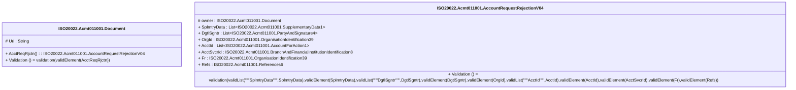

# acmt.011.001.04-physical

> The tables below contain descriptions of the members of each Element. 
> The first column indicates the type of the member:
> A ‘#’ indicates that the field is a key to the element, and a ‘+’ indicates that the field is a value.
> The ‘*’ column contains a description for the element member.  
> The ‘@’ column contains any properties for the member.
> The ‘=’ column contains calculated values; or in the case of an enum, the serialized value.

---

## EntityImpl ISO20022.Acmt011001.Document

| |Name|Type|*|@|=|
|-|-|-|-|-|-|
|#|Uri|String||XmlIgnore(), JsonIgnore()||
|+|AcctReqRjctn|ISO20022.Acmt011001.AccountRequestRejectionV04||XmlElement()||
||Validation|Some(String)||XmlIgnore(), JsonIgnore()|validation(validElement(AcctReqRjctn))|

---

## AspectImpl ISO20022.Acmt011001.AccountRequestRejectionV04

| |Name|Type|*|@|=|
|-|-|-|-|-|-|
|#|owner|ISO20022.Acmt011001.Document||||
|+|SplmtryData|List<ISO20022.Acmt011001.SupplementaryData1>||XmlElement()||
|+|DgtlSgntr|List<ISO20022.Acmt011001.PartyAndSignature4>||XmlElement()||
|+|OrgId|ISO20022.Acmt011001.OrganisationIdentification39||XmlElement()||
|+|AcctId|List<ISO20022.Acmt011001.AccountForAction1>||XmlElement()||
|+|AcctSvcrId|ISO20022.Acmt011001.BranchAndFinancialInstitutionIdentification8||XmlElement()||
|+|Fr|ISO20022.Acmt011001.OrganisationIdentification39||XmlElement()||
|+|Refs|ISO20022.Acmt011001.References6||XmlElement()||
||Validation|Some(String)||XmlIgnore(), JsonIgnore()|validation(validList("""SplmtryData""",SplmtryData),validElement(SplmtryData),validList("""DgtlSgntr""",DgtlSgntr),validElement(DgtlSgntr),validElement(OrgId),validList("""AcctId""",AcctId),validElement(AcctId),validElement(AcctSvcrId),validElement(Fr),validElement(Refs))|

