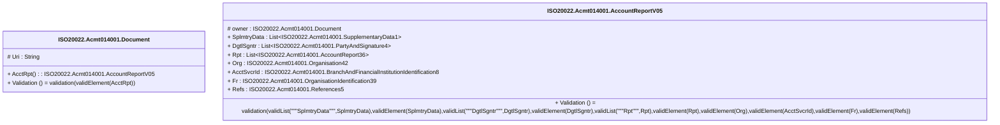

# acmt.014.001.05-physical

> The tables below contain descriptions of the members of each Element. 
> The first column indicates the type of the member:
> A ‘#’ indicates that the field is a key to the element, and a ‘+’ indicates that the field is a value.
> The ‘*’ column contains a description for the element member.  
> The ‘@’ column contains any properties for the member.
> The ‘=’ column contains calculated values; or in the case of an enum, the serialized value.

---

## EntityImpl ISO20022.Acmt014001.Document

| |Name|Type|*|@|=|
|-|-|-|-|-|-|
|#|Uri|String||XmlIgnore(), JsonIgnore()||
|+|AcctRpt|ISO20022.Acmt014001.AccountReportV05||XmlElement()||
||Validation|Some(String)||XmlIgnore(), JsonIgnore()|validation(validElement(AcctRpt))|

---

## AspectImpl ISO20022.Acmt014001.AccountReportV05

| |Name|Type|*|@|=|
|-|-|-|-|-|-|
|#|owner|ISO20022.Acmt014001.Document||||
|+|SplmtryData|List<ISO20022.Acmt014001.SupplementaryData1>||XmlElement()||
|+|DgtlSgntr|List<ISO20022.Acmt014001.PartyAndSignature4>||XmlElement()||
|+|Rpt|List<ISO20022.Acmt014001.AccountReport36>||XmlElement()||
|+|Org|ISO20022.Acmt014001.Organisation42||XmlElement()||
|+|AcctSvcrId|ISO20022.Acmt014001.BranchAndFinancialInstitutionIdentification8||XmlElement()||
|+|Fr|ISO20022.Acmt014001.OrganisationIdentification39||XmlElement()||
|+|Refs|ISO20022.Acmt014001.References5||XmlElement()||
||Validation|Some(String)||XmlIgnore(), JsonIgnore()|validation(validList("""SplmtryData""",SplmtryData),validElement(SplmtryData),validList("""DgtlSgntr""",DgtlSgntr),validElement(DgtlSgntr),validList("""Rpt""",Rpt),validElement(Rpt),validElement(Org),validElement(AcctSvcrId),validElement(Fr),validElement(Refs))|

