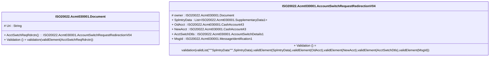

# acmt.030.001.04-physical

> The tables below contain descriptions of the members of each Element. 
> The first column indicates the type of the member:
> A ‘#’ indicates that the field is a key to the element, and a ‘+’ indicates that the field is a value.
> The ‘*’ column contains a description for the element member.  
> The ‘@’ column contains any properties for the member.
> The ‘=’ column contains calculated values; or in the case of an enum, the serialized value.

---

## EntityImpl ISO20022.Acmt030001.Document

| |Name|Type|*|@|=|
|-|-|-|-|-|-|
|#|Uri|String||XmlIgnore(), JsonIgnore()||
|+|AcctSwtchReqRdrctn|ISO20022.Acmt030001.AccountSwitchRequestRedirectionV04||XmlElement()||
||Validation|Some(String)||XmlIgnore(), JsonIgnore()|validation(validElement(AcctSwtchReqRdrctn))|

---

## AspectImpl ISO20022.Acmt030001.AccountSwitchRequestRedirectionV04

| |Name|Type|*|@|=|
|-|-|-|-|-|-|
|#|owner|ISO20022.Acmt030001.Document||||
|+|SplmtryData|List<ISO20022.Acmt030001.SupplementaryData1>||XmlElement()||
|+|OdAcct|ISO20022.Acmt030001.CashAccount43||XmlElement()||
|+|NewAcct|ISO20022.Acmt030001.CashAccount43||XmlElement()||
|+|AcctSwtchDtls|ISO20022.Acmt030001.AccountSwitchDetails1||XmlElement()||
|+|MsgId|ISO20022.Acmt030001.MessageIdentification1||XmlElement()||
||Validation|Some(String)||XmlIgnore(), JsonIgnore()|validation(validList("""SplmtryData""",SplmtryData),validElement(SplmtryData),validElement(OdAcct),validElement(NewAcct),validElement(AcctSwtchDtls),validElement(MsgId))|

