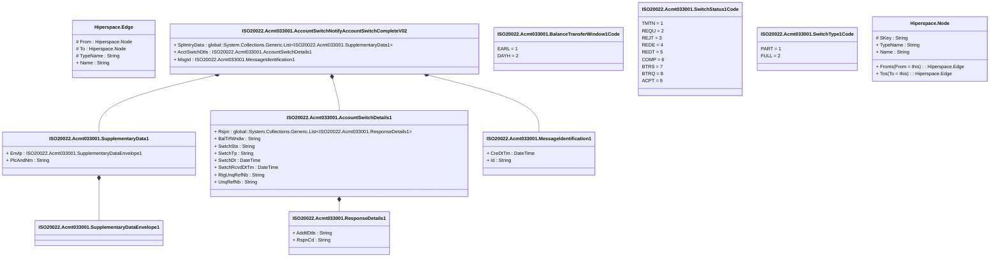

# acmt.033.001.02

> The tables below contain descriptions of the members of each Element. 
> The first column indicates the type of the member:
> A ‘#’ indicates that the field is a key to the element, and a ‘+’ indicates that the field is a value.
> The ‘*’ column contains a description for the element member.  
> The ‘@’ column contains any properties for the member.
> The ‘=’ column contains calculated values; or in the case of an enum, the serialized value.

---

## View Hiperspace.Edge
edge between nodes

| |Name|Type|*|@|=|
|-|-|-|-|-|-|
|#|From|Hiperspace.Node||||
|#|To|Hiperspace.Node||||
|#|TypeName|String||||
|+|Name|String||||

---

## Value ISO20022.Acmt033001.AccountSwitchDetails1

| |Name|Type|*|@|=|
|-|-|-|-|-|-|
|+|Rspn|global::System.Collections.Generic.List<ISO20022.Acmt033001.ResponseDetails1>||XmlElement()||
|+|BalTrfWndw|String||XmlElement()||
|+|SwtchSts|String||XmlElement()||
|+|SwtchTp|String||XmlElement()||
|+|SwtchDt|DateTime||XmlElement()||
|+|SwtchRcvdDtTm|DateTime||XmlElement()||
|+|RtgUnqRefNb|String||XmlElement()||
|+|UnqRefNb|String||XmlElement()||
||Validation|Some(String)||XmlIgnore(), JsonIgnore()|validation(validList("""Rspn""",Rspn),validElement(Rspn))|

---

## Aspect ISO20022.Acmt033001.AccountSwitchNotifyAccountSwitchCompleteV02

| |Name|Type|*|@|=|
|-|-|-|-|-|-|
|+|SplmtryData|global::System.Collections.Generic.List<ISO20022.Acmt033001.SupplementaryData1>||XmlElement()||
|+|AcctSwtchDtls|ISO20022.Acmt033001.AccountSwitchDetails1||XmlElement()||
|+|MsgId|ISO20022.Acmt033001.MessageIdentification1||XmlElement()||
||Validation|Some(String)||XmlIgnore(), JsonIgnore()|validation(validList("""SplmtryData""",SplmtryData),validElement(SplmtryData),validElement(AcctSwtchDtls),validElement(MsgId))|

---

## Enum ISO20022.Acmt033001.BalanceTransferWindow1Code

| |Name|Type|*|@|=|
|-|-|-|-|-|-|
||EARL|Int32||XmlEnum("""EARL""")|1|
||DAYH|Int32||XmlEnum("""DAYH""")|2|

---

## Type ISO20022.Acmt033001.Document

| |Name|Type|*|@|=|
|-|-|-|-|-|-|
|+|AcctSwtchNtfyAcctSwtchCmplt|ISO20022.Acmt033001.AccountSwitchNotifyAccountSwitchCompleteV02||XmlElement()||
||Validation|Some(String)||XmlIgnore(), JsonIgnore()|validation(validElement(AcctSwtchNtfyAcctSwtchCmplt))|

---

## Value ISO20022.Acmt033001.MessageIdentification1

| |Name|Type|*|@|=|
|-|-|-|-|-|-|
|+|CreDtTm|DateTime||XmlElement()||
|+|Id|String||XmlElement()||
||Validation|Some(String)||XmlIgnore(), JsonIgnore()|""|

---

## Value ISO20022.Acmt033001.ResponseDetails1

| |Name|Type|*|@|=|
|-|-|-|-|-|-|
|+|AddtlDtls|String||XmlElement()||
|+|RspnCd|String||XmlElement()||
||Validation|Some(String)||XmlIgnore(), JsonIgnore()|""|

---

## Value ISO20022.Acmt033001.SupplementaryData1

| |Name|Type|*|@|=|
|-|-|-|-|-|-|
|+|Envlp|ISO20022.Acmt033001.SupplementaryDataEnvelope1||XmlElement()||
|+|PlcAndNm|String||XmlElement()||
||Validation|Some(String)||XmlIgnore(), JsonIgnore()|validation(validElement(Envlp))|

---

## Value ISO20022.Acmt033001.SupplementaryDataEnvelope1

| |Name|Type|*|@|=|
|-|-|-|-|-|-|
||Validation|Some(String)||XmlIgnore(), JsonIgnore()|""|

---

## Enum ISO20022.Acmt033001.SwitchStatus1Code

| |Name|Type|*|@|=|
|-|-|-|-|-|-|
||TMTN|Int32||XmlEnum("""TMTN""")|1|
||REQU|Int32||XmlEnum("""REQU""")|2|
||REJT|Int32||XmlEnum("""REJT""")|3|
||REDE|Int32||XmlEnum("""REDE""")|4|
||REDT|Int32||XmlEnum("""REDT""")|5|
||COMP|Int32||XmlEnum("""COMP""")|6|
||BTRS|Int32||XmlEnum("""BTRS""")|7|
||BTRQ|Int32||XmlEnum("""BTRQ""")|8|
||ACPT|Int32||XmlEnum("""ACPT""")|9|

---

## Enum ISO20022.Acmt033001.SwitchType1Code

| |Name|Type|*|@|=|
|-|-|-|-|-|-|
||PART|Int32||XmlEnum("""PART""")|1|
||FULL|Int32||XmlEnum("""FULL""")|2|

---

## View Hiperspace.Node
node in a graph view of data

| |Name|Type|*|@|=|
|-|-|-|-|-|-|
|#|SKey|String||||
|+|TypeName|String||||
|+|Name|String||||
||Froms|Hiperspace.Edge|||From = this|
||Tos|Hiperspace.Edge|||To = this|

