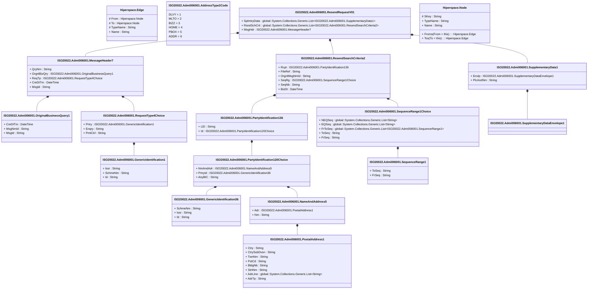

# admi.006.001.01

> The tables below contain descriptions of the members of each Element. 
> The first column indicates the type of the member:
> A ‘#’ indicates that the field is a key to the element, and a ‘+’ indicates that the field is a value.
> The ‘*’ column contains a description for the element member.  
> The ‘@’ column contains any properties for the member.
> The ‘=’ column contains calculated values; or in the case of an enum, the serialized value.

---

## View Hiperspace.Edge
edge between nodes

| |Name|Type|*|@|=|
|-|-|-|-|-|-|
|#|From|Hiperspace.Node||||
|#|To|Hiperspace.Node||||
|#|TypeName|String||||
|+|Name|String||||

---

## Enum ISO20022.Admi006001.AddressType2Code

| |Name|Type|*|@|=|
|-|-|-|-|-|-|
||DLVY|Int32||XmlEnum("""DLVY""")|1|
||MLTO|Int32||XmlEnum("""MLTO""")|2|
||BIZZ|Int32||XmlEnum("""BIZZ""")|3|
||HOME|Int32||XmlEnum("""HOME""")|4|
||PBOX|Int32||XmlEnum("""PBOX""")|5|
||ADDR|Int32||XmlEnum("""ADDR""")|6|

---

## Type ISO20022.Admi006001.Document

| |Name|Type|*|@|=|
|-|-|-|-|-|-|
|+|RsndReq|ISO20022.Admi006001.ResendRequestV01||XmlElement()||
||Validation|Some(String)||XmlIgnore(), JsonIgnore()|validation(validElement(RsndReq))|

---

## Value ISO20022.Admi006001.GenericIdentification1

| |Name|Type|*|@|=|
|-|-|-|-|-|-|
|+|Issr|String||XmlElement()||
|+|SchmeNm|String||XmlElement()||
|+|Id|String||XmlElement()||
||Validation|Some(String)||XmlIgnore(), JsonIgnore()|""|

---

## Value ISO20022.Admi006001.GenericIdentification36

| |Name|Type|*|@|=|
|-|-|-|-|-|-|
|+|SchmeNm|String||XmlElement()||
|+|Issr|String||XmlElement()||
|+|Id|String||XmlElement()||
||Validation|Some(String)||XmlIgnore(), JsonIgnore()|""|

---

## Value ISO20022.Admi006001.MessageHeader7

| |Name|Type|*|@|=|
|-|-|-|-|-|-|
|+|QryNm|String||XmlElement()||
|+|OrgnlBizQry|ISO20022.Admi006001.OriginalBusinessQuery1||XmlElement()||
|+|ReqTp|ISO20022.Admi006001.RequestType4Choice||XmlElement()||
|+|CreDtTm|DateTime||XmlElement()||
|+|MsgId|String||XmlElement()||
||Validation|Some(String)||XmlIgnore(), JsonIgnore()|validation(validElement(OrgnlBizQry),validElement(ReqTp))|

---

## Value ISO20022.Admi006001.NameAndAddress5

| |Name|Type|*|@|=|
|-|-|-|-|-|-|
|+|Adr|ISO20022.Admi006001.PostalAddress1||XmlElement()||
|+|Nm|String||XmlElement()||
||Validation|Some(String)||XmlIgnore(), JsonIgnore()|validation(validElement(Adr))|

---

## Value ISO20022.Admi006001.OriginalBusinessQuery1

| |Name|Type|*|@|=|
|-|-|-|-|-|-|
|+|CreDtTm|DateTime||XmlElement()||
|+|MsgNmId|String||XmlElement()||
|+|MsgId|String||XmlElement()||
||Validation|Some(String)||XmlIgnore(), JsonIgnore()|""|

---

## Value ISO20022.Admi006001.PartyIdentification120Choice

| |Name|Type|*|@|=|
|-|-|-|-|-|-|
|+|NmAndAdr|ISO20022.Admi006001.NameAndAddress5||XmlElement()||
|+|PrtryId|ISO20022.Admi006001.GenericIdentification36||XmlElement()||
|+|AnyBIC|String||XmlElement()||
||Validation|Some(String)||XmlIgnore(), JsonIgnore()|validation(validElement(NmAndAdr),validElement(PrtryId),validPattern("""AnyBIC""",AnyBIC,"""[A-Z0-9]{4,4}[A-Z]{2,2}[A-Z0-9]{2,2}([A-Z0-9]{3,3}){0,1}"""),validChoice(NmAndAdr,PrtryId,AnyBIC))|

---

## Value ISO20022.Admi006001.PartyIdentification136

| |Name|Type|*|@|=|
|-|-|-|-|-|-|
|+|LEI|String||XmlElement()||
|+|Id|ISO20022.Admi006001.PartyIdentification120Choice||XmlElement()||
||Validation|Some(String)||XmlIgnore(), JsonIgnore()|validation(validPattern("""LEI""",LEI,"""[A-Z0-9]{18,18}[0-9]{2,2}"""),validElement(Id))|

---

## Value ISO20022.Admi006001.PostalAddress1

| |Name|Type|*|@|=|
|-|-|-|-|-|-|
|+|Ctry|String||XmlElement()||
|+|CtrySubDvsn|String||XmlElement()||
|+|TwnNm|String||XmlElement()||
|+|PstCd|String||XmlElement()||
|+|BldgNb|String||XmlElement()||
|+|StrtNm|String||XmlElement()||
|+|AdrLine|global::System.Collections.Generic.List<String>||XmlElement()||
|+|AdrTp|String||XmlElement()||
||Validation|Some(String)||XmlIgnore(), JsonIgnore()|validation(validPattern("""Ctry""",Ctry,"""[A-Z]{2,2}"""),validListMax("""AdrLine""",AdrLine,5))|

---

## Value ISO20022.Admi006001.RequestType4Choice

| |Name|Type|*|@|=|
|-|-|-|-|-|-|
|+|Prtry|ISO20022.Admi006001.GenericIdentification1||XmlElement()||
|+|Enqry|String||XmlElement()||
|+|PmtCtrl|String||XmlElement()||
||Validation|Some(String)||XmlIgnore(), JsonIgnore()|validation(validElement(Prtry),validChoice(Prtry,Enqry,PmtCtrl))|

---

## Aspect ISO20022.Admi006001.ResendRequestV01

| |Name|Type|*|@|=|
|-|-|-|-|-|-|
|+|SplmtryData|global::System.Collections.Generic.List<ISO20022.Admi006001.SupplementaryData1>||XmlElement()||
|+|RsndSchCrit|global::System.Collections.Generic.List<ISO20022.Admi006001.ResendSearchCriteria2>||XmlElement()||
|+|MsgHdr|ISO20022.Admi006001.MessageHeader7||XmlElement()||
||Validation|Some(String)||XmlIgnore(), JsonIgnore()|validation(validList("""SplmtryData""",SplmtryData),validElement(SplmtryData),validRequired("""RsndSchCrit""",RsndSchCrit),validList("""RsndSchCrit""",RsndSchCrit),validElement(RsndSchCrit),validElement(MsgHdr))|

---

## Value ISO20022.Admi006001.ResendSearchCriteria2

| |Name|Type|*|@|=|
|-|-|-|-|-|-|
|+|Rcpt|ISO20022.Admi006001.PartyIdentification136||XmlElement()||
|+|FileRef|String||XmlElement()||
|+|OrgnlMsgNmId|String||XmlElement()||
|+|SeqRg|ISO20022.Admi006001.SequenceRange1Choice||XmlElement()||
|+|SeqNb|String||XmlElement()||
|+|BizDt|DateTime||XmlElement()||
||Validation|Some(String)||XmlIgnore(), JsonIgnore()|validation(validElement(Rcpt),validElement(SeqRg))|

---

## Value ISO20022.Admi006001.SequenceRange1

| |Name|Type|*|@|=|
|-|-|-|-|-|-|
|+|ToSeq|String||XmlElement()||
|+|FrSeq|String||XmlElement()||
||Validation|Some(String)||XmlIgnore(), JsonIgnore()|""|

---

## Value ISO20022.Admi006001.SequenceRange1Choice

| |Name|Type|*|@|=|
|-|-|-|-|-|-|
|+|NEQSeq|global::System.Collections.Generic.List<String>||XmlElement()||
|+|EQSeq|global::System.Collections.Generic.List<String>||XmlElement()||
|+|FrToSeq|global::System.Collections.Generic.List<ISO20022.Admi006001.SequenceRange1>||XmlElement()||
|+|ToSeq|String||XmlElement()||
|+|FrSeq|String||XmlElement()||
||Validation|Some(String)||XmlIgnore(), JsonIgnore()|validation(validRequired("""NEQSeq""",NEQSeq),validRequired("""EQSeq""",EQSeq),validRequired("""FrToSeq""",FrToSeq),validList("""FrToSeq""",FrToSeq),validElement(FrToSeq),validChoice(NEQSeq,EQSeq,FrToSeq,ToSeq,FrSeq))|

---

## Value ISO20022.Admi006001.SupplementaryData1

| |Name|Type|*|@|=|
|-|-|-|-|-|-|
|+|Envlp|ISO20022.Admi006001.SupplementaryDataEnvelope1||XmlElement()||
|+|PlcAndNm|String||XmlElement()||
||Validation|Some(String)||XmlIgnore(), JsonIgnore()|validation(validElement(Envlp))|

---

## Value ISO20022.Admi006001.SupplementaryDataEnvelope1

| |Name|Type|*|@|=|
|-|-|-|-|-|-|
||Validation|Some(String)||XmlIgnore(), JsonIgnore()|""|

---

## View Hiperspace.Node
node in a graph view of data

| |Name|Type|*|@|=|
|-|-|-|-|-|-|
|#|SKey|String||||
|+|TypeName|String||||
|+|Name|String||||
||Froms|Hiperspace.Edge|||From = this|
||Tos|Hiperspace.Edge|||To = this|

