# auth.001.001.02

```mermaid
classDiagram
    class Hiperspace.Edge {
        # From  : Hiperspace.Node
        # To  : Hiperspace.Node
        # TypeName  : String
        + Name  : String
    }
    class ISO20022.Auth001001.AccountAndParties3 {
        + AuthrtyReqTp  : global::System.Collections.Generic.List~ISO20022.Auth001001.AuthorityRequestType1~
        + InvstgtdPties  : ISO20022.Auth001001.InvestigatedParties1Choice
        + Id  : ISO20022.Auth001001.CashAccount43
    }
    ISO20022.Auth001001.AccountAndParties3 *-- ISO20022.Auth001001.AuthorityRequestType1
    ISO20022.Auth001001.AccountAndParties3 *-- ISO20022.Auth001001.InvestigatedParties1Choice
    ISO20022.Auth001001.AccountAndParties3 *-- ISO20022.Auth001001.CashAccount43
    class ISO20022.Auth001001.AccountIdentification4Choice {
        + Othr  : ISO20022.Auth001001.GenericAccountIdentification1
        + IBAN  : String
    }
    ISO20022.Auth001001.AccountIdentification4Choice *-- ISO20022.Auth001001.GenericAccountIdentification1
    class ISO20022.Auth001001.AccountSchemeName1Choice {
        + Prtry  : String
        + Cd  : String
    }
    class ISO20022.Auth001001.AddressType2Code {
        DLVY = 1
        MLTO = 2
        BIZZ = 3
        HOME = 4
        PBOX = 5
        ADDR = 6
    }
    class ISO20022.Auth001001.AddressType3Choice {
        + Prtry  : ISO20022.Auth001001.GenericIdentification30
        + Cd  : String
    }
    ISO20022.Auth001001.AddressType3Choice *-- ISO20022.Auth001001.GenericIdentification30
    class ISO20022.Auth001001.AuthorityInvestigation2 {
        + AddtlInf  : String
        + AddtlInvstgtdPties  : ISO20022.Auth001001.InvestigatedParties1Choice
        + InvstgtdRoles  : ISO20022.Auth001001.InvestigatedParties1Choice
        + Tp  : ISO20022.Auth001001.AuthorityRequestType1
    }
    ISO20022.Auth001001.AuthorityInvestigation2 *-- ISO20022.Auth001001.InvestigatedParties1Choice
    ISO20022.Auth001001.AuthorityInvestigation2 *-- ISO20022.Auth001001.InvestigatedParties1Choice
    ISO20022.Auth001001.AuthorityInvestigation2 *-- ISO20022.Auth001001.AuthorityRequestType1
    class ISO20022.Auth001001.AuthorityRequestType1 {
        + MsgNm  : String
        + MsgNmId  : String
    }
    class ISO20022.Auth001001.BranchAndFinancialInstitutionIdentification8 {
        + BrnchId  : ISO20022.Auth001001.BranchData5
        + FinInstnId  : ISO20022.Auth001001.FinancialInstitutionIdentification23
    }
    ISO20022.Auth001001.BranchAndFinancialInstitutionIdentification8 *-- ISO20022.Auth001001.BranchData5
    ISO20022.Auth001001.BranchAndFinancialInstitutionIdentification8 *-- ISO20022.Auth001001.FinancialInstitutionIdentification23
    class ISO20022.Auth001001.BranchData5 {
        + PstlAdr  : ISO20022.Auth001001.PostalAddress27
        + Nm  : String
        + LEI  : String
        + Id  : String
    }
    ISO20022.Auth001001.BranchData5 *-- ISO20022.Auth001001.PostalAddress27
    class ISO20022.Auth001001.CashAccount43 {
        + Svcr  : ISO20022.Auth001001.BranchAndFinancialInstitutionIdentification8
        + Ownr  : ISO20022.Auth001001.PartyIdentification272
        + Prxy  : ISO20022.Auth001001.ProxyAccountIdentification1
        + Nm  : String
        + Ccy  : String
        + Tp  : ISO20022.Auth001001.CashAccountType2Choice
        + Id  : ISO20022.Auth001001.AccountIdentification4Choice
    }
    ISO20022.Auth001001.CashAccount43 *-- ISO20022.Auth001001.BranchAndFinancialInstitutionIdentification8
    ISO20022.Auth001001.CashAccount43 *-- ISO20022.Auth001001.PartyIdentification272
    ISO20022.Auth001001.CashAccount43 *-- ISO20022.Auth001001.ProxyAccountIdentification1
    ISO20022.Auth001001.CashAccount43 *-- ISO20022.Auth001001.CashAccountType2Choice
    ISO20022.Auth001001.CashAccount43 *-- ISO20022.Auth001001.AccountIdentification4Choice
    class ISO20022.Auth001001.CashAccountType2Choice {
        + Prtry  : String
        + Cd  : String
    }
    class ISO20022.Auth001001.ClearingSystemIdentification2Choice {
        + Prtry  : String
        + Cd  : String
    }
    class ISO20022.Auth001001.ClearingSystemMemberIdentification2 {
        + MmbId  : String
        + ClrSysId  : ISO20022.Auth001001.ClearingSystemIdentification2Choice
    }
    ISO20022.Auth001001.ClearingSystemMemberIdentification2 *-- ISO20022.Auth001001.ClearingSystemIdentification2Choice
    class ISO20022.Auth001001.Contact13 {
        + PrefrdMtd  : String
        + Othr  : global::System.Collections.Generic.List~ISO20022.Auth001001.OtherContact1~
        + Dept  : String
        + Rspnsblty  : String
        + JobTitl  : String
        + EmailPurp  : String
        + EmailAdr  : String
        + URLAdr  : String
        + FaxNb  : String
        + MobNb  : String
        + PhneNb  : String
        + Nm  : String
        + NmPrfx  : String
    }
    ISO20022.Auth001001.Contact13 *-- ISO20022.Auth001001.OtherContact1
    class ISO20022.Auth001001.CustomerIdentification2 {
        + AuthrtyReq  : global::System.Collections.Generic.List~ISO20022.Auth001001.AuthorityInvestigation2~
        + Pty  : ISO20022.Auth001001.PartyIdentification272
    }
    ISO20022.Auth001001.CustomerIdentification2 *-- ISO20022.Auth001001.AuthorityInvestigation2
    ISO20022.Auth001001.CustomerIdentification2 *-- ISO20022.Auth001001.PartyIdentification272
    class ISO20022.Auth001001.DateAndPlaceOfBirth1 {
        + CtryOfBirth  : String
        + CityOfBirth  : String
        + PrvcOfBirth  : String
        + BirthDt  : DateTime
    }
    class ISO20022.Auth001001.DateOrDateTimePeriod1Choice {
        + DtTm  : ISO20022.Auth001001.DateTimePeriod1
        + Dt  : ISO20022.Auth001001.DatePeriod2
    }
    ISO20022.Auth001001.DateOrDateTimePeriod1Choice *-- ISO20022.Auth001001.DateTimePeriod1
    ISO20022.Auth001001.DateOrDateTimePeriod1Choice *-- ISO20022.Auth001001.DatePeriod2
    class ISO20022.Auth001001.DatePeriod2 {
        + ToDt  : DateTime
        + FrDt  : DateTime
    }
    class ISO20022.Auth001001.DateTimePeriod1 {
        + ToDtTm  : DateTime
        + FrDtTm  : DateTime
    }
    class ISO20022.Auth001001.DueDate1 {
        + AddtlInf  : String
        + DueDt  : DateTime
    }
    class ISO20022.Auth001001.FinancialIdentificationSchemeName1Choice {
        + Prtry  : String
        + Cd  : String
    }
    class ISO20022.Auth001001.FinancialInstitutionIdentification23 {
        + Othr  : ISO20022.Auth001001.GenericFinancialIdentification1
        + PstlAdr  : ISO20022.Auth001001.PostalAddress27
        + Nm  : String
        + LEI  : String
        + ClrSysMmbId  : ISO20022.Auth001001.ClearingSystemMemberIdentification2
        + BICFI  : String
    }
    ISO20022.Auth001001.FinancialInstitutionIdentification23 *-- ISO20022.Auth001001.GenericFinancialIdentification1
    ISO20022.Auth001001.FinancialInstitutionIdentification23 *-- ISO20022.Auth001001.PostalAddress27
    ISO20022.Auth001001.FinancialInstitutionIdentification23 *-- ISO20022.Auth001001.ClearingSystemMemberIdentification2
    class ISO20022.Auth001001.GenericAccountIdentification1 {
        + Issr  : String
        + SchmeNm  : ISO20022.Auth001001.AccountSchemeName1Choice
        + Id  : String
    }
    ISO20022.Auth001001.GenericAccountIdentification1 *-- ISO20022.Auth001001.AccountSchemeName1Choice
    class ISO20022.Auth001001.GenericFinancialIdentification1 {
        + Issr  : String
        + SchmeNm  : ISO20022.Auth001001.FinancialIdentificationSchemeName1Choice
        + Id  : String
    }
    ISO20022.Auth001001.GenericFinancialIdentification1 *-- ISO20022.Auth001001.FinancialIdentificationSchemeName1Choice
    class ISO20022.Auth001001.GenericIdentification30 {
        + SchmeNm  : String
        + Issr  : String
        + Id  : String
    }
    class ISO20022.Auth001001.GenericOrganisationIdentification3 {
        + Issr  : String
        + SchmeNm  : ISO20022.Auth001001.OrganisationIdentificationSchemeName1Choice
        + Id  : String
    }
    ISO20022.Auth001001.GenericOrganisationIdentification3 *-- ISO20022.Auth001001.OrganisationIdentificationSchemeName1Choice
    class ISO20022.Auth001001.GenericPersonIdentification2 {
        + Issr  : String
        + SchmeNm  : ISO20022.Auth001001.PersonIdentificationSchemeName1Choice
        + Id  : String
    }
    ISO20022.Auth001001.GenericPersonIdentification2 *-- ISO20022.Auth001001.PersonIdentificationSchemeName1Choice
    class ISO20022.Auth001001.InformationRequestOpeningV02 {
        + SplmtryData  : global::System.Collections.Generic.List~ISO20022.Auth001001.SupplementaryData1~
        + SchCrit  : ISO20022.Auth001001.SearchCriteria2Choice
        + InvstgtnPrd  : ISO20022.Auth001001.DateOrDateTimePeriod1Choice
        + DueDt  : ISO20022.Auth001001.DueDate1
        + CnfdtltySts  : String
        + LglMndtBsis  : ISO20022.Auth001001.LegalMandate1
        + InvstgtnId  : String
    }
    ISO20022.Auth001001.InformationRequestOpeningV02 *-- ISO20022.Auth001001.SupplementaryData1
    ISO20022.Auth001001.InformationRequestOpeningV02 *-- ISO20022.Auth001001.SearchCriteria2Choice
    ISO20022.Auth001001.InformationRequestOpeningV02 *-- ISO20022.Auth001001.DateOrDateTimePeriod1Choice
    ISO20022.Auth001001.InformationRequestOpeningV02 *-- ISO20022.Auth001001.DueDate1
    ISO20022.Auth001001.InformationRequestOpeningV02 *-- ISO20022.Auth001001.LegalMandate1
    class ISO20022.Auth001001.InvestigatedParties1Choice {
        + Prtry  : String
        + Cd  : String
    }
    class ISO20022.Auth001001.InvestigatedParties1Code {
        OWNE = 1
        ALLP = 2
    }
    class ISO20022.Auth001001.LegalMandate1 {
        + Dsclmr  : String
        + Prgrph  : String
    }
    class ISO20022.Auth001001.NamePrefix2Code {
        MIKS = 1
        MIST = 2
        MISS = 3
        MADM = 4
        DOCT = 5
    }
    class ISO20022.Auth001001.OrganisationIdentification39 {
        + Othr  : global::System.Collections.Generic.List~ISO20022.Auth001001.GenericOrganisationIdentification3~
        + LEI  : String
        + AnyBIC  : String
    }
    ISO20022.Auth001001.OrganisationIdentification39 *-- ISO20022.Auth001001.GenericOrganisationIdentification3
    class ISO20022.Auth001001.OrganisationIdentificationSchemeName1Choice {
        + Prtry  : String
        + Cd  : String
    }
    class ISO20022.Auth001001.OtherContact1 {
        + Id  : String
        + ChanlTp  : String
    }
    class ISO20022.Auth001001.Party52Choice {
        + PrvtId  : ISO20022.Auth001001.PersonIdentification18
        + OrgId  : ISO20022.Auth001001.OrganisationIdentification39
    }
    ISO20022.Auth001001.Party52Choice *-- ISO20022.Auth001001.PersonIdentification18
    ISO20022.Auth001001.Party52Choice *-- ISO20022.Auth001001.OrganisationIdentification39
    class ISO20022.Auth001001.PartyIdentification272 {
        + CtctDtls  : ISO20022.Auth001001.Contact13
        + CtryOfRes  : String
        + Id  : ISO20022.Auth001001.Party52Choice
        + PstlAdr  : ISO20022.Auth001001.PostalAddress27
        + Nm  : String
    }
    ISO20022.Auth001001.PartyIdentification272 *-- ISO20022.Auth001001.Contact13
    ISO20022.Auth001001.PartyIdentification272 *-- ISO20022.Auth001001.Party52Choice
    ISO20022.Auth001001.PartyIdentification272 *-- ISO20022.Auth001001.PostalAddress27
    class ISO20022.Auth001001.PaymentInstrumentType1 {
        + AddtlInf  : String
        + AuthrtyReqTp  : global::System.Collections.Generic.List~ISO20022.Auth001001.AuthorityRequestType1~
        + CardNb  : String
    }
    ISO20022.Auth001001.PaymentInstrumentType1 *-- ISO20022.Auth001001.AuthorityRequestType1
    class ISO20022.Auth001001.PersonIdentification18 {
        + Othr  : global::System.Collections.Generic.List~ISO20022.Auth001001.GenericPersonIdentification2~
        + DtAndPlcOfBirth  : ISO20022.Auth001001.DateAndPlaceOfBirth1
    }
    ISO20022.Auth001001.PersonIdentification18 *-- ISO20022.Auth001001.GenericPersonIdentification2
    ISO20022.Auth001001.PersonIdentification18 *-- ISO20022.Auth001001.DateAndPlaceOfBirth1
    class ISO20022.Auth001001.PersonIdentificationSchemeName1Choice {
        + Prtry  : String
        + Cd  : String
    }
    class ISO20022.Auth001001.PostalAddress27 {
        + AdrLine  : global::System.Collections.Generic.List~String~
        + Ctry  : String
        + CtrySubDvsn  : String
        + DstrctNm  : String
        + TwnLctnNm  : String
        + TwnNm  : String
        + PstCd  : String
        + Room  : String
        + PstBx  : String
        + UnitNb  : String
        + Flr  : String
        + BldgNm  : String
        + BldgNb  : String
        + StrtNm  : String
        + SubDept  : String
        + Dept  : String
        + CareOf  : String
        + AdrTp  : ISO20022.Auth001001.AddressType3Choice
    }
    ISO20022.Auth001001.PostalAddress27 *-- ISO20022.Auth001001.AddressType3Choice
    class ISO20022.Auth001001.PreferredContactMethod2Code {
        PHON = 1
        ONLI = 2
        CELL = 3
        LETT = 4
        FAXX = 5
        MAIL = 6
    }
    class ISO20022.Auth001001.ProxyAccountIdentification1 {
        + Id  : String
        + Tp  : ISO20022.Auth001001.ProxyAccountType1Choice
    }
    ISO20022.Auth001001.ProxyAccountIdentification1 *-- ISO20022.Auth001001.ProxyAccountType1Choice
    class ISO20022.Auth001001.ProxyAccountType1Choice {
        + Prtry  : String
        + Cd  : String
    }
    class ISO20022.Auth001001.RequestType1 {
        + AddtlInf  : String
        + Tp  : global::System.Collections.Generic.List~String~
        + Nb  : String
    }
    class ISO20022.Auth001001.SearchCriteria2Choice {
        + OrgnlTxNb  : global::System.Collections.Generic.List~ISO20022.Auth001001.RequestType1~
        + PmtInstrm  : ISO20022.Auth001001.PaymentInstrumentType1
        + CstmrId  : ISO20022.Auth001001.CustomerIdentification2
        + Acct  : ISO20022.Auth001001.AccountAndParties3
    }
    ISO20022.Auth001001.SearchCriteria2Choice *-- ISO20022.Auth001001.RequestType1
    ISO20022.Auth001001.SearchCriteria2Choice *-- ISO20022.Auth001001.PaymentInstrumentType1
    ISO20022.Auth001001.SearchCriteria2Choice *-- ISO20022.Auth001001.CustomerIdentification2
    ISO20022.Auth001001.SearchCriteria2Choice *-- ISO20022.Auth001001.AccountAndParties3
    class ISO20022.Auth001001.SupplementaryData1 {
        + Envlp  : ISO20022.Auth001001.SupplementaryDataEnvelope1
        + PlcAndNm  : String
    }
    ISO20022.Auth001001.SupplementaryData1 *-- ISO20022.Auth001001.SupplementaryDataEnvelope1
    class ISO20022.Auth001001.SupplementaryDataEnvelope1 {
    }
    class ISO20022.Auth001001.TransactionRequestType1Code {
        OREC = 1
        DTTX = 2
    }
    class Hiperspace.Node {
        # SKey  : String
        + TypeName  : String
        + Name  : String
        + Froms (From = this) : Hiperspace.Edge
        + Tos (To = this) : Hiperspace.Edge
    }
```

> The tables below contain descriptions of the members of each Element. 
> The first column indicates the type of the member:
> A ‘#’ indicates that the field is a key to the element, and a ‘+’ indicates that the field is a value.
> The ‘*’ column contains a description for the element member.  
> The ‘@’ column contains any properties for the member.
> The ‘=’ column contains calculated values; or in the case of an enum, the serialized value.

---

## View Hiperspace.Edge
edge between nodes

| |Name|Type|*|@|=|
|-|-|-|-|-|-|
|#|From|Hiperspace.Node||||
|#|To|Hiperspace.Node||||
|#|TypeName|String||||
|+|Name|String||||

---

## Value ISO20022.Auth001001.AccountAndParties3

| |Name|Type|*|@|=|
|-|-|-|-|-|-|
|+|AuthrtyReqTp|global::System.Collections.Generic.List<ISO20022.Auth001001.AuthorityRequestType1>||XmlElement()||
|+|InvstgtdPties|ISO20022.Auth001001.InvestigatedParties1Choice||XmlElement()||
|+|Id|ISO20022.Auth001001.CashAccount43||XmlElement()||
||Validation|Some(String)||XmlIgnore(), JsonIgnore()|validation(validRequired("""AuthrtyReqTp""",AuthrtyReqTp),validList("""AuthrtyReqTp""",AuthrtyReqTp),validElement(AuthrtyReqTp),validElement(InvstgtdPties),validElement(Id))|

---

## Value ISO20022.Auth001001.AccountIdentification4Choice

| |Name|Type|*|@|=|
|-|-|-|-|-|-|
|+|Othr|ISO20022.Auth001001.GenericAccountIdentification1||XmlElement()||
|+|IBAN|String||XmlElement()||
||Validation|Some(String)||XmlIgnore(), JsonIgnore()|validation(validElement(Othr),validPattern("""IBAN""",IBAN,"""[A-Z]{2,2}[0-9]{2,2}[a-zA-Z0-9]{1,30}"""),validChoice(Othr,IBAN))|

---

## Value ISO20022.Auth001001.AccountSchemeName1Choice

| |Name|Type|*|@|=|
|-|-|-|-|-|-|
|+|Prtry|String||XmlElement()||
|+|Cd|String||XmlElement()||
||Validation|Some(String)||XmlIgnore(), JsonIgnore()|validation(validChoice(Prtry,Cd))|

---

## Enum ISO20022.Auth001001.AddressType2Code

| |Name|Type|*|@|=|
|-|-|-|-|-|-|
||DLVY|Int32||XmlEnum("""DLVY""")|1|
||MLTO|Int32||XmlEnum("""MLTO""")|2|
||BIZZ|Int32||XmlEnum("""BIZZ""")|3|
||HOME|Int32||XmlEnum("""HOME""")|4|
||PBOX|Int32||XmlEnum("""PBOX""")|5|
||ADDR|Int32||XmlEnum("""ADDR""")|6|

---

## Value ISO20022.Auth001001.AddressType3Choice

| |Name|Type|*|@|=|
|-|-|-|-|-|-|
|+|Prtry|ISO20022.Auth001001.GenericIdentification30||XmlElement()||
|+|Cd|String||XmlElement()||
||Validation|Some(String)||XmlIgnore(), JsonIgnore()|validation(validElement(Prtry),validChoice(Prtry,Cd))|

---

## Value ISO20022.Auth001001.AuthorityInvestigation2

| |Name|Type|*|@|=|
|-|-|-|-|-|-|
|+|AddtlInf|String||XmlElement()||
|+|AddtlInvstgtdPties|ISO20022.Auth001001.InvestigatedParties1Choice||XmlElement()||
|+|InvstgtdRoles|ISO20022.Auth001001.InvestigatedParties1Choice||XmlElement()||
|+|Tp|ISO20022.Auth001001.AuthorityRequestType1||XmlElement()||
||Validation|Some(String)||XmlIgnore(), JsonIgnore()|validation(validElement(AddtlInvstgtdPties),validElement(InvstgtdRoles),validElement(Tp))|

---

## Value ISO20022.Auth001001.AuthorityRequestType1

| |Name|Type|*|@|=|
|-|-|-|-|-|-|
|+|MsgNm|String||XmlElement()||
|+|MsgNmId|String||XmlElement()||
||Validation|Some(String)||XmlIgnore(), JsonIgnore()|""|

---

## Value ISO20022.Auth001001.BranchAndFinancialInstitutionIdentification8

| |Name|Type|*|@|=|
|-|-|-|-|-|-|
|+|BrnchId|ISO20022.Auth001001.BranchData5||XmlElement()||
|+|FinInstnId|ISO20022.Auth001001.FinancialInstitutionIdentification23||XmlElement()||
||Validation|Some(String)||XmlIgnore(), JsonIgnore()|validation(validElement(BrnchId),validElement(FinInstnId))|

---

## Value ISO20022.Auth001001.BranchData5

| |Name|Type|*|@|=|
|-|-|-|-|-|-|
|+|PstlAdr|ISO20022.Auth001001.PostalAddress27||XmlElement()||
|+|Nm|String||XmlElement()||
|+|LEI|String||XmlElement()||
|+|Id|String||XmlElement()||
||Validation|Some(String)||XmlIgnore(), JsonIgnore()|validation(validElement(PstlAdr),validPattern("""LEI""",LEI,"""[A-Z0-9]{18,18}[0-9]{2,2}"""))|

---

## Value ISO20022.Auth001001.CashAccount43

| |Name|Type|*|@|=|
|-|-|-|-|-|-|
|+|Svcr|ISO20022.Auth001001.BranchAndFinancialInstitutionIdentification8||XmlElement()||
|+|Ownr|ISO20022.Auth001001.PartyIdentification272||XmlElement()||
|+|Prxy|ISO20022.Auth001001.ProxyAccountIdentification1||XmlElement()||
|+|Nm|String||XmlElement()||
|+|Ccy|String||XmlElement()||
|+|Tp|ISO20022.Auth001001.CashAccountType2Choice||XmlElement()||
|+|Id|ISO20022.Auth001001.AccountIdentification4Choice||XmlElement()||
||Validation|Some(String)||XmlIgnore(), JsonIgnore()|validation(validElement(Svcr),validElement(Ownr),validElement(Prxy),validPattern("""Ccy""",Ccy,"""[A-Z]{3,3}"""),validElement(Tp),validElement(Id))|

---

## Value ISO20022.Auth001001.CashAccountType2Choice

| |Name|Type|*|@|=|
|-|-|-|-|-|-|
|+|Prtry|String||XmlElement()||
|+|Cd|String||XmlElement()||
||Validation|Some(String)||XmlIgnore(), JsonIgnore()|validation(validChoice(Prtry,Cd))|

---

## Value ISO20022.Auth001001.ClearingSystemIdentification2Choice

| |Name|Type|*|@|=|
|-|-|-|-|-|-|
|+|Prtry|String||XmlElement()||
|+|Cd|String||XmlElement()||
||Validation|Some(String)||XmlIgnore(), JsonIgnore()|validation(validChoice(Prtry,Cd))|

---

## Value ISO20022.Auth001001.ClearingSystemMemberIdentification2

| |Name|Type|*|@|=|
|-|-|-|-|-|-|
|+|MmbId|String||XmlElement()||
|+|ClrSysId|ISO20022.Auth001001.ClearingSystemIdentification2Choice||XmlElement()||
||Validation|Some(String)||XmlIgnore(), JsonIgnore()|validation(validElement(ClrSysId))|

---

## Value ISO20022.Auth001001.Contact13

| |Name|Type|*|@|=|
|-|-|-|-|-|-|
|+|PrefrdMtd|String||XmlElement()||
|+|Othr|global::System.Collections.Generic.List<ISO20022.Auth001001.OtherContact1>||XmlElement()||
|+|Dept|String||XmlElement()||
|+|Rspnsblty|String||XmlElement()||
|+|JobTitl|String||XmlElement()||
|+|EmailPurp|String||XmlElement()||
|+|EmailAdr|String||XmlElement()||
|+|URLAdr|String||XmlElement()||
|+|FaxNb|String||XmlElement()||
|+|MobNb|String||XmlElement()||
|+|PhneNb|String||XmlElement()||
|+|Nm|String||XmlElement()||
|+|NmPrfx|String||XmlElement()||
||Validation|Some(String)||XmlIgnore(), JsonIgnore()|validation(validList("""Othr""",Othr),validElement(Othr),validPattern("""FaxNb""",FaxNb,"""\+[0-9]{1,3}-[0-9()+\-]{1,30}"""),validPattern("""MobNb""",MobNb,"""\+[0-9]{1,3}-[0-9()+\-]{1,30}"""),validPattern("""PhneNb""",PhneNb,"""\+[0-9]{1,3}-[0-9()+\-]{1,30}"""))|

---

## Value ISO20022.Auth001001.CustomerIdentification2

| |Name|Type|*|@|=|
|-|-|-|-|-|-|
|+|AuthrtyReq|global::System.Collections.Generic.List<ISO20022.Auth001001.AuthorityInvestigation2>||XmlElement()||
|+|Pty|ISO20022.Auth001001.PartyIdentification272||XmlElement()||
||Validation|Some(String)||XmlIgnore(), JsonIgnore()|validation(validRequired("""AuthrtyReq""",AuthrtyReq),validList("""AuthrtyReq""",AuthrtyReq),validElement(AuthrtyReq),validElement(Pty))|

---

## Value ISO20022.Auth001001.DateAndPlaceOfBirth1

| |Name|Type|*|@|=|
|-|-|-|-|-|-|
|+|CtryOfBirth|String||XmlElement()||
|+|CityOfBirth|String||XmlElement()||
|+|PrvcOfBirth|String||XmlElement()||
|+|BirthDt|DateTime||XmlElement()||
||Validation|Some(String)||XmlIgnore(), JsonIgnore()|validation(validPattern("""CtryOfBirth""",CtryOfBirth,"""[A-Z]{2,2}"""))|

---

## Value ISO20022.Auth001001.DateOrDateTimePeriod1Choice

| |Name|Type|*|@|=|
|-|-|-|-|-|-|
|+|DtTm|ISO20022.Auth001001.DateTimePeriod1||XmlElement()||
|+|Dt|ISO20022.Auth001001.DatePeriod2||XmlElement()||
||Validation|Some(String)||XmlIgnore(), JsonIgnore()|validation(validElement(DtTm),validElement(Dt),validChoice(DtTm,Dt))|

---

## Value ISO20022.Auth001001.DatePeriod2

| |Name|Type|*|@|=|
|-|-|-|-|-|-|
|+|ToDt|DateTime||XmlElement()||
|+|FrDt|DateTime||XmlElement()||
||Validation|Some(String)||XmlIgnore(), JsonIgnore()|""|

---

## Value ISO20022.Auth001001.DateTimePeriod1

| |Name|Type|*|@|=|
|-|-|-|-|-|-|
|+|ToDtTm|DateTime||XmlElement()||
|+|FrDtTm|DateTime||XmlElement()||
||Validation|Some(String)||XmlIgnore(), JsonIgnore()|""|

---

## Type ISO20022.Auth001001.Document

| |Name|Type|*|@|=|
|-|-|-|-|-|-|
|+|InfReqOpng|ISO20022.Auth001001.InformationRequestOpeningV02||XmlElement()||
||Validation|Some(String)||XmlIgnore(), JsonIgnore()|validation(validElement(InfReqOpng))|

---

## Value ISO20022.Auth001001.DueDate1

| |Name|Type|*|@|=|
|-|-|-|-|-|-|
|+|AddtlInf|String||XmlElement()||
|+|DueDt|DateTime||XmlElement()||
||Validation|Some(String)||XmlIgnore(), JsonIgnore()|""|

---

## Value ISO20022.Auth001001.FinancialIdentificationSchemeName1Choice

| |Name|Type|*|@|=|
|-|-|-|-|-|-|
|+|Prtry|String||XmlElement()||
|+|Cd|String||XmlElement()||
||Validation|Some(String)||XmlIgnore(), JsonIgnore()|validation(validChoice(Prtry,Cd))|

---

## Value ISO20022.Auth001001.FinancialInstitutionIdentification23

| |Name|Type|*|@|=|
|-|-|-|-|-|-|
|+|Othr|ISO20022.Auth001001.GenericFinancialIdentification1||XmlElement()||
|+|PstlAdr|ISO20022.Auth001001.PostalAddress27||XmlElement()||
|+|Nm|String||XmlElement()||
|+|LEI|String||XmlElement()||
|+|ClrSysMmbId|ISO20022.Auth001001.ClearingSystemMemberIdentification2||XmlElement()||
|+|BICFI|String||XmlElement()||
||Validation|Some(String)||XmlIgnore(), JsonIgnore()|validation(validElement(Othr),validElement(PstlAdr),validPattern("""LEI""",LEI,"""[A-Z0-9]{18,18}[0-9]{2,2}"""),validElement(ClrSysMmbId),validPattern("""BICFI""",BICFI,"""[A-Z0-9]{4,4}[A-Z]{2,2}[A-Z0-9]{2,2}([A-Z0-9]{3,3}){0,1}"""))|

---

## Value ISO20022.Auth001001.GenericAccountIdentification1

| |Name|Type|*|@|=|
|-|-|-|-|-|-|
|+|Issr|String||XmlElement()||
|+|SchmeNm|ISO20022.Auth001001.AccountSchemeName1Choice||XmlElement()||
|+|Id|String||XmlElement()||
||Validation|Some(String)||XmlIgnore(), JsonIgnore()|validation(validElement(SchmeNm))|

---

## Value ISO20022.Auth001001.GenericFinancialIdentification1

| |Name|Type|*|@|=|
|-|-|-|-|-|-|
|+|Issr|String||XmlElement()||
|+|SchmeNm|ISO20022.Auth001001.FinancialIdentificationSchemeName1Choice||XmlElement()||
|+|Id|String||XmlElement()||
||Validation|Some(String)||XmlIgnore(), JsonIgnore()|validation(validElement(SchmeNm))|

---

## Value ISO20022.Auth001001.GenericIdentification30

| |Name|Type|*|@|=|
|-|-|-|-|-|-|
|+|SchmeNm|String||XmlElement()||
|+|Issr|String||XmlElement()||
|+|Id|String||XmlElement()||
||Validation|Some(String)||XmlIgnore(), JsonIgnore()|validation(validPattern("""Id""",Id,"""[a-zA-Z0-9]{4}"""))|

---

## Value ISO20022.Auth001001.GenericOrganisationIdentification3

| |Name|Type|*|@|=|
|-|-|-|-|-|-|
|+|Issr|String||XmlElement()||
|+|SchmeNm|ISO20022.Auth001001.OrganisationIdentificationSchemeName1Choice||XmlElement()||
|+|Id|String||XmlElement()||
||Validation|Some(String)||XmlIgnore(), JsonIgnore()|validation(validElement(SchmeNm))|

---

## Value ISO20022.Auth001001.GenericPersonIdentification2

| |Name|Type|*|@|=|
|-|-|-|-|-|-|
|+|Issr|String||XmlElement()||
|+|SchmeNm|ISO20022.Auth001001.PersonIdentificationSchemeName1Choice||XmlElement()||
|+|Id|String||XmlElement()||
||Validation|Some(String)||XmlIgnore(), JsonIgnore()|validation(validElement(SchmeNm))|

---

## Aspect ISO20022.Auth001001.InformationRequestOpeningV02

| |Name|Type|*|@|=|
|-|-|-|-|-|-|
|+|SplmtryData|global::System.Collections.Generic.List<ISO20022.Auth001001.SupplementaryData1>||XmlElement()||
|+|SchCrit|ISO20022.Auth001001.SearchCriteria2Choice||XmlElement()||
|+|InvstgtnPrd|ISO20022.Auth001001.DateOrDateTimePeriod1Choice||XmlElement()||
|+|DueDt|ISO20022.Auth001001.DueDate1||XmlElement()||
|+|CnfdtltySts|String||XmlElement()||
|+|LglMndtBsis|ISO20022.Auth001001.LegalMandate1||XmlElement()||
|+|InvstgtnId|String||XmlElement()||
||Validation|Some(String)||XmlIgnore(), JsonIgnore()|validation(validList("""SplmtryData""",SplmtryData),validElement(SplmtryData),validElement(SchCrit),validElement(InvstgtnPrd),validElement(DueDt),validElement(LglMndtBsis))|

---

## Value ISO20022.Auth001001.InvestigatedParties1Choice

| |Name|Type|*|@|=|
|-|-|-|-|-|-|
|+|Prtry|String||XmlElement()||
|+|Cd|String||XmlElement()||
||Validation|Some(String)||XmlIgnore(), JsonIgnore()|validation(validChoice(Prtry,Cd))|

---

## Enum ISO20022.Auth001001.InvestigatedParties1Code

| |Name|Type|*|@|=|
|-|-|-|-|-|-|
||OWNE|Int32||XmlEnum("""OWNE""")|1|
||ALLP|Int32||XmlEnum("""ALLP""")|2|

---

## Value ISO20022.Auth001001.LegalMandate1

| |Name|Type|*|@|=|
|-|-|-|-|-|-|
|+|Dsclmr|String||XmlElement()||
|+|Prgrph|String||XmlElement()||
||Validation|Some(String)||XmlIgnore(), JsonIgnore()|""|

---

## Enum ISO20022.Auth001001.NamePrefix2Code

| |Name|Type|*|@|=|
|-|-|-|-|-|-|
||MIKS|Int32||XmlEnum("""MIKS""")|1|
||MIST|Int32||XmlEnum("""MIST""")|2|
||MISS|Int32||XmlEnum("""MISS""")|3|
||MADM|Int32||XmlEnum("""MADM""")|4|
||DOCT|Int32||XmlEnum("""DOCT""")|5|

---

## Value ISO20022.Auth001001.OrganisationIdentification39

| |Name|Type|*|@|=|
|-|-|-|-|-|-|
|+|Othr|global::System.Collections.Generic.List<ISO20022.Auth001001.GenericOrganisationIdentification3>||XmlElement()||
|+|LEI|String||XmlElement()||
|+|AnyBIC|String||XmlElement()||
||Validation|Some(String)||XmlIgnore(), JsonIgnore()|validation(validList("""Othr""",Othr),validElement(Othr),validPattern("""LEI""",LEI,"""[A-Z0-9]{18,18}[0-9]{2,2}"""),validPattern("""AnyBIC""",AnyBIC,"""[A-Z0-9]{4,4}[A-Z]{2,2}[A-Z0-9]{2,2}([A-Z0-9]{3,3}){0,1}"""))|

---

## Value ISO20022.Auth001001.OrganisationIdentificationSchemeName1Choice

| |Name|Type|*|@|=|
|-|-|-|-|-|-|
|+|Prtry|String||XmlElement()||
|+|Cd|String||XmlElement()||
||Validation|Some(String)||XmlIgnore(), JsonIgnore()|validation(validChoice(Prtry,Cd))|

---

## Value ISO20022.Auth001001.OtherContact1

| |Name|Type|*|@|=|
|-|-|-|-|-|-|
|+|Id|String||XmlElement()||
|+|ChanlTp|String||XmlElement()||
||Validation|Some(String)||XmlIgnore(), JsonIgnore()|""|

---

## Value ISO20022.Auth001001.Party52Choice

| |Name|Type|*|@|=|
|-|-|-|-|-|-|
|+|PrvtId|ISO20022.Auth001001.PersonIdentification18||XmlElement()||
|+|OrgId|ISO20022.Auth001001.OrganisationIdentification39||XmlElement()||
||Validation|Some(String)||XmlIgnore(), JsonIgnore()|validation(validElement(PrvtId),validElement(OrgId),validChoice(PrvtId,OrgId))|

---

## Value ISO20022.Auth001001.PartyIdentification272

| |Name|Type|*|@|=|
|-|-|-|-|-|-|
|+|CtctDtls|ISO20022.Auth001001.Contact13||XmlElement()||
|+|CtryOfRes|String||XmlElement()||
|+|Id|ISO20022.Auth001001.Party52Choice||XmlElement()||
|+|PstlAdr|ISO20022.Auth001001.PostalAddress27||XmlElement()||
|+|Nm|String||XmlElement()||
||Validation|Some(String)||XmlIgnore(), JsonIgnore()|validation(validElement(CtctDtls),validPattern("""CtryOfRes""",CtryOfRes,"""[A-Z]{2,2}"""),validElement(Id),validElement(PstlAdr))|

---

## Value ISO20022.Auth001001.PaymentInstrumentType1

| |Name|Type|*|@|=|
|-|-|-|-|-|-|
|+|AddtlInf|String||XmlElement()||
|+|AuthrtyReqTp|global::System.Collections.Generic.List<ISO20022.Auth001001.AuthorityRequestType1>||XmlElement()||
|+|CardNb|String||XmlElement()||
||Validation|Some(String)||XmlIgnore(), JsonIgnore()|validation(validRequired("""AuthrtyReqTp""",AuthrtyReqTp),validList("""AuthrtyReqTp""",AuthrtyReqTp),validElement(AuthrtyReqTp),validPattern("""CardNb""",CardNb,"""[0-9]{8,28}"""))|

---

## Value ISO20022.Auth001001.PersonIdentification18

| |Name|Type|*|@|=|
|-|-|-|-|-|-|
|+|Othr|global::System.Collections.Generic.List<ISO20022.Auth001001.GenericPersonIdentification2>||XmlElement()||
|+|DtAndPlcOfBirth|ISO20022.Auth001001.DateAndPlaceOfBirth1||XmlElement()||
||Validation|Some(String)||XmlIgnore(), JsonIgnore()|validation(validList("""Othr""",Othr),validElement(Othr),validElement(DtAndPlcOfBirth))|

---

## Value ISO20022.Auth001001.PersonIdentificationSchemeName1Choice

| |Name|Type|*|@|=|
|-|-|-|-|-|-|
|+|Prtry|String||XmlElement()||
|+|Cd|String||XmlElement()||
||Validation|Some(String)||XmlIgnore(), JsonIgnore()|validation(validChoice(Prtry,Cd))|

---

## Value ISO20022.Auth001001.PostalAddress27

| |Name|Type|*|@|=|
|-|-|-|-|-|-|
|+|AdrLine|global::System.Collections.Generic.List<String>||XmlElement()||
|+|Ctry|String||XmlElement()||
|+|CtrySubDvsn|String||XmlElement()||
|+|DstrctNm|String||XmlElement()||
|+|TwnLctnNm|String||XmlElement()||
|+|TwnNm|String||XmlElement()||
|+|PstCd|String||XmlElement()||
|+|Room|String||XmlElement()||
|+|PstBx|String||XmlElement()||
|+|UnitNb|String||XmlElement()||
|+|Flr|String||XmlElement()||
|+|BldgNm|String||XmlElement()||
|+|BldgNb|String||XmlElement()||
|+|StrtNm|String||XmlElement()||
|+|SubDept|String||XmlElement()||
|+|Dept|String||XmlElement()||
|+|CareOf|String||XmlElement()||
|+|AdrTp|ISO20022.Auth001001.AddressType3Choice||XmlElement()||
||Validation|Some(String)||XmlIgnore(), JsonIgnore()|validation(validListMax("""AdrLine""",AdrLine,7),validPattern("""Ctry""",Ctry,"""[A-Z]{2,2}"""),validElement(AdrTp))|

---

## Enum ISO20022.Auth001001.PreferredContactMethod2Code

| |Name|Type|*|@|=|
|-|-|-|-|-|-|
||PHON|Int32||XmlEnum("""PHON""")|1|
||ONLI|Int32||XmlEnum("""ONLI""")|2|
||CELL|Int32||XmlEnum("""CELL""")|3|
||LETT|Int32||XmlEnum("""LETT""")|4|
||FAXX|Int32||XmlEnum("""FAXX""")|5|
||MAIL|Int32||XmlEnum("""MAIL""")|6|

---

## Value ISO20022.Auth001001.ProxyAccountIdentification1

| |Name|Type|*|@|=|
|-|-|-|-|-|-|
|+|Id|String||XmlElement()||
|+|Tp|ISO20022.Auth001001.ProxyAccountType1Choice||XmlElement()||
||Validation|Some(String)||XmlIgnore(), JsonIgnore()|validation(validElement(Tp))|

---

## Value ISO20022.Auth001001.ProxyAccountType1Choice

| |Name|Type|*|@|=|
|-|-|-|-|-|-|
|+|Prtry|String||XmlElement()||
|+|Cd|String||XmlElement()||
||Validation|Some(String)||XmlIgnore(), JsonIgnore()|validation(validChoice(Prtry,Cd))|

---

## Value ISO20022.Auth001001.RequestType1

| |Name|Type|*|@|=|
|-|-|-|-|-|-|
|+|AddtlInf|String||XmlElement()||
|+|Tp|global::System.Collections.Generic.List<String>||XmlElement()||
|+|Nb|String||XmlElement()||
||Validation|Some(String)||XmlIgnore(), JsonIgnore()|validation(validRequired("""Tp""",Tp))|

---

## Value ISO20022.Auth001001.SearchCriteria2Choice

| |Name|Type|*|@|=|
|-|-|-|-|-|-|
|+|OrgnlTxNb|global::System.Collections.Generic.List<ISO20022.Auth001001.RequestType1>||XmlElement()||
|+|PmtInstrm|ISO20022.Auth001001.PaymentInstrumentType1||XmlElement()||
|+|CstmrId|ISO20022.Auth001001.CustomerIdentification2||XmlElement()||
|+|Acct|ISO20022.Auth001001.AccountAndParties3||XmlElement()||
||Validation|Some(String)||XmlIgnore(), JsonIgnore()|validation(validRequired("""OrgnlTxNb""",OrgnlTxNb),validList("""OrgnlTxNb""",OrgnlTxNb),validElement(OrgnlTxNb),validElement(PmtInstrm),validElement(CstmrId),validElement(Acct),validChoice(OrgnlTxNb,PmtInstrm,CstmrId,Acct))|

---

## Value ISO20022.Auth001001.SupplementaryData1

| |Name|Type|*|@|=|
|-|-|-|-|-|-|
|+|Envlp|ISO20022.Auth001001.SupplementaryDataEnvelope1||XmlElement()||
|+|PlcAndNm|String||XmlElement()||
||Validation|Some(String)||XmlIgnore(), JsonIgnore()|validation(validElement(Envlp))|

---

## Value ISO20022.Auth001001.SupplementaryDataEnvelope1

| |Name|Type|*|@|=|
|-|-|-|-|-|-|
||Validation|Some(String)||XmlIgnore(), JsonIgnore()|""|

---

## Enum ISO20022.Auth001001.TransactionRequestType1Code

| |Name|Type|*|@|=|
|-|-|-|-|-|-|
||OREC|Int32||XmlEnum("""OREC""")|1|
||DTTX|Int32||XmlEnum("""DTTX""")|2|

---

## View Hiperspace.Node
node in a graph view of data

| |Name|Type|*|@|=|
|-|-|-|-|-|-|
|#|SKey|String||||
|+|TypeName|String||||
|+|Name|String||||
||Froms|Hiperspace.Edge|||From = this|
||Tos|Hiperspace.Edge|||To = this|

