# auth.012.001.02

```mermaid
classDiagram
    class Hiperspace.Edge {
        # From  : Hiperspace.Node
        # To  : Hiperspace.Node
        # TypeName  : String
        + Name  : String
    }
    class ISO20022.Auth012001.ActiveCurrencyAndAmount {
        + Value  : Decimal
        + Ccy  : String
    }
    class ISO20022.Auth012001.BrokeredDeal1Code {
        BROK = 1
        BILA = 2
    }
    class ISO20022.Auth012001.Collateral18 {
        + SpclCollInd  : String
        + Hrcut  : Decimal
        + Valtn  : ISO20022.Auth012001.SecuredCollateral2Choice
    }
    ISO20022.Auth012001.Collateral18 *-- ISO20022.Auth012001.SecuredCollateral2Choice
    class ISO20022.Auth012001.CollateralPool1Code {
        POOL = 1
        NOPL = 2
    }
    class ISO20022.Auth012001.CollateralValuation6 {
        + ISIN  : String
        + NmnlAmt  : ISO20022.Auth012001.ActiveCurrencyAndAmount
    }
    ISO20022.Auth012001.CollateralValuation6 *-- ISO20022.Auth012001.ActiveCurrencyAndAmount
    class ISO20022.Auth012001.CollateralValuation7 {
        + NmnlAmt  : ISO20022.Auth012001.ActiveCurrencyAndAmount
        + Sctr  : String
        + Tp  : String
        + PoolSts  : String
    }
    ISO20022.Auth012001.CollateralValuation7 *-- ISO20022.Auth012001.ActiveCurrencyAndAmount
    class ISO20022.Auth012001.CounterpartyIdentification3Choice {
        + NmAndLctn  : ISO20022.Auth012001.NameAndLocation1
        + SctrAndLctn  : ISO20022.Auth012001.SectorAndLocation1
        + LEI  : String
    }
    ISO20022.Auth012001.CounterpartyIdentification3Choice *-- ISO20022.Auth012001.NameAndLocation1
    ISO20022.Auth012001.CounterpartyIdentification3Choice *-- ISO20022.Auth012001.SectorAndLocation1
    class ISO20022.Auth012001.DateAndDateTimeChoice {
        + DtTm  : DateTime
        + Dt  : DateTime
    }
    class ISO20022.Auth012001.DateTimePeriod1 {
        + ToDtTm  : DateTime
        + FrDtTm  : DateTime
    }
    class ISO20022.Auth012001.FloatingRateNote2 {
        + BsisPtSprd  : Decimal
        + RefRateIndx  : String
    }
    class ISO20022.Auth012001.InterestRateType1Code {
        VARI = 1
        FIXE = 2
    }
    class ISO20022.Auth012001.MoneyMarketReportHeader1 {
        + RefPrd  : ISO20022.Auth012001.DateTimePeriod1
        + RptgAgt  : String
    }
    ISO20022.Auth012001.MoneyMarketReportHeader1 *-- ISO20022.Auth012001.DateTimePeriod1
    class ISO20022.Auth012001.MoneyMarketSecuredMarketStatisticalReportV02 {
        + SplmtryData  : global::System.Collections.Generic.List~ISO20022.Auth012001.SupplementaryData1~
        + ScrdMktRpt  : ISO20022.Auth012001.SecuredMarketReport4Choice
        + RptHdr  : ISO20022.Auth012001.MoneyMarketReportHeader1
    }
    ISO20022.Auth012001.MoneyMarketSecuredMarketStatisticalReportV02 *-- ISO20022.Auth012001.SupplementaryData1
    ISO20022.Auth012001.MoneyMarketSecuredMarketStatisticalReportV02 *-- ISO20022.Auth012001.SecuredMarketReport4Choice
    ISO20022.Auth012001.MoneyMarketSecuredMarketStatisticalReportV02 *-- ISO20022.Auth012001.MoneyMarketReportHeader1
    class ISO20022.Auth012001.MoneyMarketTransactionType1Code {
        LEND = 1
        BORR = 2
    }
    class ISO20022.Auth012001.NameAndLocation1 {
        + Lctn  : String
        + Nm  : String
    }
    class ISO20022.Auth012001.NovationStatus1Code {
        NOVA = 1
        NONO = 2
    }
    class ISO20022.Auth012001.ReportPeriodActivity3Code {
        NORA = 1
        NOTX = 2
    }
    class ISO20022.Auth012001.SectorAndLocation1 {
        + Lctn  : String
        + Sctr  : String
    }
    class ISO20022.Auth012001.SecuredCollateral2Choice {
        + OthrColl  : global::System.Collections.Generic.List~ISO20022.Auth012001.CollateralValuation7~
        + PoolColl  : ISO20022.Auth012001.CollateralValuation6
        + MltplColl  : global::System.Collections.Generic.List~ISO20022.Auth012001.CollateralValuation6~
        + SnglColl  : ISO20022.Auth012001.CollateralValuation6
    }
    ISO20022.Auth012001.SecuredCollateral2Choice *-- ISO20022.Auth012001.CollateralValuation7
    ISO20022.Auth012001.SecuredCollateral2Choice *-- ISO20022.Auth012001.CollateralValuation6
    ISO20022.Auth012001.SecuredCollateral2Choice *-- ISO20022.Auth012001.CollateralValuation6
    ISO20022.Auth012001.SecuredCollateral2Choice *-- ISO20022.Auth012001.CollateralValuation6
    class ISO20022.Auth012001.SecuredMarketReport4Choice {
        + Tx  : global::System.Collections.Generic.List~ISO20022.Auth012001.SecuredMarketTransaction4~
        + DataSetActn  : String
    }
    ISO20022.Auth012001.SecuredMarketReport4Choice *-- ISO20022.Auth012001.SecuredMarketTransaction4
    class ISO20022.Auth012001.SecuredMarketTransaction4 {
        + SplmtryData  : global::System.Collections.Generic.List~ISO20022.Auth012001.SupplementaryData1~
        + Coll  : ISO20022.Auth012001.Collateral18
        + BrkrdDeal  : String
        + FltgRateRpAgrmt  : ISO20022.Auth012001.FloatingRateNote2
        + DealRate  : Decimal
        + RateTp  : String
        + TxNmnlAmt  : ISO20022.Auth012001.ActiveCurrencyAndAmount
        + TxTp  : String
        + MtrtyDt  : DateTime
        + SttlmDt  : DateTime
        + TradDt  : ISO20022.Auth012001.DateAndDateTimeChoice
        + TrptyAgtId  : String
        + CtrPtyId  : ISO20022.Auth012001.CounterpartyIdentification3Choice
        + CtrPtyPrtryTxId  : String
        + RltdPrtryTxId  : String
        + PrtryTxId  : String
        + UnqTxIdr  : String
        + BrnchId  : String
        + NvtnSts  : String
        + RptdTxSts  : String
    }
    ISO20022.Auth012001.SecuredMarketTransaction4 *-- ISO20022.Auth012001.SupplementaryData1
    ISO20022.Auth012001.SecuredMarketTransaction4 *-- ISO20022.Auth012001.Collateral18
    ISO20022.Auth012001.SecuredMarketTransaction4 *-- ISO20022.Auth012001.FloatingRateNote2
    ISO20022.Auth012001.SecuredMarketTransaction4 *-- ISO20022.Auth012001.ActiveCurrencyAndAmount
    ISO20022.Auth012001.SecuredMarketTransaction4 *-- ISO20022.Auth012001.DateAndDateTimeChoice
    ISO20022.Auth012001.SecuredMarketTransaction4 *-- ISO20022.Auth012001.CounterpartyIdentification3Choice
    class ISO20022.Auth012001.SpecialCollateral2Code {
        MRRP = 1
        SPEC = 2
        GENE = 3
    }
    class ISO20022.Auth012001.SupplementaryData1 {
        + Envlp  : ISO20022.Auth012001.SupplementaryDataEnvelope1
        + PlcAndNm  : String
    }
    ISO20022.Auth012001.SupplementaryData1 *-- ISO20022.Auth012001.SupplementaryDataEnvelope1
    class ISO20022.Auth012001.SupplementaryDataEnvelope1 {
    }
    class ISO20022.Auth012001.TransactionOperationType1Code {
        NEWT = 1
        CORR = 2
        CANC = 3
        AMND = 4
    }
    class Hiperspace.Node {
        # SKey  : String
        + TypeName  : String
        + Name  : String
        + Froms (From = this) : Hiperspace.Edge
        + Tos (To = this) : Hiperspace.Edge
    }
```

> The tables below contain descriptions of the members of each Element. 
> The first column indicates the type of the member:
> A ‘#’ indicates that the field is a key to the element, and a ‘+’ indicates that the field is a value.
> The ‘*’ column contains a description for the element member.  
> The ‘@’ column contains any properties for the member.
> The ‘=’ column contains calculated values; or in the case of an enum, the serialized value.

---

## View Hiperspace.Edge
edge between nodes

| |Name|Type|*|@|=|
|-|-|-|-|-|-|
|#|From|Hiperspace.Node||||
|#|To|Hiperspace.Node||||
|#|TypeName|String||||
|+|Name|String||||

---

## Value ISO20022.Auth012001.ActiveCurrencyAndAmount

| |Name|Type|*|@|=|
|-|-|-|-|-|-|
|+|Value|Decimal||XmlElement()||
|+|Ccy|String||XmlAttribute()||
||Validation|Some(String)||XmlIgnore(), JsonIgnore()|validation(validRequired("""Value""",Value),validRequired("""Ccy""",Ccy),validPattern("""Ccy""",Ccy,"""[A-Z]{3,3}"""))|

---

## Enum ISO20022.Auth012001.BrokeredDeal1Code

| |Name|Type|*|@|=|
|-|-|-|-|-|-|
||BROK|Int32||XmlEnum("""BROK""")|1|
||BILA|Int32||XmlEnum("""BILA""")|2|

---

## Value ISO20022.Auth012001.Collateral18

| |Name|Type|*|@|=|
|-|-|-|-|-|-|
|+|SpclCollInd|String||XmlElement()||
|+|Hrcut|Decimal||XmlElement()||
|+|Valtn|ISO20022.Auth012001.SecuredCollateral2Choice||XmlElement()||
||Validation|Some(String)||XmlIgnore(), JsonIgnore()|validation(validElement(Valtn))|

---

## Enum ISO20022.Auth012001.CollateralPool1Code

| |Name|Type|*|@|=|
|-|-|-|-|-|-|
||POOL|Int32||XmlEnum("""POOL""")|1|
||NOPL|Int32||XmlEnum("""NOPL""")|2|

---

## Value ISO20022.Auth012001.CollateralValuation6

| |Name|Type|*|@|=|
|-|-|-|-|-|-|
|+|ISIN|String||XmlElement()||
|+|NmnlAmt|ISO20022.Auth012001.ActiveCurrencyAndAmount||XmlElement()||
||Validation|Some(String)||XmlIgnore(), JsonIgnore()|validation(validPattern("""ISIN""",ISIN,"""[A-Z]{2,2}[A-Z0-9]{9,9}[0-9]{1,1}"""),validElement(NmnlAmt))|

---

## Value ISO20022.Auth012001.CollateralValuation7

| |Name|Type|*|@|=|
|-|-|-|-|-|-|
|+|NmnlAmt|ISO20022.Auth012001.ActiveCurrencyAndAmount||XmlElement()||
|+|Sctr|String||XmlElement()||
|+|Tp|String||XmlElement()||
|+|PoolSts|String||XmlElement()||
||Validation|Some(String)||XmlIgnore(), JsonIgnore()|validation(validElement(NmnlAmt),validPattern("""Tp""",Tp,"""[A-Z]{6,6}"""))|

---

## Value ISO20022.Auth012001.CounterpartyIdentification3Choice

| |Name|Type|*|@|=|
|-|-|-|-|-|-|
|+|NmAndLctn|ISO20022.Auth012001.NameAndLocation1||XmlElement()||
|+|SctrAndLctn|ISO20022.Auth012001.SectorAndLocation1||XmlElement()||
|+|LEI|String||XmlElement()||
||Validation|Some(String)||XmlIgnore(), JsonIgnore()|validation(validElement(NmAndLctn),validElement(SctrAndLctn),validPattern("""LEI""",LEI,"""[A-Z0-9]{18,18}[0-9]{2,2}"""),validChoice(NmAndLctn,SctrAndLctn,LEI))|

---

## Value ISO20022.Auth012001.DateAndDateTimeChoice

| |Name|Type|*|@|=|
|-|-|-|-|-|-|
|+|DtTm|DateTime||XmlElement()||
|+|Dt|DateTime||XmlElement()||
||Validation|Some(String)||XmlIgnore(), JsonIgnore()|validation(validChoice(DtTm,Dt))|

---

## Value ISO20022.Auth012001.DateTimePeriod1

| |Name|Type|*|@|=|
|-|-|-|-|-|-|
|+|ToDtTm|DateTime||XmlElement()||
|+|FrDtTm|DateTime||XmlElement()||
||Validation|Some(String)||XmlIgnore(), JsonIgnore()|""|

---

## Type ISO20022.Auth012001.Document

| |Name|Type|*|@|=|
|-|-|-|-|-|-|
|+|MnyMktScrdMktSttstclRpt|ISO20022.Auth012001.MoneyMarketSecuredMarketStatisticalReportV02||XmlElement()||
||Validation|Some(String)||XmlIgnore(), JsonIgnore()|validation(validElement(MnyMktScrdMktSttstclRpt))|

---

## Value ISO20022.Auth012001.FloatingRateNote2

| |Name|Type|*|@|=|
|-|-|-|-|-|-|
|+|BsisPtSprd|Decimal||XmlElement()||
|+|RefRateIndx|String||XmlElement()||
||Validation|Some(String)||XmlIgnore(), JsonIgnore()|validation(validPattern("""RefRateIndx""",RefRateIndx,"""[A-Z]{2,2}[A-Z0-9]{9,9}[0-9]{1,1}"""))|

---

## Enum ISO20022.Auth012001.InterestRateType1Code

| |Name|Type|*|@|=|
|-|-|-|-|-|-|
||VARI|Int32||XmlEnum("""VARI""")|1|
||FIXE|Int32||XmlEnum("""FIXE""")|2|

---

## Value ISO20022.Auth012001.MoneyMarketReportHeader1

| |Name|Type|*|@|=|
|-|-|-|-|-|-|
|+|RefPrd|ISO20022.Auth012001.DateTimePeriod1||XmlElement()||
|+|RptgAgt|String||XmlElement()||
||Validation|Some(String)||XmlIgnore(), JsonIgnore()|validation(validElement(RefPrd),validPattern("""RptgAgt""",RptgAgt,"""[A-Z0-9]{18,18}[0-9]{2,2}"""))|

---

## Aspect ISO20022.Auth012001.MoneyMarketSecuredMarketStatisticalReportV02

| |Name|Type|*|@|=|
|-|-|-|-|-|-|
|+|SplmtryData|global::System.Collections.Generic.List<ISO20022.Auth012001.SupplementaryData1>||XmlElement()||
|+|ScrdMktRpt|ISO20022.Auth012001.SecuredMarketReport4Choice||XmlElement()||
|+|RptHdr|ISO20022.Auth012001.MoneyMarketReportHeader1||XmlElement()||
||Validation|Some(String)||XmlIgnore(), JsonIgnore()|validation(validList("""SplmtryData""",SplmtryData),validElement(SplmtryData),validElement(ScrdMktRpt),validElement(RptHdr))|

---

## Enum ISO20022.Auth012001.MoneyMarketTransactionType1Code

| |Name|Type|*|@|=|
|-|-|-|-|-|-|
||LEND|Int32||XmlEnum("""LEND""")|1|
||BORR|Int32||XmlEnum("""BORR""")|2|

---

## Value ISO20022.Auth012001.NameAndLocation1

| |Name|Type|*|@|=|
|-|-|-|-|-|-|
|+|Lctn|String||XmlElement()||
|+|Nm|String||XmlElement()||
||Validation|Some(String)||XmlIgnore(), JsonIgnore()|validation(validPattern("""Lctn""",Lctn,"""[A-Z]{2,2}"""))|

---

## Enum ISO20022.Auth012001.NovationStatus1Code

| |Name|Type|*|@|=|
|-|-|-|-|-|-|
||NOVA|Int32||XmlEnum("""NOVA""")|1|
||NONO|Int32||XmlEnum("""NONO""")|2|

---

## Enum ISO20022.Auth012001.ReportPeriodActivity3Code

| |Name|Type|*|@|=|
|-|-|-|-|-|-|
||NORA|Int32||XmlEnum("""NORA""")|1|
||NOTX|Int32||XmlEnum("""NOTX""")|2|

---

## Value ISO20022.Auth012001.SectorAndLocation1

| |Name|Type|*|@|=|
|-|-|-|-|-|-|
|+|Lctn|String||XmlElement()||
|+|Sctr|String||XmlElement()||
||Validation|Some(String)||XmlIgnore(), JsonIgnore()|validation(validPattern("""Lctn""",Lctn,"""[A-Z]{2,2}"""))|

---

## Value ISO20022.Auth012001.SecuredCollateral2Choice

| |Name|Type|*|@|=|
|-|-|-|-|-|-|
|+|OthrColl|global::System.Collections.Generic.List<ISO20022.Auth012001.CollateralValuation7>||XmlElement()||
|+|PoolColl|ISO20022.Auth012001.CollateralValuation6||XmlElement()||
|+|MltplColl|global::System.Collections.Generic.List<ISO20022.Auth012001.CollateralValuation6>||XmlElement()||
|+|SnglColl|ISO20022.Auth012001.CollateralValuation6||XmlElement()||
||Validation|Some(String)||XmlIgnore(), JsonIgnore()|validation(validRequired("""OthrColl""",OthrColl),validList("""OthrColl""",OthrColl),validElement(OthrColl),validElement(PoolColl),validRequired("""MltplColl""",MltplColl),validList("""MltplColl""",MltplColl),validElement(MltplColl),validElement(SnglColl),validChoice(OthrColl,PoolColl,MltplColl,SnglColl))|

---

## Value ISO20022.Auth012001.SecuredMarketReport4Choice

| |Name|Type|*|@|=|
|-|-|-|-|-|-|
|+|Tx|global::System.Collections.Generic.List<ISO20022.Auth012001.SecuredMarketTransaction4>||XmlElement()||
|+|DataSetActn|String||XmlElement()||
||Validation|Some(String)||XmlIgnore(), JsonIgnore()|validation(validRequired("""Tx""",Tx),validList("""Tx""",Tx),validElement(Tx),validChoice(Tx,DataSetActn))|

---

## Value ISO20022.Auth012001.SecuredMarketTransaction4

| |Name|Type|*|@|=|
|-|-|-|-|-|-|
|+|SplmtryData|global::System.Collections.Generic.List<ISO20022.Auth012001.SupplementaryData1>||XmlElement()||
|+|Coll|ISO20022.Auth012001.Collateral18||XmlElement()||
|+|BrkrdDeal|String||XmlElement()||
|+|FltgRateRpAgrmt|ISO20022.Auth012001.FloatingRateNote2||XmlElement()||
|+|DealRate|Decimal||XmlElement()||
|+|RateTp|String||XmlElement()||
|+|TxNmnlAmt|ISO20022.Auth012001.ActiveCurrencyAndAmount||XmlElement()||
|+|TxTp|String||XmlElement()||
|+|MtrtyDt|DateTime||XmlElement()||
|+|SttlmDt|DateTime||XmlElement()||
|+|TradDt|ISO20022.Auth012001.DateAndDateTimeChoice||XmlElement()||
|+|TrptyAgtId|String||XmlElement()||
|+|CtrPtyId|ISO20022.Auth012001.CounterpartyIdentification3Choice||XmlElement()||
|+|CtrPtyPrtryTxId|String||XmlElement()||
|+|RltdPrtryTxId|String||XmlElement()||
|+|PrtryTxId|String||XmlElement()||
|+|UnqTxIdr|String||XmlElement()||
|+|BrnchId|String||XmlElement()||
|+|NvtnSts|String||XmlElement()||
|+|RptdTxSts|String||XmlElement()||
||Validation|Some(String)||XmlIgnore(), JsonIgnore()|validation(validList("""SplmtryData""",SplmtryData),validElement(SplmtryData),validElement(Coll),validElement(FltgRateRpAgrmt),validElement(TxNmnlAmt),validElement(TradDt),validPattern("""TrptyAgtId""",TrptyAgtId,"""[A-Z0-9]{18,18}[0-9]{2,2}"""),validElement(CtrPtyId),validPattern("""BrnchId""",BrnchId,"""[A-Z0-9]{18,18}[0-9]{2,2}"""))|

---

## Enum ISO20022.Auth012001.SpecialCollateral2Code

| |Name|Type|*|@|=|
|-|-|-|-|-|-|
||MRRP|Int32||XmlEnum("""MRRP""")|1|
||SPEC|Int32||XmlEnum("""SPEC""")|2|
||GENE|Int32||XmlEnum("""GENE""")|3|

---

## Value ISO20022.Auth012001.SupplementaryData1

| |Name|Type|*|@|=|
|-|-|-|-|-|-|
|+|Envlp|ISO20022.Auth012001.SupplementaryDataEnvelope1||XmlElement()||
|+|PlcAndNm|String||XmlElement()||
||Validation|Some(String)||XmlIgnore(), JsonIgnore()|validation(validElement(Envlp))|

---

## Value ISO20022.Auth012001.SupplementaryDataEnvelope1

| |Name|Type|*|@|=|
|-|-|-|-|-|-|
||Validation|Some(String)||XmlIgnore(), JsonIgnore()|""|

---

## Enum ISO20022.Auth012001.TransactionOperationType1Code

| |Name|Type|*|@|=|
|-|-|-|-|-|-|
||NEWT|Int32||XmlEnum("""NEWT""")|1|
||CORR|Int32||XmlEnum("""CORR""")|2|
||CANC|Int32||XmlEnum("""CANC""")|3|
||AMND|Int32||XmlEnum("""AMND""")|4|

---

## View Hiperspace.Node
node in a graph view of data

| |Name|Type|*|@|=|
|-|-|-|-|-|-|
|#|SKey|String||||
|+|TypeName|String||||
|+|Name|String||||
||Froms|Hiperspace.Edge|||From = this|
||Tos|Hiperspace.Edge|||To = this|

