# auth.025.001.04

```mermaid
classDiagram
    class Hiperspace.Edge {
        # From  : Hiperspace.Node
        # To  : Hiperspace.Node
        # TypeName  : String
        + Name  : String
    }
    class ISO20022.Auth025001.ActiveCurrencyAndAmount {
        + Value  : Decimal
        + Ccy  : String
    }
    class ISO20022.Auth025001.AddressType2Code {
        DLVY = 1
        MLTO = 2
        BIZZ = 3
        HOME = 4
        PBOX = 5
        ADDR = 6
    }
    class ISO20022.Auth025001.AddressType3Choice {
        + Prtry  : ISO20022.Auth025001.GenericIdentification30
        + Cd  : String
    }
    ISO20022.Auth025001.AddressType3Choice *-- ISO20022.Auth025001.GenericIdentification30
    class ISO20022.Auth025001.BinaryFile1 {
        + InclBinryObjct  : String
        + CharSet  : String
        + NcodgTp  : String
        + MIMETp  : String
    }
    class ISO20022.Auth025001.BranchAndFinancialInstitutionIdentification8 {
        + BrnchId  : ISO20022.Auth025001.BranchData5
        + FinInstnId  : ISO20022.Auth025001.FinancialInstitutionIdentification23
    }
    ISO20022.Auth025001.BranchAndFinancialInstitutionIdentification8 *-- ISO20022.Auth025001.BranchData5
    ISO20022.Auth025001.BranchAndFinancialInstitutionIdentification8 *-- ISO20022.Auth025001.FinancialInstitutionIdentification23
    class ISO20022.Auth025001.BranchData5 {
        + PstlAdr  : ISO20022.Auth025001.PostalAddress27
        + Nm  : String
        + LEI  : String
        + Id  : String
    }
    ISO20022.Auth025001.BranchData5 *-- ISO20022.Auth025001.PostalAddress27
    class ISO20022.Auth025001.ClearingSystemIdentification2Choice {
        + Prtry  : String
        + Cd  : String
    }
    class ISO20022.Auth025001.ClearingSystemMemberIdentification2 {
        + MmbId  : String
        + ClrSysId  : ISO20022.Auth025001.ClearingSystemIdentification2Choice
    }
    ISO20022.Auth025001.ClearingSystemMemberIdentification2 *-- ISO20022.Auth025001.ClearingSystemIdentification2Choice
    class ISO20022.Auth025001.Contact13 {
        + PrefrdMtd  : String
        + Othr  : global::System.Collections.Generic.List~ISO20022.Auth025001.OtherContact1~
        + Dept  : String
        + Rspnsblty  : String
        + JobTitl  : String
        + EmailPurp  : String
        + EmailAdr  : String
        + URLAdr  : String
        + FaxNb  : String
        + MobNb  : String
        + PhneNb  : String
        + Nm  : String
        + NmPrfx  : String
    }
    ISO20022.Auth025001.Contact13 *-- ISO20022.Auth025001.OtherContact1
    class ISO20022.Auth025001.ContractRegistrationReference2Choice {
        + Ctrct  : ISO20022.Auth025001.DocumentIdentification35
        + RegdCtrctId  : String
    }
    ISO20022.Auth025001.ContractRegistrationReference2Choice *-- ISO20022.Auth025001.DocumentIdentification35
    class ISO20022.Auth025001.CurrencyControlHeader9 {
        + FwdgAgt  : ISO20022.Auth025001.BranchAndFinancialInstitutionIdentification8
        + InitgPty  : ISO20022.Auth025001.Party50Choice
        + NbOfItms  : String
        + CreDtTm  : DateTime
        + MsgId  : String
    }
    ISO20022.Auth025001.CurrencyControlHeader9 *-- ISO20022.Auth025001.BranchAndFinancialInstitutionIdentification8
    ISO20022.Auth025001.CurrencyControlHeader9 *-- ISO20022.Auth025001.Party50Choice
    class ISO20022.Auth025001.CurrencyControlSupportingDocumentDeliveryV04 {
        + SplmtryData  : global::System.Collections.Generic.List~ISO20022.Auth025001.SupplementaryData1~
        + SpprtgDoc  : global::System.Collections.Generic.List~ISO20022.Auth025001.SupportingDocument4~
        + GrpHdr  : ISO20022.Auth025001.CurrencyControlHeader9
    }
    ISO20022.Auth025001.CurrencyControlSupportingDocumentDeliveryV04 *-- ISO20022.Auth025001.SupplementaryData1
    ISO20022.Auth025001.CurrencyControlSupportingDocumentDeliveryV04 *-- ISO20022.Auth025001.SupportingDocument4
    ISO20022.Auth025001.CurrencyControlSupportingDocumentDeliveryV04 *-- ISO20022.Auth025001.CurrencyControlHeader9
    class ISO20022.Auth025001.DateAndPlaceOfBirth1 {
        + CtryOfBirth  : String
        + CityOfBirth  : String
        + PrvcOfBirth  : String
        + BirthDt  : DateTime
    }
    class ISO20022.Auth025001.DocumentAmendment1 {
        + OrgnlDocId  : String
        + CrrctnId  : Decimal
    }
    class ISO20022.Auth025001.DocumentEntryAmendment1 {
        + OrgnlDoc  : ISO20022.Auth025001.DocumentIdentification28
        + CrrctgNtryNb  : Decimal
    }
    ISO20022.Auth025001.DocumentEntryAmendment1 *-- ISO20022.Auth025001.DocumentIdentification28
    class ISO20022.Auth025001.DocumentGeneralInformation5 {
        + AttchdBinryFile  : ISO20022.Auth025001.BinaryFile1
        + LkFileHash  : ISO20022.Auth025001.SignatureEnvelopeReference
        + URL  : String
        + IsseDt  : DateTime
        + SndrRcvrSeqId  : String
        + DocNm  : String
        + DocNb  : String
        + DocTp  : String
    }
    ISO20022.Auth025001.DocumentGeneralInformation5 *-- ISO20022.Auth025001.BinaryFile1
    ISO20022.Auth025001.DocumentGeneralInformation5 *-- ISO20022.Auth025001.SignatureEnvelopeReference
    class ISO20022.Auth025001.DocumentIdentification22 {
        + DtOfIsse  : DateTime
        + Id  : String
    }
    class ISO20022.Auth025001.DocumentIdentification28 {
        + DtOfIsse  : DateTime
        + Id  : String
    }
    class ISO20022.Auth025001.DocumentIdentification35 {
        + DtOfIsse  : DateTime
        + Id  : String
    }
    class ISO20022.Auth025001.FinancialIdentificationSchemeName1Choice {
        + Prtry  : String
        + Cd  : String
    }
    class ISO20022.Auth025001.FinancialInstitutionIdentification23 {
        + Othr  : ISO20022.Auth025001.GenericFinancialIdentification1
        + PstlAdr  : ISO20022.Auth025001.PostalAddress27
        + Nm  : String
        + LEI  : String
        + ClrSysMmbId  : ISO20022.Auth025001.ClearingSystemMemberIdentification2
        + BICFI  : String
    }
    ISO20022.Auth025001.FinancialInstitutionIdentification23 *-- ISO20022.Auth025001.GenericFinancialIdentification1
    ISO20022.Auth025001.FinancialInstitutionIdentification23 *-- ISO20022.Auth025001.PostalAddress27
    ISO20022.Auth025001.FinancialInstitutionIdentification23 *-- ISO20022.Auth025001.ClearingSystemMemberIdentification2
    class ISO20022.Auth025001.GenericFinancialIdentification1 {
        + Issr  : String
        + SchmeNm  : ISO20022.Auth025001.FinancialIdentificationSchemeName1Choice
        + Id  : String
    }
    ISO20022.Auth025001.GenericFinancialIdentification1 *-- ISO20022.Auth025001.FinancialIdentificationSchemeName1Choice
    class ISO20022.Auth025001.GenericIdentification30 {
        + SchmeNm  : String
        + Issr  : String
        + Id  : String
    }
    class ISO20022.Auth025001.GenericOrganisationIdentification3 {
        + Issr  : String
        + SchmeNm  : ISO20022.Auth025001.OrganisationIdentificationSchemeName1Choice
        + Id  : String
    }
    ISO20022.Auth025001.GenericOrganisationIdentification3 *-- ISO20022.Auth025001.OrganisationIdentificationSchemeName1Choice
    class ISO20022.Auth025001.GenericPersonIdentification2 {
        + Issr  : String
        + SchmeNm  : ISO20022.Auth025001.PersonIdentificationSchemeName1Choice
        + Id  : String
    }
    ISO20022.Auth025001.GenericPersonIdentification2 *-- ISO20022.Auth025001.PersonIdentificationSchemeName1Choice
    class ISO20022.Auth025001.NamePrefix2Code {
        MIKS = 1
        MIST = 2
        MISS = 3
        MADM = 4
        DOCT = 5
    }
    class ISO20022.Auth025001.OrganisationIdentification39 {
        + Othr  : global::System.Collections.Generic.List~ISO20022.Auth025001.GenericOrganisationIdentification3~
        + LEI  : String
        + AnyBIC  : String
    }
    ISO20022.Auth025001.OrganisationIdentification39 *-- ISO20022.Auth025001.GenericOrganisationIdentification3
    class ISO20022.Auth025001.OrganisationIdentificationSchemeName1Choice {
        + Prtry  : String
        + Cd  : String
    }
    class ISO20022.Auth025001.OtherContact1 {
        + Id  : String
        + ChanlTp  : String
    }
    class ISO20022.Auth025001.Party50Choice {
        + Agt  : ISO20022.Auth025001.BranchAndFinancialInstitutionIdentification8
        + Pty  : ISO20022.Auth025001.PartyIdentification272
    }
    ISO20022.Auth025001.Party50Choice *-- ISO20022.Auth025001.BranchAndFinancialInstitutionIdentification8
    ISO20022.Auth025001.Party50Choice *-- ISO20022.Auth025001.PartyIdentification272
    class ISO20022.Auth025001.Party52Choice {
        + PrvtId  : ISO20022.Auth025001.PersonIdentification18
        + OrgId  : ISO20022.Auth025001.OrganisationIdentification39
    }
    ISO20022.Auth025001.Party52Choice *-- ISO20022.Auth025001.PersonIdentification18
    ISO20022.Auth025001.Party52Choice *-- ISO20022.Auth025001.OrganisationIdentification39
    class ISO20022.Auth025001.PartyIdentification272 {
        + CtctDtls  : ISO20022.Auth025001.Contact13
        + CtryOfRes  : String
        + Id  : ISO20022.Auth025001.Party52Choice
        + PstlAdr  : ISO20022.Auth025001.PostalAddress27
        + Nm  : String
    }
    ISO20022.Auth025001.PartyIdentification272 *-- ISO20022.Auth025001.Contact13
    ISO20022.Auth025001.PartyIdentification272 *-- ISO20022.Auth025001.Party52Choice
    ISO20022.Auth025001.PartyIdentification272 *-- ISO20022.Auth025001.PostalAddress27
    class ISO20022.Auth025001.PersonIdentification18 {
        + Othr  : global::System.Collections.Generic.List~ISO20022.Auth025001.GenericPersonIdentification2~
        + DtAndPlcOfBirth  : ISO20022.Auth025001.DateAndPlaceOfBirth1
    }
    ISO20022.Auth025001.PersonIdentification18 *-- ISO20022.Auth025001.GenericPersonIdentification2
    ISO20022.Auth025001.PersonIdentification18 *-- ISO20022.Auth025001.DateAndPlaceOfBirth1
    class ISO20022.Auth025001.PersonIdentificationSchemeName1Choice {
        + Prtry  : String
        + Cd  : String
    }
    class ISO20022.Auth025001.PostalAddress27 {
        + AdrLine  : global::System.Collections.Generic.List~String~
        + Ctry  : String
        + CtrySubDvsn  : String
        + DstrctNm  : String
        + TwnLctnNm  : String
        + TwnNm  : String
        + PstCd  : String
        + Room  : String
        + PstBx  : String
        + UnitNb  : String
        + Flr  : String
        + BldgNm  : String
        + BldgNb  : String
        + StrtNm  : String
        + SubDept  : String
        + Dept  : String
        + CareOf  : String
        + AdrTp  : ISO20022.Auth025001.AddressType3Choice
    }
    ISO20022.Auth025001.PostalAddress27 *-- ISO20022.Auth025001.AddressType3Choice
    class ISO20022.Auth025001.PreferredContactMethod2Code {
        PHON = 1
        ONLI = 2
        CELL = 3
        LETT = 4
        FAXX = 5
        MAIL = 6
    }
    class ISO20022.Auth025001.ShipmentAttribute2 {
        + CtryOfCntrPty  : String
        + XpctdDt  : DateTime
        + Conds  : ISO20022.Auth025001.ShipmentCondition1Choice
    }
    ISO20022.Auth025001.ShipmentAttribute2 *-- ISO20022.Auth025001.ShipmentCondition1Choice
    class ISO20022.Auth025001.ShipmentCondition1Choice {
        + Prtry  : String
        + Cd  : String
    }
    class ISO20022.Auth025001.SignatureEnvelopeReference {
    }
    class ISO20022.Auth025001.SupplementaryData1 {
        + Envlp  : ISO20022.Auth025001.SupplementaryDataEnvelope1
        + PlcAndNm  : String
    }
    ISO20022.Auth025001.SupplementaryData1 *-- ISO20022.Auth025001.SupplementaryDataEnvelope1
    class ISO20022.Auth025001.SupplementaryDataEnvelope1 {
    }
    class ISO20022.Auth025001.SupportingDocument4 {
        + SplmtryData  : global::System.Collections.Generic.List~ISO20022.Auth025001.SupplementaryData1~
        + Ntry  : global::System.Collections.Generic.List~ISO20022.Auth025001.SupportingDocumentEntry2~
        + CtrctRef  : ISO20022.Auth025001.ContractRegistrationReference2Choice
        + Amdmnt  : ISO20022.Auth025001.DocumentAmendment1
        + AcctSvcr  : ISO20022.Auth025001.BranchAndFinancialInstitutionIdentification8
        + AcctOwnr  : ISO20022.Auth025001.PartyIdentification272
        + Cert  : ISO20022.Auth025001.DocumentIdentification28
        + OrgnlReqId  : String
        + SpprtgDocId  : String
    }
    ISO20022.Auth025001.SupportingDocument4 *-- ISO20022.Auth025001.SupplementaryData1
    ISO20022.Auth025001.SupportingDocument4 *-- ISO20022.Auth025001.SupportingDocumentEntry2
    ISO20022.Auth025001.SupportingDocument4 *-- ISO20022.Auth025001.ContractRegistrationReference2Choice
    ISO20022.Auth025001.SupportingDocument4 *-- ISO20022.Auth025001.DocumentAmendment1
    ISO20022.Auth025001.SupportingDocument4 *-- ISO20022.Auth025001.BranchAndFinancialInstitutionIdentification8
    ISO20022.Auth025001.SupportingDocument4 *-- ISO20022.Auth025001.PartyIdentification272
    ISO20022.Auth025001.SupportingDocument4 *-- ISO20022.Auth025001.DocumentIdentification28
    class ISO20022.Auth025001.SupportingDocumentEntry2 {
        + Attchmnt  : global::System.Collections.Generic.List~ISO20022.Auth025001.DocumentGeneralInformation5~
        + AddtlInf  : String
        + MtrtyData  : String
        + NtryAmdmntId  : ISO20022.Auth025001.DocumentEntryAmendment1
        + ShipmntAttrbts  : ISO20022.Auth025001.ShipmentAttribute2
        + TtlAmtAftrShipmntInCtrctCcy  : ISO20022.Auth025001.ActiveCurrencyAndAmount
        + TtlAmtInCtrctCcy  : ISO20022.Auth025001.ActiveCurrencyAndAmount
        + TtlAmtAftrShipmnt  : ISO20022.Auth025001.ActiveCurrencyAndAmount
        + TtlAmt  : ISO20022.Auth025001.ActiveCurrencyAndAmount
        + DocTp  : String
        + OrgnlDoc  : ISO20022.Auth025001.DocumentIdentification22
        + NtryId  : String
    }
    ISO20022.Auth025001.SupportingDocumentEntry2 *-- ISO20022.Auth025001.DocumentGeneralInformation5
    ISO20022.Auth025001.SupportingDocumentEntry2 *-- ISO20022.Auth025001.DocumentEntryAmendment1
    ISO20022.Auth025001.SupportingDocumentEntry2 *-- ISO20022.Auth025001.ShipmentAttribute2
    ISO20022.Auth025001.SupportingDocumentEntry2 *-- ISO20022.Auth025001.ActiveCurrencyAndAmount
    ISO20022.Auth025001.SupportingDocumentEntry2 *-- ISO20022.Auth025001.ActiveCurrencyAndAmount
    ISO20022.Auth025001.SupportingDocumentEntry2 *-- ISO20022.Auth025001.ActiveCurrencyAndAmount
    ISO20022.Auth025001.SupportingDocumentEntry2 *-- ISO20022.Auth025001.ActiveCurrencyAndAmount
    ISO20022.Auth025001.SupportingDocumentEntry2 *-- ISO20022.Auth025001.DocumentIdentification22
    class Hiperspace.Node {
        # SKey  : String
        + TypeName  : String
        + Name  : String
        + Froms (From = this) : Hiperspace.Edge
        + Tos (To = this) : Hiperspace.Edge
    }
```

> The tables below contain descriptions of the members of each Element. 
> The first column indicates the type of the member:
> A ‘#’ indicates that the field is a key to the element, and a ‘+’ indicates that the field is a value.
> The ‘*’ column contains a description for the element member.  
> The ‘@’ column contains any properties for the member.
> The ‘=’ column contains calculated values; or in the case of an enum, the serialized value.

---

## View Hiperspace.Edge
edge between nodes

| |Name|Type|*|@|=|
|-|-|-|-|-|-|
|#|From|Hiperspace.Node||||
|#|To|Hiperspace.Node||||
|#|TypeName|String||||
|+|Name|String||||

---

## Value ISO20022.Auth025001.ActiveCurrencyAndAmount

| |Name|Type|*|@|=|
|-|-|-|-|-|-|
|+|Value|Decimal||XmlElement()||
|+|Ccy|String||XmlAttribute()||
||Validation|Some(String)||XmlIgnore(), JsonIgnore()|validation(validRequired("""Value""",Value),validRequired("""Ccy""",Ccy),validPattern("""Ccy""",Ccy,"""[A-Z]{3,3}"""))|

---

## Enum ISO20022.Auth025001.AddressType2Code

| |Name|Type|*|@|=|
|-|-|-|-|-|-|
||DLVY|Int32||XmlEnum("""DLVY""")|1|
||MLTO|Int32||XmlEnum("""MLTO""")|2|
||BIZZ|Int32||XmlEnum("""BIZZ""")|3|
||HOME|Int32||XmlEnum("""HOME""")|4|
||PBOX|Int32||XmlEnum("""PBOX""")|5|
||ADDR|Int32||XmlEnum("""ADDR""")|6|

---

## Value ISO20022.Auth025001.AddressType3Choice

| |Name|Type|*|@|=|
|-|-|-|-|-|-|
|+|Prtry|ISO20022.Auth025001.GenericIdentification30||XmlElement()||
|+|Cd|String||XmlElement()||
||Validation|Some(String)||XmlIgnore(), JsonIgnore()|validation(validElement(Prtry),validChoice(Prtry,Cd))|

---

## Value ISO20022.Auth025001.BinaryFile1

| |Name|Type|*|@|=|
|-|-|-|-|-|-|
|+|InclBinryObjct|String||XmlElement()||
|+|CharSet|String||XmlElement()||
|+|NcodgTp|String||XmlElement()||
|+|MIMETp|String||XmlElement()||
||Validation|Some(String)||XmlIgnore(), JsonIgnore()|""|

---

## Value ISO20022.Auth025001.BranchAndFinancialInstitutionIdentification8

| |Name|Type|*|@|=|
|-|-|-|-|-|-|
|+|BrnchId|ISO20022.Auth025001.BranchData5||XmlElement()||
|+|FinInstnId|ISO20022.Auth025001.FinancialInstitutionIdentification23||XmlElement()||
||Validation|Some(String)||XmlIgnore(), JsonIgnore()|validation(validElement(BrnchId),validElement(FinInstnId))|

---

## Value ISO20022.Auth025001.BranchData5

| |Name|Type|*|@|=|
|-|-|-|-|-|-|
|+|PstlAdr|ISO20022.Auth025001.PostalAddress27||XmlElement()||
|+|Nm|String||XmlElement()||
|+|LEI|String||XmlElement()||
|+|Id|String||XmlElement()||
||Validation|Some(String)||XmlIgnore(), JsonIgnore()|validation(validElement(PstlAdr),validPattern("""LEI""",LEI,"""[A-Z0-9]{18,18}[0-9]{2,2}"""))|

---

## Value ISO20022.Auth025001.ClearingSystemIdentification2Choice

| |Name|Type|*|@|=|
|-|-|-|-|-|-|
|+|Prtry|String||XmlElement()||
|+|Cd|String||XmlElement()||
||Validation|Some(String)||XmlIgnore(), JsonIgnore()|validation(validChoice(Prtry,Cd))|

---

## Value ISO20022.Auth025001.ClearingSystemMemberIdentification2

| |Name|Type|*|@|=|
|-|-|-|-|-|-|
|+|MmbId|String||XmlElement()||
|+|ClrSysId|ISO20022.Auth025001.ClearingSystemIdentification2Choice||XmlElement()||
||Validation|Some(String)||XmlIgnore(), JsonIgnore()|validation(validElement(ClrSysId))|

---

## Value ISO20022.Auth025001.Contact13

| |Name|Type|*|@|=|
|-|-|-|-|-|-|
|+|PrefrdMtd|String||XmlElement()||
|+|Othr|global::System.Collections.Generic.List<ISO20022.Auth025001.OtherContact1>||XmlElement()||
|+|Dept|String||XmlElement()||
|+|Rspnsblty|String||XmlElement()||
|+|JobTitl|String||XmlElement()||
|+|EmailPurp|String||XmlElement()||
|+|EmailAdr|String||XmlElement()||
|+|URLAdr|String||XmlElement()||
|+|FaxNb|String||XmlElement()||
|+|MobNb|String||XmlElement()||
|+|PhneNb|String||XmlElement()||
|+|Nm|String||XmlElement()||
|+|NmPrfx|String||XmlElement()||
||Validation|Some(String)||XmlIgnore(), JsonIgnore()|validation(validList("""Othr""",Othr),validElement(Othr),validPattern("""FaxNb""",FaxNb,"""\+[0-9]{1,3}-[0-9()+\-]{1,30}"""),validPattern("""MobNb""",MobNb,"""\+[0-9]{1,3}-[0-9()+\-]{1,30}"""),validPattern("""PhneNb""",PhneNb,"""\+[0-9]{1,3}-[0-9()+\-]{1,30}"""))|

---

## Value ISO20022.Auth025001.ContractRegistrationReference2Choice

| |Name|Type|*|@|=|
|-|-|-|-|-|-|
|+|Ctrct|ISO20022.Auth025001.DocumentIdentification35||XmlElement()||
|+|RegdCtrctId|String||XmlElement()||
||Validation|Some(String)||XmlIgnore(), JsonIgnore()|validation(validElement(Ctrct),validChoice(Ctrct,RegdCtrctId))|

---

## Value ISO20022.Auth025001.CurrencyControlHeader9

| |Name|Type|*|@|=|
|-|-|-|-|-|-|
|+|FwdgAgt|ISO20022.Auth025001.BranchAndFinancialInstitutionIdentification8||XmlElement()||
|+|InitgPty|ISO20022.Auth025001.Party50Choice||XmlElement()||
|+|NbOfItms|String||XmlElement()||
|+|CreDtTm|DateTime||XmlElement()||
|+|MsgId|String||XmlElement()||
||Validation|Some(String)||XmlIgnore(), JsonIgnore()|validation(validElement(FwdgAgt),validElement(InitgPty),validPattern("""NbOfItms""",NbOfItms,"""[0-9]{1,15}"""))|

---

## Aspect ISO20022.Auth025001.CurrencyControlSupportingDocumentDeliveryV04

| |Name|Type|*|@|=|
|-|-|-|-|-|-|
|+|SplmtryData|global::System.Collections.Generic.List<ISO20022.Auth025001.SupplementaryData1>||XmlElement()||
|+|SpprtgDoc|global::System.Collections.Generic.List<ISO20022.Auth025001.SupportingDocument4>||XmlElement()||
|+|GrpHdr|ISO20022.Auth025001.CurrencyControlHeader9||XmlElement()||
||Validation|Some(String)||XmlIgnore(), JsonIgnore()|validation(validList("""SplmtryData""",SplmtryData),validElement(SplmtryData),validRequired("""SpprtgDoc""",SpprtgDoc),validList("""SpprtgDoc""",SpprtgDoc),validElement(SpprtgDoc),validElement(GrpHdr))|

---

## Value ISO20022.Auth025001.DateAndPlaceOfBirth1

| |Name|Type|*|@|=|
|-|-|-|-|-|-|
|+|CtryOfBirth|String||XmlElement()||
|+|CityOfBirth|String||XmlElement()||
|+|PrvcOfBirth|String||XmlElement()||
|+|BirthDt|DateTime||XmlElement()||
||Validation|Some(String)||XmlIgnore(), JsonIgnore()|validation(validPattern("""CtryOfBirth""",CtryOfBirth,"""[A-Z]{2,2}"""))|

---

## Type ISO20022.Auth025001.Document

| |Name|Type|*|@|=|
|-|-|-|-|-|-|
|+|CcyCtrlSpprtgDocDlvry|ISO20022.Auth025001.CurrencyControlSupportingDocumentDeliveryV04||XmlElement()||
||Validation|Some(String)||XmlIgnore(), JsonIgnore()|validation(validElement(CcyCtrlSpprtgDocDlvry))|

---

## Value ISO20022.Auth025001.DocumentAmendment1

| |Name|Type|*|@|=|
|-|-|-|-|-|-|
|+|OrgnlDocId|String||XmlElement()||
|+|CrrctnId|Decimal||XmlElement()||
||Validation|Some(String)||XmlIgnore(), JsonIgnore()|""|

---

## Value ISO20022.Auth025001.DocumentEntryAmendment1

| |Name|Type|*|@|=|
|-|-|-|-|-|-|
|+|OrgnlDoc|ISO20022.Auth025001.DocumentIdentification28||XmlElement()||
|+|CrrctgNtryNb|Decimal||XmlElement()||
||Validation|Some(String)||XmlIgnore(), JsonIgnore()|validation(validElement(OrgnlDoc))|

---

## Value ISO20022.Auth025001.DocumentGeneralInformation5

| |Name|Type|*|@|=|
|-|-|-|-|-|-|
|+|AttchdBinryFile|ISO20022.Auth025001.BinaryFile1||XmlElement()||
|+|LkFileHash|ISO20022.Auth025001.SignatureEnvelopeReference||XmlElement()||
|+|URL|String||XmlElement()||
|+|IsseDt|DateTime||XmlElement()||
|+|SndrRcvrSeqId|String||XmlElement()||
|+|DocNm|String||XmlElement()||
|+|DocNb|String||XmlElement()||
|+|DocTp|String||XmlElement()||
||Validation|Some(String)||XmlIgnore(), JsonIgnore()|validation(validElement(AttchdBinryFile),validElement(LkFileHash))|

---

## Value ISO20022.Auth025001.DocumentIdentification22

| |Name|Type|*|@|=|
|-|-|-|-|-|-|
|+|DtOfIsse|DateTime||XmlElement()||
|+|Id|String||XmlElement()||
||Validation|Some(String)||XmlIgnore(), JsonIgnore()|""|

---

## Value ISO20022.Auth025001.DocumentIdentification28

| |Name|Type|*|@|=|
|-|-|-|-|-|-|
|+|DtOfIsse|DateTime||XmlElement()||
|+|Id|String||XmlElement()||
||Validation|Some(String)||XmlIgnore(), JsonIgnore()|""|

---

## Value ISO20022.Auth025001.DocumentIdentification35

| |Name|Type|*|@|=|
|-|-|-|-|-|-|
|+|DtOfIsse|DateTime||XmlElement()||
|+|Id|String||XmlElement()||
||Validation|Some(String)||XmlIgnore(), JsonIgnore()|""|

---

## Value ISO20022.Auth025001.FinancialIdentificationSchemeName1Choice

| |Name|Type|*|@|=|
|-|-|-|-|-|-|
|+|Prtry|String||XmlElement()||
|+|Cd|String||XmlElement()||
||Validation|Some(String)||XmlIgnore(), JsonIgnore()|validation(validChoice(Prtry,Cd))|

---

## Value ISO20022.Auth025001.FinancialInstitutionIdentification23

| |Name|Type|*|@|=|
|-|-|-|-|-|-|
|+|Othr|ISO20022.Auth025001.GenericFinancialIdentification1||XmlElement()||
|+|PstlAdr|ISO20022.Auth025001.PostalAddress27||XmlElement()||
|+|Nm|String||XmlElement()||
|+|LEI|String||XmlElement()||
|+|ClrSysMmbId|ISO20022.Auth025001.ClearingSystemMemberIdentification2||XmlElement()||
|+|BICFI|String||XmlElement()||
||Validation|Some(String)||XmlIgnore(), JsonIgnore()|validation(validElement(Othr),validElement(PstlAdr),validPattern("""LEI""",LEI,"""[A-Z0-9]{18,18}[0-9]{2,2}"""),validElement(ClrSysMmbId),validPattern("""BICFI""",BICFI,"""[A-Z0-9]{4,4}[A-Z]{2,2}[A-Z0-9]{2,2}([A-Z0-9]{3,3}){0,1}"""))|

---

## Value ISO20022.Auth025001.GenericFinancialIdentification1

| |Name|Type|*|@|=|
|-|-|-|-|-|-|
|+|Issr|String||XmlElement()||
|+|SchmeNm|ISO20022.Auth025001.FinancialIdentificationSchemeName1Choice||XmlElement()||
|+|Id|String||XmlElement()||
||Validation|Some(String)||XmlIgnore(), JsonIgnore()|validation(validElement(SchmeNm))|

---

## Value ISO20022.Auth025001.GenericIdentification30

| |Name|Type|*|@|=|
|-|-|-|-|-|-|
|+|SchmeNm|String||XmlElement()||
|+|Issr|String||XmlElement()||
|+|Id|String||XmlElement()||
||Validation|Some(String)||XmlIgnore(), JsonIgnore()|validation(validPattern("""Id""",Id,"""[a-zA-Z0-9]{4}"""))|

---

## Value ISO20022.Auth025001.GenericOrganisationIdentification3

| |Name|Type|*|@|=|
|-|-|-|-|-|-|
|+|Issr|String||XmlElement()||
|+|SchmeNm|ISO20022.Auth025001.OrganisationIdentificationSchemeName1Choice||XmlElement()||
|+|Id|String||XmlElement()||
||Validation|Some(String)||XmlIgnore(), JsonIgnore()|validation(validElement(SchmeNm))|

---

## Value ISO20022.Auth025001.GenericPersonIdentification2

| |Name|Type|*|@|=|
|-|-|-|-|-|-|
|+|Issr|String||XmlElement()||
|+|SchmeNm|ISO20022.Auth025001.PersonIdentificationSchemeName1Choice||XmlElement()||
|+|Id|String||XmlElement()||
||Validation|Some(String)||XmlIgnore(), JsonIgnore()|validation(validElement(SchmeNm))|

---

## Enum ISO20022.Auth025001.NamePrefix2Code

| |Name|Type|*|@|=|
|-|-|-|-|-|-|
||MIKS|Int32||XmlEnum("""MIKS""")|1|
||MIST|Int32||XmlEnum("""MIST""")|2|
||MISS|Int32||XmlEnum("""MISS""")|3|
||MADM|Int32||XmlEnum("""MADM""")|4|
||DOCT|Int32||XmlEnum("""DOCT""")|5|

---

## Value ISO20022.Auth025001.OrganisationIdentification39

| |Name|Type|*|@|=|
|-|-|-|-|-|-|
|+|Othr|global::System.Collections.Generic.List<ISO20022.Auth025001.GenericOrganisationIdentification3>||XmlElement()||
|+|LEI|String||XmlElement()||
|+|AnyBIC|String||XmlElement()||
||Validation|Some(String)||XmlIgnore(), JsonIgnore()|validation(validList("""Othr""",Othr),validElement(Othr),validPattern("""LEI""",LEI,"""[A-Z0-9]{18,18}[0-9]{2,2}"""),validPattern("""AnyBIC""",AnyBIC,"""[A-Z0-9]{4,4}[A-Z]{2,2}[A-Z0-9]{2,2}([A-Z0-9]{3,3}){0,1}"""))|

---

## Value ISO20022.Auth025001.OrganisationIdentificationSchemeName1Choice

| |Name|Type|*|@|=|
|-|-|-|-|-|-|
|+|Prtry|String||XmlElement()||
|+|Cd|String||XmlElement()||
||Validation|Some(String)||XmlIgnore(), JsonIgnore()|validation(validChoice(Prtry,Cd))|

---

## Value ISO20022.Auth025001.OtherContact1

| |Name|Type|*|@|=|
|-|-|-|-|-|-|
|+|Id|String||XmlElement()||
|+|ChanlTp|String||XmlElement()||
||Validation|Some(String)||XmlIgnore(), JsonIgnore()|""|

---

## Value ISO20022.Auth025001.Party50Choice

| |Name|Type|*|@|=|
|-|-|-|-|-|-|
|+|Agt|ISO20022.Auth025001.BranchAndFinancialInstitutionIdentification8||XmlElement()||
|+|Pty|ISO20022.Auth025001.PartyIdentification272||XmlElement()||
||Validation|Some(String)||XmlIgnore(), JsonIgnore()|validation(validElement(Agt),validElement(Pty),validChoice(Agt,Pty))|

---

## Value ISO20022.Auth025001.Party52Choice

| |Name|Type|*|@|=|
|-|-|-|-|-|-|
|+|PrvtId|ISO20022.Auth025001.PersonIdentification18||XmlElement()||
|+|OrgId|ISO20022.Auth025001.OrganisationIdentification39||XmlElement()||
||Validation|Some(String)||XmlIgnore(), JsonIgnore()|validation(validElement(PrvtId),validElement(OrgId),validChoice(PrvtId,OrgId))|

---

## Value ISO20022.Auth025001.PartyIdentification272

| |Name|Type|*|@|=|
|-|-|-|-|-|-|
|+|CtctDtls|ISO20022.Auth025001.Contact13||XmlElement()||
|+|CtryOfRes|String||XmlElement()||
|+|Id|ISO20022.Auth025001.Party52Choice||XmlElement()||
|+|PstlAdr|ISO20022.Auth025001.PostalAddress27||XmlElement()||
|+|Nm|String||XmlElement()||
||Validation|Some(String)||XmlIgnore(), JsonIgnore()|validation(validElement(CtctDtls),validPattern("""CtryOfRes""",CtryOfRes,"""[A-Z]{2,2}"""),validElement(Id),validElement(PstlAdr))|

---

## Value ISO20022.Auth025001.PersonIdentification18

| |Name|Type|*|@|=|
|-|-|-|-|-|-|
|+|Othr|global::System.Collections.Generic.List<ISO20022.Auth025001.GenericPersonIdentification2>||XmlElement()||
|+|DtAndPlcOfBirth|ISO20022.Auth025001.DateAndPlaceOfBirth1||XmlElement()||
||Validation|Some(String)||XmlIgnore(), JsonIgnore()|validation(validList("""Othr""",Othr),validElement(Othr),validElement(DtAndPlcOfBirth))|

---

## Value ISO20022.Auth025001.PersonIdentificationSchemeName1Choice

| |Name|Type|*|@|=|
|-|-|-|-|-|-|
|+|Prtry|String||XmlElement()||
|+|Cd|String||XmlElement()||
||Validation|Some(String)||XmlIgnore(), JsonIgnore()|validation(validChoice(Prtry,Cd))|

---

## Value ISO20022.Auth025001.PostalAddress27

| |Name|Type|*|@|=|
|-|-|-|-|-|-|
|+|AdrLine|global::System.Collections.Generic.List<String>||XmlElement()||
|+|Ctry|String||XmlElement()||
|+|CtrySubDvsn|String||XmlElement()||
|+|DstrctNm|String||XmlElement()||
|+|TwnLctnNm|String||XmlElement()||
|+|TwnNm|String||XmlElement()||
|+|PstCd|String||XmlElement()||
|+|Room|String||XmlElement()||
|+|PstBx|String||XmlElement()||
|+|UnitNb|String||XmlElement()||
|+|Flr|String||XmlElement()||
|+|BldgNm|String||XmlElement()||
|+|BldgNb|String||XmlElement()||
|+|StrtNm|String||XmlElement()||
|+|SubDept|String||XmlElement()||
|+|Dept|String||XmlElement()||
|+|CareOf|String||XmlElement()||
|+|AdrTp|ISO20022.Auth025001.AddressType3Choice||XmlElement()||
||Validation|Some(String)||XmlIgnore(), JsonIgnore()|validation(validListMax("""AdrLine""",AdrLine,7),validPattern("""Ctry""",Ctry,"""[A-Z]{2,2}"""),validElement(AdrTp))|

---

## Enum ISO20022.Auth025001.PreferredContactMethod2Code

| |Name|Type|*|@|=|
|-|-|-|-|-|-|
||PHON|Int32||XmlEnum("""PHON""")|1|
||ONLI|Int32||XmlEnum("""ONLI""")|2|
||CELL|Int32||XmlEnum("""CELL""")|3|
||LETT|Int32||XmlEnum("""LETT""")|4|
||FAXX|Int32||XmlEnum("""FAXX""")|5|
||MAIL|Int32||XmlEnum("""MAIL""")|6|

---

## Value ISO20022.Auth025001.ShipmentAttribute2

| |Name|Type|*|@|=|
|-|-|-|-|-|-|
|+|CtryOfCntrPty|String||XmlElement()||
|+|XpctdDt|DateTime||XmlElement()||
|+|Conds|ISO20022.Auth025001.ShipmentCondition1Choice||XmlElement()||
||Validation|Some(String)||XmlIgnore(), JsonIgnore()|validation(validPattern("""CtryOfCntrPty""",CtryOfCntrPty,"""[A-Z]{2,2}"""),validElement(Conds))|

---

## Value ISO20022.Auth025001.ShipmentCondition1Choice

| |Name|Type|*|@|=|
|-|-|-|-|-|-|
|+|Prtry|String||XmlElement()||
|+|Cd|String||XmlElement()||
||Validation|Some(String)||XmlIgnore(), JsonIgnore()|validation(validChoice(Prtry,Cd))|

---

## Value ISO20022.Auth025001.SignatureEnvelopeReference

| |Name|Type|*|@|=|
|-|-|-|-|-|-|
||Validation|Some(String)||XmlIgnore(), JsonIgnore()|""|

---

## Value ISO20022.Auth025001.SupplementaryData1

| |Name|Type|*|@|=|
|-|-|-|-|-|-|
|+|Envlp|ISO20022.Auth025001.SupplementaryDataEnvelope1||XmlElement()||
|+|PlcAndNm|String||XmlElement()||
||Validation|Some(String)||XmlIgnore(), JsonIgnore()|validation(validElement(Envlp))|

---

## Value ISO20022.Auth025001.SupplementaryDataEnvelope1

| |Name|Type|*|@|=|
|-|-|-|-|-|-|
||Validation|Some(String)||XmlIgnore(), JsonIgnore()|""|

---

## Value ISO20022.Auth025001.SupportingDocument4

| |Name|Type|*|@|=|
|-|-|-|-|-|-|
|+|SplmtryData|global::System.Collections.Generic.List<ISO20022.Auth025001.SupplementaryData1>||XmlElement()||
|+|Ntry|global::System.Collections.Generic.List<ISO20022.Auth025001.SupportingDocumentEntry2>||XmlElement()||
|+|CtrctRef|ISO20022.Auth025001.ContractRegistrationReference2Choice||XmlElement()||
|+|Amdmnt|ISO20022.Auth025001.DocumentAmendment1||XmlElement()||
|+|AcctSvcr|ISO20022.Auth025001.BranchAndFinancialInstitutionIdentification8||XmlElement()||
|+|AcctOwnr|ISO20022.Auth025001.PartyIdentification272||XmlElement()||
|+|Cert|ISO20022.Auth025001.DocumentIdentification28||XmlElement()||
|+|OrgnlReqId|String||XmlElement()||
|+|SpprtgDocId|String||XmlElement()||
||Validation|Some(String)||XmlIgnore(), JsonIgnore()|validation(validList("""SplmtryData""",SplmtryData),validElement(SplmtryData),validRequired("""Ntry""",Ntry),validList("""Ntry""",Ntry),validElement(Ntry),validElement(CtrctRef),validElement(Amdmnt),validElement(AcctSvcr),validElement(AcctOwnr),validElement(Cert))|

---

## Value ISO20022.Auth025001.SupportingDocumentEntry2

| |Name|Type|*|@|=|
|-|-|-|-|-|-|
|+|Attchmnt|global::System.Collections.Generic.List<ISO20022.Auth025001.DocumentGeneralInformation5>||XmlElement()||
|+|AddtlInf|String||XmlElement()||
|+|MtrtyData|String||XmlElement()||
|+|NtryAmdmntId|ISO20022.Auth025001.DocumentEntryAmendment1||XmlElement()||
|+|ShipmntAttrbts|ISO20022.Auth025001.ShipmentAttribute2||XmlElement()||
|+|TtlAmtAftrShipmntInCtrctCcy|ISO20022.Auth025001.ActiveCurrencyAndAmount||XmlElement()||
|+|TtlAmtInCtrctCcy|ISO20022.Auth025001.ActiveCurrencyAndAmount||XmlElement()||
|+|TtlAmtAftrShipmnt|ISO20022.Auth025001.ActiveCurrencyAndAmount||XmlElement()||
|+|TtlAmt|ISO20022.Auth025001.ActiveCurrencyAndAmount||XmlElement()||
|+|DocTp|String||XmlElement()||
|+|OrgnlDoc|ISO20022.Auth025001.DocumentIdentification22||XmlElement()||
|+|NtryId|String||XmlElement()||
||Validation|Some(String)||XmlIgnore(), JsonIgnore()|validation(validList("""Attchmnt""",Attchmnt),validElement(Attchmnt),validElement(NtryAmdmntId),validElement(ShipmntAttrbts),validElement(TtlAmtAftrShipmntInCtrctCcy),validElement(TtlAmtInCtrctCcy),validElement(TtlAmtAftrShipmnt),validElement(TtlAmt),validPattern("""DocTp""",DocTp,"""[a-zA-Z0-9]{1}[a-zA-Z0-9_]{3}"""),validElement(OrgnlDoc))|

---

## View Hiperspace.Node
node in a graph view of data

| |Name|Type|*|@|=|
|-|-|-|-|-|-|
|#|SKey|String||||
|+|TypeName|String||||
|+|Name|String||||
||Froms|Hiperspace.Edge|||From = this|
||Tos|Hiperspace.Edge|||To = this|

