# auth.027.001.04

```mermaid
classDiagram
    class Hiperspace.Edge {
        # From  : Hiperspace.Node
        # To  : Hiperspace.Node
        # TypeName  : String
        + Name  : String
    }
    class ISO20022.Auth027001.AddressType2Code {
        DLVY = 1
        MLTO = 2
        BIZZ = 3
        HOME = 4
        PBOX = 5
        ADDR = 6
    }
    class ISO20022.Auth027001.AddressType3Choice {
        + Prtry  : ISO20022.Auth027001.GenericIdentification30
        + Cd  : String
    }
    ISO20022.Auth027001.AddressType3Choice *-- ISO20022.Auth027001.GenericIdentification30
    class ISO20022.Auth027001.BranchAndFinancialInstitutionIdentification8 {
        + BrnchId  : ISO20022.Auth027001.BranchData5
        + FinInstnId  : ISO20022.Auth027001.FinancialInstitutionIdentification23
    }
    ISO20022.Auth027001.BranchAndFinancialInstitutionIdentification8 *-- ISO20022.Auth027001.BranchData5
    ISO20022.Auth027001.BranchAndFinancialInstitutionIdentification8 *-- ISO20022.Auth027001.FinancialInstitutionIdentification23
    class ISO20022.Auth027001.BranchData5 {
        + PstlAdr  : ISO20022.Auth027001.PostalAddress27
        + Nm  : String
        + LEI  : String
        + Id  : String
    }
    ISO20022.Auth027001.BranchData5 *-- ISO20022.Auth027001.PostalAddress27
    class ISO20022.Auth027001.ClearingSystemIdentification2Choice {
        + Prtry  : String
        + Cd  : String
    }
    class ISO20022.Auth027001.ClearingSystemMemberIdentification2 {
        + MmbId  : String
        + ClrSysId  : ISO20022.Auth027001.ClearingSystemIdentification2Choice
    }
    ISO20022.Auth027001.ClearingSystemMemberIdentification2 *-- ISO20022.Auth027001.ClearingSystemIdentification2Choice
    class ISO20022.Auth027001.Contact13 {
        + PrefrdMtd  : String
        + Othr  : global::System.Collections.Generic.List~ISO20022.Auth027001.OtherContact1~
        + Dept  : String
        + Rspnsblty  : String
        + JobTitl  : String
        + EmailPurp  : String
        + EmailAdr  : String
        + URLAdr  : String
        + FaxNb  : String
        + MobNb  : String
        + PhneNb  : String
        + Nm  : String
        + NmPrfx  : String
    }
    ISO20022.Auth027001.Contact13 *-- ISO20022.Auth027001.OtherContact1
    class ISO20022.Auth027001.CurrencyControlGroupStatus3 {
        + StsDtTm  : DateTime
        + StsRsn  : global::System.Collections.Generic.List~ISO20022.Auth027001.ValidationStatusReason3~
        + Sts  : String
        + RptgPrd  : ISO20022.Auth027001.Period4Choice
        + RegnAgt  : ISO20022.Auth027001.BranchAndFinancialInstitutionIdentification8
        + RptgPty  : ISO20022.Auth027001.TradeParty6
        + OrgnlRefs  : ISO20022.Auth027001.OriginalMessage7
    }
    ISO20022.Auth027001.CurrencyControlGroupStatus3 *-- ISO20022.Auth027001.ValidationStatusReason3
    ISO20022.Auth027001.CurrencyControlGroupStatus3 *-- ISO20022.Auth027001.Period4Choice
    ISO20022.Auth027001.CurrencyControlGroupStatus3 *-- ISO20022.Auth027001.BranchAndFinancialInstitutionIdentification8
    ISO20022.Auth027001.CurrencyControlGroupStatus3 *-- ISO20022.Auth027001.TradeParty6
    ISO20022.Auth027001.CurrencyControlGroupStatus3 *-- ISO20022.Auth027001.OriginalMessage7
    class ISO20022.Auth027001.CurrencyControlHeader7 {
        + RegnAgt  : ISO20022.Auth027001.BranchAndFinancialInstitutionIdentification8
        + RcvgPty  : ISO20022.Auth027001.PartyIdentification272
        + NbOfItms  : String
        + CreDtTm  : DateTime
        + MsgId  : String
    }
    ISO20022.Auth027001.CurrencyControlHeader7 *-- ISO20022.Auth027001.BranchAndFinancialInstitutionIdentification8
    ISO20022.Auth027001.CurrencyControlHeader7 *-- ISO20022.Auth027001.PartyIdentification272
    class ISO20022.Auth027001.CurrencyControlPackageStatus3 {
        + RcrdSts  : global::System.Collections.Generic.List~ISO20022.Auth027001.CurrencyControlRecordStatus3~
        + StsDtTm  : DateTime
        + StsRsn  : global::System.Collections.Generic.List~ISO20022.Auth027001.ValidationStatusReason3~
        + Sts  : String
        + PackgId  : String
    }
    ISO20022.Auth027001.CurrencyControlPackageStatus3 *-- ISO20022.Auth027001.CurrencyControlRecordStatus3
    ISO20022.Auth027001.CurrencyControlPackageStatus3 *-- ISO20022.Auth027001.ValidationStatusReason3
    class ISO20022.Auth027001.CurrencyControlRecordStatus3 {
        + DocId  : ISO20022.Auth027001.DocumentIdentification28
        + StsDtTm  : DateTime
        + StsRsn  : global::System.Collections.Generic.List~ISO20022.Auth027001.ValidationStatusReason3~
        + Sts  : String
        + RcrdId  : String
    }
    ISO20022.Auth027001.CurrencyControlRecordStatus3 *-- ISO20022.Auth027001.DocumentIdentification28
    ISO20022.Auth027001.CurrencyControlRecordStatus3 *-- ISO20022.Auth027001.ValidationStatusReason3
    class ISO20022.Auth027001.CurrencyControlStatusAdviceV04 {
        + SplmtryData  : global::System.Collections.Generic.List~ISO20022.Auth027001.SupplementaryData1~
        + PackgSts  : global::System.Collections.Generic.List~ISO20022.Auth027001.CurrencyControlPackageStatus3~
        + GrpSts  : global::System.Collections.Generic.List~ISO20022.Auth027001.CurrencyControlGroupStatus3~
        + GrpHdr  : ISO20022.Auth027001.CurrencyControlHeader7
    }
    ISO20022.Auth027001.CurrencyControlStatusAdviceV04 *-- ISO20022.Auth027001.SupplementaryData1
    ISO20022.Auth027001.CurrencyControlStatusAdviceV04 *-- ISO20022.Auth027001.CurrencyControlPackageStatus3
    ISO20022.Auth027001.CurrencyControlStatusAdviceV04 *-- ISO20022.Auth027001.CurrencyControlGroupStatus3
    ISO20022.Auth027001.CurrencyControlStatusAdviceV04 *-- ISO20022.Auth027001.CurrencyControlHeader7
    class ISO20022.Auth027001.DateAndPlaceOfBirth1 {
        + CtryOfBirth  : String
        + CityOfBirth  : String
        + PrvcOfBirth  : String
        + BirthDt  : DateTime
    }
    class ISO20022.Auth027001.DocumentIdentification28 {
        + DtOfIsse  : DateTime
        + Id  : String
    }
    class ISO20022.Auth027001.FinancialIdentificationSchemeName1Choice {
        + Prtry  : String
        + Cd  : String
    }
    class ISO20022.Auth027001.FinancialInstitutionIdentification23 {
        + Othr  : ISO20022.Auth027001.GenericFinancialIdentification1
        + PstlAdr  : ISO20022.Auth027001.PostalAddress27
        + Nm  : String
        + LEI  : String
        + ClrSysMmbId  : ISO20022.Auth027001.ClearingSystemMemberIdentification2
        + BICFI  : String
    }
    ISO20022.Auth027001.FinancialInstitutionIdentification23 *-- ISO20022.Auth027001.GenericFinancialIdentification1
    ISO20022.Auth027001.FinancialInstitutionIdentification23 *-- ISO20022.Auth027001.PostalAddress27
    ISO20022.Auth027001.FinancialInstitutionIdentification23 *-- ISO20022.Auth027001.ClearingSystemMemberIdentification2
    class ISO20022.Auth027001.GenericFinancialIdentification1 {
        + Issr  : String
        + SchmeNm  : ISO20022.Auth027001.FinancialIdentificationSchemeName1Choice
        + Id  : String
    }
    ISO20022.Auth027001.GenericFinancialIdentification1 *-- ISO20022.Auth027001.FinancialIdentificationSchemeName1Choice
    class ISO20022.Auth027001.GenericIdentification30 {
        + SchmeNm  : String
        + Issr  : String
        + Id  : String
    }
    class ISO20022.Auth027001.GenericOrganisationIdentification3 {
        + Issr  : String
        + SchmeNm  : ISO20022.Auth027001.OrganisationIdentificationSchemeName1Choice
        + Id  : String
    }
    ISO20022.Auth027001.GenericOrganisationIdentification3 *-- ISO20022.Auth027001.OrganisationIdentificationSchemeName1Choice
    class ISO20022.Auth027001.GenericPersonIdentification2 {
        + Issr  : String
        + SchmeNm  : ISO20022.Auth027001.PersonIdentificationSchemeName1Choice
        + Id  : String
    }
    ISO20022.Auth027001.GenericPersonIdentification2 *-- ISO20022.Auth027001.PersonIdentificationSchemeName1Choice
    class ISO20022.Auth027001.GenericValidationRuleIdentification1 {
        + Issr  : String
        + SchmeNm  : ISO20022.Auth027001.ValidationRuleSchemeName1Choice
        + Desc  : String
        + Id  : String
    }
    ISO20022.Auth027001.GenericValidationRuleIdentification1 *-- ISO20022.Auth027001.ValidationRuleSchemeName1Choice
    class ISO20022.Auth027001.LegalOrganisation2 {
        + RegnDt  : DateTime
        + EstblishmtDt  : DateTime
        + Nm  : String
        + Id  : String
    }
    class ISO20022.Auth027001.NamePrefix2Code {
        MIKS = 1
        MIST = 2
        MISS = 3
        MADM = 4
        DOCT = 5
    }
    class ISO20022.Auth027001.OrganisationIdentification39 {
        + Othr  : global::System.Collections.Generic.List~ISO20022.Auth027001.GenericOrganisationIdentification3~
        + LEI  : String
        + AnyBIC  : String
    }
    ISO20022.Auth027001.OrganisationIdentification39 *-- ISO20022.Auth027001.GenericOrganisationIdentification3
    class ISO20022.Auth027001.OrganisationIdentificationSchemeName1Choice {
        + Prtry  : String
        + Cd  : String
    }
    class ISO20022.Auth027001.OriginalMessage7 {
        + OrgnlCreDtTm  : DateTime
        + OrgnlMsgNmId  : String
        + OrgnlMsgId  : String
        + OrgnlSndr  : ISO20022.Auth027001.Party50Choice
    }
    ISO20022.Auth027001.OriginalMessage7 *-- ISO20022.Auth027001.Party50Choice
    class ISO20022.Auth027001.OtherContact1 {
        + Id  : String
        + ChanlTp  : String
    }
    class ISO20022.Auth027001.Party50Choice {
        + Agt  : ISO20022.Auth027001.BranchAndFinancialInstitutionIdentification8
        + Pty  : ISO20022.Auth027001.PartyIdentification272
    }
    ISO20022.Auth027001.Party50Choice *-- ISO20022.Auth027001.BranchAndFinancialInstitutionIdentification8
    ISO20022.Auth027001.Party50Choice *-- ISO20022.Auth027001.PartyIdentification272
    class ISO20022.Auth027001.Party52Choice {
        + PrvtId  : ISO20022.Auth027001.PersonIdentification18
        + OrgId  : ISO20022.Auth027001.OrganisationIdentification39
    }
    ISO20022.Auth027001.Party52Choice *-- ISO20022.Auth027001.PersonIdentification18
    ISO20022.Auth027001.Party52Choice *-- ISO20022.Auth027001.OrganisationIdentification39
    class ISO20022.Auth027001.PartyIdentification272 {
        + CtctDtls  : ISO20022.Auth027001.Contact13
        + CtryOfRes  : String
        + Id  : ISO20022.Auth027001.Party52Choice
        + PstlAdr  : ISO20022.Auth027001.PostalAddress27
        + Nm  : String
    }
    ISO20022.Auth027001.PartyIdentification272 *-- ISO20022.Auth027001.Contact13
    ISO20022.Auth027001.PartyIdentification272 *-- ISO20022.Auth027001.Party52Choice
    ISO20022.Auth027001.PartyIdentification272 *-- ISO20022.Auth027001.PostalAddress27
    class ISO20022.Auth027001.Period2 {
        + ToDt  : DateTime
        + FrDt  : DateTime
    }
    class ISO20022.Auth027001.Period4Choice {
        + FrDtToDt  : ISO20022.Auth027001.Period2
        + ToDt  : DateTime
        + FrDt  : DateTime
        + Dt  : DateTime
    }
    ISO20022.Auth027001.Period4Choice *-- ISO20022.Auth027001.Period2
    class ISO20022.Auth027001.PersonIdentification18 {
        + Othr  : global::System.Collections.Generic.List~ISO20022.Auth027001.GenericPersonIdentification2~
        + DtAndPlcOfBirth  : ISO20022.Auth027001.DateAndPlaceOfBirth1
    }
    ISO20022.Auth027001.PersonIdentification18 *-- ISO20022.Auth027001.GenericPersonIdentification2
    ISO20022.Auth027001.PersonIdentification18 *-- ISO20022.Auth027001.DateAndPlaceOfBirth1
    class ISO20022.Auth027001.PersonIdentificationSchemeName1Choice {
        + Prtry  : String
        + Cd  : String
    }
    class ISO20022.Auth027001.PostalAddress27 {
        + AdrLine  : global::System.Collections.Generic.List~String~
        + Ctry  : String
        + CtrySubDvsn  : String
        + DstrctNm  : String
        + TwnLctnNm  : String
        + TwnNm  : String
        + PstCd  : String
        + Room  : String
        + PstBx  : String
        + UnitNb  : String
        + Flr  : String
        + BldgNm  : String
        + BldgNb  : String
        + StrtNm  : String
        + SubDept  : String
        + Dept  : String
        + CareOf  : String
        + AdrTp  : ISO20022.Auth027001.AddressType3Choice
    }
    ISO20022.Auth027001.PostalAddress27 *-- ISO20022.Auth027001.AddressType3Choice
    class ISO20022.Auth027001.PreferredContactMethod2Code {
        PHON = 1
        ONLI = 2
        CELL = 3
        LETT = 4
        FAXX = 5
        MAIL = 6
    }
    class ISO20022.Auth027001.StatisticalReportingStatus1Code {
        CRPT = 1
        INCF = 2
        RMDR = 3
        RJCT = 4
        RCVD = 5
        PDNG = 6
        PART = 7
        ACTC = 8
        ACPT = 9
    }
    class ISO20022.Auth027001.StatusReason6Choice {
        + Prtry  : String
        + Cd  : String
    }
    class ISO20022.Auth027001.SupplementaryData1 {
        + Envlp  : ISO20022.Auth027001.SupplementaryDataEnvelope1
        + PlcAndNm  : String
    }
    ISO20022.Auth027001.SupplementaryData1 *-- ISO20022.Auth027001.SupplementaryDataEnvelope1
    class ISO20022.Auth027001.SupplementaryDataEnvelope1 {
    }
    class ISO20022.Auth027001.TaxExemptReason1Code {
        EIOP = 1
        EIFP = 2
        RCIP = 3
        RCRF = 4
        RIAN = 5
        RIRA = 6
        E457X = 7
        E403B = 8
        SIRA = 9
        E401K = 10
        PFSP = 11
        KEOG = 12
        IRAR = 13
        IRAC = 14
        DECP = 15
        NFQP = 16
        NFPI = 17
        ECYE = 18
        EPRY = 19
        EMCY = 20
        EMPY = 21
        ASTR = 22
        PRYP = 23
        CUYP = 24
        IISA = 25
        SISA = 26
        MISA = 27
        MASA = 28
        NONE = 29
    }
    class ISO20022.Auth027001.TaxExemptionReasonFormat1Choice {
        + Strd  : String
        + Ustrd  : String
    }
    class ISO20022.Auth027001.TaxParty4 {
        + TaxXmptnRsn  : global::System.Collections.Generic.List~ISO20022.Auth027001.TaxExemptionReasonFormat1Choice~
        + RegnId  : String
        + TaxTp  : String
        + TaxId  : String
    }
    ISO20022.Auth027001.TaxParty4 *-- ISO20022.Auth027001.TaxExemptionReasonFormat1Choice
    class ISO20022.Auth027001.TradeParty6 {
        + TaxPty  : global::System.Collections.Generic.List~ISO20022.Auth027001.TaxParty4~
        + LglOrg  : ISO20022.Auth027001.LegalOrganisation2
        + PtyId  : ISO20022.Auth027001.PartyIdentification272
    }
    ISO20022.Auth027001.TradeParty6 *-- ISO20022.Auth027001.TaxParty4
    ISO20022.Auth027001.TradeParty6 *-- ISO20022.Auth027001.LegalOrganisation2
    ISO20022.Auth027001.TradeParty6 *-- ISO20022.Auth027001.PartyIdentification272
    class ISO20022.Auth027001.ValidationRuleSchemeName1Choice {
        + Prtry  : String
        + Cd  : String
    }
    class ISO20022.Auth027001.ValidationStatusReason3 {
        + AddtlInf  : global::System.Collections.Generic.List~String~
        + VldtnRule  : global::System.Collections.Generic.List~ISO20022.Auth027001.GenericValidationRuleIdentification1~
        + Rsn  : ISO20022.Auth027001.StatusReason6Choice
        + Orgtr  : ISO20022.Auth027001.PartyIdentification272
    }
    ISO20022.Auth027001.ValidationStatusReason3 *-- ISO20022.Auth027001.GenericValidationRuleIdentification1
    ISO20022.Auth027001.ValidationStatusReason3 *-- ISO20022.Auth027001.StatusReason6Choice
    ISO20022.Auth027001.ValidationStatusReason3 *-- ISO20022.Auth027001.PartyIdentification272
    class Hiperspace.Node {
        # SKey  : String
        + TypeName  : String
        + Name  : String
        + Froms (From = this) : Hiperspace.Edge
        + Tos (To = this) : Hiperspace.Edge
    }
```

> The tables below contain descriptions of the members of each Element. 
> The first column indicates the type of the member:
> A ‘#’ indicates that the field is a key to the element, and a ‘+’ indicates that the field is a value.
> The ‘*’ column contains a description for the element member.  
> The ‘@’ column contains any properties for the member.
> The ‘=’ column contains calculated values; or in the case of an enum, the serialized value.

---

## View Hiperspace.Edge
edge between nodes

| |Name|Type|*|@|=|
|-|-|-|-|-|-|
|#|From|Hiperspace.Node||||
|#|To|Hiperspace.Node||||
|#|TypeName|String||||
|+|Name|String||||

---

## Enum ISO20022.Auth027001.AddressType2Code

| |Name|Type|*|@|=|
|-|-|-|-|-|-|
||DLVY|Int32||XmlEnum("""DLVY""")|1|
||MLTO|Int32||XmlEnum("""MLTO""")|2|
||BIZZ|Int32||XmlEnum("""BIZZ""")|3|
||HOME|Int32||XmlEnum("""HOME""")|4|
||PBOX|Int32||XmlEnum("""PBOX""")|5|
||ADDR|Int32||XmlEnum("""ADDR""")|6|

---

## Value ISO20022.Auth027001.AddressType3Choice

| |Name|Type|*|@|=|
|-|-|-|-|-|-|
|+|Prtry|ISO20022.Auth027001.GenericIdentification30||XmlElement()||
|+|Cd|String||XmlElement()||
||Validation|Some(String)||XmlIgnore(), JsonIgnore()|validation(validElement(Prtry),validChoice(Prtry,Cd))|

---

## Value ISO20022.Auth027001.BranchAndFinancialInstitutionIdentification8

| |Name|Type|*|@|=|
|-|-|-|-|-|-|
|+|BrnchId|ISO20022.Auth027001.BranchData5||XmlElement()||
|+|FinInstnId|ISO20022.Auth027001.FinancialInstitutionIdentification23||XmlElement()||
||Validation|Some(String)||XmlIgnore(), JsonIgnore()|validation(validElement(BrnchId),validElement(FinInstnId))|

---

## Value ISO20022.Auth027001.BranchData5

| |Name|Type|*|@|=|
|-|-|-|-|-|-|
|+|PstlAdr|ISO20022.Auth027001.PostalAddress27||XmlElement()||
|+|Nm|String||XmlElement()||
|+|LEI|String||XmlElement()||
|+|Id|String||XmlElement()||
||Validation|Some(String)||XmlIgnore(), JsonIgnore()|validation(validElement(PstlAdr),validPattern("""LEI""",LEI,"""[A-Z0-9]{18,18}[0-9]{2,2}"""))|

---

## Value ISO20022.Auth027001.ClearingSystemIdentification2Choice

| |Name|Type|*|@|=|
|-|-|-|-|-|-|
|+|Prtry|String||XmlElement()||
|+|Cd|String||XmlElement()||
||Validation|Some(String)||XmlIgnore(), JsonIgnore()|validation(validChoice(Prtry,Cd))|

---

## Value ISO20022.Auth027001.ClearingSystemMemberIdentification2

| |Name|Type|*|@|=|
|-|-|-|-|-|-|
|+|MmbId|String||XmlElement()||
|+|ClrSysId|ISO20022.Auth027001.ClearingSystemIdentification2Choice||XmlElement()||
||Validation|Some(String)||XmlIgnore(), JsonIgnore()|validation(validElement(ClrSysId))|

---

## Value ISO20022.Auth027001.Contact13

| |Name|Type|*|@|=|
|-|-|-|-|-|-|
|+|PrefrdMtd|String||XmlElement()||
|+|Othr|global::System.Collections.Generic.List<ISO20022.Auth027001.OtherContact1>||XmlElement()||
|+|Dept|String||XmlElement()||
|+|Rspnsblty|String||XmlElement()||
|+|JobTitl|String||XmlElement()||
|+|EmailPurp|String||XmlElement()||
|+|EmailAdr|String||XmlElement()||
|+|URLAdr|String||XmlElement()||
|+|FaxNb|String||XmlElement()||
|+|MobNb|String||XmlElement()||
|+|PhneNb|String||XmlElement()||
|+|Nm|String||XmlElement()||
|+|NmPrfx|String||XmlElement()||
||Validation|Some(String)||XmlIgnore(), JsonIgnore()|validation(validList("""Othr""",Othr),validElement(Othr),validPattern("""FaxNb""",FaxNb,"""\+[0-9]{1,3}-[0-9()+\-]{1,30}"""),validPattern("""MobNb""",MobNb,"""\+[0-9]{1,3}-[0-9()+\-]{1,30}"""),validPattern("""PhneNb""",PhneNb,"""\+[0-9]{1,3}-[0-9()+\-]{1,30}"""))|

---

## Value ISO20022.Auth027001.CurrencyControlGroupStatus3

| |Name|Type|*|@|=|
|-|-|-|-|-|-|
|+|StsDtTm|DateTime||XmlElement()||
|+|StsRsn|global::System.Collections.Generic.List<ISO20022.Auth027001.ValidationStatusReason3>||XmlElement()||
|+|Sts|String||XmlElement()||
|+|RptgPrd|ISO20022.Auth027001.Period4Choice||XmlElement()||
|+|RegnAgt|ISO20022.Auth027001.BranchAndFinancialInstitutionIdentification8||XmlElement()||
|+|RptgPty|ISO20022.Auth027001.TradeParty6||XmlElement()||
|+|OrgnlRefs|ISO20022.Auth027001.OriginalMessage7||XmlElement()||
||Validation|Some(String)||XmlIgnore(), JsonIgnore()|validation(validList("""StsRsn""",StsRsn),validElement(StsRsn),validElement(RptgPrd),validElement(RegnAgt),validElement(RptgPty),validElement(OrgnlRefs))|

---

## Value ISO20022.Auth027001.CurrencyControlHeader7

| |Name|Type|*|@|=|
|-|-|-|-|-|-|
|+|RegnAgt|ISO20022.Auth027001.BranchAndFinancialInstitutionIdentification8||XmlElement()||
|+|RcvgPty|ISO20022.Auth027001.PartyIdentification272||XmlElement()||
|+|NbOfItms|String||XmlElement()||
|+|CreDtTm|DateTime||XmlElement()||
|+|MsgId|String||XmlElement()||
||Validation|Some(String)||XmlIgnore(), JsonIgnore()|validation(validElement(RegnAgt),validElement(RcvgPty),validPattern("""NbOfItms""",NbOfItms,"""[0-9]{1,15}"""))|

---

## Value ISO20022.Auth027001.CurrencyControlPackageStatus3

| |Name|Type|*|@|=|
|-|-|-|-|-|-|
|+|RcrdSts|global::System.Collections.Generic.List<ISO20022.Auth027001.CurrencyControlRecordStatus3>||XmlElement()||
|+|StsDtTm|DateTime||XmlElement()||
|+|StsRsn|global::System.Collections.Generic.List<ISO20022.Auth027001.ValidationStatusReason3>||XmlElement()||
|+|Sts|String||XmlElement()||
|+|PackgId|String||XmlElement()||
||Validation|Some(String)||XmlIgnore(), JsonIgnore()|validation(validList("""RcrdSts""",RcrdSts),validElement(RcrdSts),validList("""StsRsn""",StsRsn),validElement(StsRsn))|

---

## Value ISO20022.Auth027001.CurrencyControlRecordStatus3

| |Name|Type|*|@|=|
|-|-|-|-|-|-|
|+|DocId|ISO20022.Auth027001.DocumentIdentification28||XmlElement()||
|+|StsDtTm|DateTime||XmlElement()||
|+|StsRsn|global::System.Collections.Generic.List<ISO20022.Auth027001.ValidationStatusReason3>||XmlElement()||
|+|Sts|String||XmlElement()||
|+|RcrdId|String||XmlElement()||
||Validation|Some(String)||XmlIgnore(), JsonIgnore()|validation(validElement(DocId),validList("""StsRsn""",StsRsn),validElement(StsRsn))|

---

## Aspect ISO20022.Auth027001.CurrencyControlStatusAdviceV04

| |Name|Type|*|@|=|
|-|-|-|-|-|-|
|+|SplmtryData|global::System.Collections.Generic.List<ISO20022.Auth027001.SupplementaryData1>||XmlElement()||
|+|PackgSts|global::System.Collections.Generic.List<ISO20022.Auth027001.CurrencyControlPackageStatus3>||XmlElement()||
|+|GrpSts|global::System.Collections.Generic.List<ISO20022.Auth027001.CurrencyControlGroupStatus3>||XmlElement()||
|+|GrpHdr|ISO20022.Auth027001.CurrencyControlHeader7||XmlElement()||
||Validation|Some(String)||XmlIgnore(), JsonIgnore()|validation(validList("""SplmtryData""",SplmtryData),validElement(SplmtryData),validList("""PackgSts""",PackgSts),validElement(PackgSts),validRequired("""GrpSts""",GrpSts),validList("""GrpSts""",GrpSts),validElement(GrpSts),validElement(GrpHdr))|

---

## Value ISO20022.Auth027001.DateAndPlaceOfBirth1

| |Name|Type|*|@|=|
|-|-|-|-|-|-|
|+|CtryOfBirth|String||XmlElement()||
|+|CityOfBirth|String||XmlElement()||
|+|PrvcOfBirth|String||XmlElement()||
|+|BirthDt|DateTime||XmlElement()||
||Validation|Some(String)||XmlIgnore(), JsonIgnore()|validation(validPattern("""CtryOfBirth""",CtryOfBirth,"""[A-Z]{2,2}"""))|

---

## Type ISO20022.Auth027001.Document

| |Name|Type|*|@|=|
|-|-|-|-|-|-|
|+|CcyCtrlStsAdvc|ISO20022.Auth027001.CurrencyControlStatusAdviceV04||XmlElement()||
||Validation|Some(String)||XmlIgnore(), JsonIgnore()|validation(validElement(CcyCtrlStsAdvc))|

---

## Value ISO20022.Auth027001.DocumentIdentification28

| |Name|Type|*|@|=|
|-|-|-|-|-|-|
|+|DtOfIsse|DateTime||XmlElement()||
|+|Id|String||XmlElement()||
||Validation|Some(String)||XmlIgnore(), JsonIgnore()|""|

---

## Value ISO20022.Auth027001.FinancialIdentificationSchemeName1Choice

| |Name|Type|*|@|=|
|-|-|-|-|-|-|
|+|Prtry|String||XmlElement()||
|+|Cd|String||XmlElement()||
||Validation|Some(String)||XmlIgnore(), JsonIgnore()|validation(validChoice(Prtry,Cd))|

---

## Value ISO20022.Auth027001.FinancialInstitutionIdentification23

| |Name|Type|*|@|=|
|-|-|-|-|-|-|
|+|Othr|ISO20022.Auth027001.GenericFinancialIdentification1||XmlElement()||
|+|PstlAdr|ISO20022.Auth027001.PostalAddress27||XmlElement()||
|+|Nm|String||XmlElement()||
|+|LEI|String||XmlElement()||
|+|ClrSysMmbId|ISO20022.Auth027001.ClearingSystemMemberIdentification2||XmlElement()||
|+|BICFI|String||XmlElement()||
||Validation|Some(String)||XmlIgnore(), JsonIgnore()|validation(validElement(Othr),validElement(PstlAdr),validPattern("""LEI""",LEI,"""[A-Z0-9]{18,18}[0-9]{2,2}"""),validElement(ClrSysMmbId),validPattern("""BICFI""",BICFI,"""[A-Z0-9]{4,4}[A-Z]{2,2}[A-Z0-9]{2,2}([A-Z0-9]{3,3}){0,1}"""))|

---

## Value ISO20022.Auth027001.GenericFinancialIdentification1

| |Name|Type|*|@|=|
|-|-|-|-|-|-|
|+|Issr|String||XmlElement()||
|+|SchmeNm|ISO20022.Auth027001.FinancialIdentificationSchemeName1Choice||XmlElement()||
|+|Id|String||XmlElement()||
||Validation|Some(String)||XmlIgnore(), JsonIgnore()|validation(validElement(SchmeNm))|

---

## Value ISO20022.Auth027001.GenericIdentification30

| |Name|Type|*|@|=|
|-|-|-|-|-|-|
|+|SchmeNm|String||XmlElement()||
|+|Issr|String||XmlElement()||
|+|Id|String||XmlElement()||
||Validation|Some(String)||XmlIgnore(), JsonIgnore()|validation(validPattern("""Id""",Id,"""[a-zA-Z0-9]{4}"""))|

---

## Value ISO20022.Auth027001.GenericOrganisationIdentification3

| |Name|Type|*|@|=|
|-|-|-|-|-|-|
|+|Issr|String||XmlElement()||
|+|SchmeNm|ISO20022.Auth027001.OrganisationIdentificationSchemeName1Choice||XmlElement()||
|+|Id|String||XmlElement()||
||Validation|Some(String)||XmlIgnore(), JsonIgnore()|validation(validElement(SchmeNm))|

---

## Value ISO20022.Auth027001.GenericPersonIdentification2

| |Name|Type|*|@|=|
|-|-|-|-|-|-|
|+|Issr|String||XmlElement()||
|+|SchmeNm|ISO20022.Auth027001.PersonIdentificationSchemeName1Choice||XmlElement()||
|+|Id|String||XmlElement()||
||Validation|Some(String)||XmlIgnore(), JsonIgnore()|validation(validElement(SchmeNm))|

---

## Value ISO20022.Auth027001.GenericValidationRuleIdentification1

| |Name|Type|*|@|=|
|-|-|-|-|-|-|
|+|Issr|String||XmlElement()||
|+|SchmeNm|ISO20022.Auth027001.ValidationRuleSchemeName1Choice||XmlElement()||
|+|Desc|String||XmlElement()||
|+|Id|String||XmlElement()||
||Validation|Some(String)||XmlIgnore(), JsonIgnore()|validation(validElement(SchmeNm))|

---

## Value ISO20022.Auth027001.LegalOrganisation2

| |Name|Type|*|@|=|
|-|-|-|-|-|-|
|+|RegnDt|DateTime||XmlElement()||
|+|EstblishmtDt|DateTime||XmlElement()||
|+|Nm|String||XmlElement()||
|+|Id|String||XmlElement()||
||Validation|Some(String)||XmlIgnore(), JsonIgnore()|""|

---

## Enum ISO20022.Auth027001.NamePrefix2Code

| |Name|Type|*|@|=|
|-|-|-|-|-|-|
||MIKS|Int32||XmlEnum("""MIKS""")|1|
||MIST|Int32||XmlEnum("""MIST""")|2|
||MISS|Int32||XmlEnum("""MISS""")|3|
||MADM|Int32||XmlEnum("""MADM""")|4|
||DOCT|Int32||XmlEnum("""DOCT""")|5|

---

## Value ISO20022.Auth027001.OrganisationIdentification39

| |Name|Type|*|@|=|
|-|-|-|-|-|-|
|+|Othr|global::System.Collections.Generic.List<ISO20022.Auth027001.GenericOrganisationIdentification3>||XmlElement()||
|+|LEI|String||XmlElement()||
|+|AnyBIC|String||XmlElement()||
||Validation|Some(String)||XmlIgnore(), JsonIgnore()|validation(validList("""Othr""",Othr),validElement(Othr),validPattern("""LEI""",LEI,"""[A-Z0-9]{18,18}[0-9]{2,2}"""),validPattern("""AnyBIC""",AnyBIC,"""[A-Z0-9]{4,4}[A-Z]{2,2}[A-Z0-9]{2,2}([A-Z0-9]{3,3}){0,1}"""))|

---

## Value ISO20022.Auth027001.OrganisationIdentificationSchemeName1Choice

| |Name|Type|*|@|=|
|-|-|-|-|-|-|
|+|Prtry|String||XmlElement()||
|+|Cd|String||XmlElement()||
||Validation|Some(String)||XmlIgnore(), JsonIgnore()|validation(validChoice(Prtry,Cd))|

---

## Value ISO20022.Auth027001.OriginalMessage7

| |Name|Type|*|@|=|
|-|-|-|-|-|-|
|+|OrgnlCreDtTm|DateTime||XmlElement()||
|+|OrgnlMsgNmId|String||XmlElement()||
|+|OrgnlMsgId|String||XmlElement()||
|+|OrgnlSndr|ISO20022.Auth027001.Party50Choice||XmlElement()||
||Validation|Some(String)||XmlIgnore(), JsonIgnore()|validation(validElement(OrgnlSndr))|

---

## Value ISO20022.Auth027001.OtherContact1

| |Name|Type|*|@|=|
|-|-|-|-|-|-|
|+|Id|String||XmlElement()||
|+|ChanlTp|String||XmlElement()||
||Validation|Some(String)||XmlIgnore(), JsonIgnore()|""|

---

## Value ISO20022.Auth027001.Party50Choice

| |Name|Type|*|@|=|
|-|-|-|-|-|-|
|+|Agt|ISO20022.Auth027001.BranchAndFinancialInstitutionIdentification8||XmlElement()||
|+|Pty|ISO20022.Auth027001.PartyIdentification272||XmlElement()||
||Validation|Some(String)||XmlIgnore(), JsonIgnore()|validation(validElement(Agt),validElement(Pty),validChoice(Agt,Pty))|

---

## Value ISO20022.Auth027001.Party52Choice

| |Name|Type|*|@|=|
|-|-|-|-|-|-|
|+|PrvtId|ISO20022.Auth027001.PersonIdentification18||XmlElement()||
|+|OrgId|ISO20022.Auth027001.OrganisationIdentification39||XmlElement()||
||Validation|Some(String)||XmlIgnore(), JsonIgnore()|validation(validElement(PrvtId),validElement(OrgId),validChoice(PrvtId,OrgId))|

---

## Value ISO20022.Auth027001.PartyIdentification272

| |Name|Type|*|@|=|
|-|-|-|-|-|-|
|+|CtctDtls|ISO20022.Auth027001.Contact13||XmlElement()||
|+|CtryOfRes|String||XmlElement()||
|+|Id|ISO20022.Auth027001.Party52Choice||XmlElement()||
|+|PstlAdr|ISO20022.Auth027001.PostalAddress27||XmlElement()||
|+|Nm|String||XmlElement()||
||Validation|Some(String)||XmlIgnore(), JsonIgnore()|validation(validElement(CtctDtls),validPattern("""CtryOfRes""",CtryOfRes,"""[A-Z]{2,2}"""),validElement(Id),validElement(PstlAdr))|

---

## Value ISO20022.Auth027001.Period2

| |Name|Type|*|@|=|
|-|-|-|-|-|-|
|+|ToDt|DateTime||XmlElement()||
|+|FrDt|DateTime||XmlElement()||
||Validation|Some(String)||XmlIgnore(), JsonIgnore()|""|

---

## Value ISO20022.Auth027001.Period4Choice

| |Name|Type|*|@|=|
|-|-|-|-|-|-|
|+|FrDtToDt|ISO20022.Auth027001.Period2||XmlElement()||
|+|ToDt|DateTime||XmlElement()||
|+|FrDt|DateTime||XmlElement()||
|+|Dt|DateTime||XmlElement()||
||Validation|Some(String)||XmlIgnore(), JsonIgnore()|validation(validElement(FrDtToDt),validChoice(FrDtToDt,ToDt,FrDt,Dt))|

---

## Value ISO20022.Auth027001.PersonIdentification18

| |Name|Type|*|@|=|
|-|-|-|-|-|-|
|+|Othr|global::System.Collections.Generic.List<ISO20022.Auth027001.GenericPersonIdentification2>||XmlElement()||
|+|DtAndPlcOfBirth|ISO20022.Auth027001.DateAndPlaceOfBirth1||XmlElement()||
||Validation|Some(String)||XmlIgnore(), JsonIgnore()|validation(validList("""Othr""",Othr),validElement(Othr),validElement(DtAndPlcOfBirth))|

---

## Value ISO20022.Auth027001.PersonIdentificationSchemeName1Choice

| |Name|Type|*|@|=|
|-|-|-|-|-|-|
|+|Prtry|String||XmlElement()||
|+|Cd|String||XmlElement()||
||Validation|Some(String)||XmlIgnore(), JsonIgnore()|validation(validChoice(Prtry,Cd))|

---

## Value ISO20022.Auth027001.PostalAddress27

| |Name|Type|*|@|=|
|-|-|-|-|-|-|
|+|AdrLine|global::System.Collections.Generic.List<String>||XmlElement()||
|+|Ctry|String||XmlElement()||
|+|CtrySubDvsn|String||XmlElement()||
|+|DstrctNm|String||XmlElement()||
|+|TwnLctnNm|String||XmlElement()||
|+|TwnNm|String||XmlElement()||
|+|PstCd|String||XmlElement()||
|+|Room|String||XmlElement()||
|+|PstBx|String||XmlElement()||
|+|UnitNb|String||XmlElement()||
|+|Flr|String||XmlElement()||
|+|BldgNm|String||XmlElement()||
|+|BldgNb|String||XmlElement()||
|+|StrtNm|String||XmlElement()||
|+|SubDept|String||XmlElement()||
|+|Dept|String||XmlElement()||
|+|CareOf|String||XmlElement()||
|+|AdrTp|ISO20022.Auth027001.AddressType3Choice||XmlElement()||
||Validation|Some(String)||XmlIgnore(), JsonIgnore()|validation(validListMax("""AdrLine""",AdrLine,7),validPattern("""Ctry""",Ctry,"""[A-Z]{2,2}"""),validElement(AdrTp))|

---

## Enum ISO20022.Auth027001.PreferredContactMethod2Code

| |Name|Type|*|@|=|
|-|-|-|-|-|-|
||PHON|Int32||XmlEnum("""PHON""")|1|
||ONLI|Int32||XmlEnum("""ONLI""")|2|
||CELL|Int32||XmlEnum("""CELL""")|3|
||LETT|Int32||XmlEnum("""LETT""")|4|
||FAXX|Int32||XmlEnum("""FAXX""")|5|
||MAIL|Int32||XmlEnum("""MAIL""")|6|

---

## Enum ISO20022.Auth027001.StatisticalReportingStatus1Code

| |Name|Type|*|@|=|
|-|-|-|-|-|-|
||CRPT|Int32||XmlEnum("""CRPT""")|1|
||INCF|Int32||XmlEnum("""INCF""")|2|
||RMDR|Int32||XmlEnum("""RMDR""")|3|
||RJCT|Int32||XmlEnum("""RJCT""")|4|
||RCVD|Int32||XmlEnum("""RCVD""")|5|
||PDNG|Int32||XmlEnum("""PDNG""")|6|
||PART|Int32||XmlEnum("""PART""")|7|
||ACTC|Int32||XmlEnum("""ACTC""")|8|
||ACPT|Int32||XmlEnum("""ACPT""")|9|

---

## Value ISO20022.Auth027001.StatusReason6Choice

| |Name|Type|*|@|=|
|-|-|-|-|-|-|
|+|Prtry|String||XmlElement()||
|+|Cd|String||XmlElement()||
||Validation|Some(String)||XmlIgnore(), JsonIgnore()|validation(validChoice(Prtry,Cd))|

---

## Value ISO20022.Auth027001.SupplementaryData1

| |Name|Type|*|@|=|
|-|-|-|-|-|-|
|+|Envlp|ISO20022.Auth027001.SupplementaryDataEnvelope1||XmlElement()||
|+|PlcAndNm|String||XmlElement()||
||Validation|Some(String)||XmlIgnore(), JsonIgnore()|validation(validElement(Envlp))|

---

## Value ISO20022.Auth027001.SupplementaryDataEnvelope1

| |Name|Type|*|@|=|
|-|-|-|-|-|-|
||Validation|Some(String)||XmlIgnore(), JsonIgnore()|""|

---

## Enum ISO20022.Auth027001.TaxExemptReason1Code

| |Name|Type|*|@|=|
|-|-|-|-|-|-|
||EIOP|Int32||XmlEnum("""EIOP""")|1|
||EIFP|Int32||XmlEnum("""EIFP""")|2|
||RCIP|Int32||XmlEnum("""RCIP""")|3|
||RCRF|Int32||XmlEnum("""RCRF""")|4|
||RIAN|Int32||XmlEnum("""RIAN""")|5|
||RIRA|Int32||XmlEnum("""RIRA""")|6|
||E457X|Int32||XmlEnum("""457X""")|7|
||E403B|Int32||XmlEnum("""403B""")|8|
||SIRA|Int32||XmlEnum("""SIRA""")|9|
||E401K|Int32||XmlEnum("""401K""")|10|
||PFSP|Int32||XmlEnum("""PFSP""")|11|
||KEOG|Int32||XmlEnum("""KEOG""")|12|
||IRAR|Int32||XmlEnum("""IRAR""")|13|
||IRAC|Int32||XmlEnum("""IRAC""")|14|
||DECP|Int32||XmlEnum("""DECP""")|15|
||NFQP|Int32||XmlEnum("""NFQP""")|16|
||NFPI|Int32||XmlEnum("""NFPI""")|17|
||ECYE|Int32||XmlEnum("""ECYE""")|18|
||EPRY|Int32||XmlEnum("""EPRY""")|19|
||EMCY|Int32||XmlEnum("""EMCY""")|20|
||EMPY|Int32||XmlEnum("""EMPY""")|21|
||ASTR|Int32||XmlEnum("""ASTR""")|22|
||PRYP|Int32||XmlEnum("""PRYP""")|23|
||CUYP|Int32||XmlEnum("""CUYP""")|24|
||IISA|Int32||XmlEnum("""IISA""")|25|
||SISA|Int32||XmlEnum("""SISA""")|26|
||MISA|Int32||XmlEnum("""MISA""")|27|
||MASA|Int32||XmlEnum("""MASA""")|28|
||NONE|Int32||XmlEnum("""NONE""")|29|

---

## Value ISO20022.Auth027001.TaxExemptionReasonFormat1Choice

| |Name|Type|*|@|=|
|-|-|-|-|-|-|
|+|Strd|String||XmlElement()||
|+|Ustrd|String||XmlElement()||
||Validation|Some(String)||XmlIgnore(), JsonIgnore()|validation(validChoice(Strd,Ustrd))|

---

## Value ISO20022.Auth027001.TaxParty4

| |Name|Type|*|@|=|
|-|-|-|-|-|-|
|+|TaxXmptnRsn|global::System.Collections.Generic.List<ISO20022.Auth027001.TaxExemptionReasonFormat1Choice>||XmlElement()||
|+|RegnId|String||XmlElement()||
|+|TaxTp|String||XmlElement()||
|+|TaxId|String||XmlElement()||
||Validation|Some(String)||XmlIgnore(), JsonIgnore()|validation(validList("""TaxXmptnRsn""",TaxXmptnRsn),validElement(TaxXmptnRsn))|

---

## Value ISO20022.Auth027001.TradeParty6

| |Name|Type|*|@|=|
|-|-|-|-|-|-|
|+|TaxPty|global::System.Collections.Generic.List<ISO20022.Auth027001.TaxParty4>||XmlElement()||
|+|LglOrg|ISO20022.Auth027001.LegalOrganisation2||XmlElement()||
|+|PtyId|ISO20022.Auth027001.PartyIdentification272||XmlElement()||
||Validation|Some(String)||XmlIgnore(), JsonIgnore()|validation(validList("""TaxPty""",TaxPty),validElement(TaxPty),validElement(LglOrg),validElement(PtyId))|

---

## Value ISO20022.Auth027001.ValidationRuleSchemeName1Choice

| |Name|Type|*|@|=|
|-|-|-|-|-|-|
|+|Prtry|String||XmlElement()||
|+|Cd|String||XmlElement()||
||Validation|Some(String)||XmlIgnore(), JsonIgnore()|validation(validChoice(Prtry,Cd))|

---

## Value ISO20022.Auth027001.ValidationStatusReason3

| |Name|Type|*|@|=|
|-|-|-|-|-|-|
|+|AddtlInf|global::System.Collections.Generic.List<String>||XmlElement()||
|+|VldtnRule|global::System.Collections.Generic.List<ISO20022.Auth027001.GenericValidationRuleIdentification1>||XmlElement()||
|+|Rsn|ISO20022.Auth027001.StatusReason6Choice||XmlElement()||
|+|Orgtr|ISO20022.Auth027001.PartyIdentification272||XmlElement()||
||Validation|Some(String)||XmlIgnore(), JsonIgnore()|validation(validList("""VldtnRule""",VldtnRule),validElement(VldtnRule),validElement(Rsn),validElement(Orgtr))|

---

## View Hiperspace.Node
node in a graph view of data

| |Name|Type|*|@|=|
|-|-|-|-|-|-|
|#|SKey|String||||
|+|TypeName|String||||
|+|Name|String||||
||Froms|Hiperspace.Edge|||From = this|
||Tos|Hiperspace.Edge|||To = this|

