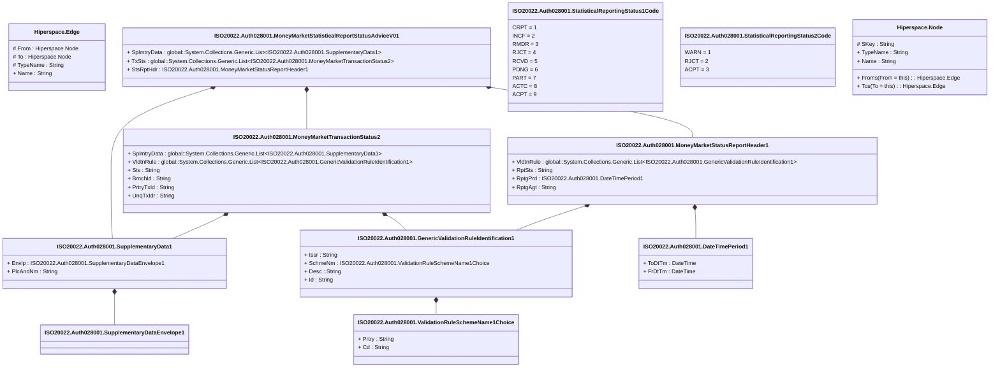

# auth.028.001.01

> The tables below contain descriptions of the members of each Element. 
> The first column indicates the type of the member:
> A ‘#’ indicates that the field is a key to the element, and a ‘+’ indicates that the field is a value.
> The ‘*’ column contains a description for the element member.  
> The ‘@’ column contains any properties for the member.
> The ‘=’ column contains calculated values; or in the case of an enum, the serialized value.

---

## View Hiperspace.Edge
edge between nodes

| |Name|Type|*|@|=|
|-|-|-|-|-|-|
|#|From|Hiperspace.Node||||
|#|To|Hiperspace.Node||||
|#|TypeName|String||||
|+|Name|String||||

---

## Value ISO20022.Auth028001.DateTimePeriod1

| |Name|Type|*|@|=|
|-|-|-|-|-|-|
|+|ToDtTm|DateTime||XmlElement()||
|+|FrDtTm|DateTime||XmlElement()||
||Validation|Some(String)||XmlIgnore(), JsonIgnore()|""|

---

## Type ISO20022.Auth028001.Document

| |Name|Type|*|@|=|
|-|-|-|-|-|-|
|+|MnyMktSttstclRptStsAdvc|ISO20022.Auth028001.MoneyMarketStatisticalReportStatusAdviceV01||XmlElement()||
||Validation|Some(String)||XmlIgnore(), JsonIgnore()|validation(validElement(MnyMktSttstclRptStsAdvc))|

---

## Value ISO20022.Auth028001.GenericValidationRuleIdentification1

| |Name|Type|*|@|=|
|-|-|-|-|-|-|
|+|Issr|String||XmlElement()||
|+|SchmeNm|ISO20022.Auth028001.ValidationRuleSchemeName1Choice||XmlElement()||
|+|Desc|String||XmlElement()||
|+|Id|String||XmlElement()||
||Validation|Some(String)||XmlIgnore(), JsonIgnore()|validation(validElement(SchmeNm))|

---

## Aspect ISO20022.Auth028001.MoneyMarketStatisticalReportStatusAdviceV01

| |Name|Type|*|@|=|
|-|-|-|-|-|-|
|+|SplmtryData|global::System.Collections.Generic.List<ISO20022.Auth028001.SupplementaryData1>||XmlElement()||
|+|TxSts|global::System.Collections.Generic.List<ISO20022.Auth028001.MoneyMarketTransactionStatus2>||XmlElement()||
|+|StsRptHdr|ISO20022.Auth028001.MoneyMarketStatusReportHeader1||XmlElement()||
||Validation|Some(String)||XmlIgnore(), JsonIgnore()|validation(validList("""SplmtryData""",SplmtryData),validElement(SplmtryData),validList("""TxSts""",TxSts),validElement(TxSts),validElement(StsRptHdr))|

---

## Value ISO20022.Auth028001.MoneyMarketStatusReportHeader1

| |Name|Type|*|@|=|
|-|-|-|-|-|-|
|+|VldtnRule|global::System.Collections.Generic.List<ISO20022.Auth028001.GenericValidationRuleIdentification1>||XmlElement()||
|+|RptSts|String||XmlElement()||
|+|RptgPrd|ISO20022.Auth028001.DateTimePeriod1||XmlElement()||
|+|RptgAgt|String||XmlElement()||
||Validation|Some(String)||XmlIgnore(), JsonIgnore()|validation(validList("""VldtnRule""",VldtnRule),validElement(VldtnRule),validElement(RptgPrd),validPattern("""RptgAgt""",RptgAgt,"""[A-Z0-9]{18,18}[0-9]{2,2}"""))|

---

## Value ISO20022.Auth028001.MoneyMarketTransactionStatus2

| |Name|Type|*|@|=|
|-|-|-|-|-|-|
|+|SplmtryData|global::System.Collections.Generic.List<ISO20022.Auth028001.SupplementaryData1>||XmlElement()||
|+|VldtnRule|global::System.Collections.Generic.List<ISO20022.Auth028001.GenericValidationRuleIdentification1>||XmlElement()||
|+|Sts|String||XmlElement()||
|+|BrnchId|String||XmlElement()||
|+|PrtryTxId|String||XmlElement()||
|+|UnqTxIdr|String||XmlElement()||
||Validation|Some(String)||XmlIgnore(), JsonIgnore()|validation(validList("""SplmtryData""",SplmtryData),validElement(SplmtryData),validList("""VldtnRule""",VldtnRule),validElement(VldtnRule),validPattern("""BrnchId""",BrnchId,"""[A-Z0-9]{18,18}[0-9]{2,2}"""))|

---

## Enum ISO20022.Auth028001.StatisticalReportingStatus1Code

| |Name|Type|*|@|=|
|-|-|-|-|-|-|
||CRPT|Int32||XmlEnum("""CRPT""")|1|
||INCF|Int32||XmlEnum("""INCF""")|2|
||RMDR|Int32||XmlEnum("""RMDR""")|3|
||RJCT|Int32||XmlEnum("""RJCT""")|4|
||RCVD|Int32||XmlEnum("""RCVD""")|5|
||PDNG|Int32||XmlEnum("""PDNG""")|6|
||PART|Int32||XmlEnum("""PART""")|7|
||ACTC|Int32||XmlEnum("""ACTC""")|8|
||ACPT|Int32||XmlEnum("""ACPT""")|9|

---

## Enum ISO20022.Auth028001.StatisticalReportingStatus2Code

| |Name|Type|*|@|=|
|-|-|-|-|-|-|
||WARN|Int32||XmlEnum("""WARN""")|1|
||RJCT|Int32||XmlEnum("""RJCT""")|2|
||ACPT|Int32||XmlEnum("""ACPT""")|3|

---

## Value ISO20022.Auth028001.SupplementaryData1

| |Name|Type|*|@|=|
|-|-|-|-|-|-|
|+|Envlp|ISO20022.Auth028001.SupplementaryDataEnvelope1||XmlElement()||
|+|PlcAndNm|String||XmlElement()||
||Validation|Some(String)||XmlIgnore(), JsonIgnore()|validation(validElement(Envlp))|

---

## Value ISO20022.Auth028001.SupplementaryDataEnvelope1

| |Name|Type|*|@|=|
|-|-|-|-|-|-|
||Validation|Some(String)||XmlIgnore(), JsonIgnore()|""|

---

## Value ISO20022.Auth028001.ValidationRuleSchemeName1Choice

| |Name|Type|*|@|=|
|-|-|-|-|-|-|
|+|Prtry|String||XmlElement()||
|+|Cd|String||XmlElement()||
||Validation|Some(String)||XmlIgnore(), JsonIgnore()|validation(validChoice(Prtry,Cd))|

---

## View Hiperspace.Node
node in a graph view of data

| |Name|Type|*|@|=|
|-|-|-|-|-|-|
|#|SKey|String||||
|+|TypeName|String||||
|+|Name|String||||
||Froms|Hiperspace.Edge|||From = this|
||Tos|Hiperspace.Edge|||To = this|

