# auth.031.001.01

```mermaid
classDiagram
    class Hiperspace.Edge {
        # From  : Hiperspace.Node
        # To  : Hiperspace.Node
        # TypeName  : String
        + Name  : String
    }
    class ISO20022.Auth031001.FinancialInstrumentReportingStatusAdviceV01 {
        + SplmtryData  : global::System.Collections.Generic.List~ISO20022.Auth031001.SupplementaryData1~
        + StsAdvc  : global::System.Collections.Generic.List~ISO20022.Auth031001.MessageReportHeader4~
    }
    ISO20022.Auth031001.FinancialInstrumentReportingStatusAdviceV01 *-- ISO20022.Auth031001.SupplementaryData1
    ISO20022.Auth031001.FinancialInstrumentReportingStatusAdviceV01 *-- ISO20022.Auth031001.MessageReportHeader4
    class ISO20022.Auth031001.GenericValidationRuleIdentification1 {
        + Issr  : String
        + SchmeNm  : ISO20022.Auth031001.ValidationRuleSchemeName1Choice
        + Desc  : String
        + Id  : String
    }
    ISO20022.Auth031001.GenericValidationRuleIdentification1 *-- ISO20022.Auth031001.ValidationRuleSchemeName1Choice
    class ISO20022.Auth031001.MessageReportHeader4 {
        + SplmtryData  : global::System.Collections.Generic.List~ISO20022.Auth031001.SupplementaryData1~
        + RcrdSts  : global::System.Collections.Generic.List~ISO20022.Auth031001.StatusReportRecord3~
        + MsgSts  : ISO20022.Auth031001.StatusAdviceReport3
        + MsgRptIdr  : String
    }
    ISO20022.Auth031001.MessageReportHeader4 *-- ISO20022.Auth031001.SupplementaryData1
    ISO20022.Auth031001.MessageReportHeader4 *-- ISO20022.Auth031001.StatusReportRecord3
    ISO20022.Auth031001.MessageReportHeader4 *-- ISO20022.Auth031001.StatusAdviceReport3
    class ISO20022.Auth031001.NumberOfRecordsPerStatus1 {
        + DtldSts  : String
        + DtldNbOfRcrds  : String
    }
    class ISO20022.Auth031001.OriginalReportStatistics3 {
        + NbOfRcrdsPerSts  : global::System.Collections.Generic.List~ISO20022.Auth031001.NumberOfRecordsPerStatus1~
        + TtlNbOfRcrds  : String
    }
    ISO20022.Auth031001.OriginalReportStatistics3 *-- ISO20022.Auth031001.NumberOfRecordsPerStatus1
    class ISO20022.Auth031001.ReportingMessageStatus1Code {
        CRPT = 1
        INCF = 2
        WARN = 3
        RMDR = 4
        RJCT = 5
        RCVD = 6
        PART = 7
        ACTC = 8
        ACPT = 9
    }
    class ISO20022.Auth031001.ReportingRecordStatus1Code {
        WARN = 1
        RJPD = 2
        RJCT = 3
        RCVD = 4
        PDNG = 5
        ACPD = 6
        ACPT = 7
    }
    class ISO20022.Auth031001.StatusAdviceReport3 {
        + Sttstcs  : ISO20022.Auth031001.OriginalReportStatistics3
        + MsgDt  : DateTime
        + VldtnRule  : global::System.Collections.Generic.List~ISO20022.Auth031001.GenericValidationRuleIdentification1~
        + Sts  : String
    }
    ISO20022.Auth031001.StatusAdviceReport3 *-- ISO20022.Auth031001.OriginalReportStatistics3
    ISO20022.Auth031001.StatusAdviceReport3 *-- ISO20022.Auth031001.GenericValidationRuleIdentification1
    class ISO20022.Auth031001.StatusReportRecord3 {
        + SplmtryData  : global::System.Collections.Generic.List~ISO20022.Auth031001.SupplementaryData1~
        + VldtnRule  : global::System.Collections.Generic.List~ISO20022.Auth031001.GenericValidationRuleIdentification1~
        + Sts  : String
        + OrgnlRcrdId  : String
    }
    ISO20022.Auth031001.StatusReportRecord3 *-- ISO20022.Auth031001.SupplementaryData1
    ISO20022.Auth031001.StatusReportRecord3 *-- ISO20022.Auth031001.GenericValidationRuleIdentification1
    class ISO20022.Auth031001.SupplementaryData1 {
        + Envlp  : ISO20022.Auth031001.SupplementaryDataEnvelope1
        + PlcAndNm  : String
    }
    ISO20022.Auth031001.SupplementaryData1 *-- ISO20022.Auth031001.SupplementaryDataEnvelope1
    class ISO20022.Auth031001.SupplementaryDataEnvelope1 {
    }
    class ISO20022.Auth031001.ValidationRuleSchemeName1Choice {
        + Prtry  : String
        + Cd  : String
    }
    class Hiperspace.Node {
        # SKey  : String
        + TypeName  : String
        + Name  : String
        + Froms (From = this) : Hiperspace.Edge
        + Tos (To = this) : Hiperspace.Edge
    }
```

> The tables below contain descriptions of the members of each Element. 
> The first column indicates the type of the member:
> A ‘#’ indicates that the field is a key to the element, and a ‘+’ indicates that the field is a value.
> The ‘*’ column contains a description for the element member.  
> The ‘@’ column contains any properties for the member.
> The ‘=’ column contains calculated values; or in the case of an enum, the serialized value.

---

## View Hiperspace.Edge
edge between nodes

| |Name|Type|*|@|=|
|-|-|-|-|-|-|
|#|From|Hiperspace.Node||||
|#|To|Hiperspace.Node||||
|#|TypeName|String||||
|+|Name|String||||

---

## Type ISO20022.Auth031001.Document

| |Name|Type|*|@|=|
|-|-|-|-|-|-|
|+|FinInstrmRptgStsAdvc|ISO20022.Auth031001.FinancialInstrumentReportingStatusAdviceV01||XmlElement()||
||Validation|Some(String)||XmlIgnore(), JsonIgnore()|validation(validElement(FinInstrmRptgStsAdvc))|

---

## Aspect ISO20022.Auth031001.FinancialInstrumentReportingStatusAdviceV01

| |Name|Type|*|@|=|
|-|-|-|-|-|-|
|+|SplmtryData|global::System.Collections.Generic.List<ISO20022.Auth031001.SupplementaryData1>||XmlElement()||
|+|StsAdvc|global::System.Collections.Generic.List<ISO20022.Auth031001.MessageReportHeader4>||XmlElement()||
||Validation|Some(String)||XmlIgnore(), JsonIgnore()|validation(validList("""SplmtryData""",SplmtryData),validElement(SplmtryData),validRequired("""StsAdvc""",StsAdvc),validList("""StsAdvc""",StsAdvc),validElement(StsAdvc))|

---

## Value ISO20022.Auth031001.GenericValidationRuleIdentification1

| |Name|Type|*|@|=|
|-|-|-|-|-|-|
|+|Issr|String||XmlElement()||
|+|SchmeNm|ISO20022.Auth031001.ValidationRuleSchemeName1Choice||XmlElement()||
|+|Desc|String||XmlElement()||
|+|Id|String||XmlElement()||
||Validation|Some(String)||XmlIgnore(), JsonIgnore()|validation(validElement(SchmeNm))|

---

## Value ISO20022.Auth031001.MessageReportHeader4

| |Name|Type|*|@|=|
|-|-|-|-|-|-|
|+|SplmtryData|global::System.Collections.Generic.List<ISO20022.Auth031001.SupplementaryData1>||XmlElement()||
|+|RcrdSts|global::System.Collections.Generic.List<ISO20022.Auth031001.StatusReportRecord3>||XmlElement()||
|+|MsgSts|ISO20022.Auth031001.StatusAdviceReport3||XmlElement()||
|+|MsgRptIdr|String||XmlElement()||
||Validation|Some(String)||XmlIgnore(), JsonIgnore()|validation(validList("""SplmtryData""",SplmtryData),validElement(SplmtryData),validList("""RcrdSts""",RcrdSts),validElement(RcrdSts),validElement(MsgSts))|

---

## Value ISO20022.Auth031001.NumberOfRecordsPerStatus1

| |Name|Type|*|@|=|
|-|-|-|-|-|-|
|+|DtldSts|String||XmlElement()||
|+|DtldNbOfRcrds|String||XmlElement()||
||Validation|Some(String)||XmlIgnore(), JsonIgnore()|validation(validPattern("""DtldNbOfRcrds""",DtldNbOfRcrds,"""[0-9]{1,15}"""))|

---

## Value ISO20022.Auth031001.OriginalReportStatistics3

| |Name|Type|*|@|=|
|-|-|-|-|-|-|
|+|NbOfRcrdsPerSts|global::System.Collections.Generic.List<ISO20022.Auth031001.NumberOfRecordsPerStatus1>||XmlElement()||
|+|TtlNbOfRcrds|String||XmlElement()||
||Validation|Some(String)||XmlIgnore(), JsonIgnore()|validation(validRequired("""NbOfRcrdsPerSts""",NbOfRcrdsPerSts),validList("""NbOfRcrdsPerSts""",NbOfRcrdsPerSts),validElement(NbOfRcrdsPerSts),validPattern("""TtlNbOfRcrds""",TtlNbOfRcrds,"""[0-9]{1,15}"""))|

---

## Enum ISO20022.Auth031001.ReportingMessageStatus1Code

| |Name|Type|*|@|=|
|-|-|-|-|-|-|
||CRPT|Int32||XmlEnum("""CRPT""")|1|
||INCF|Int32||XmlEnum("""INCF""")|2|
||WARN|Int32||XmlEnum("""WARN""")|3|
||RMDR|Int32||XmlEnum("""RMDR""")|4|
||RJCT|Int32||XmlEnum("""RJCT""")|5|
||RCVD|Int32||XmlEnum("""RCVD""")|6|
||PART|Int32||XmlEnum("""PART""")|7|
||ACTC|Int32||XmlEnum("""ACTC""")|8|
||ACPT|Int32||XmlEnum("""ACPT""")|9|

---

## Enum ISO20022.Auth031001.ReportingRecordStatus1Code

| |Name|Type|*|@|=|
|-|-|-|-|-|-|
||WARN|Int32||XmlEnum("""WARN""")|1|
||RJPD|Int32||XmlEnum("""RJPD""")|2|
||RJCT|Int32||XmlEnum("""RJCT""")|3|
||RCVD|Int32||XmlEnum("""RCVD""")|4|
||PDNG|Int32||XmlEnum("""PDNG""")|5|
||ACPD|Int32||XmlEnum("""ACPD""")|6|
||ACPT|Int32||XmlEnum("""ACPT""")|7|

---

## Value ISO20022.Auth031001.StatusAdviceReport3

| |Name|Type|*|@|=|
|-|-|-|-|-|-|
|+|Sttstcs|ISO20022.Auth031001.OriginalReportStatistics3||XmlElement()||
|+|MsgDt|DateTime||XmlElement()||
|+|VldtnRule|global::System.Collections.Generic.List<ISO20022.Auth031001.GenericValidationRuleIdentification1>||XmlElement()||
|+|Sts|String||XmlElement()||
||Validation|Some(String)||XmlIgnore(), JsonIgnore()|validation(validElement(Sttstcs),validList("""VldtnRule""",VldtnRule),validElement(VldtnRule))|

---

## Value ISO20022.Auth031001.StatusReportRecord3

| |Name|Type|*|@|=|
|-|-|-|-|-|-|
|+|SplmtryData|global::System.Collections.Generic.List<ISO20022.Auth031001.SupplementaryData1>||XmlElement()||
|+|VldtnRule|global::System.Collections.Generic.List<ISO20022.Auth031001.GenericValidationRuleIdentification1>||XmlElement()||
|+|Sts|String||XmlElement()||
|+|OrgnlRcrdId|String||XmlElement()||
||Validation|Some(String)||XmlIgnore(), JsonIgnore()|validation(validList("""SplmtryData""",SplmtryData),validElement(SplmtryData),validList("""VldtnRule""",VldtnRule),validElement(VldtnRule))|

---

## Value ISO20022.Auth031001.SupplementaryData1

| |Name|Type|*|@|=|
|-|-|-|-|-|-|
|+|Envlp|ISO20022.Auth031001.SupplementaryDataEnvelope1||XmlElement()||
|+|PlcAndNm|String||XmlElement()||
||Validation|Some(String)||XmlIgnore(), JsonIgnore()|validation(validElement(Envlp))|

---

## Value ISO20022.Auth031001.SupplementaryDataEnvelope1

| |Name|Type|*|@|=|
|-|-|-|-|-|-|
||Validation|Some(String)||XmlIgnore(), JsonIgnore()|""|

---

## Value ISO20022.Auth031001.ValidationRuleSchemeName1Choice

| |Name|Type|*|@|=|
|-|-|-|-|-|-|
|+|Prtry|String||XmlElement()||
|+|Cd|String||XmlElement()||
||Validation|Some(String)||XmlIgnore(), JsonIgnore()|validation(validChoice(Prtry,Cd))|

---

## View Hiperspace.Node
node in a graph view of data

| |Name|Type|*|@|=|
|-|-|-|-|-|-|
|#|SKey|String||||
|+|TypeName|String||||
|+|Name|String||||
||Froms|Hiperspace.Edge|||From = this|
||Tos|Hiperspace.Edge|||To = this|

