# auth.033.001.03

```mermaid
classDiagram
    class Hiperspace.Edge {
        # From  : Hiperspace.Node
        # To  : Hiperspace.Node
        # TypeName  : String
        + Name  : String
    }
    class ISO20022.Auth033001.AssetClassSubProductType19Code {
        NDLV = 1
        DLVR = 2
    }
    class ISO20022.Auth033001.BenchmarkCurveName2Code {
        BBSW = 1
        BUBO = 2
        CDOR = 3
        CIBO = 4
        EONA = 5
        EONS = 6
        EURI = 7
        EUUS = 8
        EUCH = 9
        FUSW = 10
        GCFR = 11
        ISDA = 12
        JIBA = 13
        LIBI = 14
        LIBO = 15
        MOSP = 16
        MAAA = 17
        NIBO = 18
        PFAN = 19
        PRBO = 20
        STBO = 21
        SWAP = 22
        TLBO = 23
        TIBO = 24
        TREA = 25
        WIBO = 26
    }
    class ISO20022.Auth033001.BenchmarkCurveName5Choice {
        + Nm  : String
        + Indx  : String
    }
    class ISO20022.Auth033001.BondDerivative2 {
        + IssncDt  : DateTime
        + MtrtyDt  : DateTime
        + Issr  : String
    }
    class ISO20022.Auth033001.BondType1Code {
        OTHR = 1
        CVDB = 2
        CRPB = 3
        CVTB = 4
        OEPB = 5
        EUSB = 6
    }
    class ISO20022.Auth033001.CommodityDerivative2Choice {
        + Nrgy  : ISO20022.Auth033001.CommodityDerivative6
        + Frght  : ISO20022.Auth033001.CommodityDerivative5
    }
    ISO20022.Auth033001.CommodityDerivative2Choice *-- ISO20022.Auth033001.CommodityDerivative6
    ISO20022.Auth033001.CommodityDerivative2Choice *-- ISO20022.Auth033001.CommodityDerivative5
    class ISO20022.Auth033001.CommodityDerivative4 {
        + NtnlCcy  : String
        + ClssSpcfc  : ISO20022.Auth033001.CommodityDerivative2Choice
    }
    ISO20022.Auth033001.CommodityDerivative4 *-- ISO20022.Auth033001.CommodityDerivative2Choice
    class ISO20022.Auth033001.CommodityDerivative5 {
        + AvrgTmChrtr  : String
        + Sz  : String
    }
    class ISO20022.Auth033001.CommodityDerivative6 {
        + SttlmLctn  : String
    }
    class ISO20022.Auth033001.ContractForDifference2 {
        + NtnlCcy2  : String
        + NtnlCcy1  : String
        + UndrlygTp  : String
    }
    class ISO20022.Auth033001.CreditDefaultSwapDerivative5 {
        + UndrlygCdtDfltSwpIndx  : ISO20022.Auth033001.CreditDefaultSwapIndex3
        + UndrlygCdtDfltSwpId  : String
    }
    ISO20022.Auth033001.CreditDefaultSwapDerivative5 *-- ISO20022.Auth033001.CreditDefaultSwapIndex3
    class ISO20022.Auth033001.CreditDefaultSwapDerivative6 {
        + SnglNm  : ISO20022.Auth033001.CreditDefaultSwapSingleName2
        + OblgtnId  : String
        + UndrlygCdtDfltSwpId  : String
    }
    ISO20022.Auth033001.CreditDefaultSwapDerivative6 *-- ISO20022.Auth033001.CreditDefaultSwapSingleName2
    class ISO20022.Auth033001.CreditDefaultSwapIndex3 {
        + NtnlCcy  : String
        + NxtRollDt  : DateTime
        + RollMnth  : global::System.Collections.Generic.List~Decimal~
        + Vrsn  : Decimal
        + Srs  : Decimal
        + UndrlygIndxNm  : String
        + UndrlygIndxId  : String
    }
    class ISO20022.Auth033001.CreditDefaultSwapSingleName2 {
        + NtnlCcy  : String
        + RefPty  : ISO20022.Auth033001.DerivativePartyIdentification1Choice
        + SvrgnIssr  : String
    }
    ISO20022.Auth033001.CreditDefaultSwapSingleName2 *-- ISO20022.Auth033001.DerivativePartyIdentification1Choice
    class ISO20022.Auth033001.CreditDefaultSwapsDerivative4Choice {
        + CdtDfltSwpIndxDeriv  : ISO20022.Auth033001.CreditDefaultSwapDerivative5
        + SnglNmCdtDfltSwpDeriv  : ISO20022.Auth033001.CreditDefaultSwapDerivative6
        + CdtDfltSwpIndx  : ISO20022.Auth033001.CreditDefaultSwapIndex3
        + SnglNmCdtDfltSwp  : ISO20022.Auth033001.CreditDefaultSwapSingleName2
    }
    ISO20022.Auth033001.CreditDefaultSwapsDerivative4Choice *-- ISO20022.Auth033001.CreditDefaultSwapDerivative5
    ISO20022.Auth033001.CreditDefaultSwapsDerivative4Choice *-- ISO20022.Auth033001.CreditDefaultSwapDerivative6
    ISO20022.Auth033001.CreditDefaultSwapsDerivative4Choice *-- ISO20022.Auth033001.CreditDefaultSwapIndex3
    ISO20022.Auth033001.CreditDefaultSwapsDerivative4Choice *-- ISO20022.Auth033001.CreditDefaultSwapSingleName2
    class ISO20022.Auth033001.DebtInstrument5 {
        + IssncDt  : DateTime
        + Tp  : String
    }
    class ISO20022.Auth033001.Derivative3Choice {
        + EmssnAllwnc  : String
        + Cdt  : ISO20022.Auth033001.CreditDefaultSwapsDerivative4Choice
        + CtrctForDiff  : ISO20022.Auth033001.ContractForDifference2
        + Eqty  : ISO20022.Auth033001.EquityDerivative2
        + FX  : ISO20022.Auth033001.ForeignExchangeDerivative2
        + IntrstRate  : ISO20022.Auth033001.InterestRateDerivative5
        + Cmmdty  : ISO20022.Auth033001.CommodityDerivative4
    }
    ISO20022.Auth033001.Derivative3Choice *-- ISO20022.Auth033001.CreditDefaultSwapsDerivative4Choice
    ISO20022.Auth033001.Derivative3Choice *-- ISO20022.Auth033001.ContractForDifference2
    ISO20022.Auth033001.Derivative3Choice *-- ISO20022.Auth033001.EquityDerivative2
    ISO20022.Auth033001.Derivative3Choice *-- ISO20022.Auth033001.ForeignExchangeDerivative2
    ISO20022.Auth033001.Derivative3Choice *-- ISO20022.Auth033001.InterestRateDerivative5
    ISO20022.Auth033001.Derivative3Choice *-- ISO20022.Auth033001.CommodityDerivative4
    class ISO20022.Auth033001.DerivativePartyIdentification1Choice {
        + LEI  : String
        + CtrySubDvsn  : String
        + Ctry  : String
    }
    class ISO20022.Auth033001.EmissionAllowanceProductType1Code {
        OTHR = 1
        CERE = 2
        ERUE = 3
        EUAE = 4
        EUAA = 5
    }
    class ISO20022.Auth033001.EquityDerivative2 {
        + Param  : String
        + UndrlygTp  : ISO20022.Auth033001.EquityDerivative3Choice
    }
    ISO20022.Auth033001.EquityDerivative2 *-- ISO20022.Auth033001.EquityDerivative3Choice
    class ISO20022.Auth033001.EquityDerivative3Choice {
        + Othr  : String
        + SnglNm  : String
        + Indx  : String
        + Bskt  : String
    }
    class ISO20022.Auth033001.EquityReturnParameter1Code {
        PRBP = 1
        PRVO = 2
        PRVA = 3
        PRDV = 4
    }
    class ISO20022.Auth033001.FinancialInstrumentContractType1Code {
        FWOS = 1
        FFAS = 2
        PSWP = 3
        FONS = 4
        SWPT = 5
        SWAP = 6
        SPDB = 7
        OTHR = 8
        OPTN = 9
        FUTR = 10
        FRAS = 11
        FORW = 12
        CFDS = 13
    }
    class ISO20022.Auth033001.FinancialInstrumentReportingNonEquityTransparencyDataReportV03 {
        + SplmtryData  : global::System.Collections.Generic.List~ISO20022.Auth033001.SupplementaryData1~
        + NonEqtyTrnsprncyData  : global::System.Collections.Generic.List~ISO20022.Auth033001.TransparencyDataReport21~
        + RptHdr  : ISO20022.Auth033001.SecuritiesMarketReportHeader1
    }
    ISO20022.Auth033001.FinancialInstrumentReportingNonEquityTransparencyDataReportV03 *-- ISO20022.Auth033001.SupplementaryData1
    ISO20022.Auth033001.FinancialInstrumentReportingNonEquityTransparencyDataReportV03 *-- ISO20022.Auth033001.TransparencyDataReport21
    ISO20022.Auth033001.FinancialInstrumentReportingNonEquityTransparencyDataReportV03 *-- ISO20022.Auth033001.SecuritiesMarketReportHeader1
    class ISO20022.Auth033001.FloatingInterestRate8 {
        + Term  : ISO20022.Auth033001.InterestRateContractTerm2
        + RefRate  : ISO20022.Auth033001.BenchmarkCurveName5Choice
    }
    ISO20022.Auth033001.FloatingInterestRate8 *-- ISO20022.Auth033001.InterestRateContractTerm2
    ISO20022.Auth033001.FloatingInterestRate8 *-- ISO20022.Auth033001.BenchmarkCurveName5Choice
    class ISO20022.Auth033001.ForeignExchangeDerivative2 {
        + CtrctSubTp  : String
    }
    class ISO20022.Auth033001.InflationIndex1Choice {
        + Nm  : String
        + ISIN  : String
    }
    class ISO20022.Auth033001.InterestRateContractTerm2 {
        + Val  : Decimal
        + Unit  : String
    }
    class ISO20022.Auth033001.InterestRateDerivative2Choice {
        + Othr  : String
        + SwpRltd  : String
    }
    class ISO20022.Auth033001.InterestRateDerivative5 {
        + IntrstRateRef  : ISO20022.Auth033001.FloatingInterestRate8
        + InfltnIndx  : ISO20022.Auth033001.InflationIndex1Choice
        + UndrlygSwpMtrtyDt  : DateTime
        + SwptnNtnlCcy  : String
        + UndrlygBd  : ISO20022.Auth033001.BondDerivative2
        + UndrlygTp  : ISO20022.Auth033001.InterestRateDerivative2Choice
    }
    ISO20022.Auth033001.InterestRateDerivative5 *-- ISO20022.Auth033001.FloatingInterestRate8
    ISO20022.Auth033001.InterestRateDerivative5 *-- ISO20022.Auth033001.InflationIndex1Choice
    ISO20022.Auth033001.InterestRateDerivative5 *-- ISO20022.Auth033001.BondDerivative2
    ISO20022.Auth033001.InterestRateDerivative5 *-- ISO20022.Auth033001.InterestRateDerivative2Choice
    class ISO20022.Auth033001.NonEquityInstrumentReportingClassification1Code {
        ETNS = 1
        ETCS = 2
        BOND = 3
        EMAL = 4
        DERV = 5
        SDRV = 6
        SFPS = 7
    }
    class ISO20022.Auth033001.Period2 {
        + ToDt  : DateTime
        + FrDt  : DateTime
    }
    class ISO20022.Auth033001.Period4Choice {
        + FrDtToDt  : ISO20022.Auth033001.Period2
        + ToDt  : DateTime
        + FrDt  : DateTime
        + Dt  : DateTime
    }
    ISO20022.Auth033001.Period4Choice *-- ISO20022.Auth033001.Period2
    class ISO20022.Auth033001.RateBasis1Code {
        YEAR = 1
        WEEK = 2
        MNTH = 3
        DAYS = 4
    }
    class ISO20022.Auth033001.SecuritiesMarketReportHeader1 {
        + SubmissnDtTm  : DateTime
        + RptgPrd  : ISO20022.Auth033001.Period4Choice
        + RptgNtty  : ISO20022.Auth033001.TradingVenueIdentification1Choice
    }
    ISO20022.Auth033001.SecuritiesMarketReportHeader1 *-- ISO20022.Auth033001.Period4Choice
    ISO20022.Auth033001.SecuritiesMarketReportHeader1 *-- ISO20022.Auth033001.TradingVenueIdentification1Choice
    class ISO20022.Auth033001.SupplementaryData1 {
        + Envlp  : ISO20022.Auth033001.SupplementaryDataEnvelope1
        + PlcAndNm  : String
    }
    ISO20022.Auth033001.SupplementaryData1 *-- ISO20022.Auth033001.SupplementaryDataEnvelope1
    class ISO20022.Auth033001.SupplementaryDataEnvelope1 {
    }
    class ISO20022.Auth033001.SwapType1Code {
        OSMC = 1
        IFSC = 2
        FFMC = 3
        FFSC = 4
        IFMC = 5
        XXMC = 6
        XXSC = 7
        XFMC = 8
        XFSC = 9
        OSSC = 10
    }
    class ISO20022.Auth033001.TradingVenue2Code {
        CTPS = 1
        APPA = 2
    }
    class ISO20022.Auth033001.TradingVenueIdentification1Choice {
        + Othr  : ISO20022.Auth033001.TradingVenueIdentification2
        + NtlCmptntAuthrty  : String
        + MktIdCd  : String
    }
    ISO20022.Auth033001.TradingVenueIdentification1Choice *-- ISO20022.Auth033001.TradingVenueIdentification2
    class ISO20022.Auth033001.TradingVenueIdentification2 {
        + Tp  : String
        + Id  : String
    }
    class ISO20022.Auth033001.TransparencyDataReport21 {
        + Deriv  : ISO20022.Auth033001.Derivative3Choice
        + EmssnAllwncTp  : String
        + Bd  : ISO20022.Auth033001.DebtInstrument5
        + DerivCtrctTp  : String
        + UndrlygInstrmAsstClss  : String
        + FinInstrmClssfctn  : String
        + MtrtyDt  : DateTime
        + RptgDt  : DateTime
        + TradgVn  : String
        + FullNm  : String
        + Id  : String
        + TechRcrdId  : String
    }
    ISO20022.Auth033001.TransparencyDataReport21 *-- ISO20022.Auth033001.Derivative3Choice
    ISO20022.Auth033001.TransparencyDataReport21 *-- ISO20022.Auth033001.DebtInstrument5
    class ISO20022.Auth033001.UnderlyingContractForDifferenceType3Code {
        OTHR = 1
        OPEQ = 2
        FTEQ = 3
        EQUI = 4
        EMAL = 5
        CURR = 6
        COMM = 7
        BOND = 8
    }
    class ISO20022.Auth033001.UnderlyingEquityType3Code {
        BSKT = 1
    }
    class ISO20022.Auth033001.UnderlyingEquityType4Code {
        VOLI = 1
        OTHR = 2
        DIVI = 3
        STIX = 4
    }
    class ISO20022.Auth033001.UnderlyingEquityType5Code {
        DVSE = 1
        SHRS = 2
        ETFS = 3
        OTHR = 4
    }
    class ISO20022.Auth033001.UnderlyingEquityType6Code {
        VOLI = 1
        STIX = 2
        DVSE = 3
        SHRS = 4
        OTHR = 5
        ETFS = 6
        DIVI = 7
        BSKT = 8
    }
    class ISO20022.Auth033001.UnderlyingInterestRateType3Code {
        IFUT = 1
        INTR = 2
        BNDF = 3
        BOND = 4
    }
    class Hiperspace.Node {
        # SKey  : String
        + TypeName  : String
        + Name  : String
        + Froms (From = this) : Hiperspace.Edge
        + Tos (To = this) : Hiperspace.Edge
    }
```

> The tables below contain descriptions of the members of each Element. 
> The first column indicates the type of the member:
> A ‘#’ indicates that the field is a key to the element, and a ‘+’ indicates that the field is a value.
> The ‘*’ column contains a description for the element member.  
> The ‘@’ column contains any properties for the member.
> The ‘=’ column contains calculated values; or in the case of an enum, the serialized value.

---

## View Hiperspace.Edge
edge between nodes

| |Name|Type|*|@|=|
|-|-|-|-|-|-|
|#|From|Hiperspace.Node||||
|#|To|Hiperspace.Node||||
|#|TypeName|String||||
|+|Name|String||||

---

## Enum ISO20022.Auth033001.AssetClassSubProductType19Code

| |Name|Type|*|@|=|
|-|-|-|-|-|-|
||NDLV|Int32||XmlEnum("""NDLV""")|1|
||DLVR|Int32||XmlEnum("""DLVR""")|2|

---

## Enum ISO20022.Auth033001.BenchmarkCurveName2Code

| |Name|Type|*|@|=|
|-|-|-|-|-|-|
||BBSW|Int32||XmlEnum("""BBSW""")|1|
||BUBO|Int32||XmlEnum("""BUBO""")|2|
||CDOR|Int32||XmlEnum("""CDOR""")|3|
||CIBO|Int32||XmlEnum("""CIBO""")|4|
||EONA|Int32||XmlEnum("""EONA""")|5|
||EONS|Int32||XmlEnum("""EONS""")|6|
||EURI|Int32||XmlEnum("""EURI""")|7|
||EUUS|Int32||XmlEnum("""EUUS""")|8|
||EUCH|Int32||XmlEnum("""EUCH""")|9|
||FUSW|Int32||XmlEnum("""FUSW""")|10|
||GCFR|Int32||XmlEnum("""GCFR""")|11|
||ISDA|Int32||XmlEnum("""ISDA""")|12|
||JIBA|Int32||XmlEnum("""JIBA""")|13|
||LIBI|Int32||XmlEnum("""LIBI""")|14|
||LIBO|Int32||XmlEnum("""LIBO""")|15|
||MOSP|Int32||XmlEnum("""MOSP""")|16|
||MAAA|Int32||XmlEnum("""MAAA""")|17|
||NIBO|Int32||XmlEnum("""NIBO""")|18|
||PFAN|Int32||XmlEnum("""PFAN""")|19|
||PRBO|Int32||XmlEnum("""PRBO""")|20|
||STBO|Int32||XmlEnum("""STBO""")|21|
||SWAP|Int32||XmlEnum("""SWAP""")|22|
||TLBO|Int32||XmlEnum("""TLBO""")|23|
||TIBO|Int32||XmlEnum("""TIBO""")|24|
||TREA|Int32||XmlEnum("""TREA""")|25|
||WIBO|Int32||XmlEnum("""WIBO""")|26|

---

## Value ISO20022.Auth033001.BenchmarkCurveName5Choice

| |Name|Type|*|@|=|
|-|-|-|-|-|-|
|+|Nm|String||XmlElement()||
|+|Indx|String||XmlElement()||
||Validation|Some(String)||XmlIgnore(), JsonIgnore()|validation(validChoice(Nm,Indx))|

---

## Value ISO20022.Auth033001.BondDerivative2

| |Name|Type|*|@|=|
|-|-|-|-|-|-|
|+|IssncDt|DateTime||XmlElement()||
|+|MtrtyDt|DateTime||XmlElement()||
|+|Issr|String||XmlElement()||
||Validation|Some(String)||XmlIgnore(), JsonIgnore()|validation(validPattern("""Issr""",Issr,"""[A-Z0-9]{18,18}[0-9]{2,2}"""))|

---

## Enum ISO20022.Auth033001.BondType1Code

| |Name|Type|*|@|=|
|-|-|-|-|-|-|
||OTHR|Int32||XmlEnum("""OTHR""")|1|
||CVDB|Int32||XmlEnum("""CVDB""")|2|
||CRPB|Int32||XmlEnum("""CRPB""")|3|
||CVTB|Int32||XmlEnum("""CVTB""")|4|
||OEPB|Int32||XmlEnum("""OEPB""")|5|
||EUSB|Int32||XmlEnum("""EUSB""")|6|

---

## Value ISO20022.Auth033001.CommodityDerivative2Choice

| |Name|Type|*|@|=|
|-|-|-|-|-|-|
|+|Nrgy|ISO20022.Auth033001.CommodityDerivative6||XmlElement()||
|+|Frght|ISO20022.Auth033001.CommodityDerivative5||XmlElement()||
||Validation|Some(String)||XmlIgnore(), JsonIgnore()|validation(validElement(Nrgy),validElement(Frght),validChoice(Nrgy,Frght))|

---

## Value ISO20022.Auth033001.CommodityDerivative4

| |Name|Type|*|@|=|
|-|-|-|-|-|-|
|+|NtnlCcy|String||XmlElement()||
|+|ClssSpcfc|ISO20022.Auth033001.CommodityDerivative2Choice||XmlElement()||
||Validation|Some(String)||XmlIgnore(), JsonIgnore()|validation(validPattern("""NtnlCcy""",NtnlCcy,"""[A-Z]{3,3}"""),validElement(ClssSpcfc))|

---

## Value ISO20022.Auth033001.CommodityDerivative5

| |Name|Type|*|@|=|
|-|-|-|-|-|-|
|+|AvrgTmChrtr|String||XmlElement()||
|+|Sz|String||XmlElement()||
||Validation|Some(String)||XmlIgnore(), JsonIgnore()|""|

---

## Value ISO20022.Auth033001.CommodityDerivative6

| |Name|Type|*|@|=|
|-|-|-|-|-|-|
|+|SttlmLctn|String||XmlElement()||
||Validation|Some(String)||XmlIgnore(), JsonIgnore()|""|

---

## Value ISO20022.Auth033001.ContractForDifference2

| |Name|Type|*|@|=|
|-|-|-|-|-|-|
|+|NtnlCcy2|String||XmlElement()||
|+|NtnlCcy1|String||XmlElement()||
|+|UndrlygTp|String||XmlElement()||
||Validation|Some(String)||XmlIgnore(), JsonIgnore()|validation(validPattern("""NtnlCcy2""",NtnlCcy2,"""[A-Z]{3,3}"""),validPattern("""NtnlCcy1""",NtnlCcy1,"""[A-Z]{3,3}"""))|

---

## Value ISO20022.Auth033001.CreditDefaultSwapDerivative5

| |Name|Type|*|@|=|
|-|-|-|-|-|-|
|+|UndrlygCdtDfltSwpIndx|ISO20022.Auth033001.CreditDefaultSwapIndex3||XmlElement()||
|+|UndrlygCdtDfltSwpId|String||XmlElement()||
||Validation|Some(String)||XmlIgnore(), JsonIgnore()|validation(validElement(UndrlygCdtDfltSwpIndx),validPattern("""UndrlygCdtDfltSwpId""",UndrlygCdtDfltSwpId,"""[A-Z]{2,2}[A-Z0-9]{9,9}[0-9]{1,1}"""))|

---

## Value ISO20022.Auth033001.CreditDefaultSwapDerivative6

| |Name|Type|*|@|=|
|-|-|-|-|-|-|
|+|SnglNm|ISO20022.Auth033001.CreditDefaultSwapSingleName2||XmlElement()||
|+|OblgtnId|String||XmlElement()||
|+|UndrlygCdtDfltSwpId|String||XmlElement()||
||Validation|Some(String)||XmlIgnore(), JsonIgnore()|validation(validElement(SnglNm),validPattern("""OblgtnId""",OblgtnId,"""[A-Z]{2,2}[A-Z0-9]{9,9}[0-9]{1,1}"""),validPattern("""UndrlygCdtDfltSwpId""",UndrlygCdtDfltSwpId,"""[A-Z]{2,2}[A-Z0-9]{9,9}[0-9]{1,1}"""))|

---

## Value ISO20022.Auth033001.CreditDefaultSwapIndex3

| |Name|Type|*|@|=|
|-|-|-|-|-|-|
|+|NtnlCcy|String||XmlElement()||
|+|NxtRollDt|DateTime||XmlElement()||
|+|RollMnth|global::System.Collections.Generic.List<Decimal>||XmlElement()||
|+|Vrsn|Decimal||XmlElement()||
|+|Srs|Decimal||XmlElement()||
|+|UndrlygIndxNm|String||XmlElement()||
|+|UndrlygIndxId|String||XmlElement()||
||Validation|Some(String)||XmlIgnore(), JsonIgnore()|validation(validPattern("""NtnlCcy""",NtnlCcy,"""[A-Z]{3,3}"""),validPattern("""RollMnth""",RollMnth,"""[0-9]{2,2}"""),validListMax("""RollMnth""",RollMnth,12),validPattern("""UndrlygIndxId""",UndrlygIndxId,"""[A-Z]{2,2}[A-Z0-9]{9,9}[0-9]{1,1}"""))|

---

## Value ISO20022.Auth033001.CreditDefaultSwapSingleName2

| |Name|Type|*|@|=|
|-|-|-|-|-|-|
|+|NtnlCcy|String||XmlElement()||
|+|RefPty|ISO20022.Auth033001.DerivativePartyIdentification1Choice||XmlElement()||
|+|SvrgnIssr|String||XmlElement()||
||Validation|Some(String)||XmlIgnore(), JsonIgnore()|validation(validPattern("""NtnlCcy""",NtnlCcy,"""[A-Z]{3,3}"""),validElement(RefPty))|

---

## Value ISO20022.Auth033001.CreditDefaultSwapsDerivative4Choice

| |Name|Type|*|@|=|
|-|-|-|-|-|-|
|+|CdtDfltSwpIndxDeriv|ISO20022.Auth033001.CreditDefaultSwapDerivative5||XmlElement()||
|+|SnglNmCdtDfltSwpDeriv|ISO20022.Auth033001.CreditDefaultSwapDerivative6||XmlElement()||
|+|CdtDfltSwpIndx|ISO20022.Auth033001.CreditDefaultSwapIndex3||XmlElement()||
|+|SnglNmCdtDfltSwp|ISO20022.Auth033001.CreditDefaultSwapSingleName2||XmlElement()||
||Validation|Some(String)||XmlIgnore(), JsonIgnore()|validation(validElement(CdtDfltSwpIndxDeriv),validElement(SnglNmCdtDfltSwpDeriv),validElement(CdtDfltSwpIndx),validElement(SnglNmCdtDfltSwp),validChoice(CdtDfltSwpIndxDeriv,SnglNmCdtDfltSwpDeriv,CdtDfltSwpIndx,SnglNmCdtDfltSwp))|

---

## Value ISO20022.Auth033001.DebtInstrument5

| |Name|Type|*|@|=|
|-|-|-|-|-|-|
|+|IssncDt|DateTime||XmlElement()||
|+|Tp|String||XmlElement()||
||Validation|Some(String)||XmlIgnore(), JsonIgnore()|""|

---

## Value ISO20022.Auth033001.Derivative3Choice

| |Name|Type|*|@|=|
|-|-|-|-|-|-|
|+|EmssnAllwnc|String||XmlElement()||
|+|Cdt|ISO20022.Auth033001.CreditDefaultSwapsDerivative4Choice||XmlElement()||
|+|CtrctForDiff|ISO20022.Auth033001.ContractForDifference2||XmlElement()||
|+|Eqty|ISO20022.Auth033001.EquityDerivative2||XmlElement()||
|+|FX|ISO20022.Auth033001.ForeignExchangeDerivative2||XmlElement()||
|+|IntrstRate|ISO20022.Auth033001.InterestRateDerivative5||XmlElement()||
|+|Cmmdty|ISO20022.Auth033001.CommodityDerivative4||XmlElement()||
||Validation|Some(String)||XmlIgnore(), JsonIgnore()|validation(validElement(Cdt),validElement(CtrctForDiff),validElement(Eqty),validElement(FX),validElement(IntrstRate),validElement(Cmmdty),validChoice(EmssnAllwnc,Cdt,CtrctForDiff,Eqty,FX,IntrstRate,Cmmdty))|

---

## Value ISO20022.Auth033001.DerivativePartyIdentification1Choice

| |Name|Type|*|@|=|
|-|-|-|-|-|-|
|+|LEI|String||XmlElement()||
|+|CtrySubDvsn|String||XmlElement()||
|+|Ctry|String||XmlElement()||
||Validation|Some(String)||XmlIgnore(), JsonIgnore()|validation(validPattern("""LEI""",LEI,"""[A-Z0-9]{18,18}[0-9]{2,2}"""),validPattern("""CtrySubDvsn""",CtrySubDvsn,"""[A-Z]{2,2}\-[0-9A-Z]{1,3}"""),validPattern("""Ctry""",Ctry,"""[A-Z]{2,2}"""),validChoice(LEI,CtrySubDvsn,Ctry))|

---

## Type ISO20022.Auth033001.Document

| |Name|Type|*|@|=|
|-|-|-|-|-|-|
|+|FinInstrmRptgNonEqtyTrnsprncyDataRpt|ISO20022.Auth033001.FinancialInstrumentReportingNonEquityTransparencyDataReportV03||XmlElement()||
||Validation|Some(String)||XmlIgnore(), JsonIgnore()|validation(validElement(FinInstrmRptgNonEqtyTrnsprncyDataRpt))|

---

## Enum ISO20022.Auth033001.EmissionAllowanceProductType1Code

| |Name|Type|*|@|=|
|-|-|-|-|-|-|
||OTHR|Int32||XmlEnum("""OTHR""")|1|
||CERE|Int32||XmlEnum("""CERE""")|2|
||ERUE|Int32||XmlEnum("""ERUE""")|3|
||EUAE|Int32||XmlEnum("""EUAE""")|4|
||EUAA|Int32||XmlEnum("""EUAA""")|5|

---

## Value ISO20022.Auth033001.EquityDerivative2

| |Name|Type|*|@|=|
|-|-|-|-|-|-|
|+|Param|String||XmlElement()||
|+|UndrlygTp|ISO20022.Auth033001.EquityDerivative3Choice||XmlElement()||
||Validation|Some(String)||XmlIgnore(), JsonIgnore()|validation(validElement(UndrlygTp))|

---

## Value ISO20022.Auth033001.EquityDerivative3Choice

| |Name|Type|*|@|=|
|-|-|-|-|-|-|
|+|Othr|String||XmlElement()||
|+|SnglNm|String||XmlElement()||
|+|Indx|String||XmlElement()||
|+|Bskt|String||XmlElement()||
||Validation|Some(String)||XmlIgnore(), JsonIgnore()|validation(validChoice(Othr,SnglNm,Indx,Bskt))|

---

## Enum ISO20022.Auth033001.EquityReturnParameter1Code

| |Name|Type|*|@|=|
|-|-|-|-|-|-|
||PRBP|Int32||XmlEnum("""PRBP""")|1|
||PRVO|Int32||XmlEnum("""PRVO""")|2|
||PRVA|Int32||XmlEnum("""PRVA""")|3|
||PRDV|Int32||XmlEnum("""PRDV""")|4|

---

## Enum ISO20022.Auth033001.FinancialInstrumentContractType1Code

| |Name|Type|*|@|=|
|-|-|-|-|-|-|
||FWOS|Int32||XmlEnum("""FWOS""")|1|
||FFAS|Int32||XmlEnum("""FFAS""")|2|
||PSWP|Int32||XmlEnum("""PSWP""")|3|
||FONS|Int32||XmlEnum("""FONS""")|4|
||SWPT|Int32||XmlEnum("""SWPT""")|5|
||SWAP|Int32||XmlEnum("""SWAP""")|6|
||SPDB|Int32||XmlEnum("""SPDB""")|7|
||OTHR|Int32||XmlEnum("""OTHR""")|8|
||OPTN|Int32||XmlEnum("""OPTN""")|9|
||FUTR|Int32||XmlEnum("""FUTR""")|10|
||FRAS|Int32||XmlEnum("""FRAS""")|11|
||FORW|Int32||XmlEnum("""FORW""")|12|
||CFDS|Int32||XmlEnum("""CFDS""")|13|

---

## Aspect ISO20022.Auth033001.FinancialInstrumentReportingNonEquityTransparencyDataReportV03

| |Name|Type|*|@|=|
|-|-|-|-|-|-|
|+|SplmtryData|global::System.Collections.Generic.List<ISO20022.Auth033001.SupplementaryData1>||XmlElement()||
|+|NonEqtyTrnsprncyData|global::System.Collections.Generic.List<ISO20022.Auth033001.TransparencyDataReport21>||XmlElement()||
|+|RptHdr|ISO20022.Auth033001.SecuritiesMarketReportHeader1||XmlElement()||
||Validation|Some(String)||XmlIgnore(), JsonIgnore()|validation(validList("""SplmtryData""",SplmtryData),validElement(SplmtryData),validRequired("""NonEqtyTrnsprncyData""",NonEqtyTrnsprncyData),validList("""NonEqtyTrnsprncyData""",NonEqtyTrnsprncyData),validElement(NonEqtyTrnsprncyData),validElement(RptHdr))|

---

## Value ISO20022.Auth033001.FloatingInterestRate8

| |Name|Type|*|@|=|
|-|-|-|-|-|-|
|+|Term|ISO20022.Auth033001.InterestRateContractTerm2||XmlElement()||
|+|RefRate|ISO20022.Auth033001.BenchmarkCurveName5Choice||XmlElement()||
||Validation|Some(String)||XmlIgnore(), JsonIgnore()|validation(validElement(Term),validElement(RefRate))|

---

## Value ISO20022.Auth033001.ForeignExchangeDerivative2

| |Name|Type|*|@|=|
|-|-|-|-|-|-|
|+|CtrctSubTp|String||XmlElement()||
||Validation|Some(String)||XmlIgnore(), JsonIgnore()|""|

---

## Value ISO20022.Auth033001.InflationIndex1Choice

| |Name|Type|*|@|=|
|-|-|-|-|-|-|
|+|Nm|String||XmlElement()||
|+|ISIN|String||XmlElement()||
||Validation|Some(String)||XmlIgnore(), JsonIgnore()|validation(validPattern("""ISIN""",ISIN,"""[A-Z]{2,2}[A-Z0-9]{9,9}[0-9]{1,1}"""),validChoice(Nm,ISIN))|

---

## Value ISO20022.Auth033001.InterestRateContractTerm2

| |Name|Type|*|@|=|
|-|-|-|-|-|-|
|+|Val|Decimal||XmlElement()||
|+|Unit|String||XmlElement()||
||Validation|Some(String)||XmlIgnore(), JsonIgnore()|""|

---

## Value ISO20022.Auth033001.InterestRateDerivative2Choice

| |Name|Type|*|@|=|
|-|-|-|-|-|-|
|+|Othr|String||XmlElement()||
|+|SwpRltd|String||XmlElement()||
||Validation|Some(String)||XmlIgnore(), JsonIgnore()|validation(validChoice(Othr,SwpRltd))|

---

## Value ISO20022.Auth033001.InterestRateDerivative5

| |Name|Type|*|@|=|
|-|-|-|-|-|-|
|+|IntrstRateRef|ISO20022.Auth033001.FloatingInterestRate8||XmlElement()||
|+|InfltnIndx|ISO20022.Auth033001.InflationIndex1Choice||XmlElement()||
|+|UndrlygSwpMtrtyDt|DateTime||XmlElement()||
|+|SwptnNtnlCcy|String||XmlElement()||
|+|UndrlygBd|ISO20022.Auth033001.BondDerivative2||XmlElement()||
|+|UndrlygTp|ISO20022.Auth033001.InterestRateDerivative2Choice||XmlElement()||
||Validation|Some(String)||XmlIgnore(), JsonIgnore()|validation(validElement(IntrstRateRef),validElement(InfltnIndx),validPattern("""SwptnNtnlCcy""",SwptnNtnlCcy,"""[A-Z]{3,3}"""),validElement(UndrlygBd),validElement(UndrlygTp))|

---

## Enum ISO20022.Auth033001.NonEquityInstrumentReportingClassification1Code

| |Name|Type|*|@|=|
|-|-|-|-|-|-|
||ETNS|Int32||XmlEnum("""ETNS""")|1|
||ETCS|Int32||XmlEnum("""ETCS""")|2|
||BOND|Int32||XmlEnum("""BOND""")|3|
||EMAL|Int32||XmlEnum("""EMAL""")|4|
||DERV|Int32||XmlEnum("""DERV""")|5|
||SDRV|Int32||XmlEnum("""SDRV""")|6|
||SFPS|Int32||XmlEnum("""SFPS""")|7|

---

## Value ISO20022.Auth033001.Period2

| |Name|Type|*|@|=|
|-|-|-|-|-|-|
|+|ToDt|DateTime||XmlElement()||
|+|FrDt|DateTime||XmlElement()||
||Validation|Some(String)||XmlIgnore(), JsonIgnore()|""|

---

## Value ISO20022.Auth033001.Period4Choice

| |Name|Type|*|@|=|
|-|-|-|-|-|-|
|+|FrDtToDt|ISO20022.Auth033001.Period2||XmlElement()||
|+|ToDt|DateTime||XmlElement()||
|+|FrDt|DateTime||XmlElement()||
|+|Dt|DateTime||XmlElement()||
||Validation|Some(String)||XmlIgnore(), JsonIgnore()|validation(validElement(FrDtToDt),validChoice(FrDtToDt,ToDt,FrDt,Dt))|

---

## Enum ISO20022.Auth033001.RateBasis1Code

| |Name|Type|*|@|=|
|-|-|-|-|-|-|
||YEAR|Int32||XmlEnum("""YEAR""")|1|
||WEEK|Int32||XmlEnum("""WEEK""")|2|
||MNTH|Int32||XmlEnum("""MNTH""")|3|
||DAYS|Int32||XmlEnum("""DAYS""")|4|

---

## Value ISO20022.Auth033001.SecuritiesMarketReportHeader1

| |Name|Type|*|@|=|
|-|-|-|-|-|-|
|+|SubmissnDtTm|DateTime||XmlElement()||
|+|RptgPrd|ISO20022.Auth033001.Period4Choice||XmlElement()||
|+|RptgNtty|ISO20022.Auth033001.TradingVenueIdentification1Choice||XmlElement()||
||Validation|Some(String)||XmlIgnore(), JsonIgnore()|validation(validElement(RptgPrd),validElement(RptgNtty))|

---

## Value ISO20022.Auth033001.SupplementaryData1

| |Name|Type|*|@|=|
|-|-|-|-|-|-|
|+|Envlp|ISO20022.Auth033001.SupplementaryDataEnvelope1||XmlElement()||
|+|PlcAndNm|String||XmlElement()||
||Validation|Some(String)||XmlIgnore(), JsonIgnore()|validation(validElement(Envlp))|

---

## Value ISO20022.Auth033001.SupplementaryDataEnvelope1

| |Name|Type|*|@|=|
|-|-|-|-|-|-|
||Validation|Some(String)||XmlIgnore(), JsonIgnore()|""|

---

## Enum ISO20022.Auth033001.SwapType1Code

| |Name|Type|*|@|=|
|-|-|-|-|-|-|
||OSMC|Int32||XmlEnum("""OSMC""")|1|
||IFSC|Int32||XmlEnum("""IFSC""")|2|
||FFMC|Int32||XmlEnum("""FFMC""")|3|
||FFSC|Int32||XmlEnum("""FFSC""")|4|
||IFMC|Int32||XmlEnum("""IFMC""")|5|
||XXMC|Int32||XmlEnum("""XXMC""")|6|
||XXSC|Int32||XmlEnum("""XXSC""")|7|
||XFMC|Int32||XmlEnum("""XFMC""")|8|
||XFSC|Int32||XmlEnum("""XFSC""")|9|
||OSSC|Int32||XmlEnum("""OSSC""")|10|

---

## Enum ISO20022.Auth033001.TradingVenue2Code

| |Name|Type|*|@|=|
|-|-|-|-|-|-|
||CTPS|Int32||XmlEnum("""CTPS""")|1|
||APPA|Int32||XmlEnum("""APPA""")|2|

---

## Value ISO20022.Auth033001.TradingVenueIdentification1Choice

| |Name|Type|*|@|=|
|-|-|-|-|-|-|
|+|Othr|ISO20022.Auth033001.TradingVenueIdentification2||XmlElement()||
|+|NtlCmptntAuthrty|String||XmlElement()||
|+|MktIdCd|String||XmlElement()||
||Validation|Some(String)||XmlIgnore(), JsonIgnore()|validation(validElement(Othr),validPattern("""NtlCmptntAuthrty""",NtlCmptntAuthrty,"""[A-Z]{2,2}"""),validPattern("""MktIdCd""",MktIdCd,"""[A-Z0-9]{4,4}"""),validChoice(Othr,NtlCmptntAuthrty,MktIdCd))|

---

## Value ISO20022.Auth033001.TradingVenueIdentification2

| |Name|Type|*|@|=|
|-|-|-|-|-|-|
|+|Tp|String||XmlElement()||
|+|Id|String||XmlElement()||
||Validation|Some(String)||XmlIgnore(), JsonIgnore()|""|

---

## Value ISO20022.Auth033001.TransparencyDataReport21

| |Name|Type|*|@|=|
|-|-|-|-|-|-|
|+|Deriv|ISO20022.Auth033001.Derivative3Choice||XmlElement()||
|+|EmssnAllwncTp|String||XmlElement()||
|+|Bd|ISO20022.Auth033001.DebtInstrument5||XmlElement()||
|+|DerivCtrctTp|String||XmlElement()||
|+|UndrlygInstrmAsstClss|String||XmlElement()||
|+|FinInstrmClssfctn|String||XmlElement()||
|+|MtrtyDt|DateTime||XmlElement()||
|+|RptgDt|DateTime||XmlElement()||
|+|TradgVn|String||XmlElement()||
|+|FullNm|String||XmlElement()||
|+|Id|String||XmlElement()||
|+|TechRcrdId|String||XmlElement()||
||Validation|Some(String)||XmlIgnore(), JsonIgnore()|validation(validElement(Deriv),validElement(Bd),validPattern("""TradgVn""",TradgVn,"""[A-Z0-9]{4,4}"""),validPattern("""Id""",Id,"""[A-Z]{2,2}[A-Z0-9]{9,9}[0-9]{1,1}"""))|

---

## Enum ISO20022.Auth033001.UnderlyingContractForDifferenceType3Code

| |Name|Type|*|@|=|
|-|-|-|-|-|-|
||OTHR|Int32||XmlEnum("""OTHR""")|1|
||OPEQ|Int32||XmlEnum("""OPEQ""")|2|
||FTEQ|Int32||XmlEnum("""FTEQ""")|3|
||EQUI|Int32||XmlEnum("""EQUI""")|4|
||EMAL|Int32||XmlEnum("""EMAL""")|5|
||CURR|Int32||XmlEnum("""CURR""")|6|
||COMM|Int32||XmlEnum("""COMM""")|7|
||BOND|Int32||XmlEnum("""BOND""")|8|

---

## Enum ISO20022.Auth033001.UnderlyingEquityType3Code

| |Name|Type|*|@|=|
|-|-|-|-|-|-|
||BSKT|Int32||XmlEnum("""BSKT""")|1|

---

## Enum ISO20022.Auth033001.UnderlyingEquityType4Code

| |Name|Type|*|@|=|
|-|-|-|-|-|-|
||VOLI|Int32||XmlEnum("""VOLI""")|1|
||OTHR|Int32||XmlEnum("""OTHR""")|2|
||DIVI|Int32||XmlEnum("""DIVI""")|3|
||STIX|Int32||XmlEnum("""STIX""")|4|

---

## Enum ISO20022.Auth033001.UnderlyingEquityType5Code

| |Name|Type|*|@|=|
|-|-|-|-|-|-|
||DVSE|Int32||XmlEnum("""DVSE""")|1|
||SHRS|Int32||XmlEnum("""SHRS""")|2|
||ETFS|Int32||XmlEnum("""ETFS""")|3|
||OTHR|Int32||XmlEnum("""OTHR""")|4|

---

## Enum ISO20022.Auth033001.UnderlyingEquityType6Code

| |Name|Type|*|@|=|
|-|-|-|-|-|-|
||VOLI|Int32||XmlEnum("""VOLI""")|1|
||STIX|Int32||XmlEnum("""STIX""")|2|
||DVSE|Int32||XmlEnum("""DVSE""")|3|
||SHRS|Int32||XmlEnum("""SHRS""")|4|
||OTHR|Int32||XmlEnum("""OTHR""")|5|
||ETFS|Int32||XmlEnum("""ETFS""")|6|
||DIVI|Int32||XmlEnum("""DIVI""")|7|
||BSKT|Int32||XmlEnum("""BSKT""")|8|

---

## Enum ISO20022.Auth033001.UnderlyingInterestRateType3Code

| |Name|Type|*|@|=|
|-|-|-|-|-|-|
||IFUT|Int32||XmlEnum("""IFUT""")|1|
||INTR|Int32||XmlEnum("""INTR""")|2|
||BNDF|Int32||XmlEnum("""BNDF""")|3|
||BOND|Int32||XmlEnum("""BOND""")|4|

---

## View Hiperspace.Node
node in a graph view of data

| |Name|Type|*|@|=|
|-|-|-|-|-|-|
|#|SKey|String||||
|+|TypeName|String||||
|+|Name|String||||
||Froms|Hiperspace.Edge|||From = this|
||Tos|Hiperspace.Edge|||To = this|

