# auth.034.001.01

```mermaid
classDiagram
    class Hiperspace.Edge {
        # From  : Hiperspace.Node
        # To  : Hiperspace.Node
        # TypeName  : String
        + Name  : String
    }
    class ISO20022.Auth034001.AdditionalInformation1 {
        + InfVal  : String
        + InfTp  : ISO20022.Auth034001.InformationType1Choice
    }
    ISO20022.Auth034001.AdditionalInformation1 *-- ISO20022.Auth034001.InformationType1Choice
    class ISO20022.Auth034001.AddressType2Code {
        DLVY = 1
        MLTO = 2
        BIZZ = 3
        HOME = 4
        PBOX = 5
        ADDR = 6
    }
    class ISO20022.Auth034001.BinaryFile1 {
        + InclBinryObjct  : String
        + CharSet  : String
        + NcodgTp  : String
        + MIMETp  : String
    }
    class ISO20022.Auth034001.ContactDetails2 {
        + Othr  : String
        + EmailAdr  : String
        + FaxNb  : String
        + MobNb  : String
        + PhneNb  : String
        + Nm  : String
        + NmPrfx  : String
    }
    class ISO20022.Auth034001.CreditorReferenceInformation2 {
        + Ref  : String
        + Tp  : ISO20022.Auth034001.CreditorReferenceType2
    }
    ISO20022.Auth034001.CreditorReferenceInformation2 *-- ISO20022.Auth034001.CreditorReferenceType2
    class ISO20022.Auth034001.CreditorReferenceType1Choice {
        + Prtry  : String
        + Cd  : String
    }
    class ISO20022.Auth034001.CreditorReferenceType2 {
        + Issr  : String
        + CdOrPrtry  : ISO20022.Auth034001.CreditorReferenceType1Choice
    }
    ISO20022.Auth034001.CreditorReferenceType2 *-- ISO20022.Auth034001.CreditorReferenceType1Choice
    class ISO20022.Auth034001.CurrencyAndAmount {
        + Value  : Decimal
        + Ccy  : String
    }
    class ISO20022.Auth034001.CurrencyReference3 {
        + XchgRateInf  : global::System.Collections.Generic.List~ISO20022.Auth034001.ExchangeRateInformation1~
        + SrcCcy  : String
        + TrgtCcy  : String
    }
    ISO20022.Auth034001.CurrencyReference3 *-- ISO20022.Auth034001.ExchangeRateInformation1
    class ISO20022.Auth034001.DateAndPlaceOfBirth {
        + CtryOfBirth  : String
        + CityOfBirth  : String
        + PrvcOfBirth  : String
        + BirthDt  : DateTime
    }
    class ISO20022.Auth034001.DocumentGeneralInformation2 {
        + AttchdBinryFile  : global::System.Collections.Generic.List~ISO20022.Auth034001.BinaryFile1~
        + URL  : String
        + IsseDt  : DateTime
        + SndrRcvrSeqId  : String
        + DocNb  : String
        + DocTp  : String
    }
    ISO20022.Auth034001.DocumentGeneralInformation2 *-- ISO20022.Auth034001.BinaryFile1
    class ISO20022.Auth034001.DocumentType3Code {
        SCOR = 1
        PUOR = 2
        DISP = 3
        FXDR = 4
        RPIN = 5
        RADM = 6
    }
    class ISO20022.Auth034001.EarlyPayment1 {
        + DuePyblAmtWthEarlyPmt  : ISO20022.Auth034001.CurrencyAndAmount
        + EarlyPmtTaxTtl  : ISO20022.Auth034001.CurrencyAndAmount
        + EarlyPmtTaxSpcfctn  : global::System.Collections.Generic.List~ISO20022.Auth034001.EarlyPaymentsVAT1~
        + DscntAmt  : ISO20022.Auth034001.CurrencyAndAmount
        + DscntPct  : Decimal
        + EarlyPmtDt  : DateTime
    }
    ISO20022.Auth034001.EarlyPayment1 *-- ISO20022.Auth034001.CurrencyAndAmount
    ISO20022.Auth034001.EarlyPayment1 *-- ISO20022.Auth034001.CurrencyAndAmount
    ISO20022.Auth034001.EarlyPayment1 *-- ISO20022.Auth034001.EarlyPaymentsVAT1
    ISO20022.Auth034001.EarlyPayment1 *-- ISO20022.Auth034001.CurrencyAndAmount
    class ISO20022.Auth034001.EarlyPaymentsVAT1 {
        + DscntTaxAmt  : ISO20022.Auth034001.CurrencyAndAmount
        + DscntTaxTp  : String
        + TaxRate  : Decimal
    }
    ISO20022.Auth034001.EarlyPaymentsVAT1 *-- ISO20022.Auth034001.CurrencyAndAmount
    class ISO20022.Auth034001.ExchangeRateInformation1 {
        + CtrctId  : String
        + RateTp  : String
        + XchgRate  : Decimal
    }
    class ISO20022.Auth034001.ExchangeRateType1Code {
        AGRD = 1
        SALE = 2
        SPOT = 3
    }
    class ISO20022.Auth034001.GenericOrganisationIdentification1 {
        + Issr  : String
        + SchmeNm  : ISO20022.Auth034001.OrganisationIdentificationSchemeName1Choice
        + Id  : String
    }
    ISO20022.Auth034001.GenericOrganisationIdentification1 *-- ISO20022.Auth034001.OrganisationIdentificationSchemeName1Choice
    class ISO20022.Auth034001.GenericPersonIdentification1 {
        + Issr  : String
        + SchmeNm  : ISO20022.Auth034001.PersonIdentificationSchemeName1Choice
        + Id  : String
    }
    ISO20022.Auth034001.GenericPersonIdentification1 *-- ISO20022.Auth034001.PersonIdentificationSchemeName1Choice
    class ISO20022.Auth034001.GroupHeader69 {
        + LangCd  : String
        + BuyrTaxRprtv  : ISO20022.Auth034001.PartyIdentification116
        + SellrTaxRprtv  : ISO20022.Auth034001.PartyIdentification116
        + OrgnlId  : String
        + TaxRptPurp  : String
        + RptCtgy  : String
        + IssdDt  : DateTime
        + Id  : String
    }
    ISO20022.Auth034001.GroupHeader69 *-- ISO20022.Auth034001.PartyIdentification116
    ISO20022.Auth034001.GroupHeader69 *-- ISO20022.Auth034001.PartyIdentification116
    class ISO20022.Auth034001.InformationType1Choice {
        + Prtry  : String
        + Cd  : String
    }
    class ISO20022.Auth034001.InformationType1Code {
        RELY = 1
        INST = 2
    }
    class ISO20022.Auth034001.InvoiceTaxReportV01 {
        + SplmtryData  : global::System.Collections.Generic.List~ISO20022.Auth034001.SupplementaryData1~
        + TaxRpt  : global::System.Collections.Generic.List~ISO20022.Auth034001.TaxReport1~
        + InvcTaxRptHdr  : ISO20022.Auth034001.TaxReportHeader1
    }
    ISO20022.Auth034001.InvoiceTaxReportV01 *-- ISO20022.Auth034001.SupplementaryData1
    ISO20022.Auth034001.InvoiceTaxReportV01 *-- ISO20022.Auth034001.TaxReport1
    ISO20022.Auth034001.InvoiceTaxReportV01 *-- ISO20022.Auth034001.TaxReportHeader1
    class ISO20022.Auth034001.LegalOrganisation1 {
        + Nm  : String
        + Id  : String
    }
    class ISO20022.Auth034001.MessageIdentification1 {
        + CreDtTm  : DateTime
        + Id  : String
    }
    class ISO20022.Auth034001.NamePrefix1Code {
        MADM = 1
        MISS = 2
        MIST = 3
        DOCT = 4
    }
    class ISO20022.Auth034001.OrganisationIdentification28 {
        + CtctDtls  : ISO20022.Auth034001.ContactDetails2
        + CtryOfRes  : String
        + Id  : ISO20022.Auth034001.OrganisationIdentification8
        + PstlAdr  : ISO20022.Auth034001.PostalAddress6
        + Nm  : String
    }
    ISO20022.Auth034001.OrganisationIdentification28 *-- ISO20022.Auth034001.ContactDetails2
    ISO20022.Auth034001.OrganisationIdentification28 *-- ISO20022.Auth034001.OrganisationIdentification8
    ISO20022.Auth034001.OrganisationIdentification28 *-- ISO20022.Auth034001.PostalAddress6
    class ISO20022.Auth034001.OrganisationIdentification8 {
        + Othr  : global::System.Collections.Generic.List~ISO20022.Auth034001.GenericOrganisationIdentification1~
        + AnyBIC  : String
    }
    ISO20022.Auth034001.OrganisationIdentification8 *-- ISO20022.Auth034001.GenericOrganisationIdentification1
    class ISO20022.Auth034001.OrganisationIdentificationSchemeName1Choice {
        + Prtry  : String
        + Cd  : String
    }
    class ISO20022.Auth034001.Party11Choice {
        + PrvtId  : ISO20022.Auth034001.PersonIdentification5
        + OrgId  : ISO20022.Auth034001.OrganisationIdentification8
    }
    ISO20022.Auth034001.Party11Choice *-- ISO20022.Auth034001.PersonIdentification5
    ISO20022.Auth034001.Party11Choice *-- ISO20022.Auth034001.OrganisationIdentification8
    class ISO20022.Auth034001.PartyIdentification116 {
        + TaxPty  : ISO20022.Auth034001.TaxParty1
        + LglOrg  : ISO20022.Auth034001.LegalOrganisation1
        + PtyId  : ISO20022.Auth034001.OrganisationIdentification28
    }
    ISO20022.Auth034001.PartyIdentification116 *-- ISO20022.Auth034001.TaxParty1
    ISO20022.Auth034001.PartyIdentification116 *-- ISO20022.Auth034001.LegalOrganisation1
    ISO20022.Auth034001.PartyIdentification116 *-- ISO20022.Auth034001.OrganisationIdentification28
    class ISO20022.Auth034001.PartyIdentification43 {
        + CtctDtls  : ISO20022.Auth034001.ContactDetails2
        + CtryOfRes  : String
        + Id  : ISO20022.Auth034001.Party11Choice
        + PstlAdr  : ISO20022.Auth034001.PostalAddress6
        + Nm  : String
    }
    ISO20022.Auth034001.PartyIdentification43 *-- ISO20022.Auth034001.ContactDetails2
    ISO20022.Auth034001.PartyIdentification43 *-- ISO20022.Auth034001.Party11Choice
    ISO20022.Auth034001.PartyIdentification43 *-- ISO20022.Auth034001.PostalAddress6
    class ISO20022.Auth034001.PartyIdentification72 {
        + TaxPty  : ISO20022.Auth034001.TaxParty1
        + LglOrg  : ISO20022.Auth034001.LegalOrganisation1
        + PtyId  : ISO20022.Auth034001.PartyIdentification43
    }
    ISO20022.Auth034001.PartyIdentification72 *-- ISO20022.Auth034001.TaxParty1
    ISO20022.Auth034001.PartyIdentification72 *-- ISO20022.Auth034001.LegalOrganisation1
    ISO20022.Auth034001.PartyIdentification72 *-- ISO20022.Auth034001.PartyIdentification43
    class ISO20022.Auth034001.Period2 {
        + ToDt  : DateTime
        + FrDt  : DateTime
    }
    class ISO20022.Auth034001.PersonIdentification5 {
        + Othr  : global::System.Collections.Generic.List~ISO20022.Auth034001.GenericPersonIdentification1~
        + DtAndPlcOfBirth  : ISO20022.Auth034001.DateAndPlaceOfBirth
    }
    ISO20022.Auth034001.PersonIdentification5 *-- ISO20022.Auth034001.GenericPersonIdentification1
    ISO20022.Auth034001.PersonIdentification5 *-- ISO20022.Auth034001.DateAndPlaceOfBirth
    class ISO20022.Auth034001.PersonIdentificationSchemeName1Choice {
        + Prtry  : String
        + Cd  : String
    }
    class ISO20022.Auth034001.PostalAddress6 {
        + AdrLine  : global::System.Collections.Generic.List~String~
        + Ctry  : String
        + CtrySubDvsn  : String
        + TwnNm  : String
        + PstCd  : String
        + BldgNb  : String
        + StrtNm  : String
        + SubDept  : String
        + Dept  : String
        + AdrTp  : String
    }
    class ISO20022.Auth034001.SettlementSubTotalCalculatedTax2 {
        + TaxCcyXchg  : ISO20022.Auth034001.CurrencyReference3
        + XmptnRsnTxt  : String
        + XmptnRsnCd  : String
        + ClctdAmt  : global::System.Collections.Generic.List~ISO20022.Auth034001.CurrencyAndAmount~
        + BsisAmt  : global::System.Collections.Generic.List~ISO20022.Auth034001.CurrencyAndAmount~
        + ClctdRate  : Decimal
        + TpCd  : String
    }
    ISO20022.Auth034001.SettlementSubTotalCalculatedTax2 *-- ISO20022.Auth034001.CurrencyReference3
    ISO20022.Auth034001.SettlementSubTotalCalculatedTax2 *-- ISO20022.Auth034001.CurrencyAndAmount
    ISO20022.Auth034001.SettlementSubTotalCalculatedTax2 *-- ISO20022.Auth034001.CurrencyAndAmount
    class ISO20022.Auth034001.SupplementaryData1 {
        + Envlp  : ISO20022.Auth034001.SupplementaryDataEnvelope1
        + PlcAndNm  : String
    }
    ISO20022.Auth034001.SupplementaryData1 *-- ISO20022.Auth034001.SupplementaryDataEnvelope1
    class ISO20022.Auth034001.SupplementaryDataEnvelope1 {
    }
    class ISO20022.Auth034001.TaxOrganisationIdentification1 {
        + CtctDtls  : ISO20022.Auth034001.ContactDetails2
        + PstlAdr  : ISO20022.Auth034001.PostalAddress6
        + Nm  : String
    }
    ISO20022.Auth034001.TaxOrganisationIdentification1 *-- ISO20022.Auth034001.ContactDetails2
    ISO20022.Auth034001.TaxOrganisationIdentification1 *-- ISO20022.Auth034001.PostalAddress6
    class ISO20022.Auth034001.TaxParty1 {
        + TaxTp  : String
        + RegnId  : String
        + TaxId  : String
    }
    class ISO20022.Auth034001.TaxReport1 {
        + SplmtryData  : global::System.Collections.Generic.List~ISO20022.Auth034001.SupplementaryData1~
        + AddtlRef  : global::System.Collections.Generic.List~ISO20022.Auth034001.DocumentGeneralInformation2~
        + AddtlInf  : global::System.Collections.Generic.List~ISO20022.Auth034001.AdditionalInformation1~
        + OthrPty  : global::System.Collections.Generic.List~ISO20022.Auth034001.PartyIdentification72~
        + TradSttlm  : ISO20022.Auth034001.TradeSettlement2
        + Buyr  : ISO20022.Auth034001.PartyIdentification72
        + Sellr  : ISO20022.Auth034001.PartyIdentification72
        + TaxRptHdr  : ISO20022.Auth034001.GroupHeader69
    }
    ISO20022.Auth034001.TaxReport1 *-- ISO20022.Auth034001.SupplementaryData1
    ISO20022.Auth034001.TaxReport1 *-- ISO20022.Auth034001.DocumentGeneralInformation2
    ISO20022.Auth034001.TaxReport1 *-- ISO20022.Auth034001.AdditionalInformation1
    ISO20022.Auth034001.TaxReport1 *-- ISO20022.Auth034001.PartyIdentification72
    ISO20022.Auth034001.TaxReport1 *-- ISO20022.Auth034001.TradeSettlement2
    ISO20022.Auth034001.TaxReport1 *-- ISO20022.Auth034001.PartyIdentification72
    ISO20022.Auth034001.TaxReport1 *-- ISO20022.Auth034001.PartyIdentification72
    ISO20022.Auth034001.TaxReport1 *-- ISO20022.Auth034001.GroupHeader69
    class ISO20022.Auth034001.TaxReportHeader1 {
        + TaxAuthrty  : global::System.Collections.Generic.List~ISO20022.Auth034001.TaxOrganisationIdentification1~
        + NbOfTaxRpts  : Decimal
        + MsgId  : ISO20022.Auth034001.MessageIdentification1
    }
    ISO20022.Auth034001.TaxReportHeader1 *-- ISO20022.Auth034001.TaxOrganisationIdentification1
    ISO20022.Auth034001.TaxReportHeader1 *-- ISO20022.Auth034001.MessageIdentification1
    class ISO20022.Auth034001.TradeSettlement2 {
        + EarlyPmts  : global::System.Collections.Generic.List~ISO20022.Auth034001.EarlyPayment1~
        + SubTtlClctdTax  : global::System.Collections.Generic.List~ISO20022.Auth034001.SettlementSubTotalCalculatedTax2~
        + XmptnRsn  : String
        + XmptnRsnCd  : String
        + TaxTtlAmt  : ISO20022.Auth034001.CurrencyAndAmount
        + BllgPrd  : ISO20022.Auth034001.Period2
        + DlvryDt  : DateTime
        + InvcCcyXchg  : ISO20022.Auth034001.CurrencyReference3
        + DuePyblAmt  : ISO20022.Auth034001.CurrencyAndAmount
        + DueDt  : DateTime
        + PmtRef  : ISO20022.Auth034001.CreditorReferenceInformation2
    }
    ISO20022.Auth034001.TradeSettlement2 *-- ISO20022.Auth034001.EarlyPayment1
    ISO20022.Auth034001.TradeSettlement2 *-- ISO20022.Auth034001.SettlementSubTotalCalculatedTax2
    ISO20022.Auth034001.TradeSettlement2 *-- ISO20022.Auth034001.CurrencyAndAmount
    ISO20022.Auth034001.TradeSettlement2 *-- ISO20022.Auth034001.Period2
    ISO20022.Auth034001.TradeSettlement2 *-- ISO20022.Auth034001.CurrencyReference3
    ISO20022.Auth034001.TradeSettlement2 *-- ISO20022.Auth034001.CurrencyAndAmount
    ISO20022.Auth034001.TradeSettlement2 *-- ISO20022.Auth034001.CreditorReferenceInformation2
    class Hiperspace.Node {
        # SKey  : String
        + TypeName  : String
        + Name  : String
        + Froms (From = this) : Hiperspace.Edge
        + Tos (To = this) : Hiperspace.Edge
    }
```

> The tables below contain descriptions of the members of each Element. 
> The first column indicates the type of the member:
> A ‘#’ indicates that the field is a key to the element, and a ‘+’ indicates that the field is a value.
> The ‘*’ column contains a description for the element member.  
> The ‘@’ column contains any properties for the member.
> The ‘=’ column contains calculated values; or in the case of an enum, the serialized value.

---

## View Hiperspace.Edge
edge between nodes

| |Name|Type|*|@|=|
|-|-|-|-|-|-|
|#|From|Hiperspace.Node||||
|#|To|Hiperspace.Node||||
|#|TypeName|String||||
|+|Name|String||||

---

## Value ISO20022.Auth034001.AdditionalInformation1

| |Name|Type|*|@|=|
|-|-|-|-|-|-|
|+|InfVal|String||XmlElement()||
|+|InfTp|ISO20022.Auth034001.InformationType1Choice||XmlElement()||
||Validation|Some(String)||XmlIgnore(), JsonIgnore()|validation(validElement(InfTp))|

---

## Enum ISO20022.Auth034001.AddressType2Code

| |Name|Type|*|@|=|
|-|-|-|-|-|-|
||DLVY|Int32||XmlEnum("""DLVY""")|1|
||MLTO|Int32||XmlEnum("""MLTO""")|2|
||BIZZ|Int32||XmlEnum("""BIZZ""")|3|
||HOME|Int32||XmlEnum("""HOME""")|4|
||PBOX|Int32||XmlEnum("""PBOX""")|5|
||ADDR|Int32||XmlEnum("""ADDR""")|6|

---

## Value ISO20022.Auth034001.BinaryFile1

| |Name|Type|*|@|=|
|-|-|-|-|-|-|
|+|InclBinryObjct|String||XmlElement()||
|+|CharSet|String||XmlElement()||
|+|NcodgTp|String||XmlElement()||
|+|MIMETp|String||XmlElement()||
||Validation|Some(String)||XmlIgnore(), JsonIgnore()|""|

---

## Value ISO20022.Auth034001.ContactDetails2

| |Name|Type|*|@|=|
|-|-|-|-|-|-|
|+|Othr|String||XmlElement()||
|+|EmailAdr|String||XmlElement()||
|+|FaxNb|String||XmlElement()||
|+|MobNb|String||XmlElement()||
|+|PhneNb|String||XmlElement()||
|+|Nm|String||XmlElement()||
|+|NmPrfx|String||XmlElement()||
||Validation|Some(String)||XmlIgnore(), JsonIgnore()|validation(validPattern("""FaxNb""",FaxNb,"""\+[0-9]{1,3}-[0-9()+\-]{1,30}"""),validPattern("""MobNb""",MobNb,"""\+[0-9]{1,3}-[0-9()+\-]{1,30}"""),validPattern("""PhneNb""",PhneNb,"""\+[0-9]{1,3}-[0-9()+\-]{1,30}"""))|

---

## Value ISO20022.Auth034001.CreditorReferenceInformation2

| |Name|Type|*|@|=|
|-|-|-|-|-|-|
|+|Ref|String||XmlElement()||
|+|Tp|ISO20022.Auth034001.CreditorReferenceType2||XmlElement()||
||Validation|Some(String)||XmlIgnore(), JsonIgnore()|validation(validElement(Tp))|

---

## Value ISO20022.Auth034001.CreditorReferenceType1Choice

| |Name|Type|*|@|=|
|-|-|-|-|-|-|
|+|Prtry|String||XmlElement()||
|+|Cd|String||XmlElement()||
||Validation|Some(String)||XmlIgnore(), JsonIgnore()|validation(validChoice(Prtry,Cd))|

---

## Value ISO20022.Auth034001.CreditorReferenceType2

| |Name|Type|*|@|=|
|-|-|-|-|-|-|
|+|Issr|String||XmlElement()||
|+|CdOrPrtry|ISO20022.Auth034001.CreditorReferenceType1Choice||XmlElement()||
||Validation|Some(String)||XmlIgnore(), JsonIgnore()|validation(validElement(CdOrPrtry))|

---

## Value ISO20022.Auth034001.CurrencyAndAmount

| |Name|Type|*|@|=|
|-|-|-|-|-|-|
|+|Value|Decimal||XmlElement()||
|+|Ccy|String||XmlAttribute()||
||Validation|Some(String)||XmlIgnore(), JsonIgnore()|validation(validRequired("""Value""",Value),validRequired("""Ccy""",Ccy),validPattern("""Ccy""",Ccy,"""[A-Z]{3,3}"""))|

---

## Value ISO20022.Auth034001.CurrencyReference3

| |Name|Type|*|@|=|
|-|-|-|-|-|-|
|+|XchgRateInf|global::System.Collections.Generic.List<ISO20022.Auth034001.ExchangeRateInformation1>||XmlElement()||
|+|SrcCcy|String||XmlElement()||
|+|TrgtCcy|String||XmlElement()||
||Validation|Some(String)||XmlIgnore(), JsonIgnore()|validation(validList("""XchgRateInf""",XchgRateInf),validElement(XchgRateInf),validPattern("""SrcCcy""",SrcCcy,"""[A-Z]{3,3}"""),validPattern("""TrgtCcy""",TrgtCcy,"""[A-Z]{3,3}"""))|

---

## Value ISO20022.Auth034001.DateAndPlaceOfBirth

| |Name|Type|*|@|=|
|-|-|-|-|-|-|
|+|CtryOfBirth|String||XmlElement()||
|+|CityOfBirth|String||XmlElement()||
|+|PrvcOfBirth|String||XmlElement()||
|+|BirthDt|DateTime||XmlElement()||
||Validation|Some(String)||XmlIgnore(), JsonIgnore()|validation(validPattern("""CtryOfBirth""",CtryOfBirth,"""[A-Z]{2,2}"""))|

---

## Type ISO20022.Auth034001.Document

| |Name|Type|*|@|=|
|-|-|-|-|-|-|
|+|InvcTaxRpt|ISO20022.Auth034001.InvoiceTaxReportV01||XmlElement()||
||Validation|Some(String)||XmlIgnore(), JsonIgnore()|validation(validElement(InvcTaxRpt))|

---

## Value ISO20022.Auth034001.DocumentGeneralInformation2

| |Name|Type|*|@|=|
|-|-|-|-|-|-|
|+|AttchdBinryFile|global::System.Collections.Generic.List<ISO20022.Auth034001.BinaryFile1>||XmlElement()||
|+|URL|String||XmlElement()||
|+|IsseDt|DateTime||XmlElement()||
|+|SndrRcvrSeqId|String||XmlElement()||
|+|DocNb|String||XmlElement()||
|+|DocTp|String||XmlElement()||
||Validation|Some(String)||XmlIgnore(), JsonIgnore()|validation(validList("""AttchdBinryFile""",AttchdBinryFile),validElement(AttchdBinryFile))|

---

## Enum ISO20022.Auth034001.DocumentType3Code

| |Name|Type|*|@|=|
|-|-|-|-|-|-|
||SCOR|Int32||XmlEnum("""SCOR""")|1|
||PUOR|Int32||XmlEnum("""PUOR""")|2|
||DISP|Int32||XmlEnum("""DISP""")|3|
||FXDR|Int32||XmlEnum("""FXDR""")|4|
||RPIN|Int32||XmlEnum("""RPIN""")|5|
||RADM|Int32||XmlEnum("""RADM""")|6|

---

## Value ISO20022.Auth034001.EarlyPayment1

| |Name|Type|*|@|=|
|-|-|-|-|-|-|
|+|DuePyblAmtWthEarlyPmt|ISO20022.Auth034001.CurrencyAndAmount||XmlElement()||
|+|EarlyPmtTaxTtl|ISO20022.Auth034001.CurrencyAndAmount||XmlElement()||
|+|EarlyPmtTaxSpcfctn|global::System.Collections.Generic.List<ISO20022.Auth034001.EarlyPaymentsVAT1>||XmlElement()||
|+|DscntAmt|ISO20022.Auth034001.CurrencyAndAmount||XmlElement()||
|+|DscntPct|Decimal||XmlElement()||
|+|EarlyPmtDt|DateTime||XmlElement()||
||Validation|Some(String)||XmlIgnore(), JsonIgnore()|validation(validElement(DuePyblAmtWthEarlyPmt),validElement(EarlyPmtTaxTtl),validList("""EarlyPmtTaxSpcfctn""",EarlyPmtTaxSpcfctn),validElement(EarlyPmtTaxSpcfctn),validElement(DscntAmt))|

---

## Value ISO20022.Auth034001.EarlyPaymentsVAT1

| |Name|Type|*|@|=|
|-|-|-|-|-|-|
|+|DscntTaxAmt|ISO20022.Auth034001.CurrencyAndAmount||XmlElement()||
|+|DscntTaxTp|String||XmlElement()||
|+|TaxRate|Decimal||XmlElement()||
||Validation|Some(String)||XmlIgnore(), JsonIgnore()|validation(validElement(DscntTaxAmt))|

---

## Value ISO20022.Auth034001.ExchangeRateInformation1

| |Name|Type|*|@|=|
|-|-|-|-|-|-|
|+|CtrctId|String||XmlElement()||
|+|RateTp|String||XmlElement()||
|+|XchgRate|Decimal||XmlElement()||
||Validation|Some(String)||XmlIgnore(), JsonIgnore()|""|

---

## Enum ISO20022.Auth034001.ExchangeRateType1Code

| |Name|Type|*|@|=|
|-|-|-|-|-|-|
||AGRD|Int32||XmlEnum("""AGRD""")|1|
||SALE|Int32||XmlEnum("""SALE""")|2|
||SPOT|Int32||XmlEnum("""SPOT""")|3|

---

## Value ISO20022.Auth034001.GenericOrganisationIdentification1

| |Name|Type|*|@|=|
|-|-|-|-|-|-|
|+|Issr|String||XmlElement()||
|+|SchmeNm|ISO20022.Auth034001.OrganisationIdentificationSchemeName1Choice||XmlElement()||
|+|Id|String||XmlElement()||
||Validation|Some(String)||XmlIgnore(), JsonIgnore()|validation(validElement(SchmeNm))|

---

## Value ISO20022.Auth034001.GenericPersonIdentification1

| |Name|Type|*|@|=|
|-|-|-|-|-|-|
|+|Issr|String||XmlElement()||
|+|SchmeNm|ISO20022.Auth034001.PersonIdentificationSchemeName1Choice||XmlElement()||
|+|Id|String||XmlElement()||
||Validation|Some(String)||XmlIgnore(), JsonIgnore()|validation(validElement(SchmeNm))|

---

## Value ISO20022.Auth034001.GroupHeader69

| |Name|Type|*|@|=|
|-|-|-|-|-|-|
|+|LangCd|String||XmlElement()||
|+|BuyrTaxRprtv|ISO20022.Auth034001.PartyIdentification116||XmlElement()||
|+|SellrTaxRprtv|ISO20022.Auth034001.PartyIdentification116||XmlElement()||
|+|OrgnlId|String||XmlElement()||
|+|TaxRptPurp|String||XmlElement()||
|+|RptCtgy|String||XmlElement()||
|+|IssdDt|DateTime||XmlElement()||
|+|Id|String||XmlElement()||
||Validation|Some(String)||XmlIgnore(), JsonIgnore()|validation(validElement(BuyrTaxRprtv),validElement(SellrTaxRprtv))|

---

## Value ISO20022.Auth034001.InformationType1Choice

| |Name|Type|*|@|=|
|-|-|-|-|-|-|
|+|Prtry|String||XmlElement()||
|+|Cd|String||XmlElement()||
||Validation|Some(String)||XmlIgnore(), JsonIgnore()|validation(validChoice(Prtry,Cd))|

---

## Enum ISO20022.Auth034001.InformationType1Code

| |Name|Type|*|@|=|
|-|-|-|-|-|-|
||RELY|Int32||XmlEnum("""RELY""")|1|
||INST|Int32||XmlEnum("""INST""")|2|

---

## Aspect ISO20022.Auth034001.InvoiceTaxReportV01

| |Name|Type|*|@|=|
|-|-|-|-|-|-|
|+|SplmtryData|global::System.Collections.Generic.List<ISO20022.Auth034001.SupplementaryData1>||XmlElement()||
|+|TaxRpt|global::System.Collections.Generic.List<ISO20022.Auth034001.TaxReport1>||XmlElement()||
|+|InvcTaxRptHdr|ISO20022.Auth034001.TaxReportHeader1||XmlElement()||
||Validation|Some(String)||XmlIgnore(), JsonIgnore()|validation(validList("""SplmtryData""",SplmtryData),validElement(SplmtryData),validRequired("""TaxRpt""",TaxRpt),validList("""TaxRpt""",TaxRpt),validElement(TaxRpt),validElement(InvcTaxRptHdr))|

---

## Value ISO20022.Auth034001.LegalOrganisation1

| |Name|Type|*|@|=|
|-|-|-|-|-|-|
|+|Nm|String||XmlElement()||
|+|Id|String||XmlElement()||
||Validation|Some(String)||XmlIgnore(), JsonIgnore()|""|

---

## Value ISO20022.Auth034001.MessageIdentification1

| |Name|Type|*|@|=|
|-|-|-|-|-|-|
|+|CreDtTm|DateTime||XmlElement()||
|+|Id|String||XmlElement()||
||Validation|Some(String)||XmlIgnore(), JsonIgnore()|""|

---

## Enum ISO20022.Auth034001.NamePrefix1Code

| |Name|Type|*|@|=|
|-|-|-|-|-|-|
||MADM|Int32||XmlEnum("""MADM""")|1|
||MISS|Int32||XmlEnum("""MISS""")|2|
||MIST|Int32||XmlEnum("""MIST""")|3|
||DOCT|Int32||XmlEnum("""DOCT""")|4|

---

## Value ISO20022.Auth034001.OrganisationIdentification28

| |Name|Type|*|@|=|
|-|-|-|-|-|-|
|+|CtctDtls|ISO20022.Auth034001.ContactDetails2||XmlElement()||
|+|CtryOfRes|String||XmlElement()||
|+|Id|ISO20022.Auth034001.OrganisationIdentification8||XmlElement()||
|+|PstlAdr|ISO20022.Auth034001.PostalAddress6||XmlElement()||
|+|Nm|String||XmlElement()||
||Validation|Some(String)||XmlIgnore(), JsonIgnore()|validation(validElement(CtctDtls),validPattern("""CtryOfRes""",CtryOfRes,"""[A-Z]{2,2}"""),validElement(Id),validElement(PstlAdr))|

---

## Value ISO20022.Auth034001.OrganisationIdentification8

| |Name|Type|*|@|=|
|-|-|-|-|-|-|
|+|Othr|global::System.Collections.Generic.List<ISO20022.Auth034001.GenericOrganisationIdentification1>||XmlElement()||
|+|AnyBIC|String||XmlElement()||
||Validation|Some(String)||XmlIgnore(), JsonIgnore()|validation(validList("""Othr""",Othr),validElement(Othr),validPattern("""AnyBIC""",AnyBIC,"""[A-Z]{6,6}[A-Z2-9][A-NP-Z0-9]([A-Z0-9]{3,3}){0,1}"""))|

---

## Value ISO20022.Auth034001.OrganisationIdentificationSchemeName1Choice

| |Name|Type|*|@|=|
|-|-|-|-|-|-|
|+|Prtry|String||XmlElement()||
|+|Cd|String||XmlElement()||
||Validation|Some(String)||XmlIgnore(), JsonIgnore()|validation(validChoice(Prtry,Cd))|

---

## Value ISO20022.Auth034001.Party11Choice

| |Name|Type|*|@|=|
|-|-|-|-|-|-|
|+|PrvtId|ISO20022.Auth034001.PersonIdentification5||XmlElement()||
|+|OrgId|ISO20022.Auth034001.OrganisationIdentification8||XmlElement()||
||Validation|Some(String)||XmlIgnore(), JsonIgnore()|validation(validElement(PrvtId),validElement(OrgId),validChoice(PrvtId,OrgId))|

---

## Value ISO20022.Auth034001.PartyIdentification116

| |Name|Type|*|@|=|
|-|-|-|-|-|-|
|+|TaxPty|ISO20022.Auth034001.TaxParty1||XmlElement()||
|+|LglOrg|ISO20022.Auth034001.LegalOrganisation1||XmlElement()||
|+|PtyId|ISO20022.Auth034001.OrganisationIdentification28||XmlElement()||
||Validation|Some(String)||XmlIgnore(), JsonIgnore()|validation(validElement(TaxPty),validElement(LglOrg),validElement(PtyId))|

---

## Value ISO20022.Auth034001.PartyIdentification43

| |Name|Type|*|@|=|
|-|-|-|-|-|-|
|+|CtctDtls|ISO20022.Auth034001.ContactDetails2||XmlElement()||
|+|CtryOfRes|String||XmlElement()||
|+|Id|ISO20022.Auth034001.Party11Choice||XmlElement()||
|+|PstlAdr|ISO20022.Auth034001.PostalAddress6||XmlElement()||
|+|Nm|String||XmlElement()||
||Validation|Some(String)||XmlIgnore(), JsonIgnore()|validation(validElement(CtctDtls),validPattern("""CtryOfRes""",CtryOfRes,"""[A-Z]{2,2}"""),validElement(Id),validElement(PstlAdr))|

---

## Value ISO20022.Auth034001.PartyIdentification72

| |Name|Type|*|@|=|
|-|-|-|-|-|-|
|+|TaxPty|ISO20022.Auth034001.TaxParty1||XmlElement()||
|+|LglOrg|ISO20022.Auth034001.LegalOrganisation1||XmlElement()||
|+|PtyId|ISO20022.Auth034001.PartyIdentification43||XmlElement()||
||Validation|Some(String)||XmlIgnore(), JsonIgnore()|validation(validElement(TaxPty),validElement(LglOrg),validElement(PtyId))|

---

## Value ISO20022.Auth034001.Period2

| |Name|Type|*|@|=|
|-|-|-|-|-|-|
|+|ToDt|DateTime||XmlElement()||
|+|FrDt|DateTime||XmlElement()||
||Validation|Some(String)||XmlIgnore(), JsonIgnore()|""|

---

## Value ISO20022.Auth034001.PersonIdentification5

| |Name|Type|*|@|=|
|-|-|-|-|-|-|
|+|Othr|global::System.Collections.Generic.List<ISO20022.Auth034001.GenericPersonIdentification1>||XmlElement()||
|+|DtAndPlcOfBirth|ISO20022.Auth034001.DateAndPlaceOfBirth||XmlElement()||
||Validation|Some(String)||XmlIgnore(), JsonIgnore()|validation(validList("""Othr""",Othr),validElement(Othr),validElement(DtAndPlcOfBirth))|

---

## Value ISO20022.Auth034001.PersonIdentificationSchemeName1Choice

| |Name|Type|*|@|=|
|-|-|-|-|-|-|
|+|Prtry|String||XmlElement()||
|+|Cd|String||XmlElement()||
||Validation|Some(String)||XmlIgnore(), JsonIgnore()|validation(validChoice(Prtry,Cd))|

---

## Value ISO20022.Auth034001.PostalAddress6

| |Name|Type|*|@|=|
|-|-|-|-|-|-|
|+|AdrLine|global::System.Collections.Generic.List<String>||XmlElement()||
|+|Ctry|String||XmlElement()||
|+|CtrySubDvsn|String||XmlElement()||
|+|TwnNm|String||XmlElement()||
|+|PstCd|String||XmlElement()||
|+|BldgNb|String||XmlElement()||
|+|StrtNm|String||XmlElement()||
|+|SubDept|String||XmlElement()||
|+|Dept|String||XmlElement()||
|+|AdrTp|String||XmlElement()||
||Validation|Some(String)||XmlIgnore(), JsonIgnore()|validation(validListMax("""AdrLine""",AdrLine,7),validPattern("""Ctry""",Ctry,"""[A-Z]{2,2}"""))|

---

## Value ISO20022.Auth034001.SettlementSubTotalCalculatedTax2

| |Name|Type|*|@|=|
|-|-|-|-|-|-|
|+|TaxCcyXchg|ISO20022.Auth034001.CurrencyReference3||XmlElement()||
|+|XmptnRsnTxt|String||XmlElement()||
|+|XmptnRsnCd|String||XmlElement()||
|+|ClctdAmt|global::System.Collections.Generic.List<ISO20022.Auth034001.CurrencyAndAmount>||XmlElement()||
|+|BsisAmt|global::System.Collections.Generic.List<ISO20022.Auth034001.CurrencyAndAmount>||XmlElement()||
|+|ClctdRate|Decimal||XmlElement()||
|+|TpCd|String||XmlElement()||
||Validation|Some(String)||XmlIgnore(), JsonIgnore()|validation(validElement(TaxCcyXchg),validList("""ClctdAmt""",ClctdAmt),validElement(ClctdAmt),validList("""BsisAmt""",BsisAmt),validElement(BsisAmt))|

---

## Value ISO20022.Auth034001.SupplementaryData1

| |Name|Type|*|@|=|
|-|-|-|-|-|-|
|+|Envlp|ISO20022.Auth034001.SupplementaryDataEnvelope1||XmlElement()||
|+|PlcAndNm|String||XmlElement()||
||Validation|Some(String)||XmlIgnore(), JsonIgnore()|validation(validElement(Envlp))|

---

## Value ISO20022.Auth034001.SupplementaryDataEnvelope1

| |Name|Type|*|@|=|
|-|-|-|-|-|-|
||Validation|Some(String)||XmlIgnore(), JsonIgnore()|""|

---

## Value ISO20022.Auth034001.TaxOrganisationIdentification1

| |Name|Type|*|@|=|
|-|-|-|-|-|-|
|+|CtctDtls|ISO20022.Auth034001.ContactDetails2||XmlElement()||
|+|PstlAdr|ISO20022.Auth034001.PostalAddress6||XmlElement()||
|+|Nm|String||XmlElement()||
||Validation|Some(String)||XmlIgnore(), JsonIgnore()|validation(validElement(CtctDtls),validElement(PstlAdr))|

---

## Value ISO20022.Auth034001.TaxParty1

| |Name|Type|*|@|=|
|-|-|-|-|-|-|
|+|TaxTp|String||XmlElement()||
|+|RegnId|String||XmlElement()||
|+|TaxId|String||XmlElement()||
||Validation|Some(String)||XmlIgnore(), JsonIgnore()|""|

---

## Value ISO20022.Auth034001.TaxReport1

| |Name|Type|*|@|=|
|-|-|-|-|-|-|
|+|SplmtryData|global::System.Collections.Generic.List<ISO20022.Auth034001.SupplementaryData1>||XmlElement()||
|+|AddtlRef|global::System.Collections.Generic.List<ISO20022.Auth034001.DocumentGeneralInformation2>||XmlElement()||
|+|AddtlInf|global::System.Collections.Generic.List<ISO20022.Auth034001.AdditionalInformation1>||XmlElement()||
|+|OthrPty|global::System.Collections.Generic.List<ISO20022.Auth034001.PartyIdentification72>||XmlElement()||
|+|TradSttlm|ISO20022.Auth034001.TradeSettlement2||XmlElement()||
|+|Buyr|ISO20022.Auth034001.PartyIdentification72||XmlElement()||
|+|Sellr|ISO20022.Auth034001.PartyIdentification72||XmlElement()||
|+|TaxRptHdr|ISO20022.Auth034001.GroupHeader69||XmlElement()||
||Validation|Some(String)||XmlIgnore(), JsonIgnore()|validation(validList("""SplmtryData""",SplmtryData),validElement(SplmtryData),validList("""AddtlRef""",AddtlRef),validElement(AddtlRef),validList("""AddtlInf""",AddtlInf),validElement(AddtlInf),validList("""OthrPty""",OthrPty),validElement(OthrPty),validElement(TradSttlm),validElement(Buyr),validElement(Sellr),validElement(TaxRptHdr))|

---

## Value ISO20022.Auth034001.TaxReportHeader1

| |Name|Type|*|@|=|
|-|-|-|-|-|-|
|+|TaxAuthrty|global::System.Collections.Generic.List<ISO20022.Auth034001.TaxOrganisationIdentification1>||XmlElement()||
|+|NbOfTaxRpts|Decimal||XmlElement()||
|+|MsgId|ISO20022.Auth034001.MessageIdentification1||XmlElement()||
||Validation|Some(String)||XmlIgnore(), JsonIgnore()|validation(validList("""TaxAuthrty""",TaxAuthrty),validElement(TaxAuthrty),validElement(MsgId))|

---

## Value ISO20022.Auth034001.TradeSettlement2

| |Name|Type|*|@|=|
|-|-|-|-|-|-|
|+|EarlyPmts|global::System.Collections.Generic.List<ISO20022.Auth034001.EarlyPayment1>||XmlElement()||
|+|SubTtlClctdTax|global::System.Collections.Generic.List<ISO20022.Auth034001.SettlementSubTotalCalculatedTax2>||XmlElement()||
|+|XmptnRsn|String||XmlElement()||
|+|XmptnRsnCd|String||XmlElement()||
|+|TaxTtlAmt|ISO20022.Auth034001.CurrencyAndAmount||XmlElement()||
|+|BllgPrd|ISO20022.Auth034001.Period2||XmlElement()||
|+|DlvryDt|DateTime||XmlElement()||
|+|InvcCcyXchg|ISO20022.Auth034001.CurrencyReference3||XmlElement()||
|+|DuePyblAmt|ISO20022.Auth034001.CurrencyAndAmount||XmlElement()||
|+|DueDt|DateTime||XmlElement()||
|+|PmtRef|ISO20022.Auth034001.CreditorReferenceInformation2||XmlElement()||
||Validation|Some(String)||XmlIgnore(), JsonIgnore()|validation(validList("""EarlyPmts""",EarlyPmts),validElement(EarlyPmts),validList("""SubTtlClctdTax""",SubTtlClctdTax),validElement(SubTtlClctdTax),validElement(TaxTtlAmt),validElement(BllgPrd),validElement(InvcCcyXchg),validElement(DuePyblAmt),validElement(PmtRef))|

---

## View Hiperspace.Node
node in a graph view of data

| |Name|Type|*|@|=|
|-|-|-|-|-|-|
|#|SKey|String||||
|+|TypeName|String||||
|+|Name|String||||
||Froms|Hiperspace.Edge|||From = this|
||Tos|Hiperspace.Edge|||To = this|

