# auth.038.001.01

```mermaid
classDiagram
    class Hiperspace.Edge {
        # From  : Hiperspace.Node
        # To  : Hiperspace.Node
        # TypeName  : String
        + Name  : String
    }
    class ISO20022.Auth038001.AddressType2Code {
        DLVY = 1
        MLTO = 2
        BIZZ = 3
        HOME = 4
        PBOX = 5
        ADDR = 6
    }
    class ISO20022.Auth038001.ContactDetails2 {
        + Othr  : String
        + EmailAdr  : String
        + FaxNb  : String
        + MobNb  : String
        + PhneNb  : String
        + Nm  : String
        + NmPrfx  : String
    }
    class ISO20022.Auth038001.GenericValidationRuleIdentification1 {
        + Issr  : String
        + SchmeNm  : ISO20022.Auth038001.ValidationRuleSchemeName1Choice
        + Desc  : String
        + Id  : String
    }
    ISO20022.Auth038001.GenericValidationRuleIdentification1 *-- ISO20022.Auth038001.ValidationRuleSchemeName1Choice
    class ISO20022.Auth038001.InvoiceTaxReportStatusAdviceV01 {
        + SplmtryData  : global::System.Collections.Generic.List~ISO20022.Auth038001.SupplementaryData1~
        + TxSts  : global::System.Collections.Generic.List~ISO20022.Auth038001.InvoiceTaxReportTransactionStatus1~
        + StsRptHdr  : ISO20022.Auth038001.InvoiceTaxStatusReportHeader1
    }
    ISO20022.Auth038001.InvoiceTaxReportStatusAdviceV01 *-- ISO20022.Auth038001.SupplementaryData1
    ISO20022.Auth038001.InvoiceTaxReportStatusAdviceV01 *-- ISO20022.Auth038001.InvoiceTaxReportTransactionStatus1
    ISO20022.Auth038001.InvoiceTaxReportStatusAdviceV01 *-- ISO20022.Auth038001.InvoiceTaxStatusReportHeader1
    class ISO20022.Auth038001.InvoiceTaxReportTransactionStatus1 {
        + SplmtryData  : global::System.Collections.Generic.List~ISO20022.Auth038001.SupplementaryData1~
        + VldtnRule  : global::System.Collections.Generic.List~ISO20022.Auth038001.GenericValidationRuleIdentification1~
        + Sts  : String
        + TaxRptId  : String
    }
    ISO20022.Auth038001.InvoiceTaxReportTransactionStatus1 *-- ISO20022.Auth038001.SupplementaryData1
    ISO20022.Auth038001.InvoiceTaxReportTransactionStatus1 *-- ISO20022.Auth038001.GenericValidationRuleIdentification1
    class ISO20022.Auth038001.InvoiceTaxStatusReportHeader1 {
        + VldtnRule  : global::System.Collections.Generic.List~ISO20022.Auth038001.GenericValidationRuleIdentification1~
        + RptSts  : String
        + OrgnlMsgId  : ISO20022.Auth038001.MessageIdentification1
        + MsgId  : ISO20022.Auth038001.MessageIdentification1
        + TaxAuthrty  : ISO20022.Auth038001.TaxOrganisationIdentification1
    }
    ISO20022.Auth038001.InvoiceTaxStatusReportHeader1 *-- ISO20022.Auth038001.GenericValidationRuleIdentification1
    ISO20022.Auth038001.InvoiceTaxStatusReportHeader1 *-- ISO20022.Auth038001.MessageIdentification1
    ISO20022.Auth038001.InvoiceTaxStatusReportHeader1 *-- ISO20022.Auth038001.MessageIdentification1
    ISO20022.Auth038001.InvoiceTaxStatusReportHeader1 *-- ISO20022.Auth038001.TaxOrganisationIdentification1
    class ISO20022.Auth038001.MessageIdentification1 {
        + CreDtTm  : DateTime
        + Id  : String
    }
    class ISO20022.Auth038001.NamePrefix1Code {
        MADM = 1
        MISS = 2
        MIST = 3
        DOCT = 4
    }
    class ISO20022.Auth038001.PostalAddress6 {
        + AdrLine  : global::System.Collections.Generic.List~String~
        + Ctry  : String
        + CtrySubDvsn  : String
        + TwnNm  : String
        + PstCd  : String
        + BldgNb  : String
        + StrtNm  : String
        + SubDept  : String
        + Dept  : String
        + AdrTp  : String
    }
    class ISO20022.Auth038001.SupplementaryData1 {
        + Envlp  : ISO20022.Auth038001.SupplementaryDataEnvelope1
        + PlcAndNm  : String
    }
    ISO20022.Auth038001.SupplementaryData1 *-- ISO20022.Auth038001.SupplementaryDataEnvelope1
    class ISO20022.Auth038001.SupplementaryDataEnvelope1 {
    }
    class ISO20022.Auth038001.TaxOrganisationIdentification1 {
        + CtctDtls  : ISO20022.Auth038001.ContactDetails2
        + PstlAdr  : ISO20022.Auth038001.PostalAddress6
        + Nm  : String
    }
    ISO20022.Auth038001.TaxOrganisationIdentification1 *-- ISO20022.Auth038001.ContactDetails2
    ISO20022.Auth038001.TaxOrganisationIdentification1 *-- ISO20022.Auth038001.PostalAddress6
    class ISO20022.Auth038001.TaxReportingStatus1Code {
        PART = 1
        ACTC = 2
        WARN = 3
        CRPT = 4
        INCF = 5
        RJCT = 6
        RCVD = 7
        ACPT = 8
    }
    class ISO20022.Auth038001.TaxReportingStatus2Code {
        WARN = 1
        RJCT = 2
        ACPT = 3
    }
    class ISO20022.Auth038001.ValidationRuleSchemeName1Choice {
        + Prtry  : String
        + Cd  : String
    }
    class Hiperspace.Node {
        # SKey  : String
        + TypeName  : String
        + Name  : String
        + Froms (From = this) : Hiperspace.Edge
        + Tos (To = this) : Hiperspace.Edge
    }
```

> The tables below contain descriptions of the members of each Element. 
> The first column indicates the type of the member:
> A ‘#’ indicates that the field is a key to the element, and a ‘+’ indicates that the field is a value.
> The ‘*’ column contains a description for the element member.  
> The ‘@’ column contains any properties for the member.
> The ‘=’ column contains calculated values; or in the case of an enum, the serialized value.

---

## View Hiperspace.Edge
edge between nodes

| |Name|Type|*|@|=|
|-|-|-|-|-|-|
|#|From|Hiperspace.Node||||
|#|To|Hiperspace.Node||||
|#|TypeName|String||||
|+|Name|String||||

---

## Enum ISO20022.Auth038001.AddressType2Code

| |Name|Type|*|@|=|
|-|-|-|-|-|-|
||DLVY|Int32||XmlEnum("""DLVY""")|1|
||MLTO|Int32||XmlEnum("""MLTO""")|2|
||BIZZ|Int32||XmlEnum("""BIZZ""")|3|
||HOME|Int32||XmlEnum("""HOME""")|4|
||PBOX|Int32||XmlEnum("""PBOX""")|5|
||ADDR|Int32||XmlEnum("""ADDR""")|6|

---

## Value ISO20022.Auth038001.ContactDetails2

| |Name|Type|*|@|=|
|-|-|-|-|-|-|
|+|Othr|String||XmlElement()||
|+|EmailAdr|String||XmlElement()||
|+|FaxNb|String||XmlElement()||
|+|MobNb|String||XmlElement()||
|+|PhneNb|String||XmlElement()||
|+|Nm|String||XmlElement()||
|+|NmPrfx|String||XmlElement()||
||Validation|Some(String)||XmlIgnore(), JsonIgnore()|validation(validPattern("""FaxNb""",FaxNb,"""\+[0-9]{1,3}-[0-9()+\-]{1,30}"""),validPattern("""MobNb""",MobNb,"""\+[0-9]{1,3}-[0-9()+\-]{1,30}"""),validPattern("""PhneNb""",PhneNb,"""\+[0-9]{1,3}-[0-9()+\-]{1,30}"""))|

---

## Type ISO20022.Auth038001.Document

| |Name|Type|*|@|=|
|-|-|-|-|-|-|
|+|InvcTaxRptStsAdvc|ISO20022.Auth038001.InvoiceTaxReportStatusAdviceV01||XmlElement()||
||Validation|Some(String)||XmlIgnore(), JsonIgnore()|validation(validElement(InvcTaxRptStsAdvc))|

---

## Value ISO20022.Auth038001.GenericValidationRuleIdentification1

| |Name|Type|*|@|=|
|-|-|-|-|-|-|
|+|Issr|String||XmlElement()||
|+|SchmeNm|ISO20022.Auth038001.ValidationRuleSchemeName1Choice||XmlElement()||
|+|Desc|String||XmlElement()||
|+|Id|String||XmlElement()||
||Validation|Some(String)||XmlIgnore(), JsonIgnore()|validation(validElement(SchmeNm))|

---

## Aspect ISO20022.Auth038001.InvoiceTaxReportStatusAdviceV01

| |Name|Type|*|@|=|
|-|-|-|-|-|-|
|+|SplmtryData|global::System.Collections.Generic.List<ISO20022.Auth038001.SupplementaryData1>||XmlElement()||
|+|TxSts|global::System.Collections.Generic.List<ISO20022.Auth038001.InvoiceTaxReportTransactionStatus1>||XmlElement()||
|+|StsRptHdr|ISO20022.Auth038001.InvoiceTaxStatusReportHeader1||XmlElement()||
||Validation|Some(String)||XmlIgnore(), JsonIgnore()|validation(validList("""SplmtryData""",SplmtryData),validElement(SplmtryData),validList("""TxSts""",TxSts),validElement(TxSts),validElement(StsRptHdr))|

---

## Value ISO20022.Auth038001.InvoiceTaxReportTransactionStatus1

| |Name|Type|*|@|=|
|-|-|-|-|-|-|
|+|SplmtryData|global::System.Collections.Generic.List<ISO20022.Auth038001.SupplementaryData1>||XmlElement()||
|+|VldtnRule|global::System.Collections.Generic.List<ISO20022.Auth038001.GenericValidationRuleIdentification1>||XmlElement()||
|+|Sts|String||XmlElement()||
|+|TaxRptId|String||XmlElement()||
||Validation|Some(String)||XmlIgnore(), JsonIgnore()|validation(validList("""SplmtryData""",SplmtryData),validElement(SplmtryData),validList("""VldtnRule""",VldtnRule),validElement(VldtnRule))|

---

## Value ISO20022.Auth038001.InvoiceTaxStatusReportHeader1

| |Name|Type|*|@|=|
|-|-|-|-|-|-|
|+|VldtnRule|global::System.Collections.Generic.List<ISO20022.Auth038001.GenericValidationRuleIdentification1>||XmlElement()||
|+|RptSts|String||XmlElement()||
|+|OrgnlMsgId|ISO20022.Auth038001.MessageIdentification1||XmlElement()||
|+|MsgId|ISO20022.Auth038001.MessageIdentification1||XmlElement()||
|+|TaxAuthrty|ISO20022.Auth038001.TaxOrganisationIdentification1||XmlElement()||
||Validation|Some(String)||XmlIgnore(), JsonIgnore()|validation(validList("""VldtnRule""",VldtnRule),validElement(VldtnRule),validElement(OrgnlMsgId),validElement(MsgId),validElement(TaxAuthrty))|

---

## Value ISO20022.Auth038001.MessageIdentification1

| |Name|Type|*|@|=|
|-|-|-|-|-|-|
|+|CreDtTm|DateTime||XmlElement()||
|+|Id|String||XmlElement()||
||Validation|Some(String)||XmlIgnore(), JsonIgnore()|""|

---

## Enum ISO20022.Auth038001.NamePrefix1Code

| |Name|Type|*|@|=|
|-|-|-|-|-|-|
||MADM|Int32||XmlEnum("""MADM""")|1|
||MISS|Int32||XmlEnum("""MISS""")|2|
||MIST|Int32||XmlEnum("""MIST""")|3|
||DOCT|Int32||XmlEnum("""DOCT""")|4|

---

## Value ISO20022.Auth038001.PostalAddress6

| |Name|Type|*|@|=|
|-|-|-|-|-|-|
|+|AdrLine|global::System.Collections.Generic.List<String>||XmlElement()||
|+|Ctry|String||XmlElement()||
|+|CtrySubDvsn|String||XmlElement()||
|+|TwnNm|String||XmlElement()||
|+|PstCd|String||XmlElement()||
|+|BldgNb|String||XmlElement()||
|+|StrtNm|String||XmlElement()||
|+|SubDept|String||XmlElement()||
|+|Dept|String||XmlElement()||
|+|AdrTp|String||XmlElement()||
||Validation|Some(String)||XmlIgnore(), JsonIgnore()|validation(validListMax("""AdrLine""",AdrLine,7),validPattern("""Ctry""",Ctry,"""[A-Z]{2,2}"""))|

---

## Value ISO20022.Auth038001.SupplementaryData1

| |Name|Type|*|@|=|
|-|-|-|-|-|-|
|+|Envlp|ISO20022.Auth038001.SupplementaryDataEnvelope1||XmlElement()||
|+|PlcAndNm|String||XmlElement()||
||Validation|Some(String)||XmlIgnore(), JsonIgnore()|validation(validElement(Envlp))|

---

## Value ISO20022.Auth038001.SupplementaryDataEnvelope1

| |Name|Type|*|@|=|
|-|-|-|-|-|-|
||Validation|Some(String)||XmlIgnore(), JsonIgnore()|""|

---

## Value ISO20022.Auth038001.TaxOrganisationIdentification1

| |Name|Type|*|@|=|
|-|-|-|-|-|-|
|+|CtctDtls|ISO20022.Auth038001.ContactDetails2||XmlElement()||
|+|PstlAdr|ISO20022.Auth038001.PostalAddress6||XmlElement()||
|+|Nm|String||XmlElement()||
||Validation|Some(String)||XmlIgnore(), JsonIgnore()|validation(validElement(CtctDtls),validElement(PstlAdr))|

---

## Enum ISO20022.Auth038001.TaxReportingStatus1Code

| |Name|Type|*|@|=|
|-|-|-|-|-|-|
||PART|Int32||XmlEnum("""PART""")|1|
||ACTC|Int32||XmlEnum("""ACTC""")|2|
||WARN|Int32||XmlEnum("""WARN""")|3|
||CRPT|Int32||XmlEnum("""CRPT""")|4|
||INCF|Int32||XmlEnum("""INCF""")|5|
||RJCT|Int32||XmlEnum("""RJCT""")|6|
||RCVD|Int32||XmlEnum("""RCVD""")|7|
||ACPT|Int32||XmlEnum("""ACPT""")|8|

---

## Enum ISO20022.Auth038001.TaxReportingStatus2Code

| |Name|Type|*|@|=|
|-|-|-|-|-|-|
||WARN|Int32||XmlEnum("""WARN""")|1|
||RJCT|Int32||XmlEnum("""RJCT""")|2|
||ACPT|Int32||XmlEnum("""ACPT""")|3|

---

## Value ISO20022.Auth038001.ValidationRuleSchemeName1Choice

| |Name|Type|*|@|=|
|-|-|-|-|-|-|
|+|Prtry|String||XmlElement()||
|+|Cd|String||XmlElement()||
||Validation|Some(String)||XmlIgnore(), JsonIgnore()|validation(validChoice(Prtry,Cd))|

---

## View Hiperspace.Node
node in a graph view of data

| |Name|Type|*|@|=|
|-|-|-|-|-|-|
|#|SKey|String||||
|+|TypeName|String||||
|+|Name|String||||
||Froms|Hiperspace.Edge|||From = this|
||Tos|Hiperspace.Edge|||To = this|

