# auth.039.001.01

```mermaid
classDiagram
    class Hiperspace.Edge {
        # From  : Hiperspace.Node
        # To  : Hiperspace.Node
        # TypeName  : String
        + Name  : String
    }
    class ISO20022.Auth039001.FinancialInstrumentReportingNonWorkingDayReportV01 {
        + SplmtryData  : global::System.Collections.Generic.List~ISO20022.Auth039001.SupplementaryData1~
        + NonWorkgDay  : global::System.Collections.Generic.List~ISO20022.Auth039001.SecuritiesNonTradingDayReport1~
        + RptHdr  : ISO20022.Auth039001.SecuritiesMarketReportHeader1
    }
    ISO20022.Auth039001.FinancialInstrumentReportingNonWorkingDayReportV01 *-- ISO20022.Auth039001.SupplementaryData1
    ISO20022.Auth039001.FinancialInstrumentReportingNonWorkingDayReportV01 *-- ISO20022.Auth039001.SecuritiesNonTradingDayReport1
    ISO20022.Auth039001.FinancialInstrumentReportingNonWorkingDayReportV01 *-- ISO20022.Auth039001.SecuritiesMarketReportHeader1
    class ISO20022.Auth039001.NonTradingDayReason1Code {
        WKND = 1
        BHOL = 2
        PHOL = 3
        HALF = 4
        OTHR = 5
        THOL = 6
    }
    class ISO20022.Auth039001.Period2 {
        + ToDt  : DateTime
        + FrDt  : DateTime
    }
    class ISO20022.Auth039001.Period4Choice {
        + FrDtToDt  : ISO20022.Auth039001.Period2
        + ToDt  : DateTime
        + FrDt  : DateTime
        + Dt  : DateTime
    }
    ISO20022.Auth039001.Period4Choice *-- ISO20022.Auth039001.Period2
    class ISO20022.Auth039001.SecuritiesMarketReportHeader1 {
        + SubmissnDtTm  : DateTime
        + RptgPrd  : ISO20022.Auth039001.Period4Choice
        + RptgNtty  : ISO20022.Auth039001.TradingVenueIdentification1Choice
    }
    ISO20022.Auth039001.SecuritiesMarketReportHeader1 *-- ISO20022.Auth039001.Period4Choice
    ISO20022.Auth039001.SecuritiesMarketReportHeader1 *-- ISO20022.Auth039001.TradingVenueIdentification1Choice
    class ISO20022.Auth039001.SecuritiesNonTradingDay1 {
        + Rsn  : String
        + Dt  : DateTime
        + TechRcrdId  : String
    }
    class ISO20022.Auth039001.SecuritiesNonTradingDayReport1 {
        + NonWorkgDay  : global::System.Collections.Generic.List~ISO20022.Auth039001.SecuritiesNonTradingDay1~
        + Id  : ISO20022.Auth039001.TradingVenueIdentification1Choice
    }
    ISO20022.Auth039001.SecuritiesNonTradingDayReport1 *-- ISO20022.Auth039001.SecuritiesNonTradingDay1
    ISO20022.Auth039001.SecuritiesNonTradingDayReport1 *-- ISO20022.Auth039001.TradingVenueIdentification1Choice
    class ISO20022.Auth039001.SupplementaryData1 {
        + Envlp  : ISO20022.Auth039001.SupplementaryDataEnvelope1
        + PlcAndNm  : String
    }
    ISO20022.Auth039001.SupplementaryData1 *-- ISO20022.Auth039001.SupplementaryDataEnvelope1
    class ISO20022.Auth039001.SupplementaryDataEnvelope1 {
    }
    class ISO20022.Auth039001.TradingVenue2Code {
        CTPS = 1
        APPA = 2
    }
    class ISO20022.Auth039001.TradingVenueIdentification1Choice {
        + Othr  : ISO20022.Auth039001.TradingVenueIdentification2
        + NtlCmptntAuthrty  : String
        + MktIdCd  : String
    }
    ISO20022.Auth039001.TradingVenueIdentification1Choice *-- ISO20022.Auth039001.TradingVenueIdentification2
    class ISO20022.Auth039001.TradingVenueIdentification2 {
        + Tp  : String
        + Id  : String
    }
    class Hiperspace.Node {
        # SKey  : String
        + TypeName  : String
        + Name  : String
        + Froms (From = this) : Hiperspace.Edge
        + Tos (To = this) : Hiperspace.Edge
    }
```

> The tables below contain descriptions of the members of each Element. 
> The first column indicates the type of the member:
> A ‘#’ indicates that the field is a key to the element, and a ‘+’ indicates that the field is a value.
> The ‘*’ column contains a description for the element member.  
> The ‘@’ column contains any properties for the member.
> The ‘=’ column contains calculated values; or in the case of an enum, the serialized value.

---

## View Hiperspace.Edge
edge between nodes

| |Name|Type|*|@|=|
|-|-|-|-|-|-|
|#|From|Hiperspace.Node||||
|#|To|Hiperspace.Node||||
|#|TypeName|String||||
|+|Name|String||||

---

## Type ISO20022.Auth039001.Document

| |Name|Type|*|@|=|
|-|-|-|-|-|-|
|+|FinInstrmRptgNonWorkgDayRpt|ISO20022.Auth039001.FinancialInstrumentReportingNonWorkingDayReportV01||XmlElement()||
||Validation|Some(String)||XmlIgnore(), JsonIgnore()|validation(validElement(FinInstrmRptgNonWorkgDayRpt))|

---

## Aspect ISO20022.Auth039001.FinancialInstrumentReportingNonWorkingDayReportV01

| |Name|Type|*|@|=|
|-|-|-|-|-|-|
|+|SplmtryData|global::System.Collections.Generic.List<ISO20022.Auth039001.SupplementaryData1>||XmlElement()||
|+|NonWorkgDay|global::System.Collections.Generic.List<ISO20022.Auth039001.SecuritiesNonTradingDayReport1>||XmlElement()||
|+|RptHdr|ISO20022.Auth039001.SecuritiesMarketReportHeader1||XmlElement()||
||Validation|Some(String)||XmlIgnore(), JsonIgnore()|validation(validList("""SplmtryData""",SplmtryData),validElement(SplmtryData),validRequired("""NonWorkgDay""",NonWorkgDay),validList("""NonWorkgDay""",NonWorkgDay),validElement(NonWorkgDay),validElement(RptHdr))|

---

## Enum ISO20022.Auth039001.NonTradingDayReason1Code

| |Name|Type|*|@|=|
|-|-|-|-|-|-|
||WKND|Int32||XmlEnum("""WKND""")|1|
||BHOL|Int32||XmlEnum("""BHOL""")|2|
||PHOL|Int32||XmlEnum("""PHOL""")|3|
||HALF|Int32||XmlEnum("""HALF""")|4|
||OTHR|Int32||XmlEnum("""OTHR""")|5|
||THOL|Int32||XmlEnum("""THOL""")|6|

---

## Value ISO20022.Auth039001.Period2

| |Name|Type|*|@|=|
|-|-|-|-|-|-|
|+|ToDt|DateTime||XmlElement()||
|+|FrDt|DateTime||XmlElement()||
||Validation|Some(String)||XmlIgnore(), JsonIgnore()|""|

---

## Value ISO20022.Auth039001.Period4Choice

| |Name|Type|*|@|=|
|-|-|-|-|-|-|
|+|FrDtToDt|ISO20022.Auth039001.Period2||XmlElement()||
|+|ToDt|DateTime||XmlElement()||
|+|FrDt|DateTime||XmlElement()||
|+|Dt|DateTime||XmlElement()||
||Validation|Some(String)||XmlIgnore(), JsonIgnore()|validation(validElement(FrDtToDt),validChoice(FrDtToDt,ToDt,FrDt,Dt))|

---

## Value ISO20022.Auth039001.SecuritiesMarketReportHeader1

| |Name|Type|*|@|=|
|-|-|-|-|-|-|
|+|SubmissnDtTm|DateTime||XmlElement()||
|+|RptgPrd|ISO20022.Auth039001.Period4Choice||XmlElement()||
|+|RptgNtty|ISO20022.Auth039001.TradingVenueIdentification1Choice||XmlElement()||
||Validation|Some(String)||XmlIgnore(), JsonIgnore()|validation(validElement(RptgPrd),validElement(RptgNtty))|

---

## Value ISO20022.Auth039001.SecuritiesNonTradingDay1

| |Name|Type|*|@|=|
|-|-|-|-|-|-|
|+|Rsn|String||XmlElement()||
|+|Dt|DateTime||XmlElement()||
|+|TechRcrdId|String||XmlElement()||
||Validation|Some(String)||XmlIgnore(), JsonIgnore()|""|

---

## Value ISO20022.Auth039001.SecuritiesNonTradingDayReport1

| |Name|Type|*|@|=|
|-|-|-|-|-|-|
|+|NonWorkgDay|global::System.Collections.Generic.List<ISO20022.Auth039001.SecuritiesNonTradingDay1>||XmlElement()||
|+|Id|ISO20022.Auth039001.TradingVenueIdentification1Choice||XmlElement()||
||Validation|Some(String)||XmlIgnore(), JsonIgnore()|validation(validRequired("""NonWorkgDay""",NonWorkgDay),validList("""NonWorkgDay""",NonWorkgDay),validElement(NonWorkgDay),validElement(Id))|

---

## Value ISO20022.Auth039001.SupplementaryData1

| |Name|Type|*|@|=|
|-|-|-|-|-|-|
|+|Envlp|ISO20022.Auth039001.SupplementaryDataEnvelope1||XmlElement()||
|+|PlcAndNm|String||XmlElement()||
||Validation|Some(String)||XmlIgnore(), JsonIgnore()|validation(validElement(Envlp))|

---

## Value ISO20022.Auth039001.SupplementaryDataEnvelope1

| |Name|Type|*|@|=|
|-|-|-|-|-|-|
||Validation|Some(String)||XmlIgnore(), JsonIgnore()|""|

---

## Enum ISO20022.Auth039001.TradingVenue2Code

| |Name|Type|*|@|=|
|-|-|-|-|-|-|
||CTPS|Int32||XmlEnum("""CTPS""")|1|
||APPA|Int32||XmlEnum("""APPA""")|2|

---

## Value ISO20022.Auth039001.TradingVenueIdentification1Choice

| |Name|Type|*|@|=|
|-|-|-|-|-|-|
|+|Othr|ISO20022.Auth039001.TradingVenueIdentification2||XmlElement()||
|+|NtlCmptntAuthrty|String||XmlElement()||
|+|MktIdCd|String||XmlElement()||
||Validation|Some(String)||XmlIgnore(), JsonIgnore()|validation(validElement(Othr),validPattern("""NtlCmptntAuthrty""",NtlCmptntAuthrty,"""[A-Z]{2,2}"""),validPattern("""MktIdCd""",MktIdCd,"""[A-Z0-9]{4,4}"""),validChoice(Othr,NtlCmptntAuthrty,MktIdCd))|

---

## Value ISO20022.Auth039001.TradingVenueIdentification2

| |Name|Type|*|@|=|
|-|-|-|-|-|-|
|+|Tp|String||XmlElement()||
|+|Id|String||XmlElement()||
||Validation|Some(String)||XmlIgnore(), JsonIgnore()|""|

---

## View Hiperspace.Node
node in a graph view of data

| |Name|Type|*|@|=|
|-|-|-|-|-|-|
|#|SKey|String||||
|+|TypeName|String||||
|+|Name|String||||
||Froms|Hiperspace.Edge|||From = this|
||Tos|Hiperspace.Edge|||To = this|

