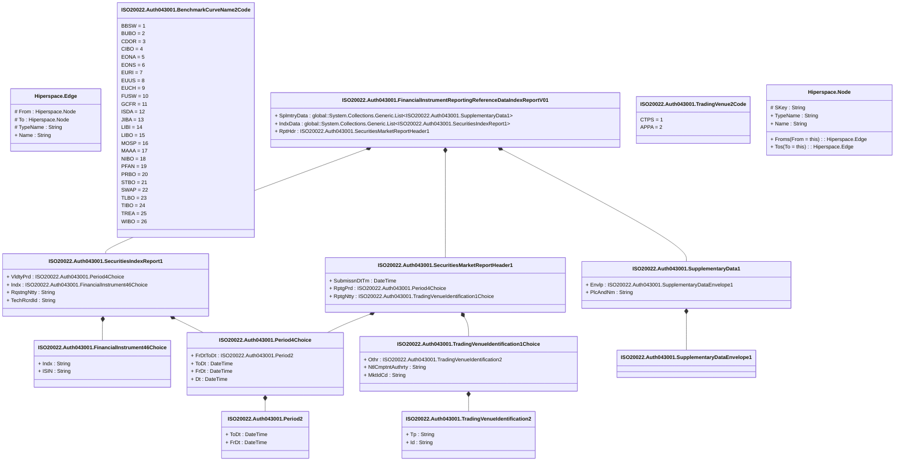

# auth.043.001.01

> The tables below contain descriptions of the members of each Element. 
> The first column indicates the type of the member:
> A ‘#’ indicates that the field is a key to the element, and a ‘+’ indicates that the field is a value.
> The ‘*’ column contains a description for the element member.  
> The ‘@’ column contains any properties for the member.
> The ‘=’ column contains calculated values; or in the case of an enum, the serialized value.

---

## View Hiperspace.Edge
edge between nodes

| |Name|Type|*|@|=|
|-|-|-|-|-|-|
|#|From|Hiperspace.Node||||
|#|To|Hiperspace.Node||||
|#|TypeName|String||||
|+|Name|String||||

---

## Enum ISO20022.Auth043001.BenchmarkCurveName2Code

| |Name|Type|*|@|=|
|-|-|-|-|-|-|
||BBSW|Int32||XmlEnum("""BBSW""")|1|
||BUBO|Int32||XmlEnum("""BUBO""")|2|
||CDOR|Int32||XmlEnum("""CDOR""")|3|
||CIBO|Int32||XmlEnum("""CIBO""")|4|
||EONA|Int32||XmlEnum("""EONA""")|5|
||EONS|Int32||XmlEnum("""EONS""")|6|
||EURI|Int32||XmlEnum("""EURI""")|7|
||EUUS|Int32||XmlEnum("""EUUS""")|8|
||EUCH|Int32||XmlEnum("""EUCH""")|9|
||FUSW|Int32||XmlEnum("""FUSW""")|10|
||GCFR|Int32||XmlEnum("""GCFR""")|11|
||ISDA|Int32||XmlEnum("""ISDA""")|12|
||JIBA|Int32||XmlEnum("""JIBA""")|13|
||LIBI|Int32||XmlEnum("""LIBI""")|14|
||LIBO|Int32||XmlEnum("""LIBO""")|15|
||MOSP|Int32||XmlEnum("""MOSP""")|16|
||MAAA|Int32||XmlEnum("""MAAA""")|17|
||NIBO|Int32||XmlEnum("""NIBO""")|18|
||PFAN|Int32||XmlEnum("""PFAN""")|19|
||PRBO|Int32||XmlEnum("""PRBO""")|20|
||STBO|Int32||XmlEnum("""STBO""")|21|
||SWAP|Int32||XmlEnum("""SWAP""")|22|
||TLBO|Int32||XmlEnum("""TLBO""")|23|
||TIBO|Int32||XmlEnum("""TIBO""")|24|
||TREA|Int32||XmlEnum("""TREA""")|25|
||WIBO|Int32||XmlEnum("""WIBO""")|26|

---

## Type ISO20022.Auth043001.Document

| |Name|Type|*|@|=|
|-|-|-|-|-|-|
|+|FinInstrmRptgRefDataIndxRpt|ISO20022.Auth043001.FinancialInstrumentReportingReferenceDataIndexReportV01||XmlElement()||
||Validation|Some(String)||XmlIgnore(), JsonIgnore()|validation(validElement(FinInstrmRptgRefDataIndxRpt))|

---

## Value ISO20022.Auth043001.FinancialInstrument46Choice

| |Name|Type|*|@|=|
|-|-|-|-|-|-|
|+|Indx|String||XmlElement()||
|+|ISIN|String||XmlElement()||
||Validation|Some(String)||XmlIgnore(), JsonIgnore()|validation(validPattern("""ISIN""",ISIN,"""[A-Z]{2,2}[A-Z0-9]{9,9}[0-9]{1,1}"""),validChoice(Indx,ISIN))|

---

## Aspect ISO20022.Auth043001.FinancialInstrumentReportingReferenceDataIndexReportV01

| |Name|Type|*|@|=|
|-|-|-|-|-|-|
|+|SplmtryData|global::System.Collections.Generic.List<ISO20022.Auth043001.SupplementaryData1>||XmlElement()||
|+|IndxData|global::System.Collections.Generic.List<ISO20022.Auth043001.SecuritiesIndexReport1>||XmlElement()||
|+|RptHdr|ISO20022.Auth043001.SecuritiesMarketReportHeader1||XmlElement()||
||Validation|Some(String)||XmlIgnore(), JsonIgnore()|validation(validList("""SplmtryData""",SplmtryData),validElement(SplmtryData),validRequired("""IndxData""",IndxData),validList("""IndxData""",IndxData),validElement(IndxData),validElement(RptHdr))|

---

## Value ISO20022.Auth043001.Period2

| |Name|Type|*|@|=|
|-|-|-|-|-|-|
|+|ToDt|DateTime||XmlElement()||
|+|FrDt|DateTime||XmlElement()||
||Validation|Some(String)||XmlIgnore(), JsonIgnore()|""|

---

## Value ISO20022.Auth043001.Period4Choice

| |Name|Type|*|@|=|
|-|-|-|-|-|-|
|+|FrDtToDt|ISO20022.Auth043001.Period2||XmlElement()||
|+|ToDt|DateTime||XmlElement()||
|+|FrDt|DateTime||XmlElement()||
|+|Dt|DateTime||XmlElement()||
||Validation|Some(String)||XmlIgnore(), JsonIgnore()|validation(validElement(FrDtToDt),validChoice(FrDtToDt,ToDt,FrDt,Dt))|

---

## Value ISO20022.Auth043001.SecuritiesIndexReport1

| |Name|Type|*|@|=|
|-|-|-|-|-|-|
|+|VldtyPrd|ISO20022.Auth043001.Period4Choice||XmlElement()||
|+|Indx|ISO20022.Auth043001.FinancialInstrument46Choice||XmlElement()||
|+|RqstngNtty|String||XmlElement()||
|+|TechRcrdId|String||XmlElement()||
||Validation|Some(String)||XmlIgnore(), JsonIgnore()|validation(validElement(VldtyPrd),validElement(Indx),validPattern("""RqstngNtty""",RqstngNtty,"""[A-Z]{2,2}"""))|

---

## Value ISO20022.Auth043001.SecuritiesMarketReportHeader1

| |Name|Type|*|@|=|
|-|-|-|-|-|-|
|+|SubmissnDtTm|DateTime||XmlElement()||
|+|RptgPrd|ISO20022.Auth043001.Period4Choice||XmlElement()||
|+|RptgNtty|ISO20022.Auth043001.TradingVenueIdentification1Choice||XmlElement()||
||Validation|Some(String)||XmlIgnore(), JsonIgnore()|validation(validElement(RptgPrd),validElement(RptgNtty))|

---

## Value ISO20022.Auth043001.SupplementaryData1

| |Name|Type|*|@|=|
|-|-|-|-|-|-|
|+|Envlp|ISO20022.Auth043001.SupplementaryDataEnvelope1||XmlElement()||
|+|PlcAndNm|String||XmlElement()||
||Validation|Some(String)||XmlIgnore(), JsonIgnore()|validation(validElement(Envlp))|

---

## Value ISO20022.Auth043001.SupplementaryDataEnvelope1

| |Name|Type|*|@|=|
|-|-|-|-|-|-|
||Validation|Some(String)||XmlIgnore(), JsonIgnore()|""|

---

## Enum ISO20022.Auth043001.TradingVenue2Code

| |Name|Type|*|@|=|
|-|-|-|-|-|-|
||CTPS|Int32||XmlEnum("""CTPS""")|1|
||APPA|Int32||XmlEnum("""APPA""")|2|

---

## Value ISO20022.Auth043001.TradingVenueIdentification1Choice

| |Name|Type|*|@|=|
|-|-|-|-|-|-|
|+|Othr|ISO20022.Auth043001.TradingVenueIdentification2||XmlElement()||
|+|NtlCmptntAuthrty|String||XmlElement()||
|+|MktIdCd|String||XmlElement()||
||Validation|Some(String)||XmlIgnore(), JsonIgnore()|validation(validElement(Othr),validPattern("""NtlCmptntAuthrty""",NtlCmptntAuthrty,"""[A-Z]{2,2}"""),validPattern("""MktIdCd""",MktIdCd,"""[A-Z0-9]{4,4}"""),validChoice(Othr,NtlCmptntAuthrty,MktIdCd))|

---

## Value ISO20022.Auth043001.TradingVenueIdentification2

| |Name|Type|*|@|=|
|-|-|-|-|-|-|
|+|Tp|String||XmlElement()||
|+|Id|String||XmlElement()||
||Validation|Some(String)||XmlIgnore(), JsonIgnore()|""|

---

## View Hiperspace.Node
node in a graph view of data

| |Name|Type|*|@|=|
|-|-|-|-|-|-|
|#|SKey|String||||
|+|TypeName|String||||
|+|Name|String||||
||Froms|Hiperspace.Edge|||From = this|
||Tos|Hiperspace.Edge|||To = this|

