# auth.044.001.02

```mermaid
classDiagram
    class Hiperspace.Edge {
        # From  : Hiperspace.Node
        # To  : Hiperspace.Node
        # TypeName  : String
        + Name  : String
    }
    class ISO20022.Auth044001.ActiveCurrencyAndAmount {
        + Value  : Decimal
        + Ccy  : String
    }
    class ISO20022.Auth044001.EquityInstrumentReportingClassification1Code {
        CRFT = 1
        DPRS = 2
        ETFS = 3
        OTHR = 4
        SHRS = 5
    }
    class ISO20022.Auth044001.FinancialInstrumentReportingEquityTradingActivityResultV02 {
        + SplmtryData  : global::System.Collections.Generic.List~ISO20022.Auth044001.SupplementaryData1~
        + EqtyTrnsprncyData  : global::System.Collections.Generic.List~ISO20022.Auth044001.TransparencyDataReport17~
        + RptHdr  : ISO20022.Auth044001.SecuritiesMarketReportHeader1
    }
    ISO20022.Auth044001.FinancialInstrumentReportingEquityTradingActivityResultV02 *-- ISO20022.Auth044001.SupplementaryData1
    ISO20022.Auth044001.FinancialInstrumentReportingEquityTradingActivityResultV02 *-- ISO20022.Auth044001.TransparencyDataReport17
    ISO20022.Auth044001.FinancialInstrumentReportingEquityTradingActivityResultV02 *-- ISO20022.Auth044001.SecuritiesMarketReportHeader1
    class ISO20022.Auth044001.MarketDetail2 {
        + AvrgDalyNbOfTxs  : Decimal
        + Id  : String
    }
    class ISO20022.Auth044001.Period2 {
        + ToDt  : DateTime
        + FrDt  : DateTime
    }
    class ISO20022.Auth044001.Period4Choice {
        + FrDtToDt  : ISO20022.Auth044001.Period2
        + ToDt  : DateTime
        + FrDt  : DateTime
        + Dt  : DateTime
    }
    ISO20022.Auth044001.Period4Choice *-- ISO20022.Auth044001.Period2
    class ISO20022.Auth044001.SecuritiesMarketReportHeader1 {
        + SubmissnDtTm  : DateTime
        + RptgPrd  : ISO20022.Auth044001.Period4Choice
        + RptgNtty  : ISO20022.Auth044001.TradingVenueIdentification1Choice
    }
    ISO20022.Auth044001.SecuritiesMarketReportHeader1 *-- ISO20022.Auth044001.Period4Choice
    ISO20022.Auth044001.SecuritiesMarketReportHeader1 *-- ISO20022.Auth044001.TradingVenueIdentification1Choice
    class ISO20022.Auth044001.StatisticsTransparency3 {
        + TtlNbOfTradgDays  : Decimal
        + TtlVolOfTxsExctd  : Decimal
        + TtlNbOfTxsExctd  : Decimal
        + AvrgDalyNbOfTxs  : Decimal
        + StdMktSz  : Decimal
        + LrgInScale  : Decimal
        + AvrgTxVal  : ISO20022.Auth044001.ActiveCurrencyAndAmount
        + AvrgDalyTrnvr  : ISO20022.Auth044001.ActiveCurrencyAndAmount
    }
    ISO20022.Auth044001.StatisticsTransparency3 *-- ISO20022.Auth044001.ActiveCurrencyAndAmount
    ISO20022.Auth044001.StatisticsTransparency3 *-- ISO20022.Auth044001.ActiveCurrencyAndAmount
    class ISO20022.Auth044001.SupplementaryData1 {
        + Envlp  : ISO20022.Auth044001.SupplementaryDataEnvelope1
        + PlcAndNm  : String
    }
    ISO20022.Auth044001.SupplementaryData1 *-- ISO20022.Auth044001.SupplementaryDataEnvelope1
    class ISO20022.Auth044001.SupplementaryDataEnvelope1 {
    }
    class ISO20022.Auth044001.TradingVenue2Code {
        CTPS = 1
        APPA = 2
    }
    class ISO20022.Auth044001.TradingVenueIdentification1Choice {
        + Othr  : ISO20022.Auth044001.TradingVenueIdentification2
        + NtlCmptntAuthrty  : String
        + MktIdCd  : String
    }
    ISO20022.Auth044001.TradingVenueIdentification1Choice *-- ISO20022.Auth044001.TradingVenueIdentification2
    class ISO20022.Auth044001.TradingVenueIdentification2 {
        + Tp  : String
        + Id  : String
    }
    class ISO20022.Auth044001.TransparencyDataReport17 {
        + RlvntMkt  : ISO20022.Auth044001.MarketDetail2
        + Sttstcs  : ISO20022.Auth044001.StatisticsTransparency3
        + Mthdlgy  : String
        + Lqdty  : String
        + RptgPrd  : ISO20022.Auth044001.Period4Choice
        + TradgVn  : String
        + FullNm  : String
        + FinInstrmClssfctn  : String
        + Id  : String
        + TechRcrdId  : String
    }
    ISO20022.Auth044001.TransparencyDataReport17 *-- ISO20022.Auth044001.MarketDetail2
    ISO20022.Auth044001.TransparencyDataReport17 *-- ISO20022.Auth044001.StatisticsTransparency3
    ISO20022.Auth044001.TransparencyDataReport17 *-- ISO20022.Auth044001.Period4Choice
    class ISO20022.Auth044001.TransparencyMethodology2Code {
        ESTM = 1
        FFWK = 2
        SINT = 3
        YEAR = 4
    }
    class Hiperspace.Node {
        # SKey  : String
        + TypeName  : String
        + Name  : String
        + Froms (From = this) : Hiperspace.Edge
        + Tos (To = this) : Hiperspace.Edge
    }
```

> The tables below contain descriptions of the members of each Element. 
> The first column indicates the type of the member:
> A ‘#’ indicates that the field is a key to the element, and a ‘+’ indicates that the field is a value.
> The ‘*’ column contains a description for the element member.  
> The ‘@’ column contains any properties for the member.
> The ‘=’ column contains calculated values; or in the case of an enum, the serialized value.

---

## View Hiperspace.Edge
edge between nodes

| |Name|Type|*|@|=|
|-|-|-|-|-|-|
|#|From|Hiperspace.Node||||
|#|To|Hiperspace.Node||||
|#|TypeName|String||||
|+|Name|String||||

---

## Value ISO20022.Auth044001.ActiveCurrencyAndAmount

| |Name|Type|*|@|=|
|-|-|-|-|-|-|
|+|Value|Decimal||XmlElement()||
|+|Ccy|String||XmlAttribute()||
||Validation|Some(String)||XmlIgnore(), JsonIgnore()|validation(validRequired("""Value""",Value),validRequired("""Ccy""",Ccy),validPattern("""Ccy""",Ccy,"""[A-Z]{3,3}"""))|

---

## Type ISO20022.Auth044001.Document

| |Name|Type|*|@|=|
|-|-|-|-|-|-|
|+|FinInstrmRptgEqtyTradgActvtyRslt|ISO20022.Auth044001.FinancialInstrumentReportingEquityTradingActivityResultV02||XmlElement()||
||Validation|Some(String)||XmlIgnore(), JsonIgnore()|validation(validElement(FinInstrmRptgEqtyTradgActvtyRslt))|

---

## Enum ISO20022.Auth044001.EquityInstrumentReportingClassification1Code

| |Name|Type|*|@|=|
|-|-|-|-|-|-|
||CRFT|Int32||XmlEnum("""CRFT""")|1|
||DPRS|Int32||XmlEnum("""DPRS""")|2|
||ETFS|Int32||XmlEnum("""ETFS""")|3|
||OTHR|Int32||XmlEnum("""OTHR""")|4|
||SHRS|Int32||XmlEnum("""SHRS""")|5|

---

## Aspect ISO20022.Auth044001.FinancialInstrumentReportingEquityTradingActivityResultV02

| |Name|Type|*|@|=|
|-|-|-|-|-|-|
|+|SplmtryData|global::System.Collections.Generic.List<ISO20022.Auth044001.SupplementaryData1>||XmlElement()||
|+|EqtyTrnsprncyData|global::System.Collections.Generic.List<ISO20022.Auth044001.TransparencyDataReport17>||XmlElement()||
|+|RptHdr|ISO20022.Auth044001.SecuritiesMarketReportHeader1||XmlElement()||
||Validation|Some(String)||XmlIgnore(), JsonIgnore()|validation(validList("""SplmtryData""",SplmtryData),validElement(SplmtryData),validRequired("""EqtyTrnsprncyData""",EqtyTrnsprncyData),validList("""EqtyTrnsprncyData""",EqtyTrnsprncyData),validElement(EqtyTrnsprncyData),validElement(RptHdr))|

---

## Value ISO20022.Auth044001.MarketDetail2

| |Name|Type|*|@|=|
|-|-|-|-|-|-|
|+|AvrgDalyNbOfTxs|Decimal||XmlElement()||
|+|Id|String||XmlElement()||
||Validation|Some(String)||XmlIgnore(), JsonIgnore()|validation(validPattern("""Id""",Id,"""[A-Z0-9]{4,4}"""))|

---

## Value ISO20022.Auth044001.Period2

| |Name|Type|*|@|=|
|-|-|-|-|-|-|
|+|ToDt|DateTime||XmlElement()||
|+|FrDt|DateTime||XmlElement()||
||Validation|Some(String)||XmlIgnore(), JsonIgnore()|""|

---

## Value ISO20022.Auth044001.Period4Choice

| |Name|Type|*|@|=|
|-|-|-|-|-|-|
|+|FrDtToDt|ISO20022.Auth044001.Period2||XmlElement()||
|+|ToDt|DateTime||XmlElement()||
|+|FrDt|DateTime||XmlElement()||
|+|Dt|DateTime||XmlElement()||
||Validation|Some(String)||XmlIgnore(), JsonIgnore()|validation(validElement(FrDtToDt),validChoice(FrDtToDt,ToDt,FrDt,Dt))|

---

## Value ISO20022.Auth044001.SecuritiesMarketReportHeader1

| |Name|Type|*|@|=|
|-|-|-|-|-|-|
|+|SubmissnDtTm|DateTime||XmlElement()||
|+|RptgPrd|ISO20022.Auth044001.Period4Choice||XmlElement()||
|+|RptgNtty|ISO20022.Auth044001.TradingVenueIdentification1Choice||XmlElement()||
||Validation|Some(String)||XmlIgnore(), JsonIgnore()|validation(validElement(RptgPrd),validElement(RptgNtty))|

---

## Value ISO20022.Auth044001.StatisticsTransparency3

| |Name|Type|*|@|=|
|-|-|-|-|-|-|
|+|TtlNbOfTradgDays|Decimal||XmlElement()||
|+|TtlVolOfTxsExctd|Decimal||XmlElement()||
|+|TtlNbOfTxsExctd|Decimal||XmlElement()||
|+|AvrgDalyNbOfTxs|Decimal||XmlElement()||
|+|StdMktSz|Decimal||XmlElement()||
|+|LrgInScale|Decimal||XmlElement()||
|+|AvrgTxVal|ISO20022.Auth044001.ActiveCurrencyAndAmount||XmlElement()||
|+|AvrgDalyTrnvr|ISO20022.Auth044001.ActiveCurrencyAndAmount||XmlElement()||
||Validation|Some(String)||XmlIgnore(), JsonIgnore()|validation(validElement(AvrgTxVal),validElement(AvrgDalyTrnvr))|

---

## Value ISO20022.Auth044001.SupplementaryData1

| |Name|Type|*|@|=|
|-|-|-|-|-|-|
|+|Envlp|ISO20022.Auth044001.SupplementaryDataEnvelope1||XmlElement()||
|+|PlcAndNm|String||XmlElement()||
||Validation|Some(String)||XmlIgnore(), JsonIgnore()|validation(validElement(Envlp))|

---

## Value ISO20022.Auth044001.SupplementaryDataEnvelope1

| |Name|Type|*|@|=|
|-|-|-|-|-|-|
||Validation|Some(String)||XmlIgnore(), JsonIgnore()|""|

---

## Enum ISO20022.Auth044001.TradingVenue2Code

| |Name|Type|*|@|=|
|-|-|-|-|-|-|
||CTPS|Int32||XmlEnum("""CTPS""")|1|
||APPA|Int32||XmlEnum("""APPA""")|2|

---

## Value ISO20022.Auth044001.TradingVenueIdentification1Choice

| |Name|Type|*|@|=|
|-|-|-|-|-|-|
|+|Othr|ISO20022.Auth044001.TradingVenueIdentification2||XmlElement()||
|+|NtlCmptntAuthrty|String||XmlElement()||
|+|MktIdCd|String||XmlElement()||
||Validation|Some(String)||XmlIgnore(), JsonIgnore()|validation(validElement(Othr),validPattern("""NtlCmptntAuthrty""",NtlCmptntAuthrty,"""[A-Z]{2,2}"""),validPattern("""MktIdCd""",MktIdCd,"""[A-Z0-9]{4,4}"""),validChoice(Othr,NtlCmptntAuthrty,MktIdCd))|

---

## Value ISO20022.Auth044001.TradingVenueIdentification2

| |Name|Type|*|@|=|
|-|-|-|-|-|-|
|+|Tp|String||XmlElement()||
|+|Id|String||XmlElement()||
||Validation|Some(String)||XmlIgnore(), JsonIgnore()|""|

---

## Value ISO20022.Auth044001.TransparencyDataReport17

| |Name|Type|*|@|=|
|-|-|-|-|-|-|
|+|RlvntMkt|ISO20022.Auth044001.MarketDetail2||XmlElement()||
|+|Sttstcs|ISO20022.Auth044001.StatisticsTransparency3||XmlElement()||
|+|Mthdlgy|String||XmlElement()||
|+|Lqdty|String||XmlElement()||
|+|RptgPrd|ISO20022.Auth044001.Period4Choice||XmlElement()||
|+|TradgVn|String||XmlElement()||
|+|FullNm|String||XmlElement()||
|+|FinInstrmClssfctn|String||XmlElement()||
|+|Id|String||XmlElement()||
|+|TechRcrdId|String||XmlElement()||
||Validation|Some(String)||XmlIgnore(), JsonIgnore()|validation(validElement(RlvntMkt),validElement(Sttstcs),validElement(RptgPrd),validPattern("""TradgVn""",TradgVn,"""[A-Z0-9]{4,4}"""),validPattern("""Id""",Id,"""[A-Z]{2,2}[A-Z0-9]{9,9}[0-9]{1,1}"""))|

---

## Enum ISO20022.Auth044001.TransparencyMethodology2Code

| |Name|Type|*|@|=|
|-|-|-|-|-|-|
||ESTM|Int32||XmlEnum("""ESTM""")|1|
||FFWK|Int32||XmlEnum("""FFWK""")|2|
||SINT|Int32||XmlEnum("""SINT""")|3|
||YEAR|Int32||XmlEnum("""YEAR""")|4|

---

## View Hiperspace.Node
node in a graph view of data

| |Name|Type|*|@|=|
|-|-|-|-|-|-|
|#|SKey|String||||
|+|TypeName|String||||
|+|Name|String||||
||Froms|Hiperspace.Edge|||From = this|
||Tos|Hiperspace.Edge|||To = this|

