# auth.045.001.03

```mermaid
classDiagram
    class Hiperspace.Edge {
        # From  : Hiperspace.Node
        # To  : Hiperspace.Node
        # TypeName  : String
        + Name  : String
    }
    class ISO20022.Auth045001.ActiveOrHistoricCurrencyAndAmount {
        + Value  : Decimal
        + Ccy  : String
    }
    class ISO20022.Auth045001.AssetClassAndSubClassIdentification2 {
        + FinInstrmClssfctn  : String
        + DerivSubClss  : ISO20022.Auth045001.NonEquitySubClass1
        + AsstClss  : String
    }
    ISO20022.Auth045001.AssetClassAndSubClassIdentification2 *-- ISO20022.Auth045001.NonEquitySubClass1
    class ISO20022.Auth045001.FinancialInstrumentReportingNonEquityTradingActivityResultV03 {
        + SplmtryData  : global::System.Collections.Generic.List~ISO20022.Auth045001.SupplementaryData1~
        + NonEqtyTrnsprncyData  : global::System.Collections.Generic.List~ISO20022.Auth045001.TransparencyDataReport20~
        + RptHdr  : ISO20022.Auth045001.SecuritiesMarketReportHeader1
    }
    ISO20022.Auth045001.FinancialInstrumentReportingNonEquityTradingActivityResultV03 *-- ISO20022.Auth045001.SupplementaryData1
    ISO20022.Auth045001.FinancialInstrumentReportingNonEquityTradingActivityResultV03 *-- ISO20022.Auth045001.TransparencyDataReport20
    ISO20022.Auth045001.FinancialInstrumentReportingNonEquityTradingActivityResultV03 *-- ISO20022.Auth045001.SecuritiesMarketReportHeader1
    class ISO20022.Auth045001.InstrumentAndSubClassIdentification2 {
        + FinInstrmClssfctn  : String
        + DerivSubClss  : ISO20022.Auth045001.NonEquitySubClass1
        + ISIN  : String
    }
    ISO20022.Auth045001.InstrumentAndSubClassIdentification2 *-- ISO20022.Auth045001.NonEquitySubClass1
    class ISO20022.Auth045001.InstrumentOrSubClassIdentification2Choice {
        + AsstClssAndSubClss  : ISO20022.Auth045001.AssetClassAndSubClassIdentification2
        + ISINAndSubClss  : ISO20022.Auth045001.InstrumentAndSubClassIdentification2
    }
    ISO20022.Auth045001.InstrumentOrSubClassIdentification2Choice *-- ISO20022.Auth045001.AssetClassAndSubClassIdentification2
    ISO20022.Auth045001.InstrumentOrSubClassIdentification2Choice *-- ISO20022.Auth045001.InstrumentAndSubClassIdentification2
    class ISO20022.Auth045001.NonEquityAssetClass1Code {
        SFPS = 1
        ETNS = 2
        ETCS = 3
        BOND = 4
        C10D = 5
        COMD = 6
        CFDS = 7
        CRDV = 8
        EMAL = 9
        EADV = 10
        EQDV = 11
        FEXD = 12
        IRDV = 13
        SDRV = 14
    }
    class ISO20022.Auth045001.NonEquityInstrumentReportingClassification1Code {
        ETNS = 1
        ETCS = 2
        BOND = 3
        EMAL = 4
        DERV = 5
        SDRV = 6
        SFPS = 7
    }
    class ISO20022.Auth045001.NonEquitySubClass1 {
        + SgmttnCrit  : global::System.Collections.Generic.List~ISO20022.Auth045001.NonEquitySubClassSegmentationCriterion1~
        + Desc  : String
    }
    ISO20022.Auth045001.NonEquitySubClass1 *-- ISO20022.Auth045001.NonEquitySubClassSegmentationCriterion1
    class ISO20022.Auth045001.NonEquitySubClassSegmentationCriteria1Code {
        UTYP = 1
        REOU = 2
        UIRT = 3
        UINS = 4
        UIDX = 5
        UISC = 6
        TOUB = 7
        IOUB = 8
        TTMB = 9
        NCSW = 10
        TTMS = 11
        SBPD = 12
        SACL = 13
        SRTC = 14
        ISPT = 15
        SSRF = 16
        PRMT = 17
        TTMO = 18
        ISIN = 19
        INC2 = 20
        INC1 = 21
        IRTC = 22
        IIND = 23
        FSPD = 24
        FNC2 = 25
        FNC1 = 26
        EQUT = 27
        DTYP = 28
        DCSL = 29
        NCCR = 30
        CTYP = 31
        NCCO = 32
        CNC2 = 33
        CNC1 = 34
        BSPD = 35
        ASCL = 36
    }
    class ISO20022.Auth045001.NonEquitySubClassSegmentationCriterion1 {
        + CritVal  : String
        + CritNm  : String
    }
    class ISO20022.Auth045001.Period2 {
        + ToDt  : DateTime
        + FrDt  : DateTime
    }
    class ISO20022.Auth045001.Period4Choice {
        + FrDtToDt  : ISO20022.Auth045001.Period2
        + ToDt  : DateTime
        + FrDt  : DateTime
        + Dt  : DateTime
    }
    ISO20022.Auth045001.Period4Choice *-- ISO20022.Auth045001.Period2
    class ISO20022.Auth045001.SecuritiesMarketReportHeader1 {
        + SubmissnDtTm  : DateTime
        + RptgPrd  : ISO20022.Auth045001.Period4Choice
        + RptgNtty  : ISO20022.Auth045001.TradingVenueIdentification1Choice
    }
    ISO20022.Auth045001.SecuritiesMarketReportHeader1 *-- ISO20022.Auth045001.Period4Choice
    ISO20022.Auth045001.SecuritiesMarketReportHeader1 *-- ISO20022.Auth045001.TradingVenueIdentification1Choice
    class ISO20022.Auth045001.StatisticsTransparency2 {
        + TtlVolOfTxsExctd  : Decimal
        + TtlNbOfTxsExctd  : Decimal
    }
    class ISO20022.Auth045001.SupplementaryData1 {
        + Envlp  : ISO20022.Auth045001.SupplementaryDataEnvelope1
        + PlcAndNm  : String
    }
    ISO20022.Auth045001.SupplementaryData1 *-- ISO20022.Auth045001.SupplementaryDataEnvelope1
    class ISO20022.Auth045001.SupplementaryDataEnvelope1 {
    }
    class ISO20022.Auth045001.TonsOrCurrency2Choice {
        + Amt  : ISO20022.Auth045001.ActiveOrHistoricCurrencyAndAmount
        + Nb  : Decimal
    }
    ISO20022.Auth045001.TonsOrCurrency2Choice *-- ISO20022.Auth045001.ActiveOrHistoricCurrencyAndAmount
    class ISO20022.Auth045001.TradingVenue2Code {
        CTPS = 1
        APPA = 2
    }
    class ISO20022.Auth045001.TradingVenueIdentification1Choice {
        + Othr  : ISO20022.Auth045001.TradingVenueIdentification2
        + NtlCmptntAuthrty  : String
        + MktIdCd  : String
    }
    ISO20022.Auth045001.TradingVenueIdentification1Choice *-- ISO20022.Auth045001.TradingVenueIdentification2
    class ISO20022.Auth045001.TradingVenueIdentification2 {
        + Tp  : String
        + Id  : String
    }
    class ISO20022.Auth045001.TransparencyDataReport20 {
        + Sttstcs  : ISO20022.Auth045001.StatisticsTransparency2
        + PstTradInstrmSzSpcfcThrshld  : ISO20022.Auth045001.TonsOrCurrency2Choice
        + PreTradInstrmSzSpcfcThrshld  : ISO20022.Auth045001.TonsOrCurrency2Choice
        + PstTradLrgInScaleThrshld  : ISO20022.Auth045001.TonsOrCurrency2Choice
        + PreTradLrgInScaleThrshld  : ISO20022.Auth045001.TonsOrCurrency2Choice
        + Lqdty  : String
        + RptgPrd  : ISO20022.Auth045001.Period4Choice
        + TradgVn  : String
        + FullNm  : String
        + Id  : ISO20022.Auth045001.InstrumentOrSubClassIdentification2Choice
        + TechRcrdId  : String
    }
    ISO20022.Auth045001.TransparencyDataReport20 *-- ISO20022.Auth045001.StatisticsTransparency2
    ISO20022.Auth045001.TransparencyDataReport20 *-- ISO20022.Auth045001.TonsOrCurrency2Choice
    ISO20022.Auth045001.TransparencyDataReport20 *-- ISO20022.Auth045001.TonsOrCurrency2Choice
    ISO20022.Auth045001.TransparencyDataReport20 *-- ISO20022.Auth045001.TonsOrCurrency2Choice
    ISO20022.Auth045001.TransparencyDataReport20 *-- ISO20022.Auth045001.TonsOrCurrency2Choice
    ISO20022.Auth045001.TransparencyDataReport20 *-- ISO20022.Auth045001.Period4Choice
    ISO20022.Auth045001.TransparencyDataReport20 *-- ISO20022.Auth045001.InstrumentOrSubClassIdentification2Choice
    class Hiperspace.Node {
        # SKey  : String
        + TypeName  : String
        + Name  : String
        + Froms (From = this) : Hiperspace.Edge
        + Tos (To = this) : Hiperspace.Edge
    }
```

> The tables below contain descriptions of the members of each Element. 
> The first column indicates the type of the member:
> A ‘#’ indicates that the field is a key to the element, and a ‘+’ indicates that the field is a value.
> The ‘*’ column contains a description for the element member.  
> The ‘@’ column contains any properties for the member.
> The ‘=’ column contains calculated values; or in the case of an enum, the serialized value.

---

## View Hiperspace.Edge
edge between nodes

| |Name|Type|*|@|=|
|-|-|-|-|-|-|
|#|From|Hiperspace.Node||||
|#|To|Hiperspace.Node||||
|#|TypeName|String||||
|+|Name|String||||

---

## Value ISO20022.Auth045001.ActiveOrHistoricCurrencyAndAmount

| |Name|Type|*|@|=|
|-|-|-|-|-|-|
|+|Value|Decimal||XmlElement()||
|+|Ccy|String||XmlAttribute()||
||Validation|Some(String)||XmlIgnore(), JsonIgnore()|validation(validRequired("""Value""",Value),validRequired("""Ccy""",Ccy),validPattern("""Ccy""",Ccy,"""[A-Z]{3,3}"""))|

---

## Value ISO20022.Auth045001.AssetClassAndSubClassIdentification2

| |Name|Type|*|@|=|
|-|-|-|-|-|-|
|+|FinInstrmClssfctn|String||XmlElement()||
|+|DerivSubClss|ISO20022.Auth045001.NonEquitySubClass1||XmlElement()||
|+|AsstClss|String||XmlElement()||
||Validation|Some(String)||XmlIgnore(), JsonIgnore()|validation(validElement(DerivSubClss))|

---

## Type ISO20022.Auth045001.Document

| |Name|Type|*|@|=|
|-|-|-|-|-|-|
|+|FinInstrmRptgNonEqtyTradgActvtyRslt|ISO20022.Auth045001.FinancialInstrumentReportingNonEquityTradingActivityResultV03||XmlElement()||
||Validation|Some(String)||XmlIgnore(), JsonIgnore()|validation(validElement(FinInstrmRptgNonEqtyTradgActvtyRslt))|

---

## Aspect ISO20022.Auth045001.FinancialInstrumentReportingNonEquityTradingActivityResultV03

| |Name|Type|*|@|=|
|-|-|-|-|-|-|
|+|SplmtryData|global::System.Collections.Generic.List<ISO20022.Auth045001.SupplementaryData1>||XmlElement()||
|+|NonEqtyTrnsprncyData|global::System.Collections.Generic.List<ISO20022.Auth045001.TransparencyDataReport20>||XmlElement()||
|+|RptHdr|ISO20022.Auth045001.SecuritiesMarketReportHeader1||XmlElement()||
||Validation|Some(String)||XmlIgnore(), JsonIgnore()|validation(validList("""SplmtryData""",SplmtryData),validElement(SplmtryData),validRequired("""NonEqtyTrnsprncyData""",NonEqtyTrnsprncyData),validList("""NonEqtyTrnsprncyData""",NonEqtyTrnsprncyData),validElement(NonEqtyTrnsprncyData),validElement(RptHdr))|

---

## Value ISO20022.Auth045001.InstrumentAndSubClassIdentification2

| |Name|Type|*|@|=|
|-|-|-|-|-|-|
|+|FinInstrmClssfctn|String||XmlElement()||
|+|DerivSubClss|ISO20022.Auth045001.NonEquitySubClass1||XmlElement()||
|+|ISIN|String||XmlElement()||
||Validation|Some(String)||XmlIgnore(), JsonIgnore()|validation(validElement(DerivSubClss),validPattern("""ISIN""",ISIN,"""[A-Z]{2,2}[A-Z0-9]{9,9}[0-9]{1,1}"""))|

---

## Value ISO20022.Auth045001.InstrumentOrSubClassIdentification2Choice

| |Name|Type|*|@|=|
|-|-|-|-|-|-|
|+|AsstClssAndSubClss|ISO20022.Auth045001.AssetClassAndSubClassIdentification2||XmlElement()||
|+|ISINAndSubClss|ISO20022.Auth045001.InstrumentAndSubClassIdentification2||XmlElement()||
||Validation|Some(String)||XmlIgnore(), JsonIgnore()|validation(validElement(AsstClssAndSubClss),validElement(ISINAndSubClss),validChoice(AsstClssAndSubClss,ISINAndSubClss))|

---

## Enum ISO20022.Auth045001.NonEquityAssetClass1Code

| |Name|Type|*|@|=|
|-|-|-|-|-|-|
||SFPS|Int32||XmlEnum("""SFPS""")|1|
||ETNS|Int32||XmlEnum("""ETNS""")|2|
||ETCS|Int32||XmlEnum("""ETCS""")|3|
||BOND|Int32||XmlEnum("""BOND""")|4|
||C10D|Int32||XmlEnum("""C10D""")|5|
||COMD|Int32||XmlEnum("""COMD""")|6|
||CFDS|Int32||XmlEnum("""CFDS""")|7|
||CRDV|Int32||XmlEnum("""CRDV""")|8|
||EMAL|Int32||XmlEnum("""EMAL""")|9|
||EADV|Int32||XmlEnum("""EADV""")|10|
||EQDV|Int32||XmlEnum("""EQDV""")|11|
||FEXD|Int32||XmlEnum("""FEXD""")|12|
||IRDV|Int32||XmlEnum("""IRDV""")|13|
||SDRV|Int32||XmlEnum("""SDRV""")|14|

---

## Enum ISO20022.Auth045001.NonEquityInstrumentReportingClassification1Code

| |Name|Type|*|@|=|
|-|-|-|-|-|-|
||ETNS|Int32||XmlEnum("""ETNS""")|1|
||ETCS|Int32||XmlEnum("""ETCS""")|2|
||BOND|Int32||XmlEnum("""BOND""")|3|
||EMAL|Int32||XmlEnum("""EMAL""")|4|
||DERV|Int32||XmlEnum("""DERV""")|5|
||SDRV|Int32||XmlEnum("""SDRV""")|6|
||SFPS|Int32||XmlEnum("""SFPS""")|7|

---

## Value ISO20022.Auth045001.NonEquitySubClass1

| |Name|Type|*|@|=|
|-|-|-|-|-|-|
|+|SgmttnCrit|global::System.Collections.Generic.List<ISO20022.Auth045001.NonEquitySubClassSegmentationCriterion1>||XmlElement()||
|+|Desc|String||XmlElement()||
||Validation|Some(String)||XmlIgnore(), JsonIgnore()|validation(validRequired("""SgmttnCrit""",SgmttnCrit),validList("""SgmttnCrit""",SgmttnCrit),validElement(SgmttnCrit))|

---

## Enum ISO20022.Auth045001.NonEquitySubClassSegmentationCriteria1Code

| |Name|Type|*|@|=|
|-|-|-|-|-|-|
||UTYP|Int32||XmlEnum("""UTYP""")|1|
||REOU|Int32||XmlEnum("""REOU""")|2|
||UIRT|Int32||XmlEnum("""UIRT""")|3|
||UINS|Int32||XmlEnum("""UINS""")|4|
||UIDX|Int32||XmlEnum("""UIDX""")|5|
||UISC|Int32||XmlEnum("""UISC""")|6|
||TOUB|Int32||XmlEnum("""TOUB""")|7|
||IOUB|Int32||XmlEnum("""IOUB""")|8|
||TTMB|Int32||XmlEnum("""TTMB""")|9|
||NCSW|Int32||XmlEnum("""NCSW""")|10|
||TTMS|Int32||XmlEnum("""TTMS""")|11|
||SBPD|Int32||XmlEnum("""SBPD""")|12|
||SACL|Int32||XmlEnum("""SACL""")|13|
||SRTC|Int32||XmlEnum("""SRTC""")|14|
||ISPT|Int32||XmlEnum("""ISPT""")|15|
||SSRF|Int32||XmlEnum("""SSRF""")|16|
||PRMT|Int32||XmlEnum("""PRMT""")|17|
||TTMO|Int32||XmlEnum("""TTMO""")|18|
||ISIN|Int32||XmlEnum("""ISIN""")|19|
||INC2|Int32||XmlEnum("""INC2""")|20|
||INC1|Int32||XmlEnum("""INC1""")|21|
||IRTC|Int32||XmlEnum("""IRTC""")|22|
||IIND|Int32||XmlEnum("""IIND""")|23|
||FSPD|Int32||XmlEnum("""FSPD""")|24|
||FNC2|Int32||XmlEnum("""FNC2""")|25|
||FNC1|Int32||XmlEnum("""FNC1""")|26|
||EQUT|Int32||XmlEnum("""EQUT""")|27|
||DTYP|Int32||XmlEnum("""DTYP""")|28|
||DCSL|Int32||XmlEnum("""DCSL""")|29|
||NCCR|Int32||XmlEnum("""NCCR""")|30|
||CTYP|Int32||XmlEnum("""CTYP""")|31|
||NCCO|Int32||XmlEnum("""NCCO""")|32|
||CNC2|Int32||XmlEnum("""CNC2""")|33|
||CNC1|Int32||XmlEnum("""CNC1""")|34|
||BSPD|Int32||XmlEnum("""BSPD""")|35|
||ASCL|Int32||XmlEnum("""ASCL""")|36|

---

## Value ISO20022.Auth045001.NonEquitySubClassSegmentationCriterion1

| |Name|Type|*|@|=|
|-|-|-|-|-|-|
|+|CritVal|String||XmlElement()||
|+|CritNm|String||XmlElement()||
||Validation|Some(String)||XmlIgnore(), JsonIgnore()|""|

---

## Value ISO20022.Auth045001.Period2

| |Name|Type|*|@|=|
|-|-|-|-|-|-|
|+|ToDt|DateTime||XmlElement()||
|+|FrDt|DateTime||XmlElement()||
||Validation|Some(String)||XmlIgnore(), JsonIgnore()|""|

---

## Value ISO20022.Auth045001.Period4Choice

| |Name|Type|*|@|=|
|-|-|-|-|-|-|
|+|FrDtToDt|ISO20022.Auth045001.Period2||XmlElement()||
|+|ToDt|DateTime||XmlElement()||
|+|FrDt|DateTime||XmlElement()||
|+|Dt|DateTime||XmlElement()||
||Validation|Some(String)||XmlIgnore(), JsonIgnore()|validation(validElement(FrDtToDt),validChoice(FrDtToDt,ToDt,FrDt,Dt))|

---

## Value ISO20022.Auth045001.SecuritiesMarketReportHeader1

| |Name|Type|*|@|=|
|-|-|-|-|-|-|
|+|SubmissnDtTm|DateTime||XmlElement()||
|+|RptgPrd|ISO20022.Auth045001.Period4Choice||XmlElement()||
|+|RptgNtty|ISO20022.Auth045001.TradingVenueIdentification1Choice||XmlElement()||
||Validation|Some(String)||XmlIgnore(), JsonIgnore()|validation(validElement(RptgPrd),validElement(RptgNtty))|

---

## Value ISO20022.Auth045001.StatisticsTransparency2

| |Name|Type|*|@|=|
|-|-|-|-|-|-|
|+|TtlVolOfTxsExctd|Decimal||XmlElement()||
|+|TtlNbOfTxsExctd|Decimal||XmlElement()||
||Validation|Some(String)||XmlIgnore(), JsonIgnore()|""|

---

## Value ISO20022.Auth045001.SupplementaryData1

| |Name|Type|*|@|=|
|-|-|-|-|-|-|
|+|Envlp|ISO20022.Auth045001.SupplementaryDataEnvelope1||XmlElement()||
|+|PlcAndNm|String||XmlElement()||
||Validation|Some(String)||XmlIgnore(), JsonIgnore()|validation(validElement(Envlp))|

---

## Value ISO20022.Auth045001.SupplementaryDataEnvelope1

| |Name|Type|*|@|=|
|-|-|-|-|-|-|
||Validation|Some(String)||XmlIgnore(), JsonIgnore()|""|

---

## Value ISO20022.Auth045001.TonsOrCurrency2Choice

| |Name|Type|*|@|=|
|-|-|-|-|-|-|
|+|Amt|ISO20022.Auth045001.ActiveOrHistoricCurrencyAndAmount||XmlElement()||
|+|Nb|Decimal||XmlElement()||
||Validation|Some(String)||XmlIgnore(), JsonIgnore()|validation(validElement(Amt),validChoice(Amt,Nb))|

---

## Enum ISO20022.Auth045001.TradingVenue2Code

| |Name|Type|*|@|=|
|-|-|-|-|-|-|
||CTPS|Int32||XmlEnum("""CTPS""")|1|
||APPA|Int32||XmlEnum("""APPA""")|2|

---

## Value ISO20022.Auth045001.TradingVenueIdentification1Choice

| |Name|Type|*|@|=|
|-|-|-|-|-|-|
|+|Othr|ISO20022.Auth045001.TradingVenueIdentification2||XmlElement()||
|+|NtlCmptntAuthrty|String||XmlElement()||
|+|MktIdCd|String||XmlElement()||
||Validation|Some(String)||XmlIgnore(), JsonIgnore()|validation(validElement(Othr),validPattern("""NtlCmptntAuthrty""",NtlCmptntAuthrty,"""[A-Z]{2,2}"""),validPattern("""MktIdCd""",MktIdCd,"""[A-Z0-9]{4,4}"""),validChoice(Othr,NtlCmptntAuthrty,MktIdCd))|

---

## Value ISO20022.Auth045001.TradingVenueIdentification2

| |Name|Type|*|@|=|
|-|-|-|-|-|-|
|+|Tp|String||XmlElement()||
|+|Id|String||XmlElement()||
||Validation|Some(String)||XmlIgnore(), JsonIgnore()|""|

---

## Value ISO20022.Auth045001.TransparencyDataReport20

| |Name|Type|*|@|=|
|-|-|-|-|-|-|
|+|Sttstcs|ISO20022.Auth045001.StatisticsTransparency2||XmlElement()||
|+|PstTradInstrmSzSpcfcThrshld|ISO20022.Auth045001.TonsOrCurrency2Choice||XmlElement()||
|+|PreTradInstrmSzSpcfcThrshld|ISO20022.Auth045001.TonsOrCurrency2Choice||XmlElement()||
|+|PstTradLrgInScaleThrshld|ISO20022.Auth045001.TonsOrCurrency2Choice||XmlElement()||
|+|PreTradLrgInScaleThrshld|ISO20022.Auth045001.TonsOrCurrency2Choice||XmlElement()||
|+|Lqdty|String||XmlElement()||
|+|RptgPrd|ISO20022.Auth045001.Period4Choice||XmlElement()||
|+|TradgVn|String||XmlElement()||
|+|FullNm|String||XmlElement()||
|+|Id|ISO20022.Auth045001.InstrumentOrSubClassIdentification2Choice||XmlElement()||
|+|TechRcrdId|String||XmlElement()||
||Validation|Some(String)||XmlIgnore(), JsonIgnore()|validation(validElement(Sttstcs),validElement(PstTradInstrmSzSpcfcThrshld),validElement(PreTradInstrmSzSpcfcThrshld),validElement(PstTradLrgInScaleThrshld),validElement(PreTradLrgInScaleThrshld),validElement(RptgPrd),validPattern("""TradgVn""",TradgVn,"""[A-Z0-9]{4,4}"""),validElement(Id))|

---

## View Hiperspace.Node
node in a graph view of data

| |Name|Type|*|@|=|
|-|-|-|-|-|-|
|#|SKey|String||||
|+|TypeName|String||||
|+|Name|String||||
||Froms|Hiperspace.Edge|||From = this|
||Tos|Hiperspace.Edge|||To = this|

