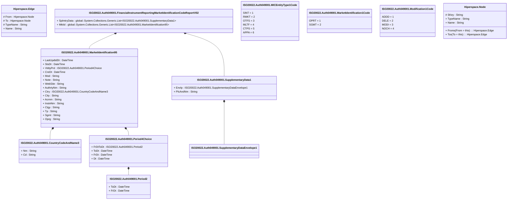

# auth.049.001.02

> The tables below contain descriptions of the members of each Element. 
> The first column indicates the type of the member:
> A ‘#’ indicates that the field is a key to the element, and a ‘+’ indicates that the field is a value.
> The ‘*’ column contains a description for the element member.  
> The ‘@’ column contains any properties for the member.
> The ‘=’ column contains calculated values; or in the case of an enum, the serialized value.

---

## View Hiperspace.Edge
edge between nodes

| |Name|Type|*|@|=|
|-|-|-|-|-|-|
|#|From|Hiperspace.Node||||
|#|To|Hiperspace.Node||||
|#|TypeName|String||||
|+|Name|String||||

---

## Value ISO20022.Auth049001.CountryCodeAndName3

| |Name|Type|*|@|=|
|-|-|-|-|-|-|
|+|Nm|String||XmlElement()||
|+|Cd|String||XmlElement()||
||Validation|Some(String)||XmlIgnore(), JsonIgnore()|validation(validPattern("""Cd""",Cd,"""[A-Z]{2,2}"""))|

---

## Type ISO20022.Auth049001.Document

| |Name|Type|*|@|=|
|-|-|-|-|-|-|
|+|FinInstrmRptgMktIdCdRpt|ISO20022.Auth049001.FinancialInstrumentReportingMarketIdentificationCodeReportV02||XmlElement()||
||Validation|Some(String)||XmlIgnore(), JsonIgnore()|validation(validElement(FinInstrmRptgMktIdCdRpt))|

---

## Aspect ISO20022.Auth049001.FinancialInstrumentReportingMarketIdentificationCodeReportV02

| |Name|Type|*|@|=|
|-|-|-|-|-|-|
|+|SplmtryData|global::System.Collections.Generic.List<ISO20022.Auth049001.SupplementaryData1>||XmlElement()||
|+|MktId|global::System.Collections.Generic.List<ISO20022.Auth049001.MarketIdentification95>||XmlElement()||
||Validation|Some(String)||XmlIgnore(), JsonIgnore()|validation(validList("""SplmtryData""",SplmtryData),validElement(SplmtryData),validRequired("""MktId""",MktId),validList("""MktId""",MktId),validElement(MktId))|

---

## Enum ISO20022.Auth049001.MICEntityType1Code

| |Name|Type|*|@|=|
|-|-|-|-|-|-|
||SINT|Int32||XmlEnum("""SINT""")|1|
||RMKT|Int32||XmlEnum("""RMKT""")|2|
||OTFS|Int32||XmlEnum("""OTFS""")|3|
||MLTF|Int32||XmlEnum("""MLTF""")|4|
||CTPS|Int32||XmlEnum("""CTPS""")|5|
||APPA|Int32||XmlEnum("""APPA""")|6|

---

## Enum ISO20022.Auth049001.MarketIdentification1Code

| |Name|Type|*|@|=|
|-|-|-|-|-|-|
||OPRT|Int32||XmlEnum("""OPRT""")|1|
||SGMT|Int32||XmlEnum("""SGMT""")|2|

---

## Value ISO20022.Auth049001.MarketIdentification95

| |Name|Type|*|@|=|
|-|-|-|-|-|-|
|+|LastUpdtdDt|DateTime||XmlElement()||
|+|StsDt|DateTime||XmlElement()||
|+|VldtyPrd|ISO20022.Auth049001.Period4Choice||XmlElement()||
|+|CreDt|DateTime||XmlElement()||
|+|Mod|String||XmlElement()||
|+|Note|String||XmlElement()||
|+|WebSite|String||XmlElement()||
|+|AuthrtyNm|String||XmlElement()||
|+|Ctry|ISO20022.Auth049001.CountryCodeAndName3||XmlElement()||
|+|City|String||XmlElement()||
|+|Acrnm|String||XmlElement()||
|+|InstnNm|String||XmlElement()||
|+|Ctgy|String||XmlElement()||
|+|Tp|String||XmlElement()||
|+|Sgmt|String||XmlElement()||
|+|Oprg|String||XmlElement()||
||Validation|Some(String)||XmlIgnore(), JsonIgnore()|validation(validElement(VldtyPrd),validElement(Ctry),validPattern("""Sgmt""",Sgmt,"""[A-Z0-9]{4,4}"""),validPattern("""Oprg""",Oprg,"""[A-Z0-9]{4,4}"""))|

---

## Enum ISO20022.Auth049001.Modification1Code

| |Name|Type|*|@|=|
|-|-|-|-|-|-|
||ADDD|Int32||XmlEnum("""ADDD""")|1|
||DELE|Int32||XmlEnum("""DELE""")|2|
||MODI|Int32||XmlEnum("""MODI""")|3|
||NOCH|Int32||XmlEnum("""NOCH""")|4|

---

## Value ISO20022.Auth049001.Period2

| |Name|Type|*|@|=|
|-|-|-|-|-|-|
|+|ToDt|DateTime||XmlElement()||
|+|FrDt|DateTime||XmlElement()||
||Validation|Some(String)||XmlIgnore(), JsonIgnore()|""|

---

## Value ISO20022.Auth049001.Period4Choice

| |Name|Type|*|@|=|
|-|-|-|-|-|-|
|+|FrDtToDt|ISO20022.Auth049001.Period2||XmlElement()||
|+|ToDt|DateTime||XmlElement()||
|+|FrDt|DateTime||XmlElement()||
|+|Dt|DateTime||XmlElement()||
||Validation|Some(String)||XmlIgnore(), JsonIgnore()|validation(validElement(FrDtToDt),validChoice(FrDtToDt,ToDt,FrDt,Dt))|

---

## Value ISO20022.Auth049001.SupplementaryData1

| |Name|Type|*|@|=|
|-|-|-|-|-|-|
|+|Envlp|ISO20022.Auth049001.SupplementaryDataEnvelope1||XmlElement()||
|+|PlcAndNm|String||XmlElement()||
||Validation|Some(String)||XmlIgnore(), JsonIgnore()|validation(validElement(Envlp))|

---

## Value ISO20022.Auth049001.SupplementaryDataEnvelope1

| |Name|Type|*|@|=|
|-|-|-|-|-|-|
||Validation|Some(String)||XmlIgnore(), JsonIgnore()|""|

---

## View Hiperspace.Node
node in a graph view of data

| |Name|Type|*|@|=|
|-|-|-|-|-|-|
|#|SKey|String||||
|+|TypeName|String||||
|+|Name|String||||
||Froms|Hiperspace.Edge|||From = this|
||Tos|Hiperspace.Edge|||To = this|

