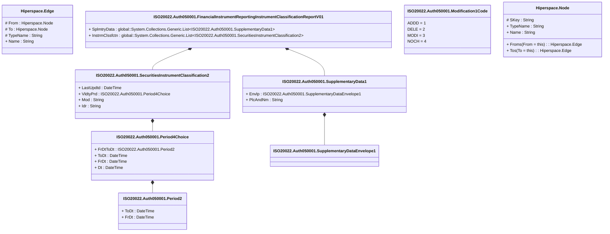

# auth.050.001.01

> The tables below contain descriptions of the members of each Element. 
> The first column indicates the type of the member:
> A ‘#’ indicates that the field is a key to the element, and a ‘+’ indicates that the field is a value.
> The ‘*’ column contains a description for the element member.  
> The ‘@’ column contains any properties for the member.
> The ‘=’ column contains calculated values; or in the case of an enum, the serialized value.

---

## View Hiperspace.Edge
edge between nodes

| |Name|Type|*|@|=|
|-|-|-|-|-|-|
|#|From|Hiperspace.Node||||
|#|To|Hiperspace.Node||||
|#|TypeName|String||||
|+|Name|String||||

---

## Type ISO20022.Auth050001.Document

| |Name|Type|*|@|=|
|-|-|-|-|-|-|
|+|FinInstrmRptgInstrmClssfctnRpt|ISO20022.Auth050001.FinancialInstrumentReportingInstrumentClassificationReportV01||XmlElement()||
||Validation|Some(String)||XmlIgnore(), JsonIgnore()|validation(validElement(FinInstrmRptgInstrmClssfctnRpt))|

---

## Aspect ISO20022.Auth050001.FinancialInstrumentReportingInstrumentClassificationReportV01

| |Name|Type|*|@|=|
|-|-|-|-|-|-|
|+|SplmtryData|global::System.Collections.Generic.List<ISO20022.Auth050001.SupplementaryData1>||XmlElement()||
|+|InstrmClssfctn|global::System.Collections.Generic.List<ISO20022.Auth050001.SecuritiesInstrumentClassification2>||XmlElement()||
||Validation|Some(String)||XmlIgnore(), JsonIgnore()|validation(validList("""SplmtryData""",SplmtryData),validElement(SplmtryData),validRequired("""InstrmClssfctn""",InstrmClssfctn),validList("""InstrmClssfctn""",InstrmClssfctn),validElement(InstrmClssfctn))|

---

## Enum ISO20022.Auth050001.Modification1Code

| |Name|Type|*|@|=|
|-|-|-|-|-|-|
||ADDD|Int32||XmlEnum("""ADDD""")|1|
||DELE|Int32||XmlEnum("""DELE""")|2|
||MODI|Int32||XmlEnum("""MODI""")|3|
||NOCH|Int32||XmlEnum("""NOCH""")|4|

---

## Value ISO20022.Auth050001.Period2

| |Name|Type|*|@|=|
|-|-|-|-|-|-|
|+|ToDt|DateTime||XmlElement()||
|+|FrDt|DateTime||XmlElement()||
||Validation|Some(String)||XmlIgnore(), JsonIgnore()|""|

---

## Value ISO20022.Auth050001.Period4Choice

| |Name|Type|*|@|=|
|-|-|-|-|-|-|
|+|FrDtToDt|ISO20022.Auth050001.Period2||XmlElement()||
|+|ToDt|DateTime||XmlElement()||
|+|FrDt|DateTime||XmlElement()||
|+|Dt|DateTime||XmlElement()||
||Validation|Some(String)||XmlIgnore(), JsonIgnore()|validation(validElement(FrDtToDt),validChoice(FrDtToDt,ToDt,FrDt,Dt))|

---

## Value ISO20022.Auth050001.SecuritiesInstrumentClassification2

| |Name|Type|*|@|=|
|-|-|-|-|-|-|
|+|LastUpdtd|DateTime||XmlElement()||
|+|VldtyPrd|ISO20022.Auth050001.Period4Choice||XmlElement()||
|+|Mod|String||XmlElement()||
|+|Idr|String||XmlElement()||
||Validation|Some(String)||XmlIgnore(), JsonIgnore()|validation(validElement(VldtyPrd),validPattern("""Idr""",Idr,"""[A-Z]{6,6}"""))|

---

## Value ISO20022.Auth050001.SupplementaryData1

| |Name|Type|*|@|=|
|-|-|-|-|-|-|
|+|Envlp|ISO20022.Auth050001.SupplementaryDataEnvelope1||XmlElement()||
|+|PlcAndNm|String||XmlElement()||
||Validation|Some(String)||XmlIgnore(), JsonIgnore()|validation(validElement(Envlp))|

---

## Value ISO20022.Auth050001.SupplementaryDataEnvelope1

| |Name|Type|*|@|=|
|-|-|-|-|-|-|
||Validation|Some(String)||XmlIgnore(), JsonIgnore()|""|

---

## View Hiperspace.Node
node in a graph view of data

| |Name|Type|*|@|=|
|-|-|-|-|-|-|
|#|SKey|String||||
|+|TypeName|String||||
|+|Name|String||||
||Froms|Hiperspace.Edge|||From = this|
||Tos|Hiperspace.Edge|||To = this|

