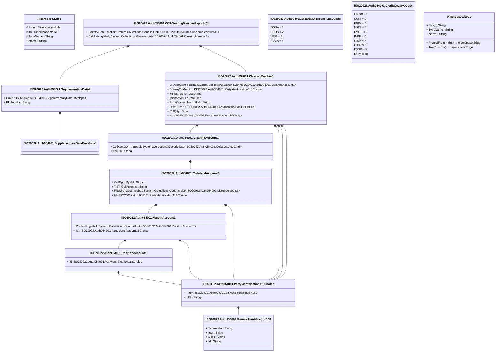

# auth.054.001.01

> The tables below contain descriptions of the members of each Element. 
> The first column indicates the type of the member:
> A ‘#’ indicates that the field is a key to the element, and a ‘+’ indicates that the field is a value.
> The ‘*’ column contains a description for the element member.  
> The ‘@’ column contains any properties for the member.
> The ‘=’ column contains calculated values; or in the case of an enum, the serialized value.

---

## View Hiperspace.Edge
edge between nodes

| |Name|Type|*|@|=|
|-|-|-|-|-|-|
|#|From|Hiperspace.Node||||
|#|To|Hiperspace.Node||||
|#|TypeName|String||||
|+|Name|String||||

---

## Aspect ISO20022.Auth054001.CCPClearingMemberReportV01

| |Name|Type|*|@|=|
|-|-|-|-|-|-|
|+|SplmtryData|global::System.Collections.Generic.List<ISO20022.Auth054001.SupplementaryData1>||XmlElement()||
|+|ClrMmb|global::System.Collections.Generic.List<ISO20022.Auth054001.ClearingMember1>||XmlElement()||
||Validation|Some(String)||XmlIgnore(), JsonIgnore()|validation(validList("""SplmtryData""",SplmtryData),validElement(SplmtryData),validRequired("""ClrMmb""",ClrMmb),validList("""ClrMmb""",ClrMmb),validElement(ClrMmb))|

---

## Value ISO20022.Auth054001.ClearingAccount1

| |Name|Type|*|@|=|
|-|-|-|-|-|-|
|+|CollAcctOwnr|global::System.Collections.Generic.List<ISO20022.Auth054001.CollateralAccount5>||XmlElement()||
|+|AcctTp|String||XmlElement()||
||Validation|Some(String)||XmlIgnore(), JsonIgnore()|validation(validRequired("""CollAcctOwnr""",CollAcctOwnr),validList("""CollAcctOwnr""",CollAcctOwnr),validElement(CollAcctOwnr))|

---

## Enum ISO20022.Auth054001.ClearingAccountType3Code

| |Name|Type|*|@|=|
|-|-|-|-|-|-|
||GOSA|Int32||XmlEnum("""GOSA""")|1|
||HOUS|Int32||XmlEnum("""HOUS""")|2|
||ISEG|Int32||XmlEnum("""ISEG""")|3|
||NOSA|Int32||XmlEnum("""NOSA""")|4|

---

## Value ISO20022.Auth054001.ClearingMember1

| |Name|Type|*|@|=|
|-|-|-|-|-|-|
|+|ClrAcctOwnr|global::System.Collections.Generic.List<ISO20022.Auth054001.ClearingAccount1>||XmlElement()||
|+|SpnsrgClrMmbId|ISO20022.Auth054001.PartyIdentification118Choice||XmlElement()||
|+|MmbshVldTo|DateTime||XmlElement()||
|+|MmbshVldFr|DateTime||XmlElement()||
|+|FutrsComssnMrchntInd|String||XmlElement()||
|+|UltmtPrntId|ISO20022.Auth054001.PartyIdentification118Choice||XmlElement()||
|+|CdtQlty|String||XmlElement()||
|+|Id|ISO20022.Auth054001.PartyIdentification118Choice||XmlElement()||
||Validation|Some(String)||XmlIgnore(), JsonIgnore()|validation(validRequired("""ClrAcctOwnr""",ClrAcctOwnr),validList("""ClrAcctOwnr""",ClrAcctOwnr),validElement(ClrAcctOwnr),validElement(SpnsrgClrMmbId),validElement(UltmtPrntId),validElement(Id))|

---

## Value ISO20022.Auth054001.CollateralAccount5

| |Name|Type|*|@|=|
|-|-|-|-|-|-|
|+|CollSgrtnByVal|String||XmlElement()||
|+|TitlTrfCollArrgmnt|String||XmlElement()||
|+|RltdMrgnAcct|global::System.Collections.Generic.List<ISO20022.Auth054001.MarginAccount1>||XmlElement()||
|+|Id|ISO20022.Auth054001.PartyIdentification118Choice||XmlElement()||
||Validation|Some(String)||XmlIgnore(), JsonIgnore()|validation(validRequired("""RltdMrgnAcct""",RltdMrgnAcct),validList("""RltdMrgnAcct""",RltdMrgnAcct),validElement(RltdMrgnAcct),validElement(Id))|

---

## Enum ISO20022.Auth054001.CreditQuality1Code

| |Name|Type|*|@|=|
|-|-|-|-|-|-|
||UMGR|Int32||XmlEnum("""UMGR""")|1|
||SURI|Int32||XmlEnum("""SURI""")|2|
||PRIM|Int32||XmlEnum("""PRIM""")|3|
||NIGS|Int32||XmlEnum("""NIGS""")|4|
||LMGR|Int32||XmlEnum("""LMGR""")|5|
||INDF|Int32||XmlEnum("""INDF""")|6|
||HISP|Int32||XmlEnum("""HISP""")|7|
||HIGR|Int32||XmlEnum("""HIGR""")|8|
||EXSP|Int32||XmlEnum("""EXSP""")|9|
||DFIM|Int32||XmlEnum("""DFIM""")|10|

---

## Type ISO20022.Auth054001.Document

| |Name|Type|*|@|=|
|-|-|-|-|-|-|
|+|CCPClrMmbRpt|ISO20022.Auth054001.CCPClearingMemberReportV01||XmlElement()||
||Validation|Some(String)||XmlIgnore(), JsonIgnore()|validation(validElement(CCPClrMmbRpt))|

---

## Value ISO20022.Auth054001.GenericIdentification168

| |Name|Type|*|@|=|
|-|-|-|-|-|-|
|+|SchmeNm|String||XmlElement()||
|+|Issr|String||XmlElement()||
|+|Desc|String||XmlElement()||
|+|Id|String||XmlElement()||
||Validation|Some(String)||XmlIgnore(), JsonIgnore()|""|

---

## Value ISO20022.Auth054001.MarginAccount1

| |Name|Type|*|@|=|
|-|-|-|-|-|-|
|+|PosAcct|global::System.Collections.Generic.List<ISO20022.Auth054001.PositionAccount1>||XmlElement()||
|+|Id|ISO20022.Auth054001.PartyIdentification118Choice||XmlElement()||
||Validation|Some(String)||XmlIgnore(), JsonIgnore()|validation(validRequired("""PosAcct""",PosAcct),validList("""PosAcct""",PosAcct),validElement(PosAcct),validElement(Id))|

---

## Value ISO20022.Auth054001.PartyIdentification118Choice

| |Name|Type|*|@|=|
|-|-|-|-|-|-|
|+|Prtry|ISO20022.Auth054001.GenericIdentification168||XmlElement()||
|+|LEI|String||XmlElement()||
||Validation|Some(String)||XmlIgnore(), JsonIgnore()|validation(validElement(Prtry),validPattern("""LEI""",LEI,"""[A-Z0-9]{18,18}[0-9]{2,2}"""),validChoice(Prtry,LEI))|

---

## Value ISO20022.Auth054001.PositionAccount1

| |Name|Type|*|@|=|
|-|-|-|-|-|-|
|+|Id|ISO20022.Auth054001.PartyIdentification118Choice||XmlElement()||
||Validation|Some(String)||XmlIgnore(), JsonIgnore()|validation(validElement(Id))|

---

## Value ISO20022.Auth054001.SupplementaryData1

| |Name|Type|*|@|=|
|-|-|-|-|-|-|
|+|Envlp|ISO20022.Auth054001.SupplementaryDataEnvelope1||XmlElement()||
|+|PlcAndNm|String||XmlElement()||
||Validation|Some(String)||XmlIgnore(), JsonIgnore()|validation(validElement(Envlp))|

---

## Value ISO20022.Auth054001.SupplementaryDataEnvelope1

| |Name|Type|*|@|=|
|-|-|-|-|-|-|
||Validation|Some(String)||XmlIgnore(), JsonIgnore()|""|

---

## View Hiperspace.Node
node in a graph view of data

| |Name|Type|*|@|=|
|-|-|-|-|-|-|
|#|SKey|String||||
|+|TypeName|String||||
|+|Name|String||||
||Froms|Hiperspace.Edge|||From = this|
||Tos|Hiperspace.Edge|||To = this|

