# auth.055.001.01-physical

```mermaid
classDiagram
    class ISO20022.Auth055001.Document {
        # Uri  : String
        + CCPMmbRqrmntsRpt () : ISO20022.Auth055001.CCPMemberRequirementsReportV01
        + Validation () = validation(validElement(CCPMmbRqrmntsRpt))
    }
    class ISO20022.Auth055001.CCPMemberRequirementsReportV01 {
        # owner  : ISO20022.Auth055001.Document
        + SplmtryData  : List~ISO20022.Auth055001.SupplementaryData1~
        + DfltFndRqrmnt  : List~ISO20022.Auth055001.DefaultFundRequirement1~
        + EndOfDayRqrmnt  : List~ISO20022.Auth055001.EndOfDayRequirement2~
        + IntraDayMrgnCall  : List~ISO20022.Auth055001.IntraDayMarginCall1~
        + IntraDayRqrmntAmt  : List~ISO20022.Auth055001.IntraDayRequirement1~
        + Validation () = validation(validList("""SplmtryData""",SplmtryData),validElement(SplmtryData),validRequired("""DfltFndRqrmnt""",DfltFndRqrmnt),validList("""DfltFndRqrmnt""",DfltFndRqrmnt),validElement(DfltFndRqrmnt),validRequired("""EndOfDayRqrmnt""",EndOfDayRqrmnt),validList("""EndOfDayRqrmnt""",EndOfDayRqrmnt),validElement(EndOfDayRqrmnt),validList("""IntraDayMrgnCall""",IntraDayMrgnCall),validElement(IntraDayMrgnCall),validRequired("""IntraDayRqrmntAmt""",IntraDayRqrmntAmt),validList("""IntraDayRqrmntAmt""",IntraDayRqrmntAmt),validElement(IntraDayRqrmntAmt))
    }
```

> The tables below contain descriptions of the members of each Element. 
> The first column indicates the type of the member:
> A ‘#’ indicates that the field is a key to the element, and a ‘+’ indicates that the field is a value.
> The ‘*’ column contains a description for the element member.  
> The ‘@’ column contains any properties for the member.
> The ‘=’ column contains calculated values; or in the case of an enum, the serialized value.

---

## EntityImpl ISO20022.Auth055001.Document

| |Name|Type|*|@|=|
|-|-|-|-|-|-|
|#|Uri|String||XmlIgnore(), JsonIgnore()||
|+|CCPMmbRqrmntsRpt|ISO20022.Auth055001.CCPMemberRequirementsReportV01||XmlElement()||
||Validation|Some(String)||XmlIgnore(), JsonIgnore()|validation(validElement(CCPMmbRqrmntsRpt))|

---

## AspectImpl ISO20022.Auth055001.CCPMemberRequirementsReportV01

| |Name|Type|*|@|=|
|-|-|-|-|-|-|
|#|owner|ISO20022.Auth055001.Document||||
|+|SplmtryData|List<ISO20022.Auth055001.SupplementaryData1>||XmlElement()||
|+|DfltFndRqrmnt|List<ISO20022.Auth055001.DefaultFundRequirement1>||XmlElement()||
|+|EndOfDayRqrmnt|List<ISO20022.Auth055001.EndOfDayRequirement2>||XmlElement()||
|+|IntraDayMrgnCall|List<ISO20022.Auth055001.IntraDayMarginCall1>||XmlElement()||
|+|IntraDayRqrmntAmt|List<ISO20022.Auth055001.IntraDayRequirement1>||XmlElement()||
||Validation|Some(String)||XmlIgnore(), JsonIgnore()|validation(validList("""SplmtryData""",SplmtryData),validElement(SplmtryData),validRequired("""DfltFndRqrmnt""",DfltFndRqrmnt),validList("""DfltFndRqrmnt""",DfltFndRqrmnt),validElement(DfltFndRqrmnt),validRequired("""EndOfDayRqrmnt""",EndOfDayRqrmnt),validList("""EndOfDayRqrmnt""",EndOfDayRqrmnt),validElement(EndOfDayRqrmnt),validList("""IntraDayMrgnCall""",IntraDayMrgnCall),validElement(IntraDayMrgnCall),validRequired("""IntraDayRqrmntAmt""",IntraDayRqrmntAmt),validList("""IntraDayRqrmntAmt""",IntraDayRqrmntAmt),validElement(IntraDayRqrmntAmt))|

