# auth.055.001.01

```mermaid
classDiagram
    class Hiperspace.Edge {
        # From  : Hiperspace.Node
        # To  : Hiperspace.Node
        # TypeName  : String
        + Name  : String
    }
    class ISO20022.Auth055001.ActiveCurrencyAndAmount {
        + Value  : Decimal
        + Ccy  : String
    }
    class ISO20022.Auth055001.Amount3 {
        + RptgAmt  : ISO20022.Auth055001.ActiveCurrencyAndAmount
        + OrgnlAmt  : ISO20022.Auth055001.ActiveCurrencyAndAmount
    }
    ISO20022.Auth055001.Amount3 *-- ISO20022.Auth055001.ActiveCurrencyAndAmount
    ISO20022.Auth055001.Amount3 *-- ISO20022.Auth055001.ActiveCurrencyAndAmount
    class ISO20022.Auth055001.AmountAndDirection102 {
        + Sgn  : String
        + Amt  : ISO20022.Auth055001.ActiveCurrencyAndAmount
    }
    ISO20022.Auth055001.AmountAndDirection102 *-- ISO20022.Auth055001.ActiveCurrencyAndAmount
    class ISO20022.Auth055001.CCPMemberRequirementsReportV01 {
        + SplmtryData  : global::System.Collections.Generic.List~ISO20022.Auth055001.SupplementaryData1~
        + DfltFndRqrmnt  : global::System.Collections.Generic.List~ISO20022.Auth055001.DefaultFundRequirement1~
        + EndOfDayRqrmnt  : global::System.Collections.Generic.List~ISO20022.Auth055001.EndOfDayRequirement2~
        + IntraDayMrgnCall  : global::System.Collections.Generic.List~ISO20022.Auth055001.IntraDayMarginCall1~
        + IntraDayRqrmntAmt  : global::System.Collections.Generic.List~ISO20022.Auth055001.IntraDayRequirement1~
    }
    ISO20022.Auth055001.CCPMemberRequirementsReportV01 *-- ISO20022.Auth055001.SupplementaryData1
    ISO20022.Auth055001.CCPMemberRequirementsReportV01 *-- ISO20022.Auth055001.DefaultFundRequirement1
    ISO20022.Auth055001.CCPMemberRequirementsReportV01 *-- ISO20022.Auth055001.EndOfDayRequirement2
    ISO20022.Auth055001.CCPMemberRequirementsReportV01 *-- ISO20022.Auth055001.IntraDayMarginCall1
    ISO20022.Auth055001.CCPMemberRequirementsReportV01 *-- ISO20022.Auth055001.IntraDayRequirement1
    class ISO20022.Auth055001.DefaultFundRequirement1 {
        + Amt  : ISO20022.Auth055001.ActiveCurrencyAndAmount
        + SvcId  : String
        + ClrMmbId  : ISO20022.Auth055001.GenericIdentification165
    }
    ISO20022.Auth055001.DefaultFundRequirement1 *-- ISO20022.Auth055001.ActiveCurrencyAndAmount
    ISO20022.Auth055001.DefaultFundRequirement1 *-- ISO20022.Auth055001.GenericIdentification165
    class ISO20022.Auth055001.EndOfDayRequirement2 {
        + MrgnAcctId  : ISO20022.Auth055001.GenericIdentification165
        + VartnMrgnRqrmnts  : ISO20022.Auth055001.AmountAndDirection102
        + InitlMrgnRqrmnts  : ISO20022.Auth055001.InitialMarginRequirement1
    }
    ISO20022.Auth055001.EndOfDayRequirement2 *-- ISO20022.Auth055001.GenericIdentification165
    ISO20022.Auth055001.EndOfDayRequirement2 *-- ISO20022.Auth055001.AmountAndDirection102
    ISO20022.Auth055001.EndOfDayRequirement2 *-- ISO20022.Auth055001.InitialMarginRequirement1
    class ISO20022.Auth055001.GenericIdentification165 {
        + SchmeNm  : String
        + Issr  : String
        + Desc  : String
        + Id  : String
    }
    class ISO20022.Auth055001.GenericIdentification36 {
        + SchmeNm  : String
        + Issr  : String
        + Id  : String
    }
    class ISO20022.Auth055001.InitialMarginExposure1 {
        + CoreInd  : String
        + Tp  : ISO20022.Auth055001.MarginType2Choice
        + Amt  : ISO20022.Auth055001.Amount3
    }
    ISO20022.Auth055001.InitialMarginExposure1 *-- ISO20022.Auth055001.MarginType2Choice
    ISO20022.Auth055001.InitialMarginExposure1 *-- ISO20022.Auth055001.Amount3
    class ISO20022.Auth055001.InitialMarginRequirement1 {
        + Cdt  : ISO20022.Auth055001.ActiveCurrencyAndAmount
        + InitlMrgnXpsr  : global::System.Collections.Generic.List~ISO20022.Auth055001.InitialMarginExposure1~
    }
    ISO20022.Auth055001.InitialMarginRequirement1 *-- ISO20022.Auth055001.ActiveCurrencyAndAmount
    ISO20022.Auth055001.InitialMarginRequirement1 *-- ISO20022.Auth055001.InitialMarginExposure1
    class ISO20022.Auth055001.IntraDayMarginCall1 {
        + TmStmp  : DateTime
        + IntraDayCall  : ISO20022.Auth055001.ActiveCurrencyAndAmount
        + MrgnAcctId  : ISO20022.Auth055001.GenericIdentification165
    }
    ISO20022.Auth055001.IntraDayMarginCall1 *-- ISO20022.Auth055001.ActiveCurrencyAndAmount
    ISO20022.Auth055001.IntraDayMarginCall1 *-- ISO20022.Auth055001.GenericIdentification165
    class ISO20022.Auth055001.IntraDayRequirement1 {
        + MrgnAcctId  : ISO20022.Auth055001.GenericIdentification165
        + AggtPeakLblty  : ISO20022.Auth055001.ActiveCurrencyAndAmount
        + PeakVartnMrgnLblty  : ISO20022.Auth055001.ActiveCurrencyAndAmount
        + PeakInitlMrgnLblty  : ISO20022.Auth055001.ActiveCurrencyAndAmount
        + IntraDayMrgnCall  : ISO20022.Auth055001.ActiveCurrencyAndAmount
    }
    ISO20022.Auth055001.IntraDayRequirement1 *-- ISO20022.Auth055001.GenericIdentification165
    ISO20022.Auth055001.IntraDayRequirement1 *-- ISO20022.Auth055001.ActiveCurrencyAndAmount
    ISO20022.Auth055001.IntraDayRequirement1 *-- ISO20022.Auth055001.ActiveCurrencyAndAmount
    ISO20022.Auth055001.IntraDayRequirement1 *-- ISO20022.Auth055001.ActiveCurrencyAndAmount
    ISO20022.Auth055001.IntraDayRequirement1 *-- ISO20022.Auth055001.ActiveCurrencyAndAmount
    class ISO20022.Auth055001.MarginType2Choice {
        + Prtry  : ISO20022.Auth055001.GenericIdentification36
        + Cd  : String
    }
    ISO20022.Auth055001.MarginType2Choice *-- ISO20022.Auth055001.GenericIdentification36
    class ISO20022.Auth055001.MarginType2Code {
        OTHR = 1
        DRAO = 2
        JTDR = 3
        SPMA = 4
        CVMA = 5
        CRAM = 6
        LIRM = 7
        BARM = 8
        WWRM = 9
        SORM = 10
        MARM = 11
        UFMA = 12
        SCMA = 13
        SEMA = 14
        CEMA = 15
        COMA = 16
        ADFM = 17
    }
    class ISO20022.Auth055001.SchemeIdentificationType1Code {
        CLIM = 1
        POSI = 2
        COLL = 3
        MARG = 4
    }
    class ISO20022.Auth055001.SupplementaryData1 {
        + Envlp  : ISO20022.Auth055001.SupplementaryDataEnvelope1
        + PlcAndNm  : String
    }
    ISO20022.Auth055001.SupplementaryData1 *-- ISO20022.Auth055001.SupplementaryDataEnvelope1
    class ISO20022.Auth055001.SupplementaryDataEnvelope1 {
    }
    class Hiperspace.Node {
        # SKey  : String
        + TypeName  : String
        + Name  : String
        + Froms (From = this) : Hiperspace.Edge
        + Tos (To = this) : Hiperspace.Edge
    }
```

> The tables below contain descriptions of the members of each Element. 
> The first column indicates the type of the member:
> A ‘#’ indicates that the field is a key to the element, and a ‘+’ indicates that the field is a value.
> The ‘*’ column contains a description for the element member.  
> The ‘@’ column contains any properties for the member.
> The ‘=’ column contains calculated values; or in the case of an enum, the serialized value.

---

## View Hiperspace.Edge
edge between nodes

| |Name|Type|*|@|=|
|-|-|-|-|-|-|
|#|From|Hiperspace.Node||||
|#|To|Hiperspace.Node||||
|#|TypeName|String||||
|+|Name|String||||

---

## Value ISO20022.Auth055001.ActiveCurrencyAndAmount

| |Name|Type|*|@|=|
|-|-|-|-|-|-|
|+|Value|Decimal||XmlElement()||
|+|Ccy|String||XmlAttribute()||
||Validation|Some(String)||XmlIgnore(), JsonIgnore()|validation(validRequired("""Value""",Value),validRequired("""Ccy""",Ccy),validPattern("""Ccy""",Ccy,"""[A-Z]{3,3}"""))|

---

## Value ISO20022.Auth055001.Amount3

| |Name|Type|*|@|=|
|-|-|-|-|-|-|
|+|RptgAmt|ISO20022.Auth055001.ActiveCurrencyAndAmount||XmlElement()||
|+|OrgnlAmt|ISO20022.Auth055001.ActiveCurrencyAndAmount||XmlElement()||
||Validation|Some(String)||XmlIgnore(), JsonIgnore()|validation(validElement(RptgAmt),validElement(OrgnlAmt))|

---

## Value ISO20022.Auth055001.AmountAndDirection102

| |Name|Type|*|@|=|
|-|-|-|-|-|-|
|+|Sgn|String||XmlElement()||
|+|Amt|ISO20022.Auth055001.ActiveCurrencyAndAmount||XmlElement()||
||Validation|Some(String)||XmlIgnore(), JsonIgnore()|validation(validElement(Amt))|

---

## Aspect ISO20022.Auth055001.CCPMemberRequirementsReportV01

| |Name|Type|*|@|=|
|-|-|-|-|-|-|
|+|SplmtryData|global::System.Collections.Generic.List<ISO20022.Auth055001.SupplementaryData1>||XmlElement()||
|+|DfltFndRqrmnt|global::System.Collections.Generic.List<ISO20022.Auth055001.DefaultFundRequirement1>||XmlElement()||
|+|EndOfDayRqrmnt|global::System.Collections.Generic.List<ISO20022.Auth055001.EndOfDayRequirement2>||XmlElement()||
|+|IntraDayMrgnCall|global::System.Collections.Generic.List<ISO20022.Auth055001.IntraDayMarginCall1>||XmlElement()||
|+|IntraDayRqrmntAmt|global::System.Collections.Generic.List<ISO20022.Auth055001.IntraDayRequirement1>||XmlElement()||
||Validation|Some(String)||XmlIgnore(), JsonIgnore()|validation(validList("""SplmtryData""",SplmtryData),validElement(SplmtryData),validRequired("""DfltFndRqrmnt""",DfltFndRqrmnt),validList("""DfltFndRqrmnt""",DfltFndRqrmnt),validElement(DfltFndRqrmnt),validRequired("""EndOfDayRqrmnt""",EndOfDayRqrmnt),validList("""EndOfDayRqrmnt""",EndOfDayRqrmnt),validElement(EndOfDayRqrmnt),validList("""IntraDayMrgnCall""",IntraDayMrgnCall),validElement(IntraDayMrgnCall),validRequired("""IntraDayRqrmntAmt""",IntraDayRqrmntAmt),validList("""IntraDayRqrmntAmt""",IntraDayRqrmntAmt),validElement(IntraDayRqrmntAmt))|

---

## Value ISO20022.Auth055001.DefaultFundRequirement1

| |Name|Type|*|@|=|
|-|-|-|-|-|-|
|+|Amt|ISO20022.Auth055001.ActiveCurrencyAndAmount||XmlElement()||
|+|SvcId|String||XmlElement()||
|+|ClrMmbId|ISO20022.Auth055001.GenericIdentification165||XmlElement()||
||Validation|Some(String)||XmlIgnore(), JsonIgnore()|validation(validElement(Amt),validElement(ClrMmbId))|

---

## Type ISO20022.Auth055001.Document

| |Name|Type|*|@|=|
|-|-|-|-|-|-|
|+|CCPMmbRqrmntsRpt|ISO20022.Auth055001.CCPMemberRequirementsReportV01||XmlElement()||
||Validation|Some(String)||XmlIgnore(), JsonIgnore()|validation(validElement(CCPMmbRqrmntsRpt))|

---

## Value ISO20022.Auth055001.EndOfDayRequirement2

| |Name|Type|*|@|=|
|-|-|-|-|-|-|
|+|MrgnAcctId|ISO20022.Auth055001.GenericIdentification165||XmlElement()||
|+|VartnMrgnRqrmnts|ISO20022.Auth055001.AmountAndDirection102||XmlElement()||
|+|InitlMrgnRqrmnts|ISO20022.Auth055001.InitialMarginRequirement1||XmlElement()||
||Validation|Some(String)||XmlIgnore(), JsonIgnore()|validation(validElement(MrgnAcctId),validElement(VartnMrgnRqrmnts),validElement(InitlMrgnRqrmnts))|

---

## Value ISO20022.Auth055001.GenericIdentification165

| |Name|Type|*|@|=|
|-|-|-|-|-|-|
|+|SchmeNm|String||XmlElement()||
|+|Issr|String||XmlElement()||
|+|Desc|String||XmlElement()||
|+|Id|String||XmlElement()||
||Validation|Some(String)||XmlIgnore(), JsonIgnore()|""|

---

## Value ISO20022.Auth055001.GenericIdentification36

| |Name|Type|*|@|=|
|-|-|-|-|-|-|
|+|SchmeNm|String||XmlElement()||
|+|Issr|String||XmlElement()||
|+|Id|String||XmlElement()||
||Validation|Some(String)||XmlIgnore(), JsonIgnore()|""|

---

## Value ISO20022.Auth055001.InitialMarginExposure1

| |Name|Type|*|@|=|
|-|-|-|-|-|-|
|+|CoreInd|String||XmlElement()||
|+|Tp|ISO20022.Auth055001.MarginType2Choice||XmlElement()||
|+|Amt|ISO20022.Auth055001.Amount3||XmlElement()||
||Validation|Some(String)||XmlIgnore(), JsonIgnore()|validation(validElement(Tp),validElement(Amt))|

---

## Value ISO20022.Auth055001.InitialMarginRequirement1

| |Name|Type|*|@|=|
|-|-|-|-|-|-|
|+|Cdt|ISO20022.Auth055001.ActiveCurrencyAndAmount||XmlElement()||
|+|InitlMrgnXpsr|global::System.Collections.Generic.List<ISO20022.Auth055001.InitialMarginExposure1>||XmlElement()||
||Validation|Some(String)||XmlIgnore(), JsonIgnore()|validation(validElement(Cdt),validRequired("""InitlMrgnXpsr""",InitlMrgnXpsr),validList("""InitlMrgnXpsr""",InitlMrgnXpsr),validElement(InitlMrgnXpsr))|

---

## Value ISO20022.Auth055001.IntraDayMarginCall1

| |Name|Type|*|@|=|
|-|-|-|-|-|-|
|+|TmStmp|DateTime||XmlElement()||
|+|IntraDayCall|ISO20022.Auth055001.ActiveCurrencyAndAmount||XmlElement()||
|+|MrgnAcctId|ISO20022.Auth055001.GenericIdentification165||XmlElement()||
||Validation|Some(String)||XmlIgnore(), JsonIgnore()|validation(validElement(IntraDayCall),validElement(MrgnAcctId))|

---

## Value ISO20022.Auth055001.IntraDayRequirement1

| |Name|Type|*|@|=|
|-|-|-|-|-|-|
|+|MrgnAcctId|ISO20022.Auth055001.GenericIdentification165||XmlElement()||
|+|AggtPeakLblty|ISO20022.Auth055001.ActiveCurrencyAndAmount||XmlElement()||
|+|PeakVartnMrgnLblty|ISO20022.Auth055001.ActiveCurrencyAndAmount||XmlElement()||
|+|PeakInitlMrgnLblty|ISO20022.Auth055001.ActiveCurrencyAndAmount||XmlElement()||
|+|IntraDayMrgnCall|ISO20022.Auth055001.ActiveCurrencyAndAmount||XmlElement()||
||Validation|Some(String)||XmlIgnore(), JsonIgnore()|validation(validElement(MrgnAcctId),validElement(AggtPeakLblty),validElement(PeakVartnMrgnLblty),validElement(PeakInitlMrgnLblty),validElement(IntraDayMrgnCall))|

---

## Value ISO20022.Auth055001.MarginType2Choice

| |Name|Type|*|@|=|
|-|-|-|-|-|-|
|+|Prtry|ISO20022.Auth055001.GenericIdentification36||XmlElement()||
|+|Cd|String||XmlElement()||
||Validation|Some(String)||XmlIgnore(), JsonIgnore()|validation(validElement(Prtry),validChoice(Prtry,Cd))|

---

## Enum ISO20022.Auth055001.MarginType2Code

| |Name|Type|*|@|=|
|-|-|-|-|-|-|
||OTHR|Int32||XmlEnum("""OTHR""")|1|
||DRAO|Int32||XmlEnum("""DRAO""")|2|
||JTDR|Int32||XmlEnum("""JTDR""")|3|
||SPMA|Int32||XmlEnum("""SPMA""")|4|
||CVMA|Int32||XmlEnum("""CVMA""")|5|
||CRAM|Int32||XmlEnum("""CRAM""")|6|
||LIRM|Int32||XmlEnum("""LIRM""")|7|
||BARM|Int32||XmlEnum("""BARM""")|8|
||WWRM|Int32||XmlEnum("""WWRM""")|9|
||SORM|Int32||XmlEnum("""SORM""")|10|
||MARM|Int32||XmlEnum("""MARM""")|11|
||UFMA|Int32||XmlEnum("""UFMA""")|12|
||SCMA|Int32||XmlEnum("""SCMA""")|13|
||SEMA|Int32||XmlEnum("""SEMA""")|14|
||CEMA|Int32||XmlEnum("""CEMA""")|15|
||COMA|Int32||XmlEnum("""COMA""")|16|
||ADFM|Int32||XmlEnum("""ADFM""")|17|

---

## Enum ISO20022.Auth055001.SchemeIdentificationType1Code

| |Name|Type|*|@|=|
|-|-|-|-|-|-|
||CLIM|Int32||XmlEnum("""CLIM""")|1|
||POSI|Int32||XmlEnum("""POSI""")|2|
||COLL|Int32||XmlEnum("""COLL""")|3|
||MARG|Int32||XmlEnum("""MARG""")|4|

---

## Value ISO20022.Auth055001.SupplementaryData1

| |Name|Type|*|@|=|
|-|-|-|-|-|-|
|+|Envlp|ISO20022.Auth055001.SupplementaryDataEnvelope1||XmlElement()||
|+|PlcAndNm|String||XmlElement()||
||Validation|Some(String)||XmlIgnore(), JsonIgnore()|validation(validElement(Envlp))|

---

## Value ISO20022.Auth055001.SupplementaryDataEnvelope1

| |Name|Type|*|@|=|
|-|-|-|-|-|-|
||Validation|Some(String)||XmlIgnore(), JsonIgnore()|""|

---

## View Hiperspace.Node
node in a graph view of data

| |Name|Type|*|@|=|
|-|-|-|-|-|-|
|#|SKey|String||||
|+|TypeName|String||||
|+|Name|String||||
||Froms|Hiperspace.Edge|||From = this|
||Tos|Hiperspace.Edge|||To = this|

