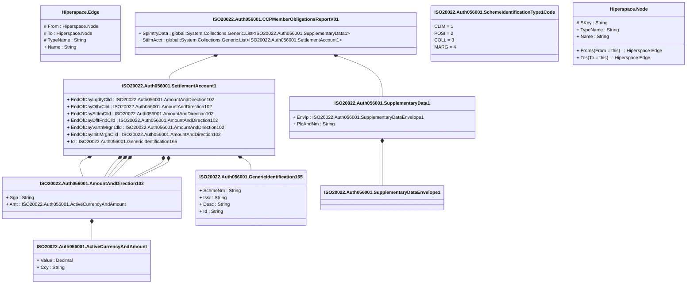

# auth.056.001.01

> The tables below contain descriptions of the members of each Element. 
> The first column indicates the type of the member:
> A ‘#’ indicates that the field is a key to the element, and a ‘+’ indicates that the field is a value.
> The ‘*’ column contains a description for the element member.  
> The ‘@’ column contains any properties for the member.
> The ‘=’ column contains calculated values; or in the case of an enum, the serialized value.

---

## View Hiperspace.Edge
edge between nodes

| |Name|Type|*|@|=|
|-|-|-|-|-|-|
|#|From|Hiperspace.Node||||
|#|To|Hiperspace.Node||||
|#|TypeName|String||||
|+|Name|String||||

---

## Value ISO20022.Auth056001.ActiveCurrencyAndAmount

| |Name|Type|*|@|=|
|-|-|-|-|-|-|
|+|Value|Decimal||XmlElement()||
|+|Ccy|String||XmlAttribute()||
||Validation|Some(String)||XmlIgnore(), JsonIgnore()|validation(validRequired("""Value""",Value),validRequired("""Ccy""",Ccy),validPattern("""Ccy""",Ccy,"""[A-Z]{3,3}"""))|

---

## Value ISO20022.Auth056001.AmountAndDirection102

| |Name|Type|*|@|=|
|-|-|-|-|-|-|
|+|Sgn|String||XmlElement()||
|+|Amt|ISO20022.Auth056001.ActiveCurrencyAndAmount||XmlElement()||
||Validation|Some(String)||XmlIgnore(), JsonIgnore()|validation(validElement(Amt))|

---

## Aspect ISO20022.Auth056001.CCPMemberObligationsReportV01

| |Name|Type|*|@|=|
|-|-|-|-|-|-|
|+|SplmtryData|global::System.Collections.Generic.List<ISO20022.Auth056001.SupplementaryData1>||XmlElement()||
|+|SttlmAcct|global::System.Collections.Generic.List<ISO20022.Auth056001.SettlementAccount1>||XmlElement()||
||Validation|Some(String)||XmlIgnore(), JsonIgnore()|validation(validList("""SplmtryData""",SplmtryData),validElement(SplmtryData),validRequired("""SttlmAcct""",SttlmAcct),validList("""SttlmAcct""",SttlmAcct),validElement(SttlmAcct))|

---

## Type ISO20022.Auth056001.Document

| |Name|Type|*|@|=|
|-|-|-|-|-|-|
|+|CCPMmbOblgtnsRpt|ISO20022.Auth056001.CCPMemberObligationsReportV01||XmlElement()||
||Validation|Some(String)||XmlIgnore(), JsonIgnore()|validation(validElement(CCPMmbOblgtnsRpt))|

---

## Value ISO20022.Auth056001.GenericIdentification165

| |Name|Type|*|@|=|
|-|-|-|-|-|-|
|+|SchmeNm|String||XmlElement()||
|+|Issr|String||XmlElement()||
|+|Desc|String||XmlElement()||
|+|Id|String||XmlElement()||
||Validation|Some(String)||XmlIgnore(), JsonIgnore()|""|

---

## Enum ISO20022.Auth056001.SchemeIdentificationType1Code

| |Name|Type|*|@|=|
|-|-|-|-|-|-|
||CLIM|Int32||XmlEnum("""CLIM""")|1|
||POSI|Int32||XmlEnum("""POSI""")|2|
||COLL|Int32||XmlEnum("""COLL""")|3|
||MARG|Int32||XmlEnum("""MARG""")|4|

---

## Value ISO20022.Auth056001.SettlementAccount1

| |Name|Type|*|@|=|
|-|-|-|-|-|-|
|+|EndOfDayLqdtyClld|ISO20022.Auth056001.AmountAndDirection102||XmlElement()||
|+|EndOfDayOthrClld|ISO20022.Auth056001.AmountAndDirection102||XmlElement()||
|+|EndOfDaySttlmClld|ISO20022.Auth056001.AmountAndDirection102||XmlElement()||
|+|EndOfDayDfltFndClld|ISO20022.Auth056001.AmountAndDirection102||XmlElement()||
|+|EndOfDayVartnMrgnClld|ISO20022.Auth056001.AmountAndDirection102||XmlElement()||
|+|EndOfDayInitlMrgnClld|ISO20022.Auth056001.AmountAndDirection102||XmlElement()||
|+|Id|ISO20022.Auth056001.GenericIdentification165||XmlElement()||
||Validation|Some(String)||XmlIgnore(), JsonIgnore()|validation(validElement(EndOfDayLqdtyClld),validElement(EndOfDayOthrClld),validElement(EndOfDaySttlmClld),validElement(EndOfDayDfltFndClld),validElement(EndOfDayVartnMrgnClld),validElement(EndOfDayInitlMrgnClld),validElement(Id))|

---

## Value ISO20022.Auth056001.SupplementaryData1

| |Name|Type|*|@|=|
|-|-|-|-|-|-|
|+|Envlp|ISO20022.Auth056001.SupplementaryDataEnvelope1||XmlElement()||
|+|PlcAndNm|String||XmlElement()||
||Validation|Some(String)||XmlIgnore(), JsonIgnore()|validation(validElement(Envlp))|

---

## Value ISO20022.Auth056001.SupplementaryDataEnvelope1

| |Name|Type|*|@|=|
|-|-|-|-|-|-|
||Validation|Some(String)||XmlIgnore(), JsonIgnore()|""|

---

## View Hiperspace.Node
node in a graph view of data

| |Name|Type|*|@|=|
|-|-|-|-|-|-|
|#|SKey|String||||
|+|TypeName|String||||
|+|Name|String||||
||Froms|Hiperspace.Edge|||From = this|
||Tos|Hiperspace.Edge|||To = this|

