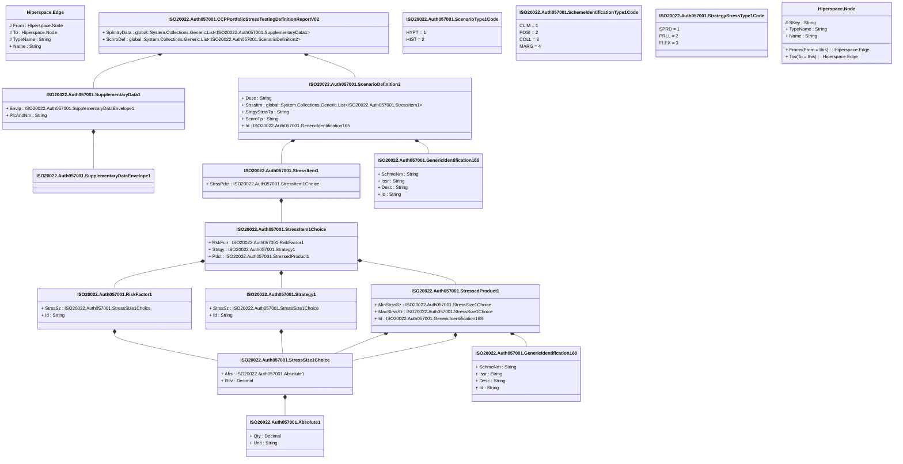

# auth.057.001.02

> The tables below contain descriptions of the members of each Element. 
> The first column indicates the type of the member:
> A ‘#’ indicates that the field is a key to the element, and a ‘+’ indicates that the field is a value.
> The ‘*’ column contains a description for the element member.  
> The ‘@’ column contains any properties for the member.
> The ‘=’ column contains calculated values; or in the case of an enum, the serialized value.

---

## View Hiperspace.Edge
edge between nodes

| |Name|Type|*|@|=|
|-|-|-|-|-|-|
|#|From|Hiperspace.Node||||
|#|To|Hiperspace.Node||||
|#|TypeName|String||||
|+|Name|String||||

---

## Value ISO20022.Auth057001.Absolute1

| |Name|Type|*|@|=|
|-|-|-|-|-|-|
|+|Qty|Decimal||XmlElement()||
|+|Unit|String||XmlElement()||
||Validation|Some(String)||XmlIgnore(), JsonIgnore()|""|

---

## Aspect ISO20022.Auth057001.CCPPortfolioStressTestingDefinitionReportV02

| |Name|Type|*|@|=|
|-|-|-|-|-|-|
|+|SplmtryData|global::System.Collections.Generic.List<ISO20022.Auth057001.SupplementaryData1>||XmlElement()||
|+|ScnroDef|global::System.Collections.Generic.List<ISO20022.Auth057001.ScenarioDefinition2>||XmlElement()||
||Validation|Some(String)||XmlIgnore(), JsonIgnore()|validation(validList("""SplmtryData""",SplmtryData),validElement(SplmtryData),validRequired("""ScnroDef""",ScnroDef),validList("""ScnroDef""",ScnroDef),validElement(ScnroDef))|

---

## Type ISO20022.Auth057001.Document

| |Name|Type|*|@|=|
|-|-|-|-|-|-|
|+|CCPPrtflStrssTstgDefRpt|ISO20022.Auth057001.CCPPortfolioStressTestingDefinitionReportV02||XmlElement()||
||Validation|Some(String)||XmlIgnore(), JsonIgnore()|validation(validElement(CCPPrtflStrssTstgDefRpt))|

---

## Value ISO20022.Auth057001.GenericIdentification165

| |Name|Type|*|@|=|
|-|-|-|-|-|-|
|+|SchmeNm|String||XmlElement()||
|+|Issr|String||XmlElement()||
|+|Desc|String||XmlElement()||
|+|Id|String||XmlElement()||
||Validation|Some(String)||XmlIgnore(), JsonIgnore()|""|

---

## Value ISO20022.Auth057001.GenericIdentification168

| |Name|Type|*|@|=|
|-|-|-|-|-|-|
|+|SchmeNm|String||XmlElement()||
|+|Issr|String||XmlElement()||
|+|Desc|String||XmlElement()||
|+|Id|String||XmlElement()||
||Validation|Some(String)||XmlIgnore(), JsonIgnore()|""|

---

## Value ISO20022.Auth057001.RiskFactor1

| |Name|Type|*|@|=|
|-|-|-|-|-|-|
|+|StrssSz|ISO20022.Auth057001.StressSize1Choice||XmlElement()||
|+|Id|String||XmlElement()||
||Validation|Some(String)||XmlIgnore(), JsonIgnore()|validation(validElement(StrssSz))|

---

## Value ISO20022.Auth057001.ScenarioDefinition2

| |Name|Type|*|@|=|
|-|-|-|-|-|-|
|+|Desc|String||XmlElement()||
|+|StrssItm|global::System.Collections.Generic.List<ISO20022.Auth057001.StressItem1>||XmlElement()||
|+|StrtgyStrssTp|String||XmlElement()||
|+|ScnroTp|String||XmlElement()||
|+|Id|ISO20022.Auth057001.GenericIdentification165||XmlElement()||
||Validation|Some(String)||XmlIgnore(), JsonIgnore()|validation(validRequired("""StrssItm""",StrssItm),validList("""StrssItm""",StrssItm),validElement(StrssItm),validElement(Id))|

---

## Enum ISO20022.Auth057001.ScenarioType1Code

| |Name|Type|*|@|=|
|-|-|-|-|-|-|
||HYPT|Int32||XmlEnum("""HYPT""")|1|
||HIST|Int32||XmlEnum("""HIST""")|2|

---

## Enum ISO20022.Auth057001.SchemeIdentificationType1Code

| |Name|Type|*|@|=|
|-|-|-|-|-|-|
||CLIM|Int32||XmlEnum("""CLIM""")|1|
||POSI|Int32||XmlEnum("""POSI""")|2|
||COLL|Int32||XmlEnum("""COLL""")|3|
||MARG|Int32||XmlEnum("""MARG""")|4|

---

## Value ISO20022.Auth057001.Strategy1

| |Name|Type|*|@|=|
|-|-|-|-|-|-|
|+|StrssSz|ISO20022.Auth057001.StressSize1Choice||XmlElement()||
|+|Id|String||XmlElement()||
||Validation|Some(String)||XmlIgnore(), JsonIgnore()|validation(validElement(StrssSz))|

---

## Enum ISO20022.Auth057001.StrategyStressType1Code

| |Name|Type|*|@|=|
|-|-|-|-|-|-|
||SPRD|Int32||XmlEnum("""SPRD""")|1|
||PRLL|Int32||XmlEnum("""PRLL""")|2|
||FLEX|Int32||XmlEnum("""FLEX""")|3|

---

## Value ISO20022.Auth057001.StressItem1

| |Name|Type|*|@|=|
|-|-|-|-|-|-|
|+|StrssPdct|ISO20022.Auth057001.StressItem1Choice||XmlElement()||
||Validation|Some(String)||XmlIgnore(), JsonIgnore()|validation(validElement(StrssPdct))|

---

## Value ISO20022.Auth057001.StressItem1Choice

| |Name|Type|*|@|=|
|-|-|-|-|-|-|
|+|RskFctr|ISO20022.Auth057001.RiskFactor1||XmlElement()||
|+|Strtgy|ISO20022.Auth057001.Strategy1||XmlElement()||
|+|Pdct|ISO20022.Auth057001.StressedProduct1||XmlElement()||
||Validation|Some(String)||XmlIgnore(), JsonIgnore()|validation(validElement(RskFctr),validElement(Strtgy),validElement(Pdct),validChoice(RskFctr,Strtgy,Pdct))|

---

## Value ISO20022.Auth057001.StressSize1Choice

| |Name|Type|*|@|=|
|-|-|-|-|-|-|
|+|Abs|ISO20022.Auth057001.Absolute1||XmlElement()||
|+|Rltv|Decimal||XmlElement()||
||Validation|Some(String)||XmlIgnore(), JsonIgnore()|validation(validElement(Abs),validChoice(Abs,Rltv))|

---

## Value ISO20022.Auth057001.StressedProduct1

| |Name|Type|*|@|=|
|-|-|-|-|-|-|
|+|MinStrssSz|ISO20022.Auth057001.StressSize1Choice||XmlElement()||
|+|MaxStrssSz|ISO20022.Auth057001.StressSize1Choice||XmlElement()||
|+|Id|ISO20022.Auth057001.GenericIdentification168||XmlElement()||
||Validation|Some(String)||XmlIgnore(), JsonIgnore()|validation(validElement(MinStrssSz),validElement(MaxStrssSz),validElement(Id))|

---

## Value ISO20022.Auth057001.SupplementaryData1

| |Name|Type|*|@|=|
|-|-|-|-|-|-|
|+|Envlp|ISO20022.Auth057001.SupplementaryDataEnvelope1||XmlElement()||
|+|PlcAndNm|String||XmlElement()||
||Validation|Some(String)||XmlIgnore(), JsonIgnore()|validation(validElement(Envlp))|

---

## Value ISO20022.Auth057001.SupplementaryDataEnvelope1

| |Name|Type|*|@|=|
|-|-|-|-|-|-|
||Validation|Some(String)||XmlIgnore(), JsonIgnore()|""|

---

## View Hiperspace.Node
node in a graph view of data

| |Name|Type|*|@|=|
|-|-|-|-|-|-|
|#|SKey|String||||
|+|TypeName|String||||
|+|Name|String||||
||Froms|Hiperspace.Edge|||From = this|
||Tos|Hiperspace.Edge|||To = this|

