# auth.059.001.02

```mermaid
classDiagram
    class Hiperspace.Edge {
        # From  : Hiperspace.Node
        # To  : Hiperspace.Node
        # TypeName  : String
        + Name  : String
    }
    class ISO20022.Auth059001.ActiveCurrencyAndAmount {
        + Value  : Decimal
        + Ccy  : String
    }
    class ISO20022.Auth059001.AmountAndDirection102 {
        + Sgn  : String
        + Amt  : ISO20022.Auth059001.ActiveCurrencyAndAmount
    }
    ISO20022.Auth059001.AmountAndDirection102 *-- ISO20022.Auth059001.ActiveCurrencyAndAmount
    class ISO20022.Auth059001.CCPIncomeStatementAndCapitalAdequacyReportV02 {
        + SplmtryData  : global::System.Collections.Generic.List~ISO20022.Auth059001.SupplementaryData1~
        + HpthtclCptlMeasr  : global::System.Collections.Generic.List~ISO20022.Auth059001.HypotheticalCapitalMeasure1~
        + LqdFinRsrcs  : ISO20022.Auth059001.ActiveCurrencyAndAmount
        + TtlCptl  : ISO20022.Auth059001.ActiveCurrencyAndAmount
        + CptlRqrmnts  : ISO20022.Auth059001.CapitalRequirement1
        + IncmStmt  : ISO20022.Auth059001.IncomeStatement2
    }
    ISO20022.Auth059001.CCPIncomeStatementAndCapitalAdequacyReportV02 *-- ISO20022.Auth059001.SupplementaryData1
    ISO20022.Auth059001.CCPIncomeStatementAndCapitalAdequacyReportV02 *-- ISO20022.Auth059001.HypotheticalCapitalMeasure1
    ISO20022.Auth059001.CCPIncomeStatementAndCapitalAdequacyReportV02 *-- ISO20022.Auth059001.ActiveCurrencyAndAmount
    ISO20022.Auth059001.CCPIncomeStatementAndCapitalAdequacyReportV02 *-- ISO20022.Auth059001.ActiveCurrencyAndAmount
    ISO20022.Auth059001.CCPIncomeStatementAndCapitalAdequacyReportV02 *-- ISO20022.Auth059001.CapitalRequirement1
    ISO20022.Auth059001.CCPIncomeStatementAndCapitalAdequacyReportV02 *-- ISO20022.Auth059001.IncomeStatement2
    class ISO20022.Auth059001.CapitalRequirement1 {
        + NtfctnBffr  : Decimal
        + BizRsk  : ISO20022.Auth059001.ActiveCurrencyAndAmount
        + MktRsk  : ISO20022.Auth059001.ActiveCurrencyAndAmount
        + CntrPtyRsk  : ISO20022.Auth059001.ActiveCurrencyAndAmount
        + CdtRsk  : ISO20022.Auth059001.ActiveCurrencyAndAmount
        + OprlAndLglRsk  : ISO20022.Auth059001.ActiveCurrencyAndAmount
        + WndgDwnOrRstrgRsk  : ISO20022.Auth059001.ActiveCurrencyAndAmount
    }
    ISO20022.Auth059001.CapitalRequirement1 *-- ISO20022.Auth059001.ActiveCurrencyAndAmount
    ISO20022.Auth059001.CapitalRequirement1 *-- ISO20022.Auth059001.ActiveCurrencyAndAmount
    ISO20022.Auth059001.CapitalRequirement1 *-- ISO20022.Auth059001.ActiveCurrencyAndAmount
    ISO20022.Auth059001.CapitalRequirement1 *-- ISO20022.Auth059001.ActiveCurrencyAndAmount
    ISO20022.Auth059001.CapitalRequirement1 *-- ISO20022.Auth059001.ActiveCurrencyAndAmount
    ISO20022.Auth059001.CapitalRequirement1 *-- ISO20022.Auth059001.ActiveCurrencyAndAmount
    class ISO20022.Auth059001.ClearingMemberFee1 {
        + ClrFee  : ISO20022.Auth059001.ActiveCurrencyAndAmount
        + ClrMmbId  : ISO20022.Auth059001.PartyIdentification118Choice
    }
    ISO20022.Auth059001.ClearingMemberFee1 *-- ISO20022.Auth059001.ActiveCurrencyAndAmount
    ISO20022.Auth059001.ClearingMemberFee1 *-- ISO20022.Auth059001.PartyIdentification118Choice
    class ISO20022.Auth059001.GenericIdentification168 {
        + SchmeNm  : String
        + Issr  : String
        + Desc  : String
        + Id  : String
    }
    class ISO20022.Auth059001.HypotheticalCapitalMeasure1 {
        + DfltWtrfllId  : String
        + Amt  : ISO20022.Auth059001.ActiveCurrencyAndAmount
    }
    ISO20022.Auth059001.HypotheticalCapitalMeasure1 *-- ISO20022.Auth059001.ActiveCurrencyAndAmount
    class ISO20022.Auth059001.IncomeStatement2 {
        + PstTaxPrftOrLoss  : ISO20022.Auth059001.AmountAndDirection102
        + PreTaxPrftOrLoss  : ISO20022.Auth059001.AmountAndDirection102
        + NonOprgExpnss  : ISO20022.Auth059001.ActiveCurrencyAndAmount
        + OthrNonOprgRvn  : ISO20022.Auth059001.ActiveCurrencyAndAmount
        + NetIntrstIncm  : ISO20022.Auth059001.ActiveCurrencyAndAmount
        + OprgPrftOrLoss  : ISO20022.Auth059001.AmountAndDirection102
        + OprgExpnss  : ISO20022.Auth059001.ActiveCurrencyAndAmount
        + OthrOprgRvn  : ISO20022.Auth059001.ActiveCurrencyAndAmount
        + ClrMmbFee  : global::System.Collections.Generic.List~ISO20022.Auth059001.ClearingMemberFee1~
    }
    ISO20022.Auth059001.IncomeStatement2 *-- ISO20022.Auth059001.AmountAndDirection102
    ISO20022.Auth059001.IncomeStatement2 *-- ISO20022.Auth059001.AmountAndDirection102
    ISO20022.Auth059001.IncomeStatement2 *-- ISO20022.Auth059001.ActiveCurrencyAndAmount
    ISO20022.Auth059001.IncomeStatement2 *-- ISO20022.Auth059001.ActiveCurrencyAndAmount
    ISO20022.Auth059001.IncomeStatement2 *-- ISO20022.Auth059001.ActiveCurrencyAndAmount
    ISO20022.Auth059001.IncomeStatement2 *-- ISO20022.Auth059001.AmountAndDirection102
    ISO20022.Auth059001.IncomeStatement2 *-- ISO20022.Auth059001.ActiveCurrencyAndAmount
    ISO20022.Auth059001.IncomeStatement2 *-- ISO20022.Auth059001.ActiveCurrencyAndAmount
    ISO20022.Auth059001.IncomeStatement2 *-- ISO20022.Auth059001.ClearingMemberFee1
    class ISO20022.Auth059001.PartyIdentification118Choice {
        + Prtry  : ISO20022.Auth059001.GenericIdentification168
        + LEI  : String
    }
    ISO20022.Auth059001.PartyIdentification118Choice *-- ISO20022.Auth059001.GenericIdentification168
    class ISO20022.Auth059001.SupplementaryData1 {
        + Envlp  : ISO20022.Auth059001.SupplementaryDataEnvelope1
        + PlcAndNm  : String
    }
    ISO20022.Auth059001.SupplementaryData1 *-- ISO20022.Auth059001.SupplementaryDataEnvelope1
    class ISO20022.Auth059001.SupplementaryDataEnvelope1 {
    }
    class Hiperspace.Node {
        # SKey  : String
        + TypeName  : String
        + Name  : String
        + Froms (From = this) : Hiperspace.Edge
        + Tos (To = this) : Hiperspace.Edge
    }
```

> The tables below contain descriptions of the members of each Element. 
> The first column indicates the type of the member:
> A ‘#’ indicates that the field is a key to the element, and a ‘+’ indicates that the field is a value.
> The ‘*’ column contains a description for the element member.  
> The ‘@’ column contains any properties for the member.
> The ‘=’ column contains calculated values; or in the case of an enum, the serialized value.

---

## View Hiperspace.Edge
edge between nodes

| |Name|Type|*|@|=|
|-|-|-|-|-|-|
|#|From|Hiperspace.Node||||
|#|To|Hiperspace.Node||||
|#|TypeName|String||||
|+|Name|String||||

---

## Value ISO20022.Auth059001.ActiveCurrencyAndAmount

| |Name|Type|*|@|=|
|-|-|-|-|-|-|
|+|Value|Decimal||XmlElement()||
|+|Ccy|String||XmlAttribute()||
||Validation|Some(String)||XmlIgnore(), JsonIgnore()|validation(validRequired("""Value""",Value),validRequired("""Ccy""",Ccy),validPattern("""Ccy""",Ccy,"""[A-Z]{3,3}"""))|

---

## Value ISO20022.Auth059001.AmountAndDirection102

| |Name|Type|*|@|=|
|-|-|-|-|-|-|
|+|Sgn|String||XmlElement()||
|+|Amt|ISO20022.Auth059001.ActiveCurrencyAndAmount||XmlElement()||
||Validation|Some(String)||XmlIgnore(), JsonIgnore()|validation(validElement(Amt))|

---

## Aspect ISO20022.Auth059001.CCPIncomeStatementAndCapitalAdequacyReportV02

| |Name|Type|*|@|=|
|-|-|-|-|-|-|
|+|SplmtryData|global::System.Collections.Generic.List<ISO20022.Auth059001.SupplementaryData1>||XmlElement()||
|+|HpthtclCptlMeasr|global::System.Collections.Generic.List<ISO20022.Auth059001.HypotheticalCapitalMeasure1>||XmlElement()||
|+|LqdFinRsrcs|ISO20022.Auth059001.ActiveCurrencyAndAmount||XmlElement()||
|+|TtlCptl|ISO20022.Auth059001.ActiveCurrencyAndAmount||XmlElement()||
|+|CptlRqrmnts|ISO20022.Auth059001.CapitalRequirement1||XmlElement()||
|+|IncmStmt|ISO20022.Auth059001.IncomeStatement2||XmlElement()||
||Validation|Some(String)||XmlIgnore(), JsonIgnore()|validation(validList("""SplmtryData""",SplmtryData),validElement(SplmtryData),validRequired("""HpthtclCptlMeasr""",HpthtclCptlMeasr),validList("""HpthtclCptlMeasr""",HpthtclCptlMeasr),validElement(HpthtclCptlMeasr),validElement(LqdFinRsrcs),validElement(TtlCptl),validElement(CptlRqrmnts),validElement(IncmStmt))|

---

## Value ISO20022.Auth059001.CapitalRequirement1

| |Name|Type|*|@|=|
|-|-|-|-|-|-|
|+|NtfctnBffr|Decimal||XmlElement()||
|+|BizRsk|ISO20022.Auth059001.ActiveCurrencyAndAmount||XmlElement()||
|+|MktRsk|ISO20022.Auth059001.ActiveCurrencyAndAmount||XmlElement()||
|+|CntrPtyRsk|ISO20022.Auth059001.ActiveCurrencyAndAmount||XmlElement()||
|+|CdtRsk|ISO20022.Auth059001.ActiveCurrencyAndAmount||XmlElement()||
|+|OprlAndLglRsk|ISO20022.Auth059001.ActiveCurrencyAndAmount||XmlElement()||
|+|WndgDwnOrRstrgRsk|ISO20022.Auth059001.ActiveCurrencyAndAmount||XmlElement()||
||Validation|Some(String)||XmlIgnore(), JsonIgnore()|validation(validElement(BizRsk),validElement(MktRsk),validElement(CntrPtyRsk),validElement(CdtRsk),validElement(OprlAndLglRsk),validElement(WndgDwnOrRstrgRsk))|

---

## Value ISO20022.Auth059001.ClearingMemberFee1

| |Name|Type|*|@|=|
|-|-|-|-|-|-|
|+|ClrFee|ISO20022.Auth059001.ActiveCurrencyAndAmount||XmlElement()||
|+|ClrMmbId|ISO20022.Auth059001.PartyIdentification118Choice||XmlElement()||
||Validation|Some(String)||XmlIgnore(), JsonIgnore()|validation(validElement(ClrFee),validElement(ClrMmbId))|

---

## Type ISO20022.Auth059001.Document

| |Name|Type|*|@|=|
|-|-|-|-|-|-|
|+|CCPIncmStmtAndCptlAdqcyRpt|ISO20022.Auth059001.CCPIncomeStatementAndCapitalAdequacyReportV02||XmlElement()||
||Validation|Some(String)||XmlIgnore(), JsonIgnore()|validation(validElement(CCPIncmStmtAndCptlAdqcyRpt))|

---

## Value ISO20022.Auth059001.GenericIdentification168

| |Name|Type|*|@|=|
|-|-|-|-|-|-|
|+|SchmeNm|String||XmlElement()||
|+|Issr|String||XmlElement()||
|+|Desc|String||XmlElement()||
|+|Id|String||XmlElement()||
||Validation|Some(String)||XmlIgnore(), JsonIgnore()|""|

---

## Value ISO20022.Auth059001.HypotheticalCapitalMeasure1

| |Name|Type|*|@|=|
|-|-|-|-|-|-|
|+|DfltWtrfllId|String||XmlElement()||
|+|Amt|ISO20022.Auth059001.ActiveCurrencyAndAmount||XmlElement()||
||Validation|Some(String)||XmlIgnore(), JsonIgnore()|validation(validElement(Amt))|

---

## Value ISO20022.Auth059001.IncomeStatement2

| |Name|Type|*|@|=|
|-|-|-|-|-|-|
|+|PstTaxPrftOrLoss|ISO20022.Auth059001.AmountAndDirection102||XmlElement()||
|+|PreTaxPrftOrLoss|ISO20022.Auth059001.AmountAndDirection102||XmlElement()||
|+|NonOprgExpnss|ISO20022.Auth059001.ActiveCurrencyAndAmount||XmlElement()||
|+|OthrNonOprgRvn|ISO20022.Auth059001.ActiveCurrencyAndAmount||XmlElement()||
|+|NetIntrstIncm|ISO20022.Auth059001.ActiveCurrencyAndAmount||XmlElement()||
|+|OprgPrftOrLoss|ISO20022.Auth059001.AmountAndDirection102||XmlElement()||
|+|OprgExpnss|ISO20022.Auth059001.ActiveCurrencyAndAmount||XmlElement()||
|+|OthrOprgRvn|ISO20022.Auth059001.ActiveCurrencyAndAmount||XmlElement()||
|+|ClrMmbFee|global::System.Collections.Generic.List<ISO20022.Auth059001.ClearingMemberFee1>||XmlElement()||
||Validation|Some(String)||XmlIgnore(), JsonIgnore()|validation(validElement(PstTaxPrftOrLoss),validElement(PreTaxPrftOrLoss),validElement(NonOprgExpnss),validElement(OthrNonOprgRvn),validElement(NetIntrstIncm),validElement(OprgPrftOrLoss),validElement(OprgExpnss),validElement(OthrOprgRvn),validRequired("""ClrMmbFee""",ClrMmbFee),validList("""ClrMmbFee""",ClrMmbFee),validElement(ClrMmbFee))|

---

## Value ISO20022.Auth059001.PartyIdentification118Choice

| |Name|Type|*|@|=|
|-|-|-|-|-|-|
|+|Prtry|ISO20022.Auth059001.GenericIdentification168||XmlElement()||
|+|LEI|String||XmlElement()||
||Validation|Some(String)||XmlIgnore(), JsonIgnore()|validation(validElement(Prtry),validPattern("""LEI""",LEI,"""[A-Z0-9]{18,18}[0-9]{2,2}"""),validChoice(Prtry,LEI))|

---

## Value ISO20022.Auth059001.SupplementaryData1

| |Name|Type|*|@|=|
|-|-|-|-|-|-|
|+|Envlp|ISO20022.Auth059001.SupplementaryDataEnvelope1||XmlElement()||
|+|PlcAndNm|String||XmlElement()||
||Validation|Some(String)||XmlIgnore(), JsonIgnore()|validation(validElement(Envlp))|

---

## Value ISO20022.Auth059001.SupplementaryDataEnvelope1

| |Name|Type|*|@|=|
|-|-|-|-|-|-|
||Validation|Some(String)||XmlIgnore(), JsonIgnore()|""|

---

## View Hiperspace.Node
node in a graph view of data

| |Name|Type|*|@|=|
|-|-|-|-|-|-|
|#|SKey|String||||
|+|TypeName|String||||
|+|Name|String||||
||Froms|Hiperspace.Edge|||From = this|
||Tos|Hiperspace.Edge|||To = this|

