# auth.060.001.02-physical

```mermaid
classDiagram
    class ISO20022.Auth060001.Document {
        # Uri  : String
        + CCPDalyCshFlowsRpt () : ISO20022.Auth060001.CCPDailyCashFlowsReportV02
        + Validation () = validation(validElement(CCPDalyCshFlowsRpt))
    }
    class ISO20022.Auth060001.CCPDailyCashFlowsReportV02 {
        # owner  : ISO20022.Auth060001.Document
        + SplmtryData  : List~ISO20022.Auth060001.SupplementaryData1~
        + SttlmAgt  : List~ISO20022.Auth060001.SettlementAgent2~
        + CncntrtnAgt  : List~ISO20022.Auth060001.ConcentrationAgent1~
        + Validation () = validation(validList("""SplmtryData""",SplmtryData),validElement(SplmtryData),validRequired("""SttlmAgt""",SttlmAgt),validList("""SttlmAgt""",SttlmAgt),validElement(SttlmAgt),validRequired("""CncntrtnAgt""",CncntrtnAgt),validList("""CncntrtnAgt""",CncntrtnAgt),validElement(CncntrtnAgt))
    }
```

> The tables below contain descriptions of the members of each Element. 
> The first column indicates the type of the member:
> A ‘#’ indicates that the field is a key to the element, and a ‘+’ indicates that the field is a value.
> The ‘*’ column contains a description for the element member.  
> The ‘@’ column contains any properties for the member.
> The ‘=’ column contains calculated values; or in the case of an enum, the serialized value.

---

## EntityImpl ISO20022.Auth060001.Document

| |Name|Type|*|@|=|
|-|-|-|-|-|-|
|#|Uri|String||XmlIgnore(), JsonIgnore()||
|+|CCPDalyCshFlowsRpt|ISO20022.Auth060001.CCPDailyCashFlowsReportV02||XmlElement()||
||Validation|Some(String)||XmlIgnore(), JsonIgnore()|validation(validElement(CCPDalyCshFlowsRpt))|

---

## AspectImpl ISO20022.Auth060001.CCPDailyCashFlowsReportV02

| |Name|Type|*|@|=|
|-|-|-|-|-|-|
|#|owner|ISO20022.Auth060001.Document||||
|+|SplmtryData|List<ISO20022.Auth060001.SupplementaryData1>||XmlElement()||
|+|SttlmAgt|List<ISO20022.Auth060001.SettlementAgent2>||XmlElement()||
|+|CncntrtnAgt|List<ISO20022.Auth060001.ConcentrationAgent1>||XmlElement()||
||Validation|Some(String)||XmlIgnore(), JsonIgnore()|validation(validList("""SplmtryData""",SplmtryData),validElement(SplmtryData),validRequired("""SttlmAgt""",SttlmAgt),validList("""SttlmAgt""",SttlmAgt),validElement(SttlmAgt),validRequired("""CncntrtnAgt""",CncntrtnAgt),validList("""CncntrtnAgt""",CncntrtnAgt),validElement(CncntrtnAgt))|

