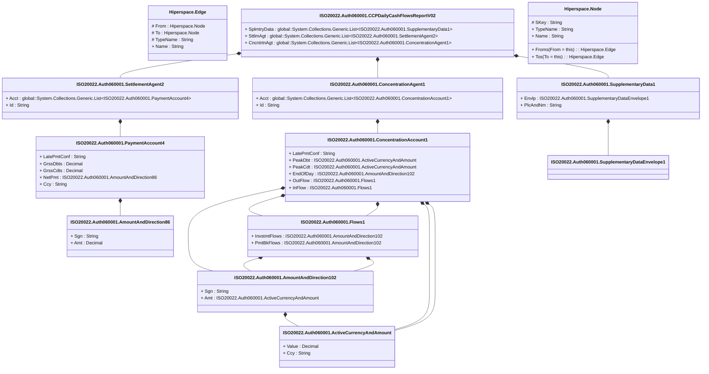

# auth.060.001.02

> The tables below contain descriptions of the members of each Element. 
> The first column indicates the type of the member:
> A ‘#’ indicates that the field is a key to the element, and a ‘+’ indicates that the field is a value.
> The ‘*’ column contains a description for the element member.  
> The ‘@’ column contains any properties for the member.
> The ‘=’ column contains calculated values; or in the case of an enum, the serialized value.

---

## View Hiperspace.Edge
edge between nodes

| |Name|Type|*|@|=|
|-|-|-|-|-|-|
|#|From|Hiperspace.Node||||
|#|To|Hiperspace.Node||||
|#|TypeName|String||||
|+|Name|String||||

---

## Value ISO20022.Auth060001.ActiveCurrencyAndAmount

| |Name|Type|*|@|=|
|-|-|-|-|-|-|
|+|Value|Decimal||XmlElement()||
|+|Ccy|String||XmlAttribute()||
||Validation|Some(String)||XmlIgnore(), JsonIgnore()|validation(validRequired("""Value""",Value),validRequired("""Ccy""",Ccy),validPattern("""Ccy""",Ccy,"""[A-Z]{3,3}"""))|

---

## Value ISO20022.Auth060001.AmountAndDirection102

| |Name|Type|*|@|=|
|-|-|-|-|-|-|
|+|Sgn|String||XmlElement()||
|+|Amt|ISO20022.Auth060001.ActiveCurrencyAndAmount||XmlElement()||
||Validation|Some(String)||XmlIgnore(), JsonIgnore()|validation(validElement(Amt))|

---

## Value ISO20022.Auth060001.AmountAndDirection86

| |Name|Type|*|@|=|
|-|-|-|-|-|-|
|+|Sgn|String||XmlElement()||
|+|Amt|Decimal||XmlElement()||
||Validation|Some(String)||XmlIgnore(), JsonIgnore()|""|

---

## Aspect ISO20022.Auth060001.CCPDailyCashFlowsReportV02

| |Name|Type|*|@|=|
|-|-|-|-|-|-|
|+|SplmtryData|global::System.Collections.Generic.List<ISO20022.Auth060001.SupplementaryData1>||XmlElement()||
|+|SttlmAgt|global::System.Collections.Generic.List<ISO20022.Auth060001.SettlementAgent2>||XmlElement()||
|+|CncntrtnAgt|global::System.Collections.Generic.List<ISO20022.Auth060001.ConcentrationAgent1>||XmlElement()||
||Validation|Some(String)||XmlIgnore(), JsonIgnore()|validation(validList("""SplmtryData""",SplmtryData),validElement(SplmtryData),validRequired("""SttlmAgt""",SttlmAgt),validList("""SttlmAgt""",SttlmAgt),validElement(SttlmAgt),validRequired("""CncntrtnAgt""",CncntrtnAgt),validList("""CncntrtnAgt""",CncntrtnAgt),validElement(CncntrtnAgt))|

---

## Value ISO20022.Auth060001.ConcentrationAccount1

| |Name|Type|*|@|=|
|-|-|-|-|-|-|
|+|LatePmtConf|String||XmlElement()||
|+|PeakDbt|ISO20022.Auth060001.ActiveCurrencyAndAmount||XmlElement()||
|+|PeakCdt|ISO20022.Auth060001.ActiveCurrencyAndAmount||XmlElement()||
|+|EndOfDay|ISO20022.Auth060001.AmountAndDirection102||XmlElement()||
|+|OutFlow|ISO20022.Auth060001.Flows1||XmlElement()||
|+|InFlow|ISO20022.Auth060001.Flows1||XmlElement()||
||Validation|Some(String)||XmlIgnore(), JsonIgnore()|validation(validPattern("""LatePmtConf""",LatePmtConf,"""[0-9]{1,10}"""),validElement(PeakDbt),validElement(PeakCdt),validElement(EndOfDay),validElement(OutFlow),validElement(InFlow))|

---

## Value ISO20022.Auth060001.ConcentrationAgent1

| |Name|Type|*|@|=|
|-|-|-|-|-|-|
|+|Acct|global::System.Collections.Generic.List<ISO20022.Auth060001.ConcentrationAccount1>||XmlElement()||
|+|Id|String||XmlElement()||
||Validation|Some(String)||XmlIgnore(), JsonIgnore()|validation(validRequired("""Acct""",Acct),validList("""Acct""",Acct),validElement(Acct),validPattern("""Id""",Id,"""[A-Z0-9]{18,18}[0-9]{2,2}"""))|

---

## Type ISO20022.Auth060001.Document

| |Name|Type|*|@|=|
|-|-|-|-|-|-|
|+|CCPDalyCshFlowsRpt|ISO20022.Auth060001.CCPDailyCashFlowsReportV02||XmlElement()||
||Validation|Some(String)||XmlIgnore(), JsonIgnore()|validation(validElement(CCPDalyCshFlowsRpt))|

---

## Value ISO20022.Auth060001.Flows1

| |Name|Type|*|@|=|
|-|-|-|-|-|-|
|+|InvstmtFlows|ISO20022.Auth060001.AmountAndDirection102||XmlElement()||
|+|PmtBkFlows|ISO20022.Auth060001.AmountAndDirection102||XmlElement()||
||Validation|Some(String)||XmlIgnore(), JsonIgnore()|validation(validElement(InvstmtFlows),validElement(PmtBkFlows))|

---

## Value ISO20022.Auth060001.PaymentAccount4

| |Name|Type|*|@|=|
|-|-|-|-|-|-|
|+|LatePmtConf|String||XmlElement()||
|+|GrssDbts|Decimal||XmlElement()||
|+|GrssCdts|Decimal||XmlElement()||
|+|NetPmt|ISO20022.Auth060001.AmountAndDirection86||XmlElement()||
|+|Ccy|String||XmlElement()||
||Validation|Some(String)||XmlIgnore(), JsonIgnore()|validation(validPattern("""LatePmtConf""",LatePmtConf,"""[0-9]{1,10}"""),validElement(NetPmt),validPattern("""Ccy""",Ccy,"""[A-Z]{3,3}"""))|

---

## Value ISO20022.Auth060001.SettlementAgent2

| |Name|Type|*|@|=|
|-|-|-|-|-|-|
|+|Acct|global::System.Collections.Generic.List<ISO20022.Auth060001.PaymentAccount4>||XmlElement()||
|+|Id|String||XmlElement()||
||Validation|Some(String)||XmlIgnore(), JsonIgnore()|validation(validRequired("""Acct""",Acct),validList("""Acct""",Acct),validElement(Acct),validPattern("""Id""",Id,"""[A-Z0-9]{18,18}[0-9]{2,2}"""))|

---

## Value ISO20022.Auth060001.SupplementaryData1

| |Name|Type|*|@|=|
|-|-|-|-|-|-|
|+|Envlp|ISO20022.Auth060001.SupplementaryDataEnvelope1||XmlElement()||
|+|PlcAndNm|String||XmlElement()||
||Validation|Some(String)||XmlIgnore(), JsonIgnore()|validation(validElement(Envlp))|

---

## Value ISO20022.Auth060001.SupplementaryDataEnvelope1

| |Name|Type|*|@|=|
|-|-|-|-|-|-|
||Validation|Some(String)||XmlIgnore(), JsonIgnore()|""|

---

## View Hiperspace.Node
node in a graph view of data

| |Name|Type|*|@|=|
|-|-|-|-|-|-|
|#|SKey|String||||
|+|TypeName|String||||
|+|Name|String||||
||Froms|Hiperspace.Edge|||From = this|
||Tos|Hiperspace.Edge|||To = this|

